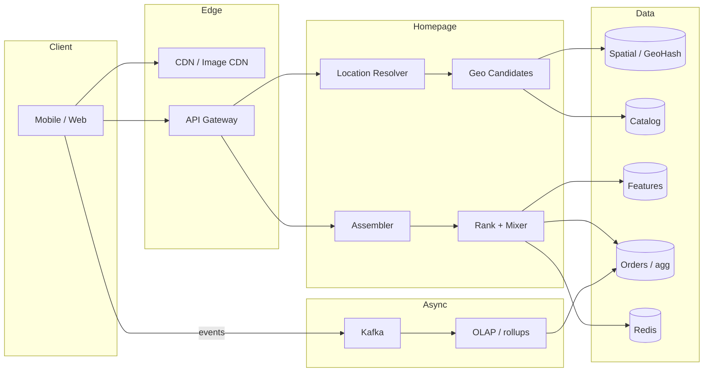
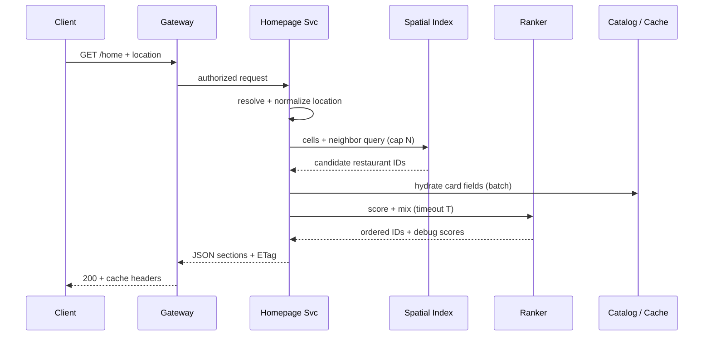

# HLD — Uber Eats Homepage

## Live interview opening (clarify first — bar raiser order)

*“I’ll **start by clarifying requirements**—scope, ambiguity, latency and scale expectations—then lock **FR/NFR**. **After** that, I’ll ground **user journey**, **consistency**, **commit/decision**, and **risks** so it’s clearly **derived from what we agreed**, then **scale** and **architecture**—and I’ll **pause after the diagram** for where you want depth.”*

> **Uber SDE-2 HLD — drive order in this doc:** **§1** clarify → FR → NFR → **Framing after requirements** (user journey, consistency, commit/decision anchors) → **§2** scale → **§3** core entities + APIs → **§4** architecture → **§5** deep dive and evolution → **§6** scaling → **§7** reliability → **§8** tradeoffs → **§9** observability and security → **§10** patterns → **Closing**. Treat **Human interaction** cue blocks (headings in this doc) as *spoken* cues—**paraphrase**; do not read every row. **Bar raiser** listens for **ownership**, **failure modes**, and **honest tradeoffs**. Canonical spine: [HLD-UBER-SDE2-INTERVIEW-SPINE.md](./HLD-UBER-SDE2-INTERVIEW-SPINE.md).

## Interview delivery (golden thread — live thinking)

Bar-raiser polish: **user-first**, **explicit consistency**, **bottleneck**, **evolution**, **UX trust**, **default opinion** (not endless “A or B”). Full template + habits: **[HLD-BAR-RAISER-PERFORMANCE-PACK.md](./HLD-BAR-RAISER-PERFORMANCE-PACK.md)** · **[HLD-MASTER-DELIVERY-GOLDEN-FLOW.md](./HLD-MASTER-DELIVERY-GOLDEN-FLOW.md)**.

| Say at the right time | What interviewers grade | In this guide |
|----------------------|---------------------------|---------------|
| **Opening** | Clarify before solution | **Above** — you **do not** assume requirements. |
| **User journey + consistency + decisions** | Derived, not memorized | **After Section 1**, block **Framing after requirements** — **before Section 2** (not before clarify). |
| **Bottleneck / evolution / UX** | Ops + trust | Same **Framing** block; deep numbers still in **Sections 5–7**. |
| **Strong opinion** | Defaults | **Section 8** tradeoffs — always *“I’d start with X because…”*. |

**Do not:** read tables line-by-line · put user journey **before** clarify · fence-sit.  
**Do:** clarify → FR/NFR → **then** grounded journey → diagram → deep dive where steered.

---

## 1. Clarify requirements

### 1.0 Live flow (how to open and steer)

#### Live voice (real interviewer room)

**Sound like you’re *deciding*, not reciting:** one idea per breath, then **pause**. Tables here are **backup**—if your eyes are down for more than a couple of seconds, you’ve slipped into reading the doc.

**Bridge phrases (mix naturally):** *“Let me **name the fork** first…”* · *“I’ll **default to X**—tell me if your bar is stricter.”* · *“The reason I ask is it changes **who owns the commit** / **what’s on the hot path**.”* · *“I’ll **over-answer** one layer, then stop—**where should I zoom**?”*

**Ping them (conversation, not monologue):** *“Does that match how you’d scope it?”* · *“If we only deep-dive one thing, is it **A** or **B**?”* (swap **A/B** for two tensions from *your* opening paragraph above.)

**This topic in one breath:** “Homepage is **eligibility + rank + assembly** under a **p99** budget—I’ll separate **trust** (geo/hours) from **taste** (rank).”

**`Verbatim` / `Live` cues:** say a line **once**, then **rephrase** the next time—verbatim twice in a row reads *canned*.

**Opening (~once):** *“I’ll align on **homepage scope**, **location + trust**, rough **p99**; then **scale**, **APIs + ownership**, **architecture**, and **`GET /home`** end-to-end. I’ll **pause after the diagram**—does that sequencing work, and where do you want depth: **geo**, **rank**, or **cache**?”*

**Thinking transitions** (use **between** topics so it feels like *design*, not *recital*): *“Let me think through …”* · *“One tradeoff here is …”* · *“If I optimize for latency I’d …”* · *“Let me sanity-check …”* · *“I’d start simple and evolve when …”*

**Live rule:** **Paraphrase** §1–2 tables; don’t read every row. Deeper bullets = **only if they probe**.

### 1.1 Clarify 

| Topic | Say it like this in the room |
|--------------------------|-------------------------------|
| **What’s “homepage”?** | “When you say **homepage**, should I picture the **full** experience—**near you**, reorder, cuisine chips, promos, maybe **sponsored** slots—or are we intentionally **narrower**?” |
| **Location + trust** | “For **location**, am I assuming **GPS + saved addresses**, and do we ever **fall back** to IP or coarse location? If we do, does the product need an explicit **disclosure** to the user?” |
| **Browse freshness** | “For the **list** itself—not checkout—how **live** do things need to feel? Is it okay if **trending** or popularity is **a little stale**—seconds or minutes—or does the business want that basically **real-time**? That drives how hard I lean on **cache**.” |
| **p99 budget** | “Roughly where should I put **server-side p99** for the home payload—**sub-100ms** territory, or more like **a few hundred ms**? I need that to know how much **ranking budget** is realistic.” |
| **Search boundary** | “Is **text search** in scope for this design, or should I treat it as a **separate** service and we mostly **link** out?” |
| **Personalization** | “For **v1**, do you want real **personalization** rails, or is **generic + trending** enough? That changes whether I’m pretending there’s a **feature store** on the hot path.” |
| **Region model** | “Should I assume **multi-region** from day one, or is **single-region** the right mental model for this exercise?” |
| **Experiments** | “Do we need to reserve space for **A/B or experiments** on ranking—like a **mixer** slot—or is ranking **static** for now?” |

**Micro-pauses:** after one or two questions, **reflect back**: *“So if staleness is fine on browse, I can be more aggressive on cache—got it.”*

#### Human interaction (clarify requirements — think out loud & evolve scope)

**Habit:** *“Clarify isn’t politeness—it’s **risk control**. I’m buying the right to simplify later.”*

**Live (open):** *“Before I draw boxes, I want to **pressure-test** three things: **what’s in the homepage shell**, **how hard eligibility is vs rank**, and **what p99 has to feel like**—because those three decide cache, mixer, and whether personalization is on the hot path.”*

**Think-out-loud evolution (say if they let you steer):**

| Stage | What you assume | What you’d add next if scope grows |
|-------|-----------------|-------------------------------------|
| **v1 — narrow** | Single metro, **generic + geo** rank, **no** sponsored mixer | Still **strict** in-zone; **ETag** + CDN for images |
| **v2 — product** | **Reorder** rail, **cuisine chips**, **promos** via mixer | **Feature flags** per section; **partial section** degrade |
| **v3 — scale / org** | **Multi-region** reads, **dense-city** sub-cells, **experiments** on rank | **Shadow** rank traffic; **stricter** observability on **mixer** vs **eligibility** |

**Bar-raiser line:** *“If you force **everything** live and personalized on v1, I’ll say **honestly** that **p99** or **cost** will suffer—I’d rather **phase** it than fake a diagram.”*

### 1.2 Functional requirements (FR) — after alignment, say this as “what we must build”

#### Human interaction (FR — how to explain after alignment)

**Habit:** *“Once scope is clear, here’s what I think we’re building—in plain terms.”*

**Live:** one **spoken** pass from the table (~60–90 s); use **thinking transitions** from [§1.0](#live-flow-open) when you move from FR → NFR.

| FR area | Say it like this in the room |
|---------|-------------------------------|
| **Location & eligibility** | “We resolve **where** the user is, then only surface restaurants that are **actually serviceable** for that context—in zone, not hard-closed, not paused—whatever your business rules call ‘eligible’.” |
| **Homepage shape** | “The response is a **structured page**: sections like reorder, **near you**, promos, cuisine chips—each has a **type**, title, items, and **pagination** where the list is long.” |
| **Cards** | “Each **card** carries enough to decide to tap in—name, hero image, rating, ETA or distance, fees, **open / opens-at**, tags, and an id so **detail** is a clean handoff.” |
| **Search boundary** | “I’m either **delegating** search to a dedicated service or keeping a **minimal** typeahead in scope—I’ll call which one I’m assuming so we don’t blur boundaries.” |
| **Personalization & promos** | “If we have personalization, it’s **user-specific** rails; **sponsored** stuff goes through a **mixer** so we never break the same **eligibility** rules.” |
| **Events** | “Impressions and clicks are **async**—they’re for analytics and ranking feedback, not on the critical read path.” |
| **Out of scope** | “I’m **not** designing checkout or dispatch here—only how the homepage **hands off** if the product ties list freshness to ordering.” |

**Location and serviceability**

- Resolve a **delivery context**: lat/lng and/or **saved address id**, with defined fallbacks (e.g. IP only when product allows).  
- Produce the set of restaurants that are **eligible** to show for that context: **in delivery zone**, **not hard-closed**, **not paused** per business rules, compliance flags if any.

**Homepage composition**

- Return a **structured homepage payload**: ordered **sections** (e.g. reorder strip, promos, cuisine chips, **near you** list, trending rails).  
- Each section has a **type**, **title**, **cursor** or pagination hint where needed, and **items** (restaurant summaries or promos).

**Restaurant cards (list + detail handoff)**

- Card fields typically include: **name**, **hero image**, **rating aggregate**, **ETA band** or distance, **delivery fee** display, **tags** (cuisine, offers), **open/closed** or “opens at” state, **merchant id** for deep link.  
- Support **pagination** or infinite scroll for long lists (`cursor` / `next_page_token`).

**Search (boundary)**

- Either **delegate** to Search Service (`GET /search?q=&lat=&lng=`) or define minimal in-scope **typeahead**—state which you chose.

**Personalization and promos (if in scope)**

- Inject **user-specific** rails (history, dietary preferences) when v1 allows.  
- Apply **sponsored** or **contractual** placements via a **mixer** layer without breaking eligibility rules.

**Events (downstream, not on critical read path)**

- Client or server emits **impression / click** events for analytics and ranking feedback (async).

**Explicit out-of-scope (unless interviewer expands)**

- **Checkout**, payment, cart—only mention as **tighter consistency** handoff.  
- **Driver dispatch**—not homepage.

### 1.3 Non-functional requirements (NFR) — say as “how it must behave”

#### Human interaction (NFR — how to say “how it must behave”)

**Habit:** *“Separate what has to feel ‘true’ from what can be ‘good enough’ for browse.”*

| NFR area | Say it like this in the room |
|----------|-------------------------------|
| **Performance** | “This path is **read-heavy**—I want an explicit **latency budget** per stage so we never do **unbounded** work per request.” |
| **Availability** | “If something non-critical is slow, I’d rather **drop a rail** or simplify than **500** the whole homepage.” |
| **Consistency (tiered)** | “I’m stricter on **hard eligibility** than on **rank order** or trending freshness—browse can be **softer**; ‘you can order’ can’t be misleading.” |
| **Orders / facts** | “**Orders** stay **durable** in OLTP—that’s what backs metrics and training; any write from this surface needs **idempotency** if we touch it.” |
| **Scale** | “**Stateless** tier out front; **partition** geo and catalog by region; scale for **peak** lunch/dinner.” |
| **Change safety** | “**Feature flags**, cache **versioning**, maybe **dark launch** on rank so we don’t surprise users.” |
| **Cost** | “**CDN** for images; **denormalized** read models so we’re not joining the world on every home load.” |
| **Compliance** | “**Disclose** coarse location when we use it; **residency** for PII/logs if multi-region matters.” |

#### UX on the read path (say with NFR)

- **Rank / mixer sick:** user still gets **eligible** restaurants in **fallback order**—not a blank home.  
- **Personalization rails down:** ship **generic + trending**; **drop** promos before **near you**.  
- **GPS noisy:** **prefer saved address** when available; **disclose** coarse/IP fallback when product requires it.

**Performance and latency**

- **Read-heavy** workload; homepage path should avoid **O(n)** work on unbounded **n**.  
- Define a rough **end-to-end** budget (client + network + server); on server, allocate sub-budgets: **auth**, **location**, **geo**, **hydration**, **rank**, **assemble**.  
- **p99** stricter than **p50**; tail driven by **ranking** and **cache misses**.

**Availability**

- Degrade to **fewer sections** or **simpler rank** rather than **hard fail** the whole page when a dependency is slow.  
- Target **high availability** for the **read path**; brief staleness preferred over **outage** for non-critical sections.

**Consistency (tiered — strong hire)**

- **Hard eligibility** (zone, paused, hard closure): **must not** be wrong in a way that misleads “you can order” if product ties list to checkout.  
- **Ranking order**, **trending scores**, **cached ETAs**: may be **eventually** consistent with explicit **staleness** SLO.  
- **Menu price / item availability** on browse: align with interviewer—often **soft** on list, **stricter** at **menu load** or cart.

**Durability and correctness of business data**

- **Orders** and order lines are **durable** and **ACID** in OLTP; used for **metrics** and training data.  
- **Idempotency** on write paths (orders) if ever touched from same BFF—usually out of scope but mention at boundary.

**Scalability and elasticity**

- Horizontal scale of **stateless** API tier; **partition** spatial and catalog data by **region** / shard key.  
- **Elastic** capacity for lunch/dinner peaks; **queue** or shed load on **noncritical** work.

**Operability and change safety**

- **Feature flags** and **experiments** for ranking and section toggles.  
- **Safe rollout**: cache versioning, **dark launch** for rank changes.

**Cost**

- **CDN** for images; minimize **over-fetching** on home; **denormalize** read models to avoid expensive joins per request.

**Compliance and trust (high level)**

- **Location** handling and user-visible **disclosure** when coarse location used.  
- **Data residency** if multi-region (where PII and logs live).

### 1.4 Invariants (one sentence you repeat under pressure)

**Invariant:** “We never present a restaurant as **orderable** (or equivalently **misleadingly in-service**) if it fails **hard eligibility** for that user context. **Ranking** may **degrade** or reorder; **eligibility** cannot **lie**.”

**Purpose:** no second “clarify lecture”—only the **handoff** from answers → design.

| Beat | Say it like this |
|------|------------------|
| **Bridge** | “Cool—if **staleness** is OK on browse, I can lean on **cache** and **precompute** more; I still keep **in-zone / not closed** tight because that’s **trust**.” |
| **Core split (once)** | Same as [Key insight (say early)](#key-insight-say-early)—who’s **allowed** vs **order** under latency. |
| **Checkout tie-in (one line)** | “Anything that implies **you can place this order** might need a **stricter** read at menu or checkout—we can align.” |

### Key insight (say early—one sentence)

**Who is allowed on the page** (hard eligibility—in zone, not hard-closed) is **not** the same as **in what order** they appear (ranking, cache, experiments). Ranking may **degrade**; eligibility must not **lie** about serviceability.

#### Key anchors (say these confidently—any order)

1. “**Eligibility** stays correct; **ranking** can degrade.”  
2. “**Cell + neighbors** so boundary users aren’t wrong.”  
3. “We **cap candidates** before expensive scoring.”  
4. “**Ranking is time-boxed** with **fallback**.”  
5. “**Metrics** from **order facts / OLAP**—cache only **mirrors** with known lag.”

---

## Framing after requirements (before scale + architecture)

**Placement in the room:** this block is **not** “right after clarify questions.” You earn it **after** you’ve locked **FR + NFR** (spoken summary is fine)—otherwise journey / consistency / commit boundaries read as **assuming** product and SLOs.

**Out loud:** *“We’ve **clarified** scope and I’ve stated **FR/NFR** from that—**based on that**, here’s the **user-visible path**, **consistency**, and **commit** I’ll hold before I size **Section 2** and draw **Section 4**.”*

### Thinking transitions (use during interview)

- *“Let me think through this…”*
- *“One tradeoff here is…”*
- *“If I optimize for latency…”*
- *“This might become a bottleneck because…”*
- *“I’d start simple here and evolve later…”*

## User journey (say once—**after** FR/NFR, not after clarify alone)

“From user perspective:

User opens app → location resolved → nearby restaurants fetched → ranked → homepage sections assembled.

So:
- read path = homepage fetch
- write path = orders (separate system)
- async path = impressions, clicks, ranking signals”

## Consistency model

Strong consistency for:
- eligibility (in-zone, open/closed)

Eventual consistency for:
- ranking
- trending
- popularity metrics

We prioritize:
latency over freshness for homepage browse,
but correctness for serviceability (trust)

## 🔒 Commit Boundary

“Homepage response is committed when:

- eligibility filtering is complete (must be correct)
- ranking is either completed OR deadline reached

If ranking exceeds deadline:
- fallback ordering is used

So:
- eligibility = strict guarantee
- ranking = best-effort”

## Decision (strong opinion)

I’d start with:

- geohash/H3 based geo indexing (fast + scalable)
- Redis for hot geo cells
- two-stage ranking (cheap + rerank)

because latency is critical for homepage.

If scale grows:
- move to precomputed ranking
- add ML-based ranking

## Evolution

| Phase | Say it like this |
|-------|------------------|
| **1** | Simple implementation that ships. |
| **2** | Scaling: partitions, caches, queues, backpressure, observability. |
| **3** | Advanced / ML / global—only when metrics or product force it. |

Details: **Section 4.1 (phases)** and **Section 5** in this file.

## Bottleneck anchor

The main bottlenecks I expect:

- hot geocells (dense areas)
- ranking latency (p99 tail)

That’s what I’d monitor first

## 🚦 Backpressure Handling

“If traffic spikes:

- reduce candidate size (lower K)
- skip personalization
- fallback to cached results

Goal:
protect latency (p99) over ranking quality”

## UX awareness

If this behaves badly:

- user sees empty homepage
- wrong restaurants (out of zone)
- slow loading experience

So we prioritize:
correct eligibility and fast response over perfect ranking

### Driving the conversation

- *“Does this direction make sense?”*
- *“Should I go deeper on **A** or **B**?”*
- *“Would you like failure scenarios next?”*

### Mindset

*“I’m not presenting a solution—I’m **designing with a teammate**.”*

**Playbook:** [HLD-BAR-RAISER-PERFORMANCE-PACK.md](./HLD-BAR-RAISER-PERFORMANCE-PACK.md).

---

## 2. Estimate scale

Order-of-magnitude talk track (tune with interviewer):

#### Human interaction (estimate scale)

**Habit:** *“I’ll throw round numbers—correct me if your mental model’s different; I only need the **shape**.”*

**Live:** *“Let me sanity-check scale before I draw boxes…”* then **3–4 numbers** + **invite correction**—skip the full dimension table unless they want math.

| Topic | Say it like this in the room |
|-------|-------------------------------|
| **Read-heavy** | “Homepage is **read-heavy**—think **tens of thousands to ~100k** reads/sec per big **region** at peak, vs **orders** which are much rarer—so I care about **partition**, **cache**, and **bounding work** per request.” |
| **Candidates** | “Before ranking, I’m assuming **hundreds to a few thousand** restaurant ids **max** per request—otherwise **p99** ranking doesn’t stay in the **~100–300ms** ballpark.” |
| **Payload** | “JSON is **kilobytes to tens of KB** per response plus **images on CDN**—so pagination and not over-fetching matter.” |
| **Invite correction** | “If your peak is an **order of magnitude** off, I’d shift how much we **precompute**—the **architecture shape** stays the same.” |

| Dimension | Illustrative assumption | Implication |
|-----------|-------------------------|-------------|
| **Users** | Millions of **DAU** in a large market | Regional peaks |
| **Read RPS** | **10k–100k** homepage reads/sec per large **region** at lunch/dinner | Cache, partition, cap work |
| **Read : write** | **100:1** or higher vs orders + impressions | Optimize read path |
| **Candidates / request** | **Hundreds to a few thousand** before **hard cap** | Geo + rank must be bounded |
| **Payload** | Kilobytes–tens of KB JSON + images via CDN | Pagination, section trimming |
| **Latency budget** | Server-side **p99** often **100–300ms** (confirm with interviewer) | Time-box ranking |

**Tie it in one line:** “So we optimize for **read latency**, **cap work per request**, and **avoid heavy scoring** on an uncapped candidate set.”

---

## 3. APIs and data model

#### Human interaction (APIs & data model)

**Habit:** *“Thin API contract, honest data ownership.”*

| Topic | Say it like this in the room |
|-------|-------------------------------|
| **APIs** | “Surface stays **small**—`GET /home`, nearby, hand off **search** and **detail/menu**; headers for **auth**, **trace**, maybe **experiment** cohort.” |
| **Storage split** | “**Orders** live in **relational** OLTP where invariants matter; **menus** are messy—I’m fine with **documents** or fat JSON for reads; **search** is its **own index**, not `LIKE` at scale.” |
| **Entities** | “I keep **User, Address, Restaurant, Menu/Dish, Order, lines, promos, impressions** straight—who **owns** writes vs who serves reads.” |
| **Metrics** | “Anything like **most ordered** is defined from **order facts** in the **warehouse**—Redis can **mirror** for speed, not **define** truth.” |

### 3.1 Public APIs (sketch)

| API | Purpose |
|-----|---------|
| `GET /v1/home?lat=&lng=&addr_id=` | Full homepage; optional `section=` to lazy-load heavy rails |
| `GET /v1/restaurants/nearby?cursor=` | Paginated list for “near you” |
| `GET /v1/search?q=&lat=&lng=` | Usually **delegated** to Search Service |
| `GET /v1/restaurants/{id}` | Detail; **menu** often `GET /v1/restaurants/{id}/menu?cursor=` |

**Headers / contract (mention):** auth token, **If-None-Match** / **ETag**, **trace id**, optional **experiment** cohort.

### 3.2 Core entities (who owns what)

- **User**, **Address**, **Restaurant**, **Menu / Dish**, **Order**, **OrderLine**, **Promotion**, **ImpressionEvent** (async).  
- **DeliveryZone** or polygon reference tied to restaurant.

### 3.3 Schema highlights (conceptual)

**Restaurant** — `id`, `name`, `geo`, `zone_ids` or polygon ref, `hours`, `cuisines[]`, `fee_rules`, `rating_agg`, `status` (open/paused), `image_urls`, `merchant_tier`, `updated_at` / **version**.  
**Dish** — `id`, `restaurant_id`, `name`, `price`, `tags`, `availability`, `popularity_denorm` (optional, stream-updated).  
**Order** — `id`, `user_id`, `restaurant_id`, `created_at`, `status`, `currency`, totals.  
**OrderLine** — `order_id`, `dish_id`, `qty`, `price_snapshot`.

### 3.4 Storage by access pattern

| Store | Holds | Why |
|-------|--------|-----|
| OLTP SQL | Orders, money-adjacent, strong invariants | ACID |
| Document / JSON column | Menu read models, modifiers | Flexible schema |
| Search index | Text + facets + geo filter | Inverted index |
| Redis / memory | Hot geo lists, featured sets, rate limits | Speed |
| OLAP / lake | Metrics, training, BI | Cheap scans |

### 3.5 Business metrics (definition lives here, not in cache)

- **Most ordered restaurant**, **most ordered dish**, **orders per restaurant** — computed from **Order / OrderLine** facts in **warehouse** (e.g. **Kafka → OLAP**); optional **denormalized** counters for speed with **documented lag**.

---

## 4. High-level architecture

#### Human interaction (high-level architecture / HLD)

**Habit:** *“I’ll walk the diagram like a pipeline, not a slide title.”*

| Moment | Say it like this in the room |
|--------|------------------------------|
| **Zoom out** | “Client hits **CDN** for images, **gateway** for policy, then a **home service** that’s basically **locate → geo candidates → filter → rank → assemble**.” |
| **Data row** | “Behind that: **spatial index**, **catalog**, **features**, hot stuff in **Redis**, **orders** feeding **Kafka → OLAP** for aggregates—not on the critical read path.” |
| **Checkpoint** | “Before I sequence **`GET /home`**, does this **split** match how you think about **team ownership**?” |
| **Steer** | “**Should I go deeper** on **geo**, **ranking**, or **cache** next—or **failure modes** on this diagram?” |

## 🧠 Decision (Architecture)

“I’d structure this as:

- thin gateway
- dedicated homepage service (BFF style)
- geo + ranking as internal components

because:

- keeps latency controlled
- isolates complexity in one place
- allows independent evolution of ranking

If system grows:
- split ranking into separate service
- introduce feature store + ML pipeline”

**Human narration:** “This is a **read funnel**: cheap **geo filter** widens to a capped set, then **expensive scoring** runs only on that set. Writes to orders stay on the **async** path feeding **aggregates**.”

“Does this architecture make sense so far?
I can go deeper into geo, ranking, or caching.”

### 4.1 How we’d evolve this (if they ask “phases / MVP”)

| Phase | Ship | Why |
|-------|------|-----|
| **1 — MVP** | **Geo filter** + **simple rank** (distance + rating/popularity) + **aggressive cache** + honest **staleness** labels | Trust + learn traffic shape |
| **2 — Growth** | **Feature** rank, **personalization** rails, **hot-cell** handling, **stream** aggregates for trending | Engagement without uncapped work |
| **3 — Scale** | **Multi-region** reads, heavier **rank + experiments**, **dense-city** tuning (sub-cells, stricter caps, rank pools) | Tail + org maturity |

**Taking a stance:** *“I’d ship **phase 1** with strict **eligibility** and **capped** geo; I’d only pay for **phase 3** complexity when metrics prove we need it.”*

---

## 5. Deep dive: critical flow

#### Human interaction (deep dive — critical flow, optimizations & evolution)

**Habit:** *“I’ll **time-box**: default **`GET /home`** path first like a debugger—**then** what I’d optimize if metrics scream.”*

**Live (evolution / think out loud):** *“**Default** path: **cap geo** → **hydrate batch** → **two-stage rank with deadline** → **assemble**. **First optimization** is almost always **candidate cap** + **single-flight** on hot cells—not a cleverer model. **Evolve** when: **rank p99** tail (**tighter deadline + more precompute**), **dense city** (**sub-cells**), **experiments** (**mixer isolation**).”*

| Step | Say it like this in the room |
|------|-------------------------------|
| **Auth & location** | “**Auth** at the edge; resolve **location** and log **GPS vs saved vs fallback**—half the weird tickets are location quality.” |
| **Geo** | “**Spatial** lookup: **cell + neighbors** so we don’t miss boundary users; **cap** ids in dense areas.” |
| **Eligibility & hydrate** | “**Hard filter** what’s actually allowed; **batch** catalog reads so we don’t **N+1**.” |
| **Rank** | “**Two-stage** score: cheap wide retrieve, heavier re-rank on a **short list**; **deadline**—if we miss it, **fallback** ordering but **eligibility** still holds.” |
| **Assemble & respond** | “**Mixer** for promos/experiments; **ETag** / CDN for repeat visits.” |
| **Cache policy** | “**Trending** can be stale; **open/closed** shorter **TTL** + **version**; cache is never **source of truth** for business metrics—same as the **§5.4** table above.” |
| **Anchor** | “The main bottleneck I see here is **\_\_\_**—**hot cell**, **rank tail**, or **stampede**—that’s what I’d instrument first.” |
| **Production voice** | “**Stampede** when a hot **cell TTL** expires—**single-flight + jitter**; **rank p99** at lunch—**deadline + fallback**; **bad GPS**—**saved address** + **log source**.” |

This is **step 5** of the [spine](#interview-spine-nine-steps)—where most Bar Raiser time should go.

“Ranking is always time-boxed to protect p99 latency.”

## 🧠 Decision (Geo + Ranking)

“I’d start with:

- H3/geohash for geo indexing
- Redis for hot cells
- two-stage ranking

because:

- fast lookup
- bounded candidate set
- controlled p99 latency

If scale increases:
- move more ranking offline
- introduce ML-based scoring”

**Taking a stance (geo + rank):** *“I’d default **cell + neighbors + cap** on something **Redis-friendly** for read **p99**; I’d **revisit PostGIS** if polygons/joins outgrow the cell model. For rank: **two-stage** + **partial precompute**, **time-box** online scoring—**more precompute** only if product proves we need fresher rails without blowing **p99**.”*

### 5.1 Step-by-step walkthrough

1. **AuthN/Z** at gateway; attach **user** and **device**.  
2. **Location resolver** picks coordinates; log which **source** was used.  
3. **Spatial lookup:** geohash/H3 cells + **adjacent ring** until enough candidates or **distance cap**.  
4. **Hard filters (eligibility):** not hard-closed, in zone, basic compliance.  
5. **Hydration:** batch fetch restaurant rows / cache; avoid N+1.  
6. **Ranker:** two-stage—cheap score for K′, richer re-rank for K; **deadline** + **fallback ordering** (distance, popularity).  
7. **Assembler:** sections, promos slots, **experiment** flags.  
8. **Response:** **ETag** / version for **conditional** GET; CDN for images.

**Races / edge cases:** menu changed mid-request—**version** on card; rank used **snapshot** of feature flags at request start.

### 5.2 Bar Raiser callouts (say without being asked)

| Step | Say this unprompted |
|------|---------------------|
| Location | “We log **which source** (GPS vs saved vs fallback) for debugging **quality** and incidents.” |
| Geo fetch | “**Neighbor cells** avoid boundary misses; we **cap** candidates in **dense** areas.” |
| Eligibility | “**Eligibility must stay correct** even if ranking fails or times out.” |
| Hydration | “**Batch** fetches to avoid **N+1** on cards.” |
| Ranking | “**Two-stage** retrieve/rerank; ranking is **time-boxed**—on timeout we **fallback** to distance or popularity.” |
| Assembly | “**Mixer** handles promos and **experiments** without polluting core rank invariants.” |

### 5.3 Ranking pipeline (inside the critical path)

**Signals:** distance/ETA, CTR/CVR history, rating, business rules, inventory hints, user affinity.  
**Offline + online:** batch aggregates to **feature store**; online **blend** + **re-rank**; reserve slots for **exploration**.  
**Optimization:** **retrieve wide, rank narrow**; **precompute** heavy aggregates.

### 5.4 Read-path caching (part of the same request story)

| Layer | Content | Notes |
|-------|---------|--------|
| CDN | Images, static campaigns | Purge + TTL |
| Edge/API cache | Section fragments | Short TTL; **vary by location bucket** |
| Redis | Per-cell lists, featured sets | **Stampede:** single-flight / jitter |
| App | Config, flags | Minutes |

**Policy:** “Trending” can be **stale**; **open/closed** uses **short TTL** + **version**; never use cache as **source of truth** for **business metrics** (see [§3](#3-apis-and-data-model) and [§9](#9-monitoring-observability-and-security)).

---

## 6. Scaling and bottlenecks

#### Human interaction (scaling & bottlenecks)

**Habit:** *“Name what breaks first—then the fix sounds obvious.”*

| Topic | Say it like this in the room |
|-------|-------------------------------|
| **10× traffic** | “Shape stays the same—I get more **aggressive** on **caps**, **cache**, and **rank deadlines**; **eligibility** rules don’t change, we just apply them **cheaper**.” |
| **Hot geocell** | “Dense cell → **shard** it, **replica** reads, **strict cap** on candidates.” |
| **Rank tail** | “Ranker blows **p99** → **time-box**, **breaker**, **fallback** ordering.” |
| **Stampede** | “Cache expiry nukes DB → **single-flight**, **TTL jitter**, **warm** keys on deploy.” |

### 6.1 Geo indexing and optimizations

- **Geohash / H3 / S2:** pre-index `restaurant_id → cell`; query **cell + neighbors** to fix **boundary** misses.  
- **Max candidates** + **distance early exit**; **dense cell** splitting or **sub-zones** for hotspots.  
- **Open now:** **bitmap** or **next_open_at** to avoid feeding obviously closed venues into expensive rank.

### 6.2 Bottleneck matrix (name these before they ask)

| Risk | What breaks | Mitigation |
|------|----------------|------------|
| **Hot geocell** | Tail latency, shard overload | Sub-partition, read replicas, **strict cap** on candidates, backoff |
| **Ranker tail** | **p99** SLO miss | **Time-box**, **circuit breaker**, **fallback** ordering |
| **Cache stampede** | DB collapse on expiry | **Single-flight**, **TTL jitter**, early refresh, **request coalescing** |
| **Stale menu / price** | Trust, support tickets | **Version** keys on card payload; short TTL; event-driven invalidation |
| **Bad GPS** | Wrong geo results | UX fallback + saved addresses; log source |
| **Thundering herd** on deploy | Cold cache | **Warm** critical keys, gradual rollout |

---

## 7. Reliability and failure handling

#### Human interaction (reliability & failure handling)

**Habit:** *“Degrade the fancy stuff before you degrade truth.”*

| Topic | Say it like this in the room |
|-------|-------------------------------|
| **Timeouts** | “Every dependency gets a **timeout**; ranker slow → **fallback** order, not fantasy scores.” |
| **Eligibility** | “I don’t relax **in-zone / closed** because ranking is sick—unless product explicitly says so.” |
| **Partial success** | “Personalization dies → **partial homepage** beats a **500**; I shed **promos** before **near you**.” |
| **Retries** | “Retry only **idempotent** reads, **backoff + cap**—no **retry storms**.” |
| **Interrupted** | “If you cut in—same design, just more ruthless on **caps** and **deadlines**.” |
| **Incident tone** | “In prod I’ve seen **stampede** on viral tiles, **hot geocells** starving a shard, and **rank tail**—same mitigations: **jitter**, **sub-partition**, **breaker + fallback**.” |

## 👤 UX Under Failure

“If ranking fails:

- user still sees valid restaurants
- ordering is still possible
- experience degrades gracefully instead of breaking”

### 7.1 Dependency behavior

- **Timeouts** with sane defaults on **ranker**, **spatial**, **catalog** calls; fail **closed** on eligibility sources if unsure, fail **open** only where product accepts it.  
- **Retries** with **exponential backoff + jitter** on idempotent reads; avoid retry storms on **timeouts** (cap retries).  
- **Circuit breakers** around ranker and flaky feature stores; **bulkhead** thread pools so one slow dependency does not exhaust all workers.

### 7.2 Graceful degradation

- Return **partial homepage** (drop heavy rails) rather than **500** when a noncritical dependency fails.  
- **Load shed:** prioritize **near you** + **eligibility** over **personalization** blocks under pressure.

**UX tie-in (say aloud):** *“Ranking down ≠ empty page—we still show **eligible** venues in **fallback** order. Personalization down ≠ broken **trust**—we **shed** fancy rails first.”*

### 7.3 Data and correctness failures

- **Replication lag** on catalog: prefer **version** checks or **read-after-write** stickiness for merchant edits if showing wrong price is unacceptable.  
- **Duplicate events** (analytics): **at-least-once** consumers with **idempotent** aggregation keys.

### 7.4 Operational readiness (short)

- **Runbooks:** ranker fallback spike, Kafka lag, empty geo cell incidents.  
- **Capacity:** autoscale on **CPU**, **queue depth**, and **p99** SLO burn rate.

---

## 8. Tradeoffs and alternatives

#### Human interaction (tradeoffs & alternatives)

**Habit:** *“I’ll name the trade, pick a side, and say what would change my mind.”*

| Topic | Say it like this in the room |
|-------|-------------------------------|
| **Freshness vs latency** | “I’m OK if **browse** is a little **stale** if **p99** stays happy; I’m not OK being **wrong** about serviceability.” |
| **Online rank vs precompute** | “More **online** rank → fresher but **tail risk**; more **precompute** → stable latency but **pipeline** work.” |
| **Store / service forks** | “PostGIS vs Redis GEO vs search geo; BFF **monolith** vs split services—I’d pick based on **ops maturity**, **team boundaries**, and **who can own** incidents.” |
| **My default (geo)** | “**Cell + neighbors + cap** on a **fast** spatial store for v1; **PostGIS** when polygon/reporting needs force it.” |
| **My default (rank)** | “**Two-stage** + **deadline + fallback**; add **precompute** when freshness **proves** worth the **pipeline** cost.” |

### 8.1 Product / system tradeoffs

| Decision | Upside | Downside |
|----------|--------|----------|
| Heavy **online** ranking | Fresher personalization | **p99** tail risk |
| More **Redis** on geo | Fast reads | Stale/incorrect if invalidation is weak |
| Strong **inventory** on list | User trust | More joins, harder cache |
| **Two-stage** rank | Latency control | More moving parts to test |

### 8.2 Credible alternatives (say “we could also…”)

| Area | Alternative | When you’d consider it |
|------|-------------|-------------------------|
| Menu storage | **All SQL** + JSON columns | Strong reporting on menu; fewer systems |
| Homepage assembly | **BFF monolith** vs **separate** Home / Rank / Catalog services | Org boundaries, team scale |
| Geo | **PostGIS** vs **Redis GEO** vs **search geo** | Ops maturity, query shape, existing stack |
| Ranking | **Precomputed** lists per cell vs **mostly online** | Traffic pattern, freshness needs |
| Fan-out of experiments | **Server-side assignment** vs **client** hints | Consistency of experiment analysis |

---

## 9. Monitoring, observability, and security

#### Human interaction (monitoring, observability & security)

**Habit:** *“Observability is how I prove the story I just drew.”*

| Topic | Say it like this in the room |
|-------|-------------------------------|
| **Tracing** | “One **trace** per `GET /home` with spans matching the pipeline—when **p99** moves, I know **which hop**.” |
| **Dashboards** | “I watch **fallback rate**, **empty geo**, **rank timeouts**, **location source** mix.” |
| **Metrics truth** | “Business metrics = **§3.5 / §9.2**—**warehouse** defines them; Redis is a **mirror** with known lag.” |
| **Security** | “Still **auth** personalized routes, **rate limits**, lean logs, **signed** media URLs.” |
| **Compliance** | “If you care: **residency**, separate merchant/consumer in logs, **no secrets** in query strings.” |

### 9.1 Monitoring and SLIs / SLOs

- **SLIs:** homepage **p99** latency, **error rate** by section, ranker **latency** and **timeout rate**, spatial query **p95**, cache **hit ratio**, **Kafka consumer lag** for aggregates.  
- **SLOs:** agree **p99** target with PM/engineering; **error budget** drives how aggressive ranking can be.  
- **Tracing:** one **trace** per `GET /home` with spans: `auth`, `location`, `geo`, `hydrate`, `rank`, `assemble`.  
- **Dashboards:** fallback rate, empty results rate, **geo source** distribution (quality).  
- **Alerts:** sustained ranker failures, **empty-cell** anomalies, cache **miss storm**, OLAP **pipeline delay** vs SLA.

### 9.2 Business metrics pipeline (ties to §3.5)

1. **Most ordered restaurant** — `orders.restaurant_id` in warehouse.  
2. **Most ordered dish** — `order_lines.dish_id`.  
3. **Orders per restaurant** — same fact table; optional **Redis mirror** for ops with **documented lag**.

**Strong hire line:** “**Definitions** live in **OLTP + warehouse**; **Redis** is at best a **cache** of aggregates.”

### 9.3 Security and abuse (homepage read surface)

- **AuthN** on personalized endpoints; **rate limiting** per user/IP/API key; **WAF** for common web attacks on public APIs.  
- **Scraping / bot** traffic: throttle, **proof-of-work** or device attestation only if product requires—mention **cost control**.  
- **Location and PII:** minimize logging of raw coordinates; **retention** policy on access logs; **TLS** everywhere.  
- **Authorization:** user A must not see user B’s **saved addresses** or **order history** rails.  
- **Supply-chain:** signed URLs for images; **content integrity** where relevant.

### 9.4 Compliance (mention if interviewer opens)

- **Regional** data residency for PII and logs if required.  
- **Merchant** and **consumer** data separation in logs and traces (**no secrets** in query strings).

---

## 10. Design patterns, data structures & best practices

Uber **HLD** rewards **distributed-systems** thinking; classic **GoF** still appears as **service-level** roles. Say **where** each pattern lives and **why**—not a pattern laundry list.

### 10.1 Architectural / distributed patterns (primary)

| Pattern | Where in this design | One-line “why” |
|---------|----------------------|----------------|
| **API Gateway / Facade** | Edge entry to homepage | Single policy surface: auth, rate limits, routing |
| **BFF (Backend for Frontend)** | Homepage assembly | Shape payload per client; isolate churn from core services |
| **Strategy** | Pluggable **rankers**, mixer rules, geo backends | A/B and product rules without rewriting the pipeline |
| **Template method** (conceptual) | Pipeline: locate → geo → filter → rank → assemble | Fixed skeleton; swap steps under flags |
| **Circuit breaker** | Ranker, feature store, flaky deps | Fail fast; trigger **fallback** ordering |
| **Bulkhead** | Thread pools / conn pools per dependency | One slow dep does not exhaust the whole service |
| **Cache-aside** | Redis / CDN for lists and fragments | Read path owns population + TTL |
| **CQRS-lite** | Orders **write** OLTP vs **read** aggregates / home rails | Different models for different access patterns |
| **Event-driven** | Kafka → OLAP / denormalized scores | Decouple metrics and training from synchronous home path |
| **Saga** (if extended) | Checkout spanning services | **Not** homepage core—mention for handoff to order service |
| **Rate limiting / Throttling** | Gateway + hot endpoints | Protect ranker and spatial index |
| **Idempotency keys** | Client retries on home mutations (if any) | Safe retries without duplicate side effects |

### 10.2 Classic OO patterns (when interviewer says “LLD inside a service”)

| Pattern | Map to homepage | Notes |
|---------|-----------------|-------|
| **State** | Restaurant **lifecycle** (open/paused) or request handling | Often a **rules engine**, not a giant enum switch in prod |
| **Chain of responsibility** | Middleware: auth → geo → rate limit | Request pipeline filters |
| **Observer** | Impression events → async consumers | **Not** blocking the read path |
| **Command** | “Refresh rail” admin ops | Auditable actions |

### 10.3 Data structures & storage choices (say in interview)

| Concern | Typical structure / store | Why |
|---------|----------------------------|-----|
| Spatial index | **Geohash / H3** cell → set or sorted set of ids | Neighbor query + cap |
| Candidate set before rank | **Bounded list** or **min-heap** for top-K by cheap score | Control CPU |
| Rank scores online | **Float vector** + weights or **sparse** feature map | Model-dependent |
| Hot rails | **Redis** string/sorted-set with **TTL** | Speed |
| Catalog | **SQL rows** + optional **JSON** / **document** for menu | Flex vs reporting |
| Search | **Inverted index** (OpenSearch) | Text + facets |
| Metrics | **Columnar** / OLAP fact tables | Scans over orders |

### 10.4 Best practices (Strong Hire bar)

- **Separate invariants:** eligibility correctness vs ranking best-effort.  
- **Time-box** expensive stages; **measure** fallback rate.  
- **Define metrics** from **facts**, cache only accelerates.  
- **Single-flight / jitter** on popular cache keys.  
- **Feature flags** for rank and section toggles with **kill switch**.

### 10.5 Pattern-level trade-offs (say aloud)

| Pick | Gain | Cost |
|------|------|------|
| More **sync** calls to ranker | Fresher scores | **p99** tail |
| More **precompute** | Stable latency | Staleness; **pipeline** complexity |
| **Fat BFF** | Velocity | **Blast radius**—split when team scales |
| **Strong cache** on eligibility | Speed | Risk if invalidation wrong—keep **short TTL** |

#### Human interaction (design patterns, data structures & best practices)

**Habit:** *“Pattern names are shorthand for behavior—**one** name per beat, tied to **where** on the board.”*

**Verbatim (drive the room in ~45s):** *“**Gateway** for auth and rate limits; **BFF** shapes the homepage payload; **locate → geo → filter → rank → assemble** is a **template method** with **strategy** rankers; **cache-aside** Redis and CDN for rails; **circuit breaker** and **bulkhead** so a sick ranker doesn’t take down reads; **CQRS-lite** so orders stay OLTP but the home feed reads **denormalized** docs; **Kafka** for signals off the hot path; **spatial index** H3 or geohash for nearby; **bounded heap** before expensive rank.”*

**Live:** pick **at most four** patterns on the diagram; *“Does that naming match how you’d split ownership?”* then stop.

| You mean… | Say it like this in the room |
|-----------|-------------------------------|
| **Distributed patterns** | “**Gateway** = policy surface; **BFF** = shape payload; **breaker/bulkhead** = ranker sick doesn’t take down the world; **cache-aside** + **CQRS-lite** = reads vs writes; **Kafka** = metrics off the hot path.” |
| **Classic / service OO** | “**Chain** = middleware pipeline; **Observer** = impressions async; **State** = open/paused rules—only if they push LLD.” |
| **Data structures** | “**Cell → ids** spatially; **bounded list / heap** before expensive rank; **inverted index** for search; **OLAP** for metric scans.” |
| **Trade** | “More **sync** rank → fresher, worse **tail**; more **precompute** → calmer latency, heavier **pipelines**.” |

---

## Closing notes (where wrap-up human interaction lives)

Endgame is **short**, **confident**, and **conversational**: use the **`#### Human interaction`** blocks under [Bar-raiser](#bar-raiser-follow-ups), [Communication (do vs avoid)](#communication-do-vs-avoid), and [60-second close](#60-second-close)—not a second full design pass.

### Communication (do vs avoid)

| Do (sounds senior) | Avoid (sounds rehearsed) |
|--------------------|---------------------------|
| **Narrate intent** before boxes | Dumping names with no story |
| **Ask** where to go deeper | Assuming the whole hour is one thread |
| **Reflect back** after clarify | Fifteen questions with no pause |
| **Default + caveat** | “We could do A, B, or C…” with no pick |
| **Time-box** your own talking | Finishing every subsection because it exists in the doc |

**60-minute sketch (flex):** clarify+FR+NFR ~8–12 · scale+APIs ~8–12 · architecture ~8–12 · **deep dive ~15–22** · scale→monitoring ~10–15 · patterns+close ~5–8.

---

## Bar-raiser follow-ups

#### Human interaction (bar-raiser)

**Habit:** two–four sentences, then **stop**—let them steer.

| They ask | Say it like this |
|----------|------------------|
| **Bias / new restaurants** | “**Exploration** slots and **cold-start** features; watch **impression share** by tenure; keep **business** rules separate from the raw model.” |
| **Multi-region** | “**Regional** catalog and spatial; user reads **local**; analytics **async**; I’m fine with **eventual** global rollups unless you need stronger.” |
| **Search vs nearby index** | “Usually **different** inverted index with geo filter; same **restaurant id**; **join** in the app layer.” |

---

## 60-second close

#### Human interaction (60-second close)

**Habit:** one **net-net** pass—stretch or compress to the clock.

| Beat | Say it like this in the room |
|------|-------------------------------|
| **Recap** | “**Read funnel**: **geo** → **capped** ids with **neighbors**; **batch** hydrate; **rank** under a **deadline** with **fallback**; **cache** where staleness is OK; **orders** **ACID** in SQL; **metrics** from **warehouse / OLAP**; **eligibility** correct even if ranking **degrades**.” |

---