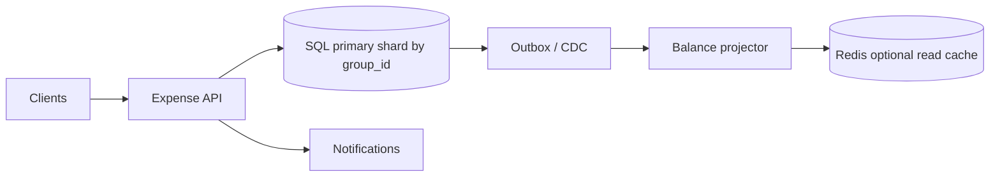
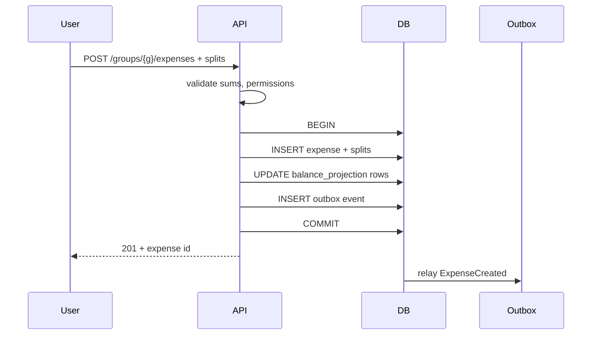

# HLD — Splitwise (Expenses, Balances, Settle-Up)

## Live interview opening (clarify first — bar raiser order)

*“I’ll **start by clarifying requirements**—scope, ambiguity, latency and scale expectations—then lock **FR/NFR**. **After** that, I’ll ground **user journey**, **consistency**, **commit/decision**, and **risks** so it’s clearly **derived from what we agreed**, then **scale** and **architecture**—and I’ll **pause after the diagram** for where you want depth.”*

> **Uber SDE-2 HLD — drive order in this doc:** **§1** clarify → FR → NFR → **Framing after requirements** (user journey, consistency, commit/decision anchors) → **§2** scale → **§3** core entities + APIs → **§4** architecture → **§5** deep dive and evolution → **§6** scaling → **§7** reliability → **§8** tradeoffs → **§9** observability and security → **§10** patterns → **Closing**. Treat **Human interaction** cue blocks (headings in this doc) as *spoken* cues—**paraphrase**; do not read every row. **Bar raiser** listens for **ownership**, **failure modes**, and **honest tradeoffs**. Canonical spine: [HLD-UBER-SDE2-INTERVIEW-SPINE.md](./HLD-UBER-SDE2-INTERVIEW-SPINE.md).

## Interview delivery (golden thread — live thinking)

Bar-raiser polish: **user-first**, **explicit consistency**, **bottleneck**, **evolution**, **UX trust**, **default opinion** (not endless “A or B”). Full template + habits: **[HLD-BAR-RAISER-PERFORMANCE-PACK.md](./HLD-BAR-RAISER-PERFORMANCE-PACK.md)** · **[HLD-MASTER-DELIVERY-GOLDEN-FLOW.md](./HLD-MASTER-DELIVERY-GOLDEN-FLOW.md)**.

| Say at the right time | What interviewers grade | In this guide |
|----------------------|---------------------------|---------------|
| **Opening** | Clarify before solution | **Above** — you **do not** assume requirements. |
| **User journey + consistency + decisions** | Derived, not memorized | **After Section 1**, block **Framing after requirements** — **before Section 2** (not before clarify). |
| **Bottleneck / evolution / UX** | Ops + trust | Same **Framing** block; deep numbers still in **Sections 5–7**. |
| **Strong opinion** | Defaults | **Section 8** tradeoffs — always *“I’d start with X because…”*. |

**Do not:** read tables line-by-line · put user journey **before** clarify · fence-sit.  
**Do:** clarify → FR/NFR → **then** grounded journey → diagram → deep dive where steered.

---

## 1. Clarify requirements

### 1.0 Live flow (how to open and steer)

#### Live voice (real interviewer room)

**Sound like you’re *deciding*, not reciting:** one idea per breath, then **pause**. Tables here are **backup**—if your eyes are down for more than a couple of seconds, you’ve slipped into reading the doc.

**Bridge phrases (mix naturally):** *“Let me **name the fork** first…”* · *“I’ll **default to X**—tell me if your bar is stricter.”* · *“The reason I ask is it changes **who owns the commit** / **what’s on the hot path**.”* · *“I’ll **over-answer** one layer, then stop—**where should I zoom**?”*

**Ping them (conversation, not monologue):** *“Does that match how you’d scope it?”* · *“If we only deep-dive one thing, is it **A** or **B**?”* (swap **A/B** for two tensions from *your* opening paragraph above.)

**This topic in one breath:** “Money is **ledger + projection**—I’ll say **void vs delete** and **409** on hot groups before I draw services.”

**`Verbatim` / `Live` cues:** say a line **once**, then **rephrase** the next time—verbatim twice in a row reads *canned*.

**Opening (~once):** *“I’ll align on **split math + rounding**, **audit (void vs delete)**, **multi-currency** if any; then **scale**, **APIs + ledger**, **architecture**, and **POST expense** end-to-end. I’ll **pause after the diagram**—does that work, and where do you want depth: **concurrency**, **settlement**, or **reads vs projector**?”*

**Thinking transitions:** *“Let me think through …”* · *“The invariant I’m holding is …”* · *“If this group is hot I’d …”* · *“Let me sanity-check …”* · *“I’d keep the ledger boring until …”*

**Live rule:** **Paraphrase** §1–2 tables; don’t read every row. Go deep **only if they probe**.

### 1.1 Clarify 

| Topic | Say it like this in the room |
|--------------------------|-------------------------------|
| **Split math** | “**Equal / percent / exact**—and what’s the **rounding** rule when it doesn’t divide cleanly?” |
| **Audit** | “**Delete** vs **void** vs **reversal**—what keeps an **audit-grade** trail?” |
| **Money** | “**Multi-currency** and FX—who **owns** the rate at post time?” |
| **Permissions** | “**Who** can post expenses—any **roles** in a group?” |
| **Scale** | “Max **group** size and history length I should assume for **pagination**?” |
| **Settlement** | “Goal is **minimum number of payments** after netting, or something else?” |
| **Region** | “**Multi-region** writes on day one, or **single-region** mental model?” |

**Micro-pauses:** *“So I’ll treat balances as **correct under concurrency** and history as **immutable**.”*

#### Human interaction (clarify requirements — think out loud & evolve scope)

**Habit:** *“Money questions first: **rounding**, **void vs delete**, **multi-currency**—wrong answers here poison every diagram.”*

**Live:** *“I’m also pinning **group size tail** and whether **balances** must be **read-your-writes** after POST—because that chooses **txn projection** vs **async projector**.”*

| Stage | Assume | Evolve when… |
|-------|--------|----------------|
| **v1** | **Single-region**, **one txn** per expense + **inline** balance update | Correctness stays simple |
| **v2** | **Async projector** + **outbox** for notify / search | Write QPS or **fan-out** grows |
| **v3** | **Shard** hot `group_id`, **CQRS** read models, **replay** tooling | Viral trip / enterprise groups |

### 1.2 Functional requirements (FR) — after alignment, say this as “what we must build”

#### Human interaction (FR — how to explain after alignment)

**Habit:** *“Ledger story first—then what the app **shows**.”*

**Live:** one **spoken** FR pass (~60–90 s); use [§1.0](#live-flow-open) when you move **FR → NFR**.

| FR area | Say it like this in the room |
|---------|-------------------------------|
| **Groups** | “Create/join **groups**, member list, **who can post**.” |
| **Expenses** | “**Payer**, amount, splits—**validate** the split sums to the total with your **rounding** rules.” |
| **Balances** | “Show **per-member net** in a group—optionally **per currency**.” |
| **Settle** | “Record **payments** and suggest **simplified** transfers—**≤ n−1** after netting.” |
| **Out of scope** | “**Bank rails** stay out unless you extend—I’m **ledger + UX**.” |

**Groups and membership**

- Create/join/leave **group**; list members; permissions for posting and viewing.

**Expenses**

- Create **expense** with **payer**, **amount**, currency, description, attachments optional.  
- **Splits:** equal shares, exact amounts, or percentages—**validate** sum matches total (with defined **rounding**).

**Balances**

- Show **per-member net** in a group (who owes whom in aggregate).  
- Optional **per-currency** nets if multi-currency.

**Settlements**

- Record **payments** between members; suggest **simplified** settlement plan (few transfers).  
- Activity feed / comments if in scope.

### 1.3 Non-functional requirements (NFR) — say as “how it must behave”

#### Human interaction (NFR — how to say “how it must behave”)

**Habit:** *“**Correctness** dominates; everything else is in service of **no silent money bugs**.”*

| NFR area | Say it like this in the room |
|----------|-------------------------------|
| **Correctness** | “**No silent corruption** under concurrent posts—**audit** who changed what.” |
| **Consistency** | “**Per-group** writes are **serializable** in my head—either **one DB transaction** or a very explicit **projector** story.” |
| **Reads** | “Balance read should be **O(members)** via **projection**, not **O(expenses)** scan.” |
| **Security** | “**AuthZ** on group; **Idempotency-Key** on POST expense.” |

#### UX on the money path (say with NFR)

- **Double-submit / flaky mobile:** **`Idempotency-Key`** + clear **201 vs replay** behavior—user never sees **two** expenses for one tap.  
- **Projector lag:** **“Updating…”** or **read-your-writes** on balance after POST—don’t show **stale net** silently.  
- **Settlement suggestion:** **invalidate** when ledger changes—don’t show a **stale** “pay X” plan.

**Correctness (dominant)**

- **No silent corruption** of balances under concurrent posts; **audit** who changed what.

**Consistency**

- **Per-group** writes should be **linearizable** or **serializable** relative to balance updates (choose transaction vs projector and say so).

**Availability**

- Reads may use **replicas** with **bounded staleness** for feed; **balances** after write: **read-your-writes** or **primary read**.

**Durability**

- Expenses and payments **durable**; **outbox** for downstream notifications.

**Scalability**

- Most groups **small**; optimize for **O(1)** balance read via **projection**; **pagination** for history.

**Security**

- **AuthZ**: only members see group; only allowed roles post.  
- **Idempotency** on POST expense to prevent double-submit.

### 1.4 Invariants (one sentence you repeat under pressure)

**Invariant:** “**Posted economic events** are not silently rewritten; **corrections** are explicit **void/reversal** entries.”

#### Key anchors (say these confidently—any order)

1. “**Append-only** facts; **balances** are a **projection** we can **rebuild**.”  
2. “**One transaction** (or explicit projector) per expense—**splits + nets** stay **atomic**.”  
3. “**Idempotency** on POST—money paths don’t **double** on retry.”  
4. “**Hot group** = **shard/version/lock** story—say which you pick.”  
5. “**Outbox** for anything a user **expects** to happen after the commit.”  
6. “**User journey** (say once)—[expense → validate → immutable row → balances → nets → settlements](#user-journey-framing); then map **write correctness** vs **read visibility**.”

**Purpose:** handoff from alignment → **ledger + projection** on the board.

| Beat | Say it like this |
|------|------------------|
| **Bridge** | “I’ll keep **append-only** economic facts and treat balances as a **projection** we can **rebuild**.” |
| **Settlement** | “Net first, then **greedy** match—**≤ n−1** transfers for **n** nonzero balances.” |

**Out of scope (unless asked):** bank integrations, actual money movement rails—focus on **ledger + UX**.

---

## Framing after requirements (before scale + architecture)

**Placement in the room:** this block is **not** “right after clarify questions.” You earn it **after** you’ve locked **FR + NFR** (spoken summary is fine)—otherwise journey / consistency / commit boundaries read as **assuming** product and SLOs.

**Out loud:** *“We’ve **clarified** scope and I’ve stated **FR/NFR** from that—**based on that**, here’s the **user-visible path**, **consistency**, and **commit** I’ll hold before I size **Section 2** and draw **Section 4**.”*

### Thinking transitions (use during interview)

- *“Let me think through this…”*
- *“One tradeoff here is…”*
- *“If I optimize for latency…”*
- *“This might become a bottleneck because…”*
- *“I’d start simple here and evolve later…”*

## User journey (say once—**after** FR/NFR, not after clarify alone)

From the member’s perspective: create/join a **group** → **post expense** (payer, amount, splits with **rounding** rules) → see **per-person nets** / who-owes-what → optionally **record a payment** or run **settle-up** suggestions.

So:

- **write path** = **append-only** economic facts (expense, void/reversal, payment)—must be **auditable** and **idempotent** on retries.
- **read path** = **O(members)** **projected balances** + paginated **history/feed**—not rescans of every row on each tap.
- **async path** = notifications, search indexing, analytics—**after** the money row is durable (**outbox** story).

## Consistency model

**Strong / serializable** for:

- **per-group** expense post: splits + balance projection updates must be **atomic** (one **DB transaction** or a very explicit **ledger + projector** you can defend).
- **no silent money bugs** under concurrent posts—**409** / conflict strategy on hot rows.

**Bounded eventual** may be OK for:

- activity feed on a replica (if product accepts), **search** lag.
- **not** for “I tapped save—did my balance change?” without **read-your-writes** or clear **pending** UX.

## Commit boundary

The expense is “real” when:

- the **ledger row** (and split lines) are **durable** under your ACK policy—usually **commit before 201**.
- **Idempotency-Key** replay returns the **same** expense, never a duplicate net.

**Corrections** are **void/reversal** entries, not silent edits to posted facts. **Settlement suggestions** are **derived**—invalidate when the ledger changes.

## Decision (strong opinion)

I’d start with:

- **append-only facts + materialized balances** (projection you can rebuild).
- **single-region OLTP** with **one transaction** per expense for v1 correctness.

because **money** is unforgiving; clever async is for **after** the invariant story is boring.

If **hot groups** or write QPS explode:

- **shard/version** on `group_id`, **outbox** for side effects, then **CQRS** read models with explicit lag contracts.

## Evolution

| Phase | Say it like this |
|-------|------------------|
| **1** | Simple implementation that ships. |
| **2** | Scaling: partitions, caches, queues, backpressure, observability. |
| **3** | Advanced / ML / global—only when metrics or product force it. |

Details: **Section 4.1 (phases)** and **Section 5** in this file.

## Bottleneck anchor

Watch first:

- **hot `group_id`** rows (concurrent posts, lock contention).
- **history pagination** + feed read amplification on viral trips.

## Backpressure handling

Under pressure:

- **rate-limit** posts per group/member; return **retryable** errors rather than corrupt.
- **slow path** notifications / search—never **drop** ledger durability.

Goal: **correct balances** over **instant** secondary indexes.

## UX awareness

Bad outcomes:

- **double expenses** on flaky mobile (no idempotency).
- **stale nets** right after POST without “updating…” or **read-your-writes**.
- silent edits—users **must** see **void/reversal** as audit-grade events.

### Driving the conversation

- *“Does this direction make sense?”*
- *“Should I go deeper on **A** or **B**?”*
- *“Would you like failure scenarios next?”*

### Mindset

*“I’m not presenting a solution—I’m **designing with a teammate**.”*

**Playbook:** [HLD-BAR-RAISER-PERFORMANCE-PACK.md](./HLD-BAR-RAISER-PERFORMANCE-PACK.md).

---

## 2. Estimate scale

#### Human interaction (estimate scale)

**Habit:** *“Most groups are small; stress the **hot group** and **history** tails.”*

**Live:** *“Let me sanity-check scale…”* then **group size**, **posts/day**, **history**—**invite correction** before the dimension table.

| Topic | Say it like this in the room |
|-------|-------------------------------|
| **Typical** | “**3–20** people, low write QPS—**correctness** tooling matters more than infinite scale.” |
| **Large trip** | “Thousands of rows → **keyset pagination** and maybe **archive**.” |
| **Hot group** | “Same group, **many concurrent** posts → **shard by group_id** + **versioning** or locks.” |

| Scenario | Notes |
|----------|--------|
| Typical group | **3–20** members, low write QPS |
| Large group / trip | Thousands of expenses over time → **keyset pagination**, **archive** |
| Read pattern | **Balance** read **much** more than expense append after trip settles |
| Hot group | Same group **many concurrent** posts → **contention** on shard |

**Implication:** optimize **GET balances** via **projection**; avoid **full rescan** of expenses on every read.

**Tie it in one line:** “**O(1)-ish balance reads** via **projection**; **pagination** for history; **per-group** contention is the scaling story.”

---

## 3. APIs and data model

### 3.0 Core entities (who owns what — say before API tables)

| Entity | Owns / lifecycle (one line) |
|--------|-----------------------------|
| **User** | Identity; **membership** in groups; **AuthZ** scope. |
| **Group** | **Shard key**; roster + roles; **durable** row. |
| **Expense** | **Append-only** economic event + splits; **void/reversal** instead of silent edit. |
| **Payment** | Settlement **intent** recorded against group nets. |
| **BalanceProjection** (optional) | **Derived** net per member; **rebuildable** from ledger. |
| **Idempotency record** | **Dedupes** `POST /expenses` retries—**money path** safety. |

#### Human interaction (APIs & data model — API design + contracts)

**Habit:** *“Small API surface; **group_id** is the shard soul.”*

| Topic | Say it like this in the room |
|-------|-------------------------------|
| **APIs** | “**POST** expenses and payments; **GET** balances and suggested settlements; **Idempotency-Key** on expense.” |
| **Schema** | “**Expense + splits** in one transaction with optional **balance_projection** rows—or async projector if we split.” |
| **Settlement** | “**Nets** from ledger + payments, then **greedy** pairing—**≤ n−1**.” |
| **Core split (once)** | Same as [Key insight / invariant](#key-insight-say-early)—**append-only** facts vs **projection** + side effects. |

### 3.1 Public APIs (sketch)

| API | Purpose |
|-----|---------|
| `POST /groups` | Create group |
| `POST /groups/{id}/members` | Invite / add |
| `POST /groups/{id}/expenses` | Add expense + splits |
| `GET /groups/{id}/balances` | Net balances |
| `GET /groups/{id}/settlements/suggested` | Suggested transfers |
| `POST /groups/{id}/payments` | Record settlement |
| `GET /groups/{id}/activity?cursor=` | Feed (optional) |

**Headers:** `Idempotency-Key` on **POST expense**.

### 3.2 Schema (conceptual)

- `expenses(id, group_id, payer_user_id, amount_cents, currency, description, created_at, version)`  
- `expense_splits(expense_id, user_id, owed_cents)` — **CHECK** sum matches (DB or app).  
- `payments(id, group_id, from_user, to_user, amount_cents, created_at)`  
- `group_members(group_id, user_id, role, joined_at)`  
- Optional **`balance_projection(group_id, user_id, net_cents, version)`** for fast reads.

**Framing:** **append-only ledger** of expenses/payments → **projections** rebuildable.

### 3.3 Settlement logic (data shape)

- Compute **net** per user in group from ledger + payments.  
- **Greedy** match largest debtor to largest creditor until zero.  
- **≤ n−1** payments for **n** nonzero balances (standard netting argument).

---

## 👤 User journey (say once early)

**Say it once early** (near the [architecture diagram](#4-high-level-architecture)):

*“I think of this from **user** perspective:

User **adds** an expense → system **validates** and records it as an **immutable** entry → **balances** update **immediately** (same transaction) **or** via **projection** if we’ve split async → user sees **updated net** → **settlement** suggestions **recompute**.

So:
- **write path** ensures **correctness**  
- **read path** ensures **fast visibility** (projection / cache—never silent wrong money).”*

👉 One pass—**intuitive** for interviewers who think in screens, not only tables.

---

## 4. High-level architecture

#### Human interaction (high-level architecture / HLD)

**Habit:** *“**Write** through SQL; **side effects** through **outbox**.”*

| Moment | Say it like this in the room |
|--------|------------------------------|
| **Core** | “**Expense API** → **SQL** sharded by **group_id**; **outbox** for notify and optional **projector**.” |
| **User journey** | “Same beat as [👤 User journey](#user-journey-framing): **post** → **ledger** → **balances** → **settlement**—**writes** correct, **reads** fast.” |
| **Read cache** | “**Redis** only accelerates reads—**version**-aware, never the **sole** source of truth.” |
| **Checkpoint** | “Does **transactional projection** vs **async projector** match how you’d staff this?” |
| **Steer** | “**Deeper** on **write path**, **settlement read**, or **failure / outbox** next?” |

**Narration:** “**Writes** commit to **authoritative SQL**; **outbox** drives **notifications** and optional **async projector**; **Redis** only for **read acceleration** with TTL/version awareness.”

### 4.1 How we’d evolve this (if they ask “phases / MVP”)

| Phase | Ship | Why |
|-------|------|-----|
| **1 — MVP** | **Single-region** SQL, **transactional** splits + balance projection, **outbox** for notify | Correctness first |
| **2 — Growth** | **Async projector** for heavy groups, **keyset** history, **cached** settlement hints | Throughput + UX |
| **3 — Scale** | **Shard** by `group_id`, **hot-group** playbooks, optional **multi-region** **leader per group** | Tail + DR |

**Taking a stance:** *“I’d start **transactional projection** until **409/lag** metrics hurt; then **append-only + projector** with honest **read lag** UX.”*

---

## 5. Deep dive: critical flow

#### Human interaction (deep dive — critical flow, optimizations & evolution)

**Live (evolution):** *“**Default**: one **SQL txn** = expense + splits + balance rows. **Evolve** to **outbox + projector** when **notify** or **read** amplification hurts; **never** silent **balance** drift—surface **version** or **‘updating…’**.”*

**Habit:** *“Walk **POST expense** like a **transaction**—same order as the sequence diagram.”*

| Step | Say it like this in the room |
|------|-------------------------------|
| **Validate** | “Permissions + **split sums** + **rounding**—reject before touching money rows.” |
| **Commit** | “**BEGIN** → insert **expense + splits** → bump **projection** (or enqueue work) → **outbox row** → **COMMIT**.” |
| **Concurrency** | “**I’d default optimistic locking** on the projection for **scalability**; **pessimistic** `FOR UPDATE` if **contention** (409 rate) becomes **too high**—then we revisit.” |
| **Anchor** | “Say **once**—[🎯 Bottleneck Anchor](#bottleneck-anchor-once).” |
| **Production voice** | “**Double tap** on POST—**unique idempotency**; **split sum** reject before commit; **outbox relay** stuck—**depth** alert; **hot group**—**version** conflicts spike.” |

This is **step 5** of the [spine](#interview-spine-nine-steps)—where most Bar Raiser time should go.

### 🎯 Bottleneck Anchor

**Say once in the deep dive:**

*“The main bottleneck here is usually **hot-group write contention** on the shard, **or** **projector lag** affecting how **fresh** balances feel after a write.*

*That’s what I’d **monitor first**.”*

👉 **Prioritization**—then drill **409s**, **outbox depth**, and **p99 POST** as proof.

**Taking a stance:** *“**Postgres** sharded by **`group_id`**; **I’d default optimistic locking** on the balance projection for **scalability**, and **fall back to pessimistic** `FOR UPDATE` if **contention** gets **too high**. Same story for **transactional vs async projector**—start simple, split when **lag** metrics force it.”*

### 5.1 Add expense (happy path)

**Talk track:** “Single **transaction** keeps splits and projection **atomic** until scale forces **append-only + projector**.”

### 5.2 Suggested settlements (read path)

- Read **nets** from projection (or compute from ledger if small).  
- Run **greedy** pairing in **app** or **cached** result invalidated on new expense/payment.

### 5.3 Concurrency (same section as “what breaks”)

- **Default:** **optimistic locking** on `balance_projection.version`—scales better for typical groups.  
- **Fallback:** **pessimistic** `SELECT … FOR UPDATE` on group row if **409**/conflict rate proves **contention** is too high—simpler, watch **hot group** tail.  
- **Shard by `group_id`** to co-locate contention.

---

## 6. Scaling and bottlenecks

#### Human interaction (scaling & bottlenecks)

**Habit:** *“**Hot group** and **big history**—name them before they ask.”*

| Topic | Say it like this in the room |
|-------|-------------------------------|
| **Hot group** | “**Shard** by `group_id`; narrow lock scope; consider **async projector**.” |
| **History** | “**Keyset** pagination; **archive** cold expenses.” |
| **Settlement** | “**Invalidate** suggested transfers on change; don’t recompute **O(n²)** on every GET.” |

| Risk | Mitigation |
|------|------------|
| **Hot group** writes | Shard + queue writes; reduce lock scope; eventual projector |
| **Large history** | Keyset pagination; **archive** cold expenses |
| **Balance read** cost | **Projection table** O(members) not O(expenses) |
| **Settlement recompute** | Invalidate on change; cache suggested transfers briefly |
| **Outbox backlog** | Monitor relay lag; scale relay workers |

---

## 7. Reliability and failure handling

#### Human interaction (reliability & failure handling)

**Habit:** *“**Idempotency** on money posts; honest about **projector lag**.”*

| Topic | Say it like this in the room |
|-------|-------------------------------|
| **Duplicates** | “**Idempotency-Key** + unique constraint—double tap doesn’t double spend.” |
| **Partial** | “Split sum mismatch → **rollback**—never half an expense.” |
| **Lag** | “If projector lags, UX says **updating** or we **read primary** after write.” |
| **Incident tone** | “**Relay lag** on outbox, **409 storms** on spring break trips, **bad migration** on projection—**replay** from ledger is the **escape hatch**.” |

**UX tie-in (say aloud):** *“Money UX: **no silent wrong balance**; **explicit** void/reversal; settlement text matches **latest** projection.”*

- **Duplicate POST:** `Idempotency-Key` + unique `(client_key)` or dedupe table.  
- **Split sum mismatch:** reject in transaction; never partial insert.  
- **Projector lag:** “**Updating…**” UX or **read primary** after write for balances.  
- **Failover:** HA replicas; **RPO/RTO** for regional outage; **single writer per group** for clarity in multi-region.

**Chaos / drills:** replay outbox, rebuild projections from ledger in staging.

---

## 8. Tradeoffs and alternatives

#### Human interaction (tradeoffs & alternatives)

**Habit:** *“**Sync projection** vs **async projector**—pick and defend.”*

| Topic | Say it like this in the room |
|-------|-------------------------------|
| **Projection** | “Transactional = **simpler reads**; async = **faster writes**, **temporary lag**.” |
| **Multi-region** | “**Leader per group** beats split-brain; **CRDT** is a hard sell for arbitrary splits.” |
| **My default (writes)** | “**Transactional** projection + **outbox** until scale proves **async projector**.” |
| **My default (reads)** | “**Projection table** for O(members) balance; **keyset** history; **invalidate** settlement on change.” |
| **My default (concurrency)** | “**Optimistic** first; **pessimistic** `FOR UPDATE` if **hot group** contention metrics say so.” |

### 8.1 Architecture tradeoffs

| Approach | Upside | Downside |
|----------|--------|----------|
| Transactional projection | Simple correct reads | Write contention on hot group |
| Append-only + async projector | Faster writes, cleaner audit | Temporary read lag |
| Recalc from scratch each read | Always consistent view | Fails at large **n** |

### 8.2 Alternatives

| Area | Option |
|------|--------|
| DB | Cockroach / Spanner vs Postgres—**geo + HA** needs |
| Settlement UI | Show **pairwise** minimal vs **user-friendly** flows |
| Multi-region | **Leader per group** vs **CRDT** (usually **not** for money splits) |

---

## 9. Monitoring, observability, and security

#### Human interaction (monitoring, observability & security)

**Habit:** *“Watch **money path** latency and **integrity** signals.”*

| Topic | Say it like this in the room |
|-------|-------------------------------|
| **SLIs** | “**p99 POST expense**, **409** rate, **projector lag**, **outbox depth**.” |
| **Security** | “**No IDOR** on `group_id`; **audit** log for money-like events.” |

**Metrics:** p99 **POST expense**, **409 conflict** rate, projector **lag**, outbox **depth**, balance read errors.

**Security:** strict **group ACL**; no **IDOR** on `group_id`; audit log for money-like events; **encrypt at rest**; **TLS** in transit.

**Compliance:** export/delete user data per regulation; retention policy on **comments** vs **expenses**.

---

## 10. Design patterns, data structures & best practices

Uber **HLD** rewards naming **ledger**, **transaction**, **outbox** where they sit—not buzzwords alone.

### 10.1 Distributed / transactional patterns

| Pattern | Where | Why |
|---------|--------|-----|
| **Ledger + projection** | Expenses immutable; balances derived | Audit + rebuild; **event sourcing**-like without naming it if uncomfortable |
| **Unit of Work / Transaction** | Single **DB transaction** per expense post | Atomic splits + balance bump |
| **Optimistic concurrency** | `version` on projection row | **Default** for scalability; hot group without long locks |
| **Pessimistic lock** | `SELECT … FOR UPDATE` on group | **Fallback** if optimistic **409** rate too high; watch **contention** |
| **Outbox** | After commit publish `ExpenseCreated` | Reliable side effects |
| **Idempotency key** | `POST /expenses` | Double-submit safe |
| **Saga** | Rare for single service; **multi-service** settlement extension | Compensating transactions if money movement splits |

### 10.2 Classic patterns

| Pattern | Map |
|---------|-----|
| **Aggregate** (DDD) | **Group** as consistency boundary |
| **Value object** | Money in **integer cents** + currency |
| **State machine** | Expense lifecycle: pending → posted → voided |
| **Strategy** | Different **split calculators** (equal / percent / exact) |

### 10.3 Data structures

| Need | Structure |
|------|-----------|
| Net balances | **Map** userId → cents; or **projection row** per member |
| Settlement greedy | **Two heaps** or sort debtors/creditors arrays |
| Activity feed | **Keyset**-paginated list by `(created_at, id)` |

### 10.4 Best practices

- **Never** silent rewrite of posted money events.  
- **Integer** currency; explicit **rounding** policy.  
- **Shard** by `group_id` for write locality.

### 10.5 Trade-offs

| Pick | Trade |
|------|--------|
| Sync projection | Simple reads vs **write lock** on hot group |
| Async projector | Write throughput vs **read lag** |

#### Human interaction (design patterns, data structures & best practices)

**Habit:** *“**Ledger + projection**, **Unit of Work**, **outbox**, **optimistic concurrency**—tie each to a box.”*

**Verbatim (drive the room in ~40s):** *“**Group** is the **aggregate** boundary; **append-only ledger** for expenses with **integer cents** money; **Unit of Work** in one **DB transaction** for splits and balance bump; **optimistic concurrency** with **`version`** on the projection row—**409** under contention; **outbox** after commit for **ExpenseCreated**; **idempotency key** on POST; **greedy settlement** with sorted nets or **two heaps**; **keyset** pagination on the activity feed.”*

**Live:** **at most four** named patterns on the diagram; then stop.

| You mean… | Say it like this in the room |
|-----------|-------------------------------|
| **Patterns** | “**Append-only ledger**; **transaction** for splits + nets; **outbox** for side effects; **version** on projection for **hot group**.” |
| **DS** | “**Projection row** per member; **greedy** settlement with sorted nets; **keyset** feed.” |

---

## Closing notes (where wrap-up human interaction lives)

Use **`#### Human interaction`** under [Bar-raiser](#bar-raiser-follow-ups), [Communication (do vs avoid)](#communication-do-vs-avoid), and [60-second close](#60-second-close)—short answers, not a second design pass.

### Communication (do vs avoid)

| Do (sounds senior) | Avoid (sounds rehearsed) |
|--------------------|---------------------------|
| **State the invariant** early | Listing tables with no “why” |
| **Ask** projection vs sync in the room | One canned diagram with no checkpoint |
| **Default + caveat** (optimistic first, pessimistic if contention) | “Both work” with no pick |
| **Ack money fear** explicitly | Hand-waving concurrency |
| **Time-box** deep dives | Finishing every edge case |

**60-minute sketch (flex):** clarify+FR+NFR ~8–12 · scale+APIs ~8–12 · architecture ~8–12 · **deep dive ~15–22** · scale→monitoring ~10–15 · patterns+close ~5–8.

---

## Bar-raiser follow-ups

#### Human interaction (bar-raiser)

**Habit:** two–four sentences, then **stop**.

| They ask | Say it like this |
|----------|------------------|
| **Global writes** | “**Leader per group** or eat latency; **CRDT** is a poor default for arbitrary money splits.” |
| **Rounding** | “**Integer cents**; explicit **remainder** rule; tests on off-by-one.” |
| **Delete** | “**Void** + offsetting entry—**audit** wins.” |

---

## 60-second close

#### Human interaction (60-second close)

**Habit:** one **net-net** pass.

| Beat | Say it like this in the room |
|------|------------------------------|
| **Recap** | “**Ledger** in **SQL**—**append-only** expenses and payments; **balances** as **projection** (sync or async); **settlement** = **net + ≤ n−1**; **per-group** concurrency; **outbox** for notify; **metrics** on **lag** and **409s**.” |

---
