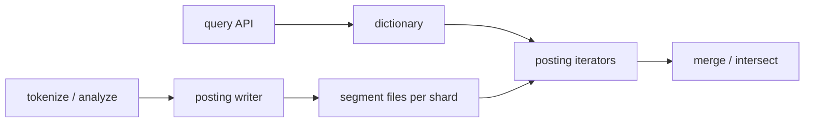

# HLD — Keyword Index for Billions of Messages

## Live interview opening (clarify first — bar raiser order)

*“I’ll **start by clarifying requirements**—scope, ambiguity, latency and scale expectations—then lock **FR/NFR**. **After** that, I’ll ground **user journey**, **consistency**, **commit/decision**, and **risks** so it’s clearly **derived from what we agreed**, then **scale** and **architecture**—and I’ll **pause after the diagram** for where you want depth.”*

<a id="interview-spine-nine-steps"></a>

> **Uber SDE-2 HLD — drive order in this doc:** **§1** clarify → FR → NFR → **Framing after requirements** (user journey, consistency, commit/decision anchors) → **§2** scale → **§3** core entities + APIs → **§4** architecture → **§5** deep dive and evolution → **§6** scaling → **§7** reliability → **§8** tradeoffs → **§9** observability and security → **§10** patterns → **Closing**. Treat **Human interaction** cue blocks (headings in this doc) as *spoken* cues—**paraphrase**; do not read every row. **Bar raiser** listens for **ownership**, **failure modes**, and **honest tradeoffs**. Canonical spine: [HLD-UBER-SDE2-INTERVIEW-SPINE.md](./HLD-UBER-SDE2-INTERVIEW-SPINE.md).

## Interview delivery (golden thread — live thinking)

Bar-raiser polish: **user-first**, **explicit consistency**, **bottleneck**, **evolution**, **UX trust**, **default opinion** (not endless “A or B”). Full template + habits: **[HLD-BAR-RAISER-PERFORMANCE-PACK.md](./HLD-BAR-RAISER-PERFORMANCE-PACK.md)** · **[HLD-MASTER-DELIVERY-GOLDEN-FLOW.md](./HLD-MASTER-DELIVERY-GOLDEN-FLOW.md)**.

| Say at the right time | What interviewers grade | In this guide |
|----------------------|---------------------------|---------------|
| **Opening** | Clarify before solution | **Above** — you **do not** assume requirements. |
| **User journey + consistency + decisions** | Derived, not memorized | **After Section 1**, block **Framing after requirements** — **before Section 2** (not before clarify). |
| **Bottleneck / evolution / UX** | Ops + trust | Same **Framing** block; deep numbers still in **Sections 5–7**. |
| **Strong opinion** | Defaults | **Section 8** tradeoffs — always *“I’d start with X because…”*. |

**Do not:** read tables line-by-line · put user journey **before** clarify · fence-sit.  
**Do:** clarify → FR/NFR → **then** grounded journey → diagram → deep dive where steered.

---

## 1. Clarify requirements

### 1.0 Live flow (how to open and steer)

<a id="live-flow-open"></a>

#### Live voice (real interviewer room)

**Sound like you’re *deciding*, not reciting:** one idea per breath, then **pause**. Tables here are **backup**—if your eyes are down for more than a couple of seconds, you’ve slipped into reading the doc.

**Bridge phrases (mix naturally):** *“Let me **name the fork** first…”* · *“I’ll **default to X**—tell me if your bar is stricter.”* · *“The reason I ask is it changes **who owns the commit** / **what’s on the hot path**.”* · *“I’ll **over-answer** one layer, then stop—**where should I zoom**?”*

**Ping them (conversation, not monologue):** *“Does that match how you’d scope it?”* · *“If we only deep-dive one thing, is it **A** or **B**?”* (swap **A/B** for two tensions from *your* opening paragraph above.)

**This topic in one breath:** “Search is **postings + merge** under a **scan budget**—I’m not giving a Lucene lecture unless you steer there.”

**`Verbatim` / `Live` cues:** say a line **once**, then **rephrase** the next time—verbatim twice in a row reads *canned*.

**Opening (~once):** *“I’ll align on **AND vs OR**, **phrase/proximity**, **index scope** (per user/chat/org), rough **search p99**; then **scale**, **data layout**, **architecture**, and **query path** end-to-end. I’ll **pause after the diagram**—depth on **intersection**, **sharding**, or **compaction**?”*

**Thinking transitions:** *“The expensive part is …”* · *“If I cap work I’d …”* · *“Let me sanity-check …”* · *“At billions scale the invariant is …”*

**Live rule:** **Paraphrase** §1–2 tables; don’t read every row. Go deep **only if they probe**.

**User journey (once):** say the [👤 User journey](#user-journey-framing) line **before** the architecture diagram so the room has a **product** entry point.

<a id="say-1-questions-human"></a>
### 1.1 Clarify 

| Topic | Say it like this in the room |
|--------------------------|-------------------------------|
| **Boolean default** | “Multi-keyword default is **AND** or **OR**?” |
| **Phrase** | “Do you need **phrase** / proximity—or token **AND** is enough?” |
| **Scope** | “Index **per user**, **per chat**, or **global** public—drives **shard + authz**.” |
| **Mutability** | “Messages **immutable** or **edits**—I’ll use **tombstones** + reindex if edits exist.” |
| **Result shape** | “**Top-K** only vs full iterator—changes early-termination.” |
| **SLO** | “Rough **p99** for search so I can cap **postings scanned**.” |

**Micro-pauses:** *“So postings are **on-disk streamable** lists—never **RAM** materialize billions of ids.”*

#### Human interaction (clarify requirements — think out loud & evolve scope)

**Habit:** *“Search at Uber scale is **inverted index + distributed merge**—I pin **query syntax**, **ACL**, and **freshness** before I pick Lucene vs managed.”*

**Live:** *“**Phrase vs keyword**? **Prefix**? **BM25** only or **learned** rerank? **Private chats**—who can see what?”*

| Stage | Assume | Evolve when… |
|-------|--------|----------------|
| **v1** | **Per-shard** postings + **merge** + **ACL filter** | Latency OK |
| **v2** | **Skip lists** / **WAND** for **AND** queries | CPU bound |
| **v3** | **ColBERT**-style rerank **off path** | Quality bar rises |

### 1.2 Functional requirements (FR) — after alignment, say this as “what we must build”

<a id="say-fr-human"></a>
#### Human interaction (FR — how to explain after alignment)

**Habit:** *“**Index build** + **query** + **authz scope**.”*

**Live:** one **spoken** FR pass (~60–90 s); use [§1.0](#live-flow-open) when you move **FR → NFR**.

| FR area | Say it like this in the room |
|---------|-------------------------------|
| **Build** | “Ingest by **`msg_seq`**; **tokenize**; append **sorted postings** per term on **disk**; **tombstone** deletes.” |
| **Search** | “Single term: **stream** postings with **pagination**; multi-term **AND**: **intersect** without loading full lists.” |
| **Access** | “Results always **scoped** to what the caller may see—**no cross-tenant** reads.” |

**Index build**

- Ingest messages (unique `msg_seq`); **tokenize**; append postings to **per-term** sorted lists (on disk).  
- Support **incremental** updates and **deletes** (tombstone).

**Search**

- **Single keyword:** return message ids (or seqs) containing term, **paginated**.  
- **Multi keyword:** return messages containing **all** terms (default AND) with efficient intersection.

**Access control**

- Results **scoped** to authorized chats/users—no cross-tenant leakage.

### 1.3 Non-functional requirements (NFR) — say as “how it must behave”

<a id="say-nfr-human"></a>
#### Human interaction (NFR — how to say “how it must behave”)

**Habit:** *“**Disk + stream**; cap **work per query**.”*

| NFR area | Say it like this in the room |
|----------|-------------------------------|
| **Scale** | “**Billions** of postings—**inverted index on disk**, **segments**, **compression**.” |
| **Latency** | “**Rarest-first AND**, **skipTo**, **caps** on postings scanned.” |
| **Privacy** | “**AuthZ** on shard route every time; **redact** queries in logs.” |

#### UX on search (say with NFR)

- **Slow query:** return **partial** page + **cursor** + honest **timeout**—don’t hang the client.  
- **No results:** distinguish **zero hits** vs **auth-filtered** when product allows safe copy.  
- **Index lag:** if messages appear “late” in search, **label** or cap **staleness** in UX.

**Scale**

- **Billions** of postings; **disk-backed** structures; **streaming** iterators.

**Performance**

- Bounded work per query via **rarest-first**, **caps**, **early exit** for top-K.

**Storage efficiency**

- **Delta encoding**, VarInt, **Roaring** bitmaps for dense ranges; **segment merge**.

**Durability**

- Index files **durable**; **WAL** or replicated log for index writer if needed.

**Security / privacy**

- **AuthZ** on every query; **encrypt at rest** for regulated tenants; **audit** access.

<a id="key-insight-say-early"></a>
### 1.4 Invariants (one sentence you repeat under pressure)

**Invariant:** “We never return a message the caller is **not authorized** to see; index partitions are **isolated** by tenant/chat policy.”

#### Key anchors (say these confidently—any order)

1. “**Disk-backed** postings—**stream**, don’t **RAM** materialize billions of ids.”  
2. “**Multi-term AND** = **rarest-first** + **`skipTo`** / **galloping**.”  
3. “**Cap** `max_postings_scan`—bounded work per query.”  
4. “**Shard** aligns with **authz** boundaries—**no** cross-tenant fan-in.”  
5. “**Tombstones** + **merge** for deletes/edits; **rebuild** from message log.”  
6. “**User journey** (say once)—[query → tokenize → dictionary → stream → intersect → top-K](#user-journey-framing); **read** = stream + cap, **write** = async index.”

<a id="say-voice-1"></a>

**Purpose:** handoff → **dictionary + postings + iterators** sketch.

| Beat | Say it like this |
|------|------------------|
| **Bridge** | “A **RAM** `Map<term, Set<id>>` or trie-of-messages doesn’t fix **query**—you still can’t materialize **billions of ids**.” |
| **Pivot** | “**Streaming intersection** on **sorted compressed postings** plus **shard** for privacy.” |

---

## Framing after requirements (before scale + architecture)

**Placement in the room:** this block is **not** “right after clarify questions.” You earn it **after** you’ve locked **FR + NFR** (spoken summary is fine)—otherwise journey / consistency / commit boundaries read as **assuming** product and SLOs.

**Out loud:** *“We’ve **clarified** scope and I’ve stated **FR/NFR** from that—**based on that**, here’s the **user-visible path**, **consistency**, and **commit** I’ll hold before I size **Section 2** and draw **Section 4**.”*

### Thinking transitions (use during interview)

- *“Let me think through this…”*
- *“One tradeoff here is…”*
- *“If I optimize for latency…”*
- *“This might become a bottleneck because…”*
- *“I’d start simple here and evolve later…”*

## User journey (say once—**after** FR/NFR, not after clarify alone)

From the searcher’s perspective: type **keywords** (AND/OR, maybe phrase) → **paginated** hits scoped to chats/users they’re allowed to see → open a message from results.

So:

- **read path** = **query** → dictionary lookup → **stream postings** from disk → **intersect** multi-term AND → **ACL filter** → **top-K** page.
- **write path** (index) = message ingest by **`msg_seq`** → tokenize → append **sorted postings** + **tombstones** on delete/edit.
- **async path** = **segment merge/compaction**, rebuild/replay from message log—never on the **interactive query** hot path.

## Consistency model

**Non-negotiable**:

- **AuthZ**: never return a hit the caller **cannot** read—partitions align with **tenant/chat** boundaries.
- **Bounded work** per query: **rarest-first**, **`skipTo`**, **`max_postings_scan`**.

**Eventual** is acceptable for:

- index **freshness** (seconds lag)—**label** in UX if product cares.
- background **merge** / replication lag—as long as **privacy** invariant holds.

## Commit boundary

A **search page** is “ready” when:

- you’ve applied **authz** filters on every candidate stream you merged.
- you respected **scan budget** / timeout—return **partial** + **cursor** rather than **hang** or **OOM**.

Index durability is a **separate** commit (WAL/segment writer)—queries must not assume **RAM** materialization of huge posting lists.

## Decision (strong opinion)

I’d start with:

- **disk-backed inverted index** (segments + compression), **shard** by the same dimension as **ACL**.
- **streaming iterators** for intersection, not `Map<term, Set<id>>` in memory.

because **billions** of messages means **RAM** dies first; **Lucene-shaped** thinking even if managed OpenSearch under the hood.

If **quality** bar rises:

- **WAND** / block-max pruning, optional **off-path rerank**—still **capped** CPU.

## Evolution

| Phase | Say it like this |
|-------|------------------|
| **1** | Simple implementation that ships. |
| **2** | Scaling: partitions, caches, queues, backpressure, observability. |
| **3** | Advanced / ML / global—only when metrics or product force it. |

Details: **Section 4.1 (phases)** and **Section 5** in this file.

## Bottleneck anchor

Watch first:

- **hot terms** (giant posting lists, CPU on AND).
- **merge/compaction** IO and **query tail** latency.

## Backpressure handling

Under load:

- tighten **top-K**, **time bounds**, **max postings scanned**; degrade to **shallower** pages.
- **isolate** noisy tenants to **dedicated shards** if needed.

Goal: **predictable p99** and **no leakage**—never **unbounded** scans for “hero” queries.

## UX awareness

Bad outcomes:

- **timeouts** with no partial results / cursor.
- **leaking** private messages across tenants.
- “**No results**” that’s really **auth-filtered**—copy should be honest when safe.

### Driving the conversation

- *“Does this direction make sense?”*
- *“Should I go deeper on **A** or **B**?”*
- *“Would you like failure scenarios next?”*

### Mindset

*“I’m not presenting a solution—I’m **designing with a teammate**.”*

**Playbook:** [HLD-BAR-RAISER-PERFORMANCE-PACK.md](./HLD-BAR-RAISER-PERFORMANCE-PACK.md).

---

## 2. Estimate scale

<a id="say-voice-2"></a>
#### Human interaction (estimate scale)

**Habit:** *“Billions ⇒ **shard + segment + cap**.”*

**Live:** *“Let me sanity-check…”* **total messages**, **QPS**, **shard scope**—**invite correction** before the dimension table.

| Topic | Say it like this in the room |
|-------|-------------------------------|
| **Volume** | “**10⁹+** messages; posting lists stay **huge**—must **stream**.” |
| **Hot term** | “Head terms need **top-K**, **time bounds**, or **WAND**—not full enumeration.” |

| Dimension | Illustrative |
|-----------|----------------|
| Messages | **10⁹+** total |
| Posting list length per rare term | Still huge—must **stream** |
| Hot terms | Millions of hits—need **top-K** or **time bounds** |
| Index size | **Many TB** → sharding + **tiered** storage |

**Tie it in one line:** “**Shard** for privacy and parallelism; **never** load a full hot posting list into RAM.”

---

## 3. APIs and data model

<a id="say-voice-3"></a>

### 3.0 Core entities (who owns what — say before API tables)

| Entity | Owns / lifecycle (one line) |
|--------|-----------------------------|
| **Document** | Message (or chunk) **text**, `doc_id`, **ACL** bitset / allowlist. |
| **Term → postings** | **Inverted** lists on shard; **immutable** segments + **merge** policy. |
| **Index segment** | **Versioned** build job output; **atomically** swapped at query node. |
| **Query** | Stateless request with **cursor** / **session** for pagination. |
| **Reranker model** (optional) | **Top-M** candidates only—**never** full corpus. |

#### Human interaction (APIs & data model — API design + contracts)

**Habit:** *“**Dictionary** in memory/mmap; **postings** on disk; **shard key** = tenant scope.”*

| Topic | Say it like this in the room |
|-------|-------------------------------|
| **API** | “**GET** search with `after_seq` **pagination**; multi-term **mode=and**.” |
| **Layout** | “**Segments** are immutable; **merge** in the background like Lucene-style engines.” |
| **Core split (once)** | Same as [Key insight / invariant](#key-insight-say-early)—**authz** + **disk iterators**, not RAM tries. |

### 3.1 APIs (sketch)

| API | Purpose |
|-----|---------|
| `GET /search?q=foo&after_seq=&limit=` | Single term |
| `GET /search?terms=foo,bar&mode=and&after_seq=` | Multi-term |
| `POST /internal/index/rebuild` | Admin/repair (authz heavy) |

### 3.2 Data structures (logical model)

- **Dictionary:** `term → (offset, len, doc_freq)` in memory or mmap.  
- **Postings:** sorted `msg_seq` (optional positions for phrases).  
- **Segments:** immutable files + **merge** (Lucene-like).

### 3.3 Physical layout

- Shard by **`user_id` / `chat_id` / org_id`** — align with **privacy** and query filters.

---

## 👤 User journey (say once early)

<a id="user-journey-framing"></a>

**Say it once early** (before or right after the [architecture sketch](#4-high-level-architecture)):

*“User **types** a query → system **tokenizes** → looks up terms in the **dictionary** → **streams** postings → **intersects** (if multi-term) → returns **top-K** results.

So:
- **read path** is **streaming** + **bounded work**  
- **write path** builds the index **asynchronously** from messages.”*

👉 **Intuitive**, **product-aware**—then map to **writer / segments / query API** on the board.

---

## 4. High-level architecture

<a id="say-voice-4"></a>
#### Human interaction (high-level architecture / HLD)

**Habit:** *“**Write path** appends segments; **read path** opens **iterators**.”*

| Moment | Say it like this in the room |
|--------|------------------------------|
| **Write** | “Tokenize → **posting writer** → **segment files** per shard.” |
| **User journey** | “Same beat as [👤 User journey](#user-journey-framing): **query → dictionary → iterators → top-K**.” |
| **Read** | “Dictionary lookup → **iterators** → **merge/intersect**—bounded work.” |
| **Steer** | “**Deeper** on **intersection**, **compaction**, or **failure/rebuild** next?” |



**Narration:** “**Writes** append postings into **segments**; **reads** open **iterators** on compressed blocks; **queries** never load full lists into RAM.”

### 4.1 How we’d evolve this (if they ask “phases / MVP”)

| Phase | Ship | Why |
|-------|------|-----|
| **1 — MVP** | Single-term **stream** + **pagination**, basic **sharding**, simple **segments** | Prove disk + authz story |
| **2 — Growth** | **Multi-term AND**, **rarest-first** + **`skipTo`**, **compaction** pool | Latency at scale |
| **3 — Scale** | **Roaring**/block max scores, **tiered** storage, **WAND**/top-K early exit | Hot terms + cost |

**Taking a stance:** *“I’d ship **phase 1** with strict **per-query caps**; I’d add **phrase positions** only when the room confirms **phrase** is in scope.”*

---

## 5. Deep dive: critical flow

<a id="say-voice-5"></a>
#### Human interaction (deep dive — critical flow, optimizations & evolution)

**Live (evolution):** *“**Default**: scatter **OR**-heavy query to shards → **merge** top-K with **ACL**. **Evolve**: **two-phase** (cheap recall + **rerank** service), **synonym** table versioned, **personal** index only if product pays cost.”*

**Habit:** *“**Single term** = stream; **AND** = **rarest-first** + **`skipTo`**.”*

| Step | Say it like this in the room |
|------|-------------------------------|
| **Single** | “Dictionary → **stream** sorted `msg_seq` with **`after_seq`** cursor.” |
| **AND** | “Order terms by **df**; walk the **shortest** list; **`skipTo`** on the others—**galloping** inside blocks.” |
| **Phrase** | “Need **positions**—verify adjacency after AND narrows candidates.” |
| **Anti-trie** | “Trie helps **prefix completion**; it doesn’t replace **compressed postings** at billions scale.” |
| **Production voice** | “**Hot term** query—**postings scanned** explodes; **compaction** backlog—**throttle** writes; **corrupt segment**—**checksum** + **rebuild** from log.” |
| **Anchor** | “Say **once**—[🎯 Bottleneck Anchor](#bottleneck-anchor-once).” |

This is **step 5** of the [spine](#interview-spine-nine-steps)—where most Bar Raiser time should go.

<a id="bottleneck-anchor-once"></a>
### 🎯 Bottleneck Anchor

**Say once in the deep dive:**

The main bottleneck here is **usually**:

- **scanning too many postings** for **hot** terms  
- **or** **compaction lag** affecting **segment count** / merge depth

*That’s what I’d **monitor first**.*

👉 Then support with **postings scanned p99**, **merge lag**, and **index bytes** per shard.

**Taking a stance:** *“**I’d default to managed search** for most teams, and **move to a custom inverted index** when **cost** or **tail latency** becomes **critical**.”*

### 5.1 Single keyword

1. Dictionary lookup for term.  
2. **Stream** postings in order; **page** with `(after_seq, limit)`.  
3. Optional **WAND/MaxScore** if scoring for top-K only.

### 5.2 Multi-keyword AND

- **Naive:** merge all lists — bad when one list is huge.  
- **Strong:** sort terms by **ascending df**; outer loop on **rarest** list; **`skipTo(seq)`** on others (**galloping** / binary search in block).  
- **Dense:** **Roaring AND**.

### 5.3 Phrase queries

- Store **positions** in postings or **secondary** positional structure; verify adjacency after candidate AND.

### 5.4 Index build path

- Tokenize message → for each term emit `(term, msg_seq)` → append to **segment buffer** → periodic **flush** + **merge**.

---

## 6. Scaling and bottlenecks

<a id="say-voice-6"></a>
#### Human interaction (scaling & bottlenecks)

**Habit:** *“**Postings scanned** is your money metric.”*

| Topic | Say it like this in the room |
|-------|-------------------------------|
| **Huge lists** | “**Rarest-first**, skip pointers, block **max scores**.” |
| **Compaction** | “Dedicated **merger** pool; throttle writes if backlog grows.” |

| Risk | Mitigation |
|------|------------|
| **Huge posting reads** | Rarest-first + skip pointers + block max scores |
| **Hot shard** | Further partition by time or hash within tenant |
| **Compaction backlog** | Throttle writes; dedicated compactor pool |
| **Memory pressure** | mmap; small block cache; avoid loading full lists |

**Techniques table:** sharding; delta+VarInt; block skips; Bloom per block; **tiered** cold storage; **segment** limit.

---

## 7. Reliability and failure handling

<a id="say-voice-7"></a>
#### Human interaction (reliability & failure handling)

**Habit:** *“**Checksum segments**; **tombstones**; **rebuild** story.”*

| Topic | Say it like this in the room |
|-------|-------------------------------|
| **Corruption** | “Detect bad blocks; **rebuild** shard from message log.” |
| **Partial** | “Return **partial page** + flag vs hard fail—product call.” |
| **Incident tone** | “**Runaway AND** on common terms—**rarest-first** + **caps**; **bad deploy** segment—**rollback** + **reindex**; **OOM** on merge—**bulkhead** compactors.” |

**UX tie-in (say aloud):** *“**Timeout** → partial results + **retry cursor**; never leak **other tenants’** hits ‘as empty’ without thinking through copy.”*

- **Replica** index shards; **failover** read path.  
- **Corrupt segment:** checksum; **rebuild** from source of truth messages.  
- **Partial query failure:** return **partial page** with error flag vs fail—product choice.  
- **Backpressure:** limit max postings scanned per query.

---

## 8. Tradeoffs and alternatives

<a id="say-voice-8"></a>
#### Human interaction (tradeoffs & alternatives)

**Habit:** *“**Managed search** first; **custom inverted index** when **cost** or **tail p99** forces it.”*

| Topic | Say it like this in the room |
|-------|-------------------------------|
| **RAM map** | “Doesn’t scale—same failure mode as naive trie story.” |
| **Managed** | “**Managed search** (OpenSearch/ES): **velocity**; watch **$** and less **low-level** control.” |
| **My default (engine)** | “**I’d default to managed search** for most teams, and **move to custom inverted index** when **cost** or **tail latency** becomes **critical**.” |
| **My default (AND)** | “**Rarest-first** + **`skipTo`** before clever **RAM** structures.” |

| Option | Good | Bad |
|--------|------|-----|
| In-memory map | Simple | **Does not scale** |
| Disk inverted index | Scales | Ops complexity |
| Central global index | One stack | **Privacy blast radius** |
| Elasticsearch managed | Faster to ship | Cost; less control |

**Alternatives:** **Elasticsearch** for full stack vs custom postings; **ngram** for substring vs token index tradeoffs.

---

## 9. Monitoring, observability, and security

<a id="say-voice-9"></a>
#### Human interaction (monitoring, observability & security)

**Habit:** *“Watch **postings scanned** as much as **p99**.”*

| Topic | Say it like this in the room |
|-------|-------------------------------|
| **Metrics** | “Query **p99**, **postings scanned**, **index lag**, merge **depth**.” |
| **Security** | “**Tenant** on every route; **redacted** query logs.” |

**Metrics:** query **p99**, **postings scanned** per query, **merge** queue depth, **index lag** behind message log.

**Security:** enforce **tenant** on every shard route; **no** cross-shard fan-in without auth; log **redacted** queries.

**Compliance:** retention on **search logs**; right-to-erasure → **tombstone** + async scrub.

---

## 10. Design patterns, data structures & best practices

Tie **inverted index**, **sharding**, **CQRS-lite** to the diagram.

### 10.1 Search / distributed patterns

| Pattern | Where | Why |
|---------|--------|-----|
| **Inverted index** | Term → postings on disk | Standard IR at scale |
| **Sharding** | By `user_id` or hash range | Isolation + parallelism |
| **CQRS-lite** | Message log vs index projector | Rebuild index from source of truth |
| **Outbox** | After message commit emit index job | Consistent indexing |
| **Idempotent indexer** | `(message_id, version)` | Safe retries |
| **Circuit breaker** | Downstream object store / ES | Protect query path |

### 10.2 Classic patterns

| Pattern | Map |
|---------|-----|
| **Iterator** | Merge **sorted** posting streams (AND/OR) |
| **Strategy** | **rarest-first** vs fixed order intersection |
| **Template method** | Query pipeline: tokenize → fetch → merge → rank snippet |
| **Anti-corruption** | Normalize encodings / language before tokenize |

### 10.3 Data structures

| Need | Structure |
|------|-----------|
| Posting list | **Sorted** `message_id` arrays or **skiplist** segments on disk |
| Vocabulary | **Lexicon** (term → term_id) |
| Hot terms | **Block max** / skip ahead in merge |
| Phrase / proximity | **Positional** postings or **bigram** table |

### 10.4 Best practices

- **Never** load full posting list into RAM for hot terms.  
- **Cap** `max_postings_scan` and return partial + cursor.  
- **Tenant** isolation on every shard lookup.

### 10.5 Trade-offs

| Pick | Trade |
|------|--------|
| Managed search (ES/OpenSearch) | Speed to ship vs **cost** + less control |
| Custom on-disk index | Control vs **engineering** burden |

<a id="say-voice-10"></a>
#### Human interaction (design patterns, data structures & best practices)

**Habit:** *“**Iterator** merge, **Strategy** for intersect order, **CQRS-lite** from message log.”*

**Verbatim (drive the room in ~40s):** *“**Inverted index** on disk with **sorted postings** per term; **shard** by `user_id` or tenant for isolation; **CQRS-lite**—message store is truth, index is **projection**; **outbox** after commit to index jobs; **idempotent indexer** on `(message_id, version)`; query pipeline **Template method**: tokenize → fetch postings → **Iterator** merge AND/OR → rank snippet; **cap** `max_postings_scan`.”*

**Live:** **at most four** patterns; tie each to **write** vs **read** path; then stop.

| You mean… | Say it like this in the room |
|-----------|-------------------------------|
| **Patterns** | “**Inverted index** on disk; **shard** by tenant; **idempotent indexer**; **breaker** on heavy deps.” |
| **DS** | “Sorted **postings**, **dictionary**, **skip lists** in blocks, optional **Roaring**.” |

---

## Closing notes (where wrap-up human interaction lives)

Optional: [coding sketch](#optional-coding-sketch) if they ask for pseudocode.

Use **`#### Human interaction`** under [Bar-raiser](#bar-raiser-follow-ups), [Communication (do vs avoid)](#communication-do-vs-avoid), and [60-second close](#60-second-close).

<a id="communication-do-vs-avoid"></a>
### Communication (do vs avoid)

| Do (sounds senior) | Avoid (sounds rehearsed) |
|--------------------|---------------------------|
| **Draw iterator** intersection | Explaining Lucene for 20 minutes unprompted |
| **Cap work** explicitly | “We’ll optimize later” |
| **AuthZ every shard** | Ignoring tenant isolation |
| **Default** (managed search → custom when cost / tail latency critical) | Fence-sitting with no pick |
| **Pause for steering** | One long monologue |

**60-minute sketch (flex):** clarify+FR+NFR ~8–12 · scale+APIs ~8–12 · architecture ~8–12 · **deep dive ~15–22** · scale→monitoring ~10–15 · patterns+close ~5–8.

---

## Bar-raiser follow-ups

<a id="say-voice-bar"></a>
#### Human interaction (bar-raiser)

**Habit:** two–four sentences, then **stop**.

| They ask | Say it like this |
|----------|------------------|
| **Edits** | “**Tombstone** old postings; append new; **merge** compacts; queries filter deleted.” |
| **Rare terms** | “**min df**, stopwords, caps per user—control **noise** and **size**.” |

---

## 60-second close

<a id="say-voice-close"></a>
#### Human interaction (60-second close)

**Habit:** one **net-net** pass.

| Beat | Say it like this in the room |
|------|------------------------------|
| **Recap** | “**Inverted index** on disk—**sorted compressed postings**; single term **stream** + **pagination**; multi-term **AND** via **rarest-first** + **`skipTo`**; **shard** for **privacy**; **managed search** default, **custom** if **cost** or **tail** critical; watch **postings scanned**, **compaction**, **p99**.” |

---

<a id="optional-coding-sketch"></a>

### Optional coding sketch

```text
intersect(lists):
  lists.sort_by(estimated_length)
  for seq in lists[0]:
    if all(L.skip_to(seq) for L in lists[1:]):
      yield seq
```

---
