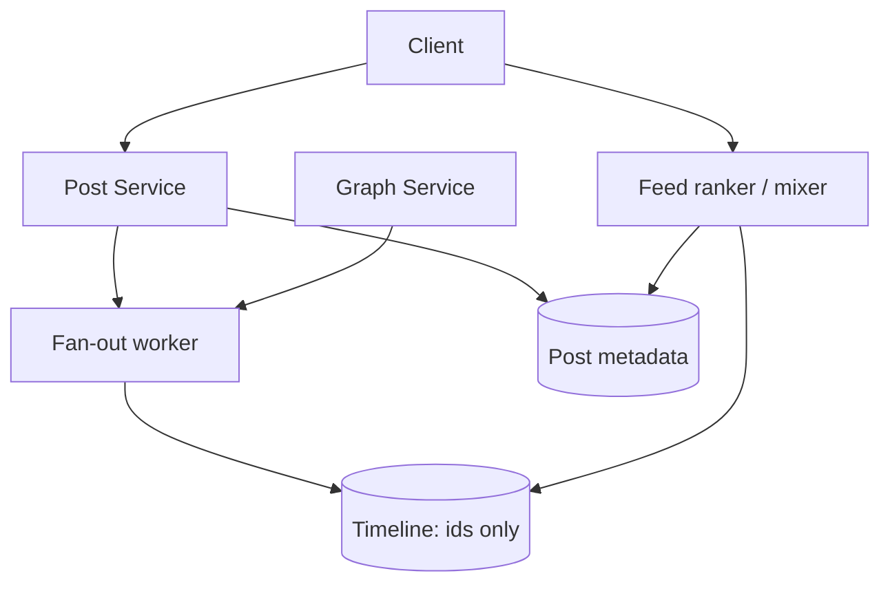
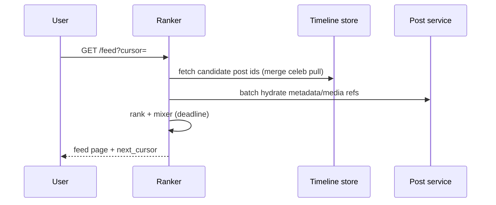

# HLD — Social Network News Feed

## Live interview opening (clarify first — bar raiser order)

*“I’ll **start by clarifying requirements**—scope, ambiguity, latency and scale expectations—then lock **FR/NFR**. **After** that, I’ll ground **user journey**, **consistency**, **commit/decision**, and **risks** so it’s clearly **derived from what we agreed**, then **scale** and **architecture**—and I’ll **pause after the diagram** for where you want depth.”*

> **Uber SDE-2 HLD — drive order in this doc:** **§1** clarify → FR → NFR → **Framing after requirements** (user journey, consistency, commit/decision anchors) → **§2** scale → **§3** core entities + APIs → **§4** architecture → **§5** deep dive and evolution → **§6** scaling → **§7** reliability → **§8** tradeoffs → **§9** observability and security → **§10** patterns → **Closing**. Treat **Human interaction** cue blocks (headings in this doc) as *spoken* cues—**paraphrase**; do not read every row. **Bar raiser** listens for **ownership**, **failure modes**, and **honest tradeoffs**. Canonical spine: [HLD-UBER-SDE2-INTERVIEW-SPINE.md](./HLD-UBER-SDE2-INTERVIEW-SPINE.md).

## Interview delivery (golden thread — live thinking)

Bar-raiser polish: **user-first**, **explicit consistency**, **bottleneck**, **evolution**, **UX trust**, **default opinion** (not endless “A or B”). Full template + habits: **[HLD-BAR-RAISER-PERFORMANCE-PACK.md](./HLD-BAR-RAISER-PERFORMANCE-PACK.md)** · **[HLD-MASTER-DELIVERY-GOLDEN-FLOW.md](./HLD-MASTER-DELIVERY-GOLDEN-FLOW.md)**.

| Say at the right time | What interviewers grade | In this guide |
|----------------------|---------------------------|---------------|
| **Opening** | Clarify before solution | **Above** — you **do not** assume requirements. |
| **User journey + consistency + decisions** | Derived, not memorized | **After Section 1**, block **Framing after requirements** — **before Section 2** (not before clarify). |
| **Bottleneck / evolution / UX** | Ops + trust | Same **Framing** block; deep numbers still in **Sections 5–7**. |
| **Strong opinion** | Defaults | **Section 8** tradeoffs — always *“I’d start with X because…”*. |

**Do not:** read tables line-by-line · put user journey **before** clarify · fence-sit.  
**Do:** clarify → FR/NFR → **then** grounded journey → diagram → deep dive where steered.

---

## 1. Clarify requirements

### 1.0 Live flow (how to open and steer)

#### Live voice (real interviewer room)

**Sound like you’re *deciding*, not reciting:** one idea per breath, then **pause**. Tables here are **backup**—if your eyes are down for more than a couple of seconds, you’ve slipped into reading the doc.

**Bridge phrases (mix naturally):** *“Let me **name the fork** first…”* · *“I’ll **default to X**—tell me if your bar is stricter.”* · *“The reason I ask is it changes **who owns the commit** / **what’s on the hot path**.”* · *“I’ll **over-answer** one layer, then stop—**where should I zoom**?”*

**Ping them (conversation, not monologue):** *“Does that match how you’d scope it?”* · *“If we only deep-dive one thing, is it **A** or **B**?”* (swap **A/B** for two tensions from *your* opening paragraph above.)

**This topic in one breath:** “Feed is **hybrid fan-out + read path rank**—I’ll name a **celebrity cutoff** so scale isn’t hand-wavy.”

**`Verbatim` / `Live` cues:** say a line **once**, then **rephrase** the next time—verbatim twice in a row reads *canned*.

**Opening (~once):** *“I’ll align on **ranked vs chrono**, **celebrity threshold**, **blocks/safety**, **live updates** (WS vs poll); then **scale**, **APIs + fan-out policy**, **architecture**, and **GET /feed**. I’ll **pause after the diagram**—depth on **fan-out**, **read path + rank**, or **failure**?”*

**Thinking transitions:** *“**Hybrid + cutoff** from day one—pure push breaks at scale …”* · *“If rank blows p99 I’d …”* · *“Let me sanity-check …”* · *“Blocks are a hard filter because …”*

**Live rule:** **Paraphrase** §1–2 tables; don’t read every row. Go deep **only if they probe**.

**User journey (once):** say the [👤 User journey](#user-journey-framing) line **before** the architecture diagram for a **product** entry point.

### 1.1 Clarify 

| Topic | Say it like this in the room |
|--------------------------|-------------------------------|
| **Feed shape** | “**Ranked** home vs mostly **reverse chrono**?” |
| **Celebrity** | “At what follower count do we **stop pushing** and switch to **read-time merge**?” |
| **Lifecycle** | “**Edit/delete** post—how hard must invalidation be?” |
| **Mixer** | “**Ads** or injected promos in scope?” |
| **Safety** | “**Blocks/mutes**—server-side **hard filter** everywhere?” |
| **Live** | “**WS/SSE nudge** vs polling for freshness?” |
| **Region** | “**Multi-region** from day one?” |

**Micro-pauses:** *“So timelines store **ids**; bodies **hydrate** separately; celebs don’t get **O(followers)** push.”*

#### Human interaction (clarify requirements — think out loud & evolve scope)

**Habit:** *“Feed is **fan-out vs fan-in**—I clarify **celebrity scale**, **ordering** (strict vs best-effort), and **ranking** budget.”*

**Live:** *“**Global** reverse chronological only, or **ranked**? **Cross-region**? **Stories** ephemeral?”*

| Stage | Assume | Evolve when… |
|-------|--------|----------------|
| **v1** | **Pull** model + **fan-out-on-write** for normal users | Simple |
| **v2** | **Hybrid**: **fan-in** for celebs + **merge** | Hot accounts |
| **v3** | **ML rank** + **cache** pools + **Graph** for social proof | Engagement SLO |

### 1.2 Functional requirements (FR) — after alignment, say this as “what we must build”

#### Human interaction (FR — how to explain after alignment)

**Habit:** *“**Graph**, **post**, **distribute**, **read**.”*

**Live:** one **spoken** FR pass (~60–90 s); use [§1.0](#live-flow-open) when you move **FR → NFR**.

| FR area | Say it like this in the room |
|---------|-------------------------------|
| **Graph** | “**Follow** / unfollow; optional friends-only.” |
| **Post** | “Create post; **I’d default hybrid fan-out** with a **clear celebrity cutoff** from day one—**pure push** breaks at scale.” |
| **Feed** | “**Home feed** paginated; ranked vs chrono per product.” |
| **Safety** | “**Blocks/mutes** enforced on **read path**.” |

**Social graph**

- **Follow** / unfollow; optional friends-only mode if product says so.

**Posting**

- Create **post** with text/media; **distribute** to followers’ feeds (per fan-out policy).

**Feed read**

- **Home feed** paginated; support **ranked** or chronological per product.

**Engagement (optional)**

- Like/comment counts may influence **rank**.

**Safety**

- **Block/mute** must filter **hard** from feed inputs.

### 1.3 Non-functional requirements (NFR) — say as “how it must behave”

#### Human interaction (NFR — how to say “how it must behave”)

**Habit:** *“**Reads ≫ writes**; **rank** gets a **deadline**.”*

| NFR area | Say it like this in the room |
|----------|-------------------------------|
| **Latency** | “**Low p99** on **GET /feed**—I’ll **time-box** ranking.” |
| **Availability** | “**Partial feed** or **chrono fallback** beats a blank **500**.” |
| **Consistency** | “Graph can be **eventual** for seconds; **blocks** should feel **fast**.” |
| **Security** | “**AuthZ** everywhere; **signed** media URLs.” |

#### UX on the feed (say with NFR)

- **Ranker sick:** **chrono fallback**—user still sees a **coherent** slice, not an empty **500**.  
- **Fan-out lag:** **stale tail** ok for seconds if product allows—**don’t** show blocked accounts.  
- **Live updates:** **cursor nudge** + client **fetch**—avoid pushing full ranked pages every tick.

**Scale**

- Massive **read:write** ratio; **timeline reads** dominate.

**Latency**

- **Low p99** for home feed; **time-box** ranking.

**Durability**

- Posts **durable**; timelines can be **rebuilt** from post log + graph (expensive)—usually **materialized**.

**Availability**

- Prefer **stale feed slice** vs total outage when ranker fails.

**Consistency**

- **Eventual** graph visibility acceptable for seconds if disclosed; **blocks** should propagate quickly (define SLO).

**Security**

- **AuthZ** on all reads; **no IDOR** on private posts; **signed URLs** for media.

### 1.4 Invariants (one sentence you repeat under pressure)

**Invariant:** “**Blocks/mutes** are **hard filters** on candidate ids; a feed response **version** does not contain **duplicate** post ids.”

#### Key anchors (say these confidently—any order)

1. “**Timelines store ids**; **hydrate** separately.”  
2. “**Hybrid fan-out** + **celebrity cutoff** from day one: **push** normals, **capped pull-merge** for celebs—**pure push** doesn’t survive scale.”  
3. “**Rank** is **time-boxed**; **fallback** to chrono.”  
4. “**Blocks** enforced on **read path**, not ‘best effort’.”  
5. “**Fan-out async**—never **O(followers)** synchronous on post.”  
6. “**User journey** (say once)—[open → fetch → ids → hydrate → rank → page](#user-journey-framing); **write** = post + policy, **read** = assemble + rank + **block** filter.”

**Purpose:** handoff → **hybrid fan-out** + **read funnel**.

| Beat | Say it like this |
|------|------------------|
| **Bridge** | “**Hybrid + cutoff** from day one: **push ids** below cutoff; **pull/merge cap** for celebs—never **O(followers)** push for celebs.” |
| **Read path** | “**Ids → hydrate → rank under deadline → mixer**.” |

---

## Framing after requirements (before scale + architecture)

**Placement in the room:** this block is **not** “right after clarify questions.” You earn it **after** you’ve locked **FR + NFR** (spoken summary is fine)—otherwise journey / consistency / commit boundaries read as **assuming** product and SLOs.

**Out loud:** *“We’ve **clarified** scope and I’ve stated **FR/NFR** from that—**based on that**, here’s the **user-visible path**, **consistency**, and **commit** I’ll hold before I size **Section 2** and draw **Section 4**.”*

### Thinking transitions (use during interview)

- *“Let me think through this…”*
- *“One tradeoff here is…”*
- *“If I optimize for latency…”*
- *“This might become a bottleneck because…”*
- *“I’d start simple here and evolve later…”*

## User journey (say once—**after** FR/NFR, not after clarify alone)

From the member’s perspective: **follow** people → **post** (text/media) → followers eventually see it on **home feed**; open app → **GET /feed** paginated → optional **live nudge** (WS/SSE) → **like/comment** signals may affect **rank**.

So:

- **write path** = create post → **fan-out policy** (push ids to timelines vs **pull/merge** for celebs)—**never** synchronous **O(followers)** on the post request.
- **read path** = fetch **timeline ids** → **hydrate** bodies/media → **rank under deadline** (or chrono) → apply **blocks/mutes** as **hard filters**.
- **async path** = fan-out workers, **precompute** pools, **mixer** for ads—must not **block** minimal feed.

## Consistency model

**Hard filters**:

- **blocks/mutes** must exclude candidates on the **read path**—not “best effort.”
- feed page has **no duplicate post ids** for a given **cursor/version** contract.

**Eventual** can be OK for:

- graph “**follows you**” visibility lag **if** product accepts seconds.
- **ranking** features and **tail** of fan-out—**never** at the expense of showing blocked content.

## Commit boundary

A **feed page** is “committed” when:

- you’ve fetched a **consistent slice** of ids for that cursor (define **torn read** policy if replicas).
- **hydration** either succeeds per item or **drops** that card with a safe placeholder—**rank** respects a **time budget** with **chrono fallback**.

Post itself is committed when **durable** in post store; **timeline materialization** is **async** and may lag—**surface** that honestly if needed.

## Decision (strong opinion)

I’d start with:

- **hybrid fan-out + celebrity cutoff** from day one: **push ids** for normal accounts, **capped pull-merge** for mega-followed accounts.
- **timelines of ids**, **hydrate separately**, **time-box rank** with **chrono fallback**.

because **pure push** dies on celeb posts; **pure pull** dies on read cost—**hybrid** is the boring industry answer.

If engagement demands:

- **ML rank** and **cache pools**—still under **p99** guardrails.

## Evolution

| Phase | Say it like this |
|-------|------------------|
| **1** | Simple implementation that ships. |
| **2** | Scaling: partitions, caches, queues, backpressure, observability. |
| **3** | Advanced / ML / global—only when metrics or product force it. |

Details: **Section 4.1 (phases)** and **Section 5** in this file.

## Bottleneck anchor

Watch first:

- **celebrity post** fan-out (queue backlog, write amplification).
- **GET /feed p99** (hydration fan-out, rank tail, cache misses).

## Backpressure handling

Under load:

- **shed mixer/ads** and **heavy rank** first; ship **chrono slice**.
- **throttle** fan-out workers; **cap** merge work for celeb readers.

Goal: **non-empty coherent feed** over **perfect personalization**.

## UX awareness

Bad outcomes:

- **empty 500** when ranker fails—**fallback** to chrono.
- showing posts from **blocked** users.
- **dupes** or broken cursors on refresh—**stable ordering** contract matters.

### Driving the conversation

- *“Does this direction make sense?”*
- *“Should I go deeper on **A** or **B**?”*
- *“Would you like failure scenarios next?”*

### Mindset

*“I’m not presenting a solution—I’m **designing with a teammate**.”*

**Playbook:** [HLD-BAR-RAISER-PERFORMANCE-PACK.md](./HLD-BAR-RAISER-PERFORMANCE-PACK.md).

---

## 2. Estimate scale

#### Human interaction (estimate scale)

**Habit:** *“**DAU** big; **celebrity** is the write trap.”*

**Live:** *“Let me sanity-check…”* **DAU**, **follow graph order**, **celebrity cutoff**—**invite correction**.

| Topic | Say it like this in the room |
|-------|-------------------------------|
| **Read:write** | “Reads dominate—optimize **timeline read** and **rank tail**.” |
| **Celebrity** | “One post could be **100M+** followers—**hybrid** is non-optional.” |

| Dimension | Illustrative |
|-----------|----------------|
| DAU | **100M–500M+** class in “big social” discussion |
| Reads | Orders of magnitude above writes |
| Celebrity | Single post **fan-out** could be **100M+** if naively pushed—**forbidden** path |
| Timeline size | **Trim** to last N thousand ids per user (product) |

**Tie it in one line:** “**Materialized timelines of ids** + **async fan-out** for normals; **capped merge** for celebs.”

---

## 3. APIs and data model

### 3.0 Core entities (who owns what — say before API tables)

| Entity | Owns / lifecycle (one line) |
|--------|-----------------------------|
| **User** | Identity; **follow graph** edges (outbox of follow events). |
| **Post** | **Immutable** content ref + **author** + **ACL** / visibility. |
| **Timeline shard** | Ordered **post ids** per user partition—**fan-out** target. |
| **Ranker / mixer** (optional) | **Reorders** **candidate ids** under **deadline**. |
| **Hydration bundle** | **Batch** fetch bodies/authors for **GET feed**. |

#### Human interaction (APIs & data model — API design + contracts)

**Habit:** *“**Graph**, **post**, **timeline ids**—three stores.”*

| Topic | Say it like this in the room |
|-------|-------------------------------|
| **Model** | “**Timeline** holds **post ids** only; **post service** holds metadata; **graph** owns follows.” |
| **Hybrid** | “**Default hybrid** with explicit **celebrity cutoff**: **push ids** below cutoff; **pull-merge cap** above—**pure push** breaks at scale.” |
| **Core split (once)** | Same as [Key insight / invariant](#key-insight-say-early)—**write distribution** vs **read funnel + safety**. |

### 3.1 APIs (sketch)

| API | Purpose |
|-----|---------|
| `POST /v1/posts` | Create post |
| `POST /v1/follow/{user_id}` | Follow |
| `GET /v1/feed?cursor=` | Home feed |
| `GET /v1/posts/{id}` | Post detail |

### 3.2 Data model

**Graph:** `following(user_id → list<followee_id>)` sharded by **follower** or **followee** (state access pattern).

**Post:** `post_id, author_id, text_ref, media_refs, created_at, deleted, version`.

**Timeline:** per **viewer** `user_id`: **ordered list of post_ids** (push model) **or** empty if pure pull.

**Hybrid:** timeline stores **non-celeb** ids; **merge** celeb slice at read from **authoritative** celeb post store.

### 3.3 Fan-out policy (part of model)

| User type | Write path | Read path |
|-----------|------------|-----------|
| Typical author | **Push** post id to each follower timeline (async worker) | Simple read |
| **Celebrity** | **No** O(followers) push | **Pull** recent from author + **merge** with cap |

---

## 👤 User journey (say once early)

**Say it once early** (before or right after the [architecture diagram](#4-high-level-architecture)):

*“User **opens** app → **fetches** feed → system pulls **candidate post IDs** → **hydrates** → **ranks** → returns **page**.

When someone **posts** → it either gets **pushed** to timelines (**normal** users) or **pulled at read** (**celebs**).

So:
- **write path** = **post** + **fan-out policy**  
- **read path** = **assemble** + **rank** + **filter** (blocks/mutes).”*

👉 **Intuitive**—then map **Post → Fan → TL** and **Ranker** on the diagram.

---

## 4. High-level architecture

#### Human interaction (high-level architecture / HLD)

**Habit:** *“**Write**: post → fan-out → timelines; **Read**: ranker hits timelines + post store.”*

| Moment | Say it like this in the room |
|--------|------------------------------|
| **Write** | “**Post service** writes metadata; **fan-out worker** fans ids into follower timelines for **non-celeb**.” |
| **User journey** | “Same beat as [👤 User journey](#user-journey-framing): **GET /feed** = **ids → hydrate → rank**; **post** = **push vs pull** by author class.” |
| **Read** | “**Feed ranker**: pull **candidate ids**, **batch hydrate**, **rank + mixer**.” |
| **Steer** | “**Deeper** on **fan-out**, **rank + mixer**, or **reliability** next?” |

**Narration:** “**Writes** create post + **async fan-out** to timelines for normal users; **reads** pull **candidate ids**, **hydrate**, **rank** under deadline.”

### 4.1 How we’d evolve this (if they ask “phases / MVP”)

| Phase | Ship | Why |
|-------|------|-----|
| **1 — MVP** | **Chrono** feed, **push** for small graphs **but** **define celebrity cutoff** in the model (even if high), **basic** graph store | Learn read/write ratio without celeb debt |
| **2 — Growth** | **Hybrid** celeb policy, **ranker** with **deadline + fallback**, **CDN** media | Engagement + p99 |
| **3 — Scale** | **Sharded** timelines, **mixer** slots, **strong** block propagation, **multi-region** reads | Tail + safety |

**Taking a stance:** *“**I’d default to hybrid fan-out** with a **clear celebrity cutoff** from **day one**—**pure push** breaks at scale; even in **MVP** I’d **name** the cutoff in the model so we don’t paint ourselves into a corner.”*

---

## 5. Deep dive: read feed path

#### Human interaction (deep dive — critical flow, optimizations & evolution)

**Live (evolution):** *“**Default**: **post** → **fan-out** pointers into followers’ **timeline shards**. **Evolve**: **celebrity** **pull**-merge, **read-through** cache for **hydration**, **rank** as **two-stage** over **candidate ids**.”*

**Habit:** *“**GET /feed** like the sequence diagram—**deadline** on rank.”*

| Step | Say it like this in the room |
|------|-------------------------------|
| **Fetch** | “Pull **timeline candidate ids**; **merge** capped celeb sources.” |
| **Hydrate** | “**Batch** post metadata; enforce **blocks** server-side.” |
| **Rank** | “**Time-box** model; on timeout → **chrono** fallback; **mixer** for ads if any.” |
| **Live** | “**WS/SSE** nudges new **`cursor`**—don’t push full ranked page every tick.” |
| **Production voice** | “**Fan-out backlog** after viral post—**queue depth** + **batch inserts**; **rank tail** at peak—**deadline + chrono**; **stale blocklist**—**version** inputs to ranker.” |
| **Anchor** | “Say **once**—[🎯 Bottleneck Anchor](#bottleneck-anchor-once).” |

This is **step 5** of the [spine](#interview-spine-nine-steps)—where most Bar Raiser time should go.

### 🎯 Bottleneck Anchor

**Say once in the deep dive:**

The main bottleneck here is:

- **fan-out backlog** for **normal** users (queue / workers / inserts)  
- **or** **ranker latency** on the **read** path (**p99** tail)

*That’s what I’d **monitor first**.*

👉 Then **fan-out lag**, **feed p99**, **fallback rate**, **empty feed**.

**Taking a stance:** *“I’d default **materialized timeline ids** + **async workers** for normals, **capped celeb merge at read**, and **rank time-box** with **chrono** fallback—**ads/mixer** shed first under load.”*

### 5.1 Ranking (inside deep dive)

**Signals:** recency, affinity, engagement velocity, quality, language, diversity.  
**Pipeline:** candidates → features → **blend/model** → **mixer** (ads, prompts).  
**Exploration:** small random slots for cold creators.  
**Fallback:** if ranker exceeds **T** ms → **chronological** slice.

### 5.2 Celebrity path

- **Do not** push to all followers.  
- **Merge** `timeline_ids` with **`fetch_recent(celeb_sources)`** capped (e.g. top K per followed celeb).

### 5.3 Live updates

- **WS/SSE:** “new posts **≥ cursor**” nudge; client **fetches** delta—do not push full ranked page every time.

### 5.4 Caching

- **CDN** for media.  
- **Redis** for recent timeline ids; **SWR** for post body hydration.

---

## 6. Scaling and bottlenecks

#### Human interaction (scaling & bottlenecks)

**Habit:** *“**Fan-out queue**, **hot timeline**, **rank tail**.”*

| Topic | Say it like this in the room |
|-------|-------------------------------|
| **Fan-out** | “Watch **queue depth**; **batch** inserts; scale workers.” |
| **Hot timeline** | “**Shard** timeline rows; **rate limit** follow bursts.” |
| **Rank** | “**Timeout + fallback**; shed **mixer** first.” |

| Risk | Mitigation |
|------|------------|
| **Fan-out backlog** | Queue depth monitoring; scale workers; **batch** inserts |
| **Hot timeline** key | Shard timeline rows; rate limit **follow** bursts |
| **Ranker timeout** | Fallback sort; shed mixer slots |
| **Stale blocks** | **Versioned** blocklist in ranker input |

**Optimizations:** fan-out batching; **pre-warm** active users; two-tier cache; approximate graph for **reco** only.

---

## 7. Reliability and failure handling

#### Human interaction (reliability & failure handling)

**Habit:** *“**Partial success**; **idempotent fan-out**.”*

| Topic | Say it like this in the room |
|-------|-------------------------------|
| **Shard fail** | “Return **partial feed** if product allows.” |
| **Fan-out** | “**Dedupe** `(post_id, follower_id)` on insert; **replay** from log in disaster.” |
| **Incident tone** | “**Half the followers** missing a post—**fan-out poison** / **shard** issue; **ranker** OOM—**fallback** spike in metrics; **block not applied**—**safety** incident, not ‘algo’.” |

**UX tie-in (say aloud):** *“**Rank down** ≠ **toxic down**—blocks still **hard filter**; **partial shard** might mean shorter page, not wrong **ordering** contract.”*

- **Partial feed:** return available sections if one shard fails (product-dependent).  
- **Idempotent fan-out:** dedupe on `(post_id, follower_id)` insert.  
- **Replay:** rebuild timeline from log in disaster (batch job).  
- **Degrade:** drop ads before core feed on overload.

---

## 8. Tradeoffs and alternatives

#### Human interaction (tradeoffs & alternatives)

**Habit:** *“**Push vs pull**—storage vs write/read complexity.”*

| Topic | Say it like this in the room |
|-------|-------------------------------|
| **Hybrid** | “**I’d default hybrid fan-out** with a **clear celebrity cutoff** from day one—**pure push** breaks at scale.” |
| **Rank** | “Heavy rank = engagement vs **p99** tail.” |
| **My default (fan-out)** | “Same line: **hybrid + cutoff** from day one; **push** below cutoff, **capped pull-merge** for celebs.” |
| **My default (read)** | “**Hydrate batch** + **deadline rank**; **drop mixer** before **core timeline**.” |

### 8.1 Core tradeoffs

| Choice | Upside | Downside |
|--------|--------|----------|
| More push | Fast reads | Celebrity write explosion |
| More pull | Simple writes | Heavy readers suffer |
| Strong ranking | Engagement | Tail latency |

### 8.2 Alternatives

| Area | Option |
|------|--------|
| Timeline store | Redis lists vs Cassandra wide rows |
| Ranking | **Heavy offline** features + light online vs full online model |
| Graph | **Adjacency** in SQL vs distributed k-v |

---

## 9. Monitoring, observability, and security

#### Human interaction (monitoring, observability & security)

**Habit:** *“**Fan-out lag** and **feed p99** are the headline SLIs.”*

| Topic | Say it like this in the room |
|-------|-------------------------------|
| **Metrics** | “**Lag** until **p%** of followers have id; **fallback** rate; **empty feed**.” |
| **Security** | “**Private** posts; **blocks**; **rate limits**; **signed** media.” |

**Metrics:** fan-out **lag** (post → **p%** followers have id), feed **p99**, rank **fallback** rate, **empty feed** rate.

**Tracing:** `GET /feed` spans for timeline fetch, hydrate, rank.

**Security:** enforce **private** posts; **block** checks server-side; **rate limits**; **signed media URLs**; audit **follow** abuse.

**Privacy:** minimize PII in logs; regional data rules if required.

---

## 10. Design patterns, data structures & best practices

Tie **hybrid fan-out**, **CQRS/materialized view**, **cache-aside**, **timeout+fallback** to boxes.

### 10.1 Feed / distributed patterns

| Pattern | Where | Why |
|---------|--------|-----|
| **Hybrid fan-out** | Normal push + celebrity pull + **explicit cutoff** | Write amplification control; **pure push** fails at scale |
| **CQRS / materialized view** | Timeline per user | Read-optimized |
| **Event-driven** | PostCreated → fan-out workers | Async scale |
| **Cache-aside** | Hot timeline in Redis | p99 read |
| **Bulkhead** | Rank vs fetch pools | Ranking stalls do not starve IO |
| **Timeout + fallback** | Ranker SLO | Degrade to recency-only |

### 10.2 Classic patterns

| Pattern | Map |
|---------|-----|
| **Strategy** | Ranker: engagement vs recency vs social proof |
| **Template method** | `GET /feed`: fetch ids → hydrate → rank → mix ads |
| **Decorator** | Mixer layer (inject promoted / live modules) |
| **Iterator** | Merge **k** friend streams for pull model |

### 10.3 Data structures

| Need | Structure |
|------|-----------|
| Timeline | **Append-only** list / wide row `(user_id → post_ids)` |
| Celebrity reads | **Min-heap** or priority queue merge recent from followed |
| Seen state | **Bloom** (approx) or compact bitset per session |
| Live updates | **Pub/sub** channel per user or connection registry |

### 10.4 Best practices

- **Keyset** pagination on `(score, post_id)` or `(time, id)`.  
- **Backfill** jobs idempotent with cursor checkpoints.  
- **Graph ACL** enforced server-side on hydrate.

### 10.5 Trade-offs

| Pick | Trade |
|------|--------|
| Push fan-out | Read cheap vs **write** cost + fan-out lag |
| Pull at read | Write cheap vs **read** latency for heavy consumers |

#### Human interaction (design patterns, data structures & best practices)

**Habit:** *“**Hybrid fan-out**, **materialized timeline**, **Strategy** rankers, **Decorator** mixer.”*

**Verbatim (drive the room in ~40s):** *“**Hybrid fan-out** with an explicit **celebrity cutoff**—normal users get push fan-out, celebs are **pull** or partial materialization; **CQRS** between post truth and **per-user timeline** read model; **event-driven** workers; **cache-aside** for hot timelines; **bulkhead** rank vs fetch; **timeout + fallback** to recency-only; **append-only timeline** lists, **min-heap** merge on pull, **Bloom** for seen approx.”*

**Live:** **at most four** patterns on the diagram; then stop.

| You mean… | Say it like this in the room |
|-----------|-------------------------------|
| **Patterns** | “**Event-driven** fan-out; **CQRS** between post truth and timeline read model; **cache-aside** hot timelines; **bulkhead** rank vs IO.” |
| **DS** | “Append-only **timeline** lists; **min-heap** merge for celeb pulls; **Bloom** for seen approx.” |

---

## Closing notes (where wrap-up human interaction lives)

Use **`#### Human interaction`** under [Bar-raiser](#bar-raiser-follow-ups), [Communication (do vs avoid)](#communication-do-vs-avoid), and [60-second close](#60-second-close).

### Communication (do vs avoid)

| Do (sounds senior) | Avoid (sounds rehearsed) |
|--------------------|---------------------------|
| **Name celebrity cutoff** | Hand-wavy “we’ll optimize fan-out” |
| **Checkpoint** after diagram | 25 minutes on rank features unprompted |
| **Safety on read path** | Treating blocks as eventual nice-to-have |
| **Hybrid + cutoff** from day one (say once) | Pure push with no celeb story |
| **Time-box** rank discussion | Finishing every mixer detail |

**60-minute sketch (flex):** clarify+FR+NFR ~8–12 · scale+APIs ~8–12 · architecture ~8–12 · **deep dive ~15–22** · scale→monitoring ~10–15 · patterns+close ~5–8.

---

## Bar-raiser follow-ups

#### Human interaction (bar-raiser)

**Habit:** two–four sentences, then **stop**.

| They ask | Say it like this |
|----------|------------------|
| **Graph vs feed** | “Usually **eventual** for seconds; **follow** changes **eventually** prune; optional **read tokens** if stricter.” |
| **Global** | “**Regional** timelines; **replicate** graph; **read local**.” |

---

## 60-second close

#### Human interaction (60-second close)

**Habit:** one **net-net** pass.

| Beat | Say it like this in the room |
|------|------------------------------|
| **Recap** | “**User journey**: **open → fetch → ids → hydrate → rank**. **Hybrid + celebrity cutoff** from day one—**push** normals, **pull-merge cap** celebs. **Fan-out backlog** or **ranker p99** first bottlenecks. **Live** = **cursor** nudges. **Stores**: **graph**, **posts**, **timelines**, **CDN**.” |

---
