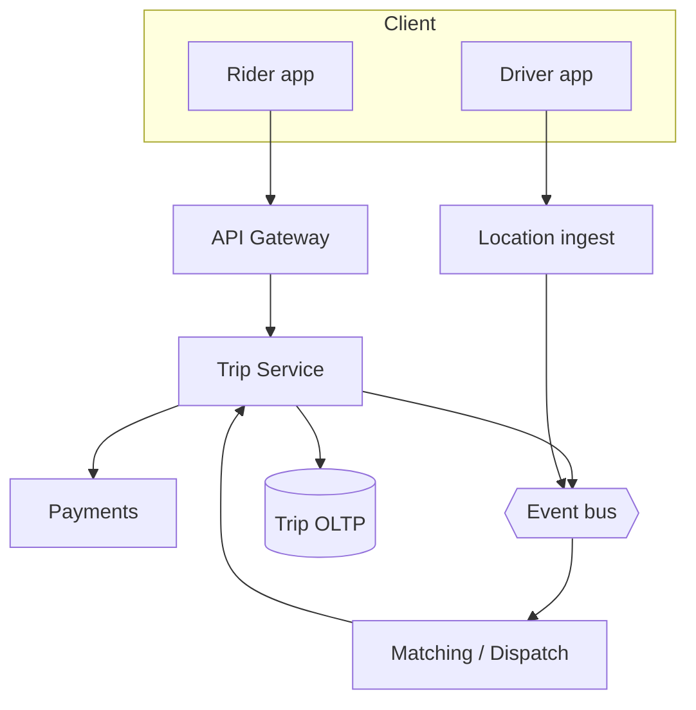
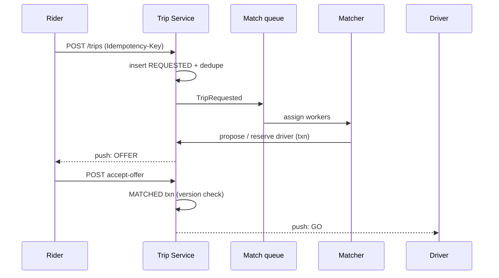

# HLD — Uber Backend / Ride-Sharing Service

## Live interview opening (clarify first — bar raiser order)

*“I’ll **start by clarifying requirements**—scope, ambiguity, latency and scale expectations—then lock **FR/NFR**. **After** that, I’ll ground **user journey**, **consistency**, **commit/decision**, and **risks** so it’s clearly **derived from what we agreed**, then **scale** and **architecture**—and I’ll **pause after the diagram** for where you want depth.”*

> **Uber SDE-2 HLD — drive order in this doc:** **§1** clarify → FR → NFR → **Framing after requirements** (user journey, consistency, commit/decision anchors) → **§2** scale → **§3** core entities + APIs → **§4** architecture → **§5** deep dive and evolution → **§6** scaling → **§7** reliability → **§8** tradeoffs → **§9** observability and security → **§10** patterns → **Closing**. Treat **Human interaction** cue blocks (headings in this doc) as *spoken* cues—**paraphrase**; do not read every row. **Bar raiser** listens for **ownership**, **failure modes**, and **honest tradeoffs**. Canonical spine: [HLD-UBER-SDE2-INTERVIEW-SPINE.md](./HLD-UBER-SDE2-INTERVIEW-SPINE.md).

## Interview delivery (golden thread — live thinking)

Bar-raiser polish: **user-first**, **explicit consistency**, **bottleneck**, **evolution**, **UX trust**, **default opinion** (not endless “A or B”). Full template + habits: **[HLD-BAR-RAISER-PERFORMANCE-PACK.md](./HLD-BAR-RAISER-PERFORMANCE-PACK.md)** · **[HLD-MASTER-DELIVERY-GOLDEN-FLOW.md](./HLD-MASTER-DELIVERY-GOLDEN-FLOW.md)**.

| Say at the right time | What interviewers grade | In this guide |
|----------------------|---------------------------|---------------|
| **Opening** | Clarify before solution | **Above** — you **do not** assume requirements. |
| **User journey + consistency + decisions** | Derived, not memorized | **After Section 1**, block **Framing after requirements** — **before Section 2** (not before clarify). |
| **Bottleneck / evolution / UX** | Ops + trust | Same **Framing** block; deep numbers still in **Sections 5–7**. |
| **Strong opinion** | Defaults | **Section 8** tradeoffs — always *“I’d start with X because…”*. |

**Do not:** read tables line-by-line · put user journey **before** clarify · fence-sit.  
**Do:** clarify → FR/NFR → **then** grounded journey → diagram → deep dive where steered.

---

## 1. Clarify requirements

### 1.0 Live flow (how to open and steer)

#### Live voice (real interviewer room)

**Sound like you’re *deciding*, not reciting:** one idea per breath, then **pause**. Tables here are **backup**—if your eyes are down for more than a couple of seconds, you’ve slipped into reading the doc.

**Bridge phrases (mix naturally):** *“Let me **name the fork** first…”* · *“I’ll **default to X**—tell me if your bar is stricter.”* · *“The reason I ask is it changes **who owns the commit** / **what’s on the hot path**.”* · *“I’ll **over-answer** one layer, then stop—**where should I zoom**?”*

**Ping them (conversation, not monologue):** *“Does that match how you’d scope it?”* · *“If we only deep-dive one thing, is it **A** or **B**?”* (swap **A/B** for two tensions from *your* opening paragraph above.)

**This topic in one breath:** “Ride core is **trip state machine**; matching **proposes**—I’ll pin **who commits accept** before APIs.”

**`Verbatim` / `Live` cues:** say a line **once**, then **rephrase** the next time—verbatim twice in a row reads *canned*.

**Opening (~once):** *“I’ll align on **trip lifecycle**, **matching boundary** (in vs out of scope), **payments/fraud**, and **consistency** for *request → offer → accept*; then **scale**, **APIs**, **architecture**, and the **happy path + cancel**. I’ll **pause after the diagram**—depth on **state machine**, **matching handoff**, or **reliability**?”*

**Thinking transitions:** *“**Matching** is usually its own service—I’ll treat **dispatch** as a **client** of this core unless you want it in-box.”* · *“**Accept** has to be **linearizable** enough that we don’t double-book a driver.”*

**Live rule:** **Paraphrase** §1–2 tables; go deep **only if they probe**.

**User journey (once):** say the [👤 User journey](#user-journey-framing) line **before** the architecture diagram for a **product** entry point.

### 1.1 Clarify

| Topic | Say it like this in the room |
|--------------------------|-------------------------------|
| **Scope** | “Are we designing **end-to-end marketplace**—pricing, matching, trip—or the **trip + billing core** with **matching** as a separate box?” |
| **Modes** | “**UberX / Pool / Reserve**—same state machine or different?” |
| **Payments** | “Do I own **auth/capture**, or just **hand off** to Payments with **idempotent** trip ids?” |
| **Regions** | “**Multi-region** active-active, or **primary region** per trip?” |
| **Safety** | “**Share trip**, **emergency**—in scope for APIs or later?” |

**Micro-pauses:** *“So **trip state** is source of truth; **matching** proposes **driver+ETA**; **accept** commits—got it.”*

#### Human interaction (clarify requirements — think out loud & evolve scope)

**Habit:** *“I’m drawing boundaries: **Trip** vs **Matching** vs **Payments**—wrong boundary causes double-book or money bugs.”*

**Live:** *“Are we **multi-region** for **writes** on day one? Is **Pool** a different **aggregate**? Does **cancel** always need **compensation** with payments?”*

| Stage | Default | Evolve when… |
|-------|---------|----------------|
| **v1** | Single-region **state machine** + **async match** + **sync accept** | p99 OK |
| **v2** | **Offer TTL**, **idempotent** APIs, **outbox** to payments | Money path hardens |
| **v3** | **Orchestrated saga** for cancel/refund + **MR** reads | Compliance / scale |

### 1.2 Functional requirements (FR)

#### Human interaction (FR)

**Habit:** *“**Request**, **offer**, **in progress**, **complete**—money at the boundary.”*

| FR area | Say it like this in the room |
|---------|-------------------------------|
| **Trip** | “Rider **requests** ride with pickup/dropoff; system creates **trip** in `REQUESTED`.” |
| **Matching** | “**Dispatch/matching** returns **candidate driver(s)**; rider **accepts** offer → `MATCHED` / `DRIVER_EN_ROUTE`.” |
| **Lifecycle** | “**Pickup**, **on trip**, **dropoff**, **receipt**; **cancel** with policy.” |
| **Pricing** | “**Fare estimate** may be separate read; **final fare** ties to **metering** rules.” |

**Core**

- Create and track **Trip** with stable `trip_id`, rider, route context, product type, timestamps.  
- Integrate **matching/dispatch** (proposals, driver assignment, ETA updates).  
- Support **cancel** (rider/driver/system) with defined transitions and **fees** if product says so.  
- Emit **events** for analytics, support, downstream billing.

**Out of scope (unless extended)**

- Deep **ML routing** inside matching; **maps** tile serving; **full** payments ledger.

### 1.3 Non-functional requirements (NFR)

#### Human interaction (NFR)

| NFR area | Say it like this in the room |
|----------|-------------------------------|
| **Correctness** | “**One active driver offer** that can **commit**—no silent double-assign.” |
| **Latency** | “**Request** returns fast with **async** matching fan-out; **push** updates for state.” |
| **Availability** | “**Degrade**: show **retry** / **re-match** rather than **lose** trip.” |
| **Durability** | “Trip + money-adjacent fields **durable**; **idempotency** on creates and captures.” |

### 1.4 Invariants

**Invariant:** “A **driver** can have **at most one** **committed** active trip for a given **vehicle session**; **trip state** transitions are **valid** only along the defined **DAG** (no illegal jumps).”

| Beat | Say it like this |
|------|------------------|
| **Bridge** | “**Trip service** owns **state**; **matching** owns **search**; **payments** owns **money**.” |
| **Core split** | “**Write path**: idempotent **request** → **match proposal** → **accept** **transaction**; **read path**: **status** + **ETA** streams.” |

### Key insight (say early)

**Trip state** is the **contract** between rider, driver, and billing; **matching** is **replaceable**; **money** never depends on a **best-effort** cache.

#### Key anchors

1. “**Idempotent** `POST /trips`.”  
2. “**Accept** is the **commit** boundary for driver assignment.”  
3. “**Out-of-band** push (**FCM/APNs**) for state; **client polls** as backup.”  
4. “For **cancel + payment reversal**, I’d **default to saga orchestration** (a **Trip orchestrator** or **workflow engine** with **visible steps**, **compensation**, and **timeouts**)—not **pure choreography**—so we get **one place to observe** and **replay** partial failures. **Choreography** only if you explicitly want **loose coupling** and **no central coordinator**.”

---

## Framing after requirements (before scale + architecture)

**Placement in the room:** this block is **not** “right after clarify questions.” You earn it **after** you’ve locked **FR + NFR** (spoken summary is fine)—otherwise journey / consistency / commit boundaries read as **assuming** product and SLOs.

**Out loud:** *“We’ve **clarified** scope and I’ve stated **FR/NFR** from that—**based on that**, here’s the **user-visible path**, **consistency**, and **commit** I’ll hold before I size **Section 2** and draw **Section 4**.”*

### Thinking transitions (use during interview)

- *“Let me think through this…”*
- *“One tradeoff here is…”*
- *“If I optimize for latency…”*
- *“This might become a bottleneck because…”*
- *“I’d start simple here and evolve later…”*

## User journey (say once—**after** FR/NFR, not after clarify alone)

From the rider’s perspective: **request** a trip → see **matching** progress → **accept** a driver offer → **track** pickup → **in trip** → **complete** / **cancel**; driver mirrors with **accept**, **arrive**, **start**, **end**.

So:

- **write path** = **idempotent** `POST /trips` → state machine transitions (**only valid DAG edges**); **payment** references owned by Payments.
- **read path** = **GET trip** status, driver snapshot, fare estimate—often **push** (FCM/APNs) + poll backup.
- **async path** = matching proposals, ETA ticks, analytics—must not **break** trip **commit** semantics.

## Consistency model

**Strong** for:

- **trip state** and **assignment**—at most **one committed** active assignment per vehicle session invariant.
- **money-adjacent** references—never “best-effort cache” as source of truth for capture.

**Eventual** for:

- **ETA refresh** streams, non-critical enrichments—**never** silent illegal state jumps.

## Commit boundary

**Driver assignment commits** on the **accept** edge (rider accepts offer)—not on “best match found” logs. **`POST /trips`** is **idempotent** (client key).

**Cancel + payment reversal**: default **saga / orchestrator** with **compensation** and **timeouts** so partial failure is **observable**—not mystery choreography.

## Decision (strong opinion)

I’d start with:

- **Trip service** as **single writer** for trip row + **version**; matching proposes **TTL offers**; **push** for UX.

because **trip state is the contract** between rider, driver, and billing—matching stays **replaceable**.

If scale hardens:

- **shard** by region + `trip_id`, **event log** for audit/replay, clearer **matching** isolation.

## Evolution

| Phase | Say it like this |
|-------|------------------|
| **1** | Simple implementation that ships. |
| **2** | Scaling: partitions, caches, queues, backpressure, observability. |
| **3** | Advanced / ML / global—only when metrics or product force it. |

Details: **Section 4.1 (phases)** and **Section 5** in this file.

## Bottleneck anchor

Watch first:

- **peak commute** write bursts + **matching** fan-out.
- **state read** amplification (everyone polling—**push** + short TTL cache).

## Backpressure handling

Under load:

- **async** matching; return **fast** request with honest **matching…** state.
- **degrade** to **re-match** UX rather than **lose** trip or double-assign.

Goal: **valid state machine + no silent double-book** over **sub-second** ETA fantasy on every tick.

## UX awareness

Bad outcomes:

- **double assign** or illegal transition.
- rider sees **stale** “no driver” after acceptance.
- **cancel fee** surprises—tie to **explicit** policy + quote artifacts.

### Driving the conversation

- *“Does this direction make sense?”*
- *“Should I go deeper on **A** or **B**?”*
- *“Would you like failure scenarios next?”*

### Mindset

*“I’m not presenting a solution—I’m **designing with a teammate**.”*

**Playbook:** [HLD-BAR-RAISER-PERFORMANCE-PACK.md](./HLD-BAR-RAISER-PERFORMANCE-PACK.md).

---

## 2. Estimate scale

#### Human interaction (estimate scale)

**Habit:** *“**Peaks** around commute; **writes** bursty per city.”*

| Dimension | Illustrative |
|-----------|----------------|
| **Trips/day** | Large metro: **100k–1M+** / day (tune) |
| **State updates** | Many **ETA ticks** / trip—mostly **async** or **throttled** |
| **Read:write** | **Status reads** heavy; **creates** smaller |

**Tie it in one line:** “**Shard** by **region** + **trip_id**; **fan-out** matching workers; **don’t** put **every GPS tick** through the **OLTP** row.”

---

## 3. APIs and data model

### 3.0 Core entities (who owns what — say before API tables)

| Entity | Owns / lifecycle (one line) |
|--------|-----------------------------|
| **Trip** | **State machine** + **version**; **durable** in OLTP; **single writer** partition. |
| **Offer / Assignment** | **Proposal** with **TTL**; not committed until **accept** edge. |
| **Driver session** | **Availability** hints for matching—**not** authoritative for money. |
| **Payment intent** | **Payments** service owns **capture**; Trip stores **references** only. |
| **TripEvent** | **Append-only** audit / replay stream. |

#### Human interaction (APIs & data model — API design + contracts)

**Habit:** *“Small **command** API; **events** out.”*

### 3.1 APIs (sketch)

| API | Purpose |
|-----|---------|
| `POST /v1/trips` | Idempotent create (client `Idempotency-Key`) |
| `GET /v1/trips/{id}` | Status, driver, fare snapshot |
| `POST /v1/trips/{id}/accept-offer` | Rider accepts proposed match |
| `POST /v1/trips/{id}/cancel` | Cancel with reason |
| `POST /v1/trips/{id}/driver-events` | Pickup started / completed (authZ driver) |

### 3.2 Data model

- **Trip:** `trip_id`, `rider_id`, `driver_id` (nullable until matched), `state`, `product`, `pickup`, `dropoff`, `fare_estimate_id`, `version`, `created_at`.  
- **Assignment / offer:** optional table or embedded **proposal** with TTL.  
- **Event log:** append-only **TripEvent** for audit and replay.

### 3.3 Ownership

| Component | Owns |
|-----------|------|
| **Trip Service** | State machine, idempotency, durable trip |
| **Matching** | Geo search, scoring, offer lifecycle |
| **Payments** | Authorization, capture, disputes |
| **Location** | Raw GPS streams, map-matched traces |

---

## 👤 User Journey (say once early)

**Say it once early** (before or right after the [architecture diagram](#4-high-level-architecture)):

*“I think about this from the **user** perspective:

**User opens app** → **requests a ride** → the system **creates a trip** → **matching** finds drivers → the user **gets an offer** → **accepts** → the **trip progresses** (driver en route → pickup → on trip → dropoff) → **completes** → **payment** is processed.

So:
- **Write path** = trip **creation** + **accept commit** (and other **durable** transitions like cancel when product requires it)
- **Async path** = **matching** + **location** updates (push/stream—**not** blocking the user on every GPS tick)
- **Read path** = **trip status** + **ETA**

That maps cleanly to **Trip** owning the **contract**, **Matching** as **async propose**, and **Payments** at the **money boundary**.”*

👉 **Intuitive** and **product-aware**—then draw **Trip** / **Matcher** / **Payments** on the board.

---

## 🔄 State Machine (anchor)

**Say this clearly once:**

**Trip is fundamentally a state machine**—all correctness is **valid transitions** only, not ad-hoc flags.

**Typical chain (tune names with interviewer):**

`REQUESTED` → `MATCHING` → `OFFERED` → `MATCHED` → `DRIVER_EN_ROUTE` → `ON_TRIP` → `COMPLETED`

**Terminal:** `CANCELLED` from **only** the states your policy allows (rider/driver/system).

**Invariant in the room:** *“No illegal jumps—every API maps to an **allowed** edge; **version** or **row lock** on **commit** edges like **accept**.”*

You can **collapse** `MATCHING` / `OFFERED` for an MVP sketch—as long as you **forbid** ambiguous double-assign.

---

## 👤 UX Awareness

**Connect reliability to what the user sees:**

- If **matching** is slow or struggling, the rider sees **“Searching for drivers…”** (or product copy)—**not** a blank screen or a generic **500**. Offer **retry**, **edit pickup**, or **cancel and re-book** per product.  
- **Degrade gracefully:** **re-match**, **expand search radius**, drop **non-critical** enrichment before failing the **whole** trip shell.  
- **Driver:** if an **offer expires**, the UI shows a **stale offer** state and waits for a **fresh** push—**no** silent wrong-driver UX.

---

## 4. High-level architecture

#### Human interaction (high-level architecture)

| Moment | Say it like this in the room |
|--------|------------------------------|
| **Write** | “**Gateway** → **Trip** persists **REQUESTED** → publishes **TripRequested** → **Matching** workers search.” |
| **Commit** | “**Matching** calls back **ReserveDriver** or **AcceptOffer** **transactionally** with **Trip**.” |
| **Read** | “**ETA** and **map** from **location** pipeline; **trip** reads **denormalized** driver snippet.” |
| **User journey** | “Same beat as [👤 User journey](#user-journey-framing): **open → request → trip created → offer → accept → progress → pay**.” |

### 4.1 Phases

| Phase | Ship |
|-------|------|
| **1** | Linear state machine, single-region, sync accept |
| **2** | Async matching queue, offer TTL, idempotent API |
| **3** | Multi-region read replicas, **orchestrated saga** (Trip-led) for payment + cancel |

---

## 🚗 Matching Deep Dive (if probed)

**When they push** *“How does matching actually work?”*—you still keep **Trip** as SoT; you **describe** the sibling service in **one tight block**:

**Matching is typically:**

- **Geo-partitioned** workers (shard by **cell / region**).  
- **Fetch nearby drivers**: **spatial index** (cell + **neighbors**), filter by **product**, **online**, **not on active trip** (per policy).  
- **Rank** by **ETA**, distance, **acceptance probability** / surge signals—**cap K** before expensive scoring.  
- **Send offers** with a **short TTL**; **expire** stale offers so we never **commit** a dead assignment.  
- **Iterate**: timeout → **re-offer** or **expand** radius with guardrails.

**Important (say aloud):**

- A **driver** can only **accept one** **committed** active trip (or whatever the **vehicle session** rule is)—**Trip service** enforces on **commit**.  
- **Offers are short-lived** so **stale** “you have a driver” never lingers—ties to [👤 UX Awareness](#ux-awareness).

👉 This closes a common **Bar Raiser** probe without pretending **matching** lives inside **Trip** unless they ask you to merge boxes.

---

## 5. Deep dive: request → match → accept

#### Human interaction (deep dive — critical flow, optimizations & evolution)

**Habit:** *“Walk **`POST /trips`** then **accept** like a sequence diagram.”*

**Live (evolution):** *“**v1**: **REQUESTED → MATCHING → OFFERED → MATCHED** with **optimistic version** on accept. **v2**: **outbox** to payments + **DLQ** discipline. **v3**: **saga** visibility for long cancel/refund—still **one Trip partition** as coordinator.”*

If they drill on **matching internals**, use [🚗 Matching Deep Dive (if probed)](#matching-deep-dive-probed)—then return to **Trip commit** boundaries here.

### 🎯 Bottleneck Anchor

**Say once:** “**Matching queue depth** + **hot geospatial cells** drive **time-to-first-offer**; **Trip row** contention on **accept** drives **correctness** incidents.”

**Taking a stance:** *“**Optimistic locking** on `trip.version` at **accept**; **matching** uses **short TTL offers** so stale drivers **expire**.”*

### 5.1 Failure modes on path

- **Matcher slow:** rider sees **searching**; **SLO** on time-to-offer; **expand radius** policy.  
- **Double tap accept:** **idempotency** + version.  
- **Driver offline after reserve:** **timeout** → re-offer.

### 5.2 Caching

- **Do not** cache **authoritative** state for **mutations**; **read-through** cache OK for **GET** with **short TTL** + **ETag**.

---

## 6. Scaling and bottlenecks

#### Human interaction (scaling)

| Risk | Mitigation |
|------|------------|
| **Geo hot cells** | Shard matchers by **cell**; **back-pressure** |
| **OLTP hot row** | Minimize columns updated per ETA tick; **separate** **LocationSummary** |
| **Queue lag** | Horizontal workers; **priority** lanes for **almost matched** |

---

## 7. Reliability and failure handling

#### Human interaction (reliability)

- **Partial outage matching:** trips stay **REQUESTED** / **MATCHING**; **retry** with backoff; rider stays in **“Searching…”** per [👤 UX Awareness](#ux-awareness).  
- **Payments timeout:** **outbox** pattern; **reconcile** job; long-running **cancel + refund** flows **default to orchestrated saga** (central coordinator + **compensating** steps) so **partial failure** is **observable** and **replayable**.  
- **Split brain:** prefer **single writer** per `trip_id` (leader partition).

---

## 8. Tradeoffs and alternatives

#### Human interaction (tradeoffs & alternatives)

**Live:** *“**Async match** wins **p99** on `POST /trips` but costs **product** complexity—**searching** UX must be honest. **Monolith** trip+match trades **velocity** vs **blast radius**.”*

| Choice | Upside | Downside |
|--------|--------|------------|
| **Sync match** in `POST /trips` | Simple mental model | Bad **p99** at peak |
| **Async match** | Fast return | More **product** complexity (**searching** UX) |
| **Monolith trip+match** | Fewer RPCs | Team + deploy **blast radius** |

---

## 9. Monitoring, observability, and security

#### Human interaction (monitoring, observability & security)

**Habit:** *“I’d alert on **accept conflicts** and **payment reconciliation lag**—those are **money + trust**.”*

**Live:** *“**Security**: **AuthZ** on **every** transition; **trip_id** is never a public guessable sequence if we can help it; logs **redact** pickup addresses at high verbosity.”*

**SLIs:** time-to-first-offer, accept **conflict** rate, cancel rate by state, payment **reconciliation** lag.  
**Security:** **AuthZ** on every trip transition; **no IDOR** on `trip_id`; **PII** minimization in logs.

---

## 10. Design patterns, data structures & best practices

#### Human interaction (design patterns, data structures & best practices)

**Verbatim (say on the board, ~30s):** *“**Trip state machine** owns valid transitions; **orchestrated saga** with **transactional outbox** for payments and side effects; **partition** by region or **trip_id** for locality; **async queue** for matching workers; **optimistic locking** on accept with **version**; **idempotency keys** on client retries.”*

**Live:** name **at most five** patterns on the diagram, then stop.

| Pattern / DS | Where | One interview line |
|----------------|------|----------------------|
| **Orchestrated saga + outbox** | Trip + payment | “Cross-service money uses **outbox**, not **hopeful** RPC.” |
| **State machine** | Trip aggregate | “Only **valid** edges—no illegal **cancel from delivered**.” |
| **Partition by region / trip** | Services + DB | “**Locality** for matching and **blast radius**.” |
| **Work queue + workers** | Matching | “Matcher **proposes**; Trip **commits**—queue decouples load.” |
| **Optimistic concurrency** | Accept / trip | “**409** on stale version beats **lost updates**.” |
| **Idempotency key** | Client POST | “Double-tap **request** doesn’t spawn two trips.” |

---

## Closing notes (where wrap-up human interaction lives)

### Communication (do vs avoid)

| Do | Avoid |
|----|--------|
| **Name matching boundary** | One giant “Uber” box |
| **Idempotency + version** on accept | Hand-wavy “we lock it” |

**60-minute sketch (flex):** clarify+FR+NFR ~8–12 · scale+APIs ~8–12 · architecture ~8–12 · **deep dive ~15–22** · rest ~10–15 · close ~5–8.

---

## Bar-raiser follow-ups

#### Human interaction (bar-raiser follow-ups)

**Live:** *“Pick one: **Pool**, **cross-region**, or **payment failure**—I’ll go deep where you steer.”*

| They ask | Say it like this |
|----------|------------------|
| **Pool** | “Shared **pickup order** + **per-leg** fare allocation—still **one** trip aggregate or **parent/child** trips.” |
| **Cross-region** | “Trip **home region** follows **rider legal** entity; **replicate read** elsewhere.” |
| **“How does matching work?”** | “[Geo-partitioned workers → cap K → rank → TTL offers](#matching-deep-dive-probed); **Trip** still owns **accept commit**.” |

---

## 60-second close

#### Human interaction (60-second close)

| Beat | Say it like this in the room |
|------|------------------------------|
| **Recap** | “**User journey**: **open → request → trip → offer → accept → ride → pay**. **State machine** = valid edges only. **Trip service** owns **durable** lifecycle; **matching** **async** proposes (**geo workers**, **cap K**, **TTL offers**); **accept** **txn** + **version**; **payments** **outbox** + **orchestrated saga** for cancel/refund; **UX**: **searching** + **graceful degrade**; **SLIs** on **offer latency** and **accept conflicts**.” |

---
