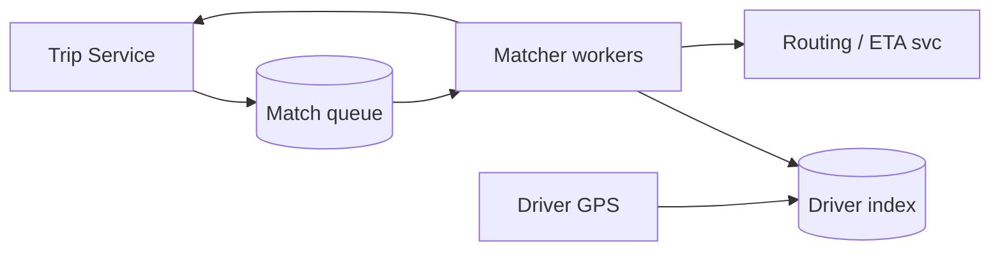
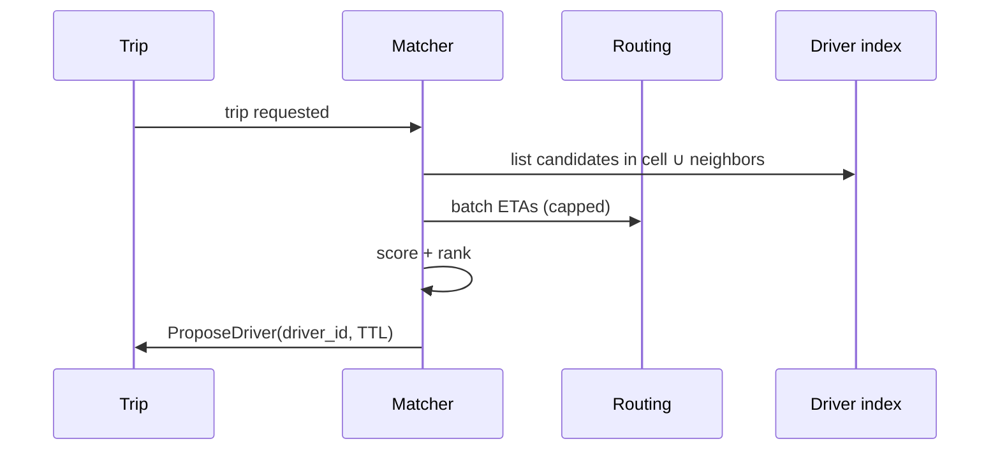

# HLD — Ride Matching / Driver Dispatch System

## Live interview opening (clarify first — bar raiser order)

*“I’ll **start by clarifying requirements**—scope, ambiguity, latency and scale expectations—then lock **FR/NFR**. **After** that, I’ll ground **user journey**, **consistency**, **commit/decision**, and **risks** so it’s clearly **derived from what we agreed**, then **scale** and **architecture**—and I’ll **pause after the diagram** for where you want depth.”*

> **Uber SDE-2 HLD — drive order in this doc:** **§1** clarify → FR → NFR → **Framing after requirements** (user journey, consistency, commit/decision anchors) → **§2** scale → **§3** core entities + APIs → **§4** architecture → **§5** deep dive and evolution → **§6** scaling → **§7** reliability → **§8** tradeoffs → **§9** observability and security → **§10** patterns → **Closing**. Treat **Human interaction** cue blocks (headings in this doc) as *spoken* cues—**paraphrase**; do not read every row. **Bar raiser** listens for **ownership**, **failure modes**, and **honest tradeoffs**. Canonical spine: [HLD-UBER-SDE2-INTERVIEW-SPINE.md](./HLD-UBER-SDE2-INTERVIEW-SPINE.md).

## Interview delivery (golden thread — live thinking)

Bar-raiser polish: **user-first**, **explicit consistency**, **bottleneck**, **evolution**, **UX trust**, **default opinion** (not endless “A or B”). Full template + habits: **[HLD-BAR-RAISER-PERFORMANCE-PACK.md](./HLD-BAR-RAISER-PERFORMANCE-PACK.md)** · **[HLD-MASTER-DELIVERY-GOLDEN-FLOW.md](./HLD-MASTER-DELIVERY-GOLDEN-FLOW.md)**.

| Say at the right time | What interviewers grade | In this guide |
|----------------------|---------------------------|---------------|
| **Opening** | Clarify before solution | **Above** — you **do not** assume requirements. |
| **User journey + consistency + decisions** | Derived, not memorized | **After Section 1**, block **Framing after requirements** — **before Section 2** (not before clarify). |
| **Bottleneck / evolution / UX** | Ops + trust | Same **Framing** block; deep numbers still in **Sections 5–7**. |
| **Strong opinion** | Defaults | **Section 8** tradeoffs — always *“I’d start with X because…”*. |

**Do not:** read tables line-by-line · put user journey **before** clarify · fence-sit.  
**Do:** clarify → FR/NFR → **then** grounded journey → diagram → deep dive where steered.

---

## 1. Clarify requirements

### 1.0 Live flow

#### Live voice (real interviewer room)

**Sound like you’re *deciding*, not reciting:** one idea per breath, then **pause**. Tables here are **backup**—if your eyes are down for more than a couple of seconds, you’ve slipped into reading the doc.

**Bridge phrases (mix naturally):** *“Let me **name the fork** first…”* · *“I’ll **default to X**—tell me if your bar is stricter.”* · *“The reason I ask is it changes **who owns the commit** / **what’s on the hot path**.”* · *“I’ll **over-answer** one layer, then stop—**where should I zoom**?”*

**Ping them (conversation, not monologue):** *“Does that match how you’d scope it?”* · *“If we only deep-dive one thing, is it **A** or **B**?”* (swap **A/B** for two tensions from *your* opening paragraph above.)

**This topic in one breath:** “Dispatch is **online optimization under SLO**—I’ll **cap K** and keep **Trip owns accept** explicit.”

**`Verbatim` / `Live` cues:** say a line **once**, then **rephrase** the next time—verbatim twice in a row reads *canned*.

**Opening (~once):** *“I’ll align **objective** (**ETA vs earnings**), **surge** as input, **fairness**, and **latency SLO**; I’ll **default** to **streaming greedy** matching and only add **batch** reassignment if **throughput/optimality** goals force it. Then **scale**, **geo structures**, **architecture**, **one match cycle**. **Pause after the diagram**—**scoring**, **rebalance**, or **load**?”*

**Thinking transitions:** *“This is an **online optimization** problem under **latency SLO**—I’ll **cap candidates** before scoring.”*

**Live rule:** Paraphrase tables; deep on **geo + scoring** only if steered.

**User journey (once):** say [👤 User journey](#user-journey-framing) **before** the architecture diagram so the room hears **product** before boxes.

### 1.1 Clarify

| Topic | Say it like this in the room |
|--------------------------|-------------------------------|
| **Objective** | “Minimize **ETA**, maximize **throughput**, or **blend**—what’s the **default**?” |
| **Batching** | “I’d **default streaming greedy** for **p99**—do you need **periodic batch** reassignment for **global** optimality, or is **continuous** re-offer enough?” |
| **Surge** | “Is **surge** an **input feature** only, or does it change **search radius**?” |
| **Pool** | “**Shared rides** change matching—**in scope**?” |
| **Fairness** | “**Driver starvation**—do we need **rotation** or **throttle** repeat declines?” |

**Micro-pauses:** *“So I’ll **default streaming greedy** under your **p99**, **cap K**, and keep **[Matcher proposes, Trip commits](#commit-boundary-anchor)**—got it.”*

#### Human interaction (clarify requirements — think out loud & evolve scope)

**Habit:** *“Matching is **online search under a deadline**—I buy scope on **objective**, **batch vs stream**, and **who commits** before I draw the geo index.”*

**Live:** *“If you want **global batch** optimality, I’ll say out loud that we’re trading **wait time** and **complexity** for **throughput**—I only go there when you insist.”*

| Stage | Default | Evolve when… |
|-------|---------|----------------|
| **v1** | **Streaming greedy** + **TTL offers** + **Trip commit** | p99 stable |
| **v2** | Richer **score** + **ETA batching** (capped parallel) | Acceptance / ETA quality |
| **v3** | **Periodic batch** reassignment + **simulation** | Ops pushes pooled rides |

### 1.2 Functional requirements (FR)

#### Human interaction (FR)

| FR area | Say it like this in the room |
|---------|-------------------------------|
| **Ingest** | “**Open trips** + **available drivers** stream into the **matcher**.” |
| **Match** | “Produce **ordered offers** or **single best** driver per trip within **SLO**.” |
| **Rebalance** | “**Reassignment** if driver cancels or stalls—define policy.” |
| **Feedback** | “**Accept / reject / timeout** events train **ranker**.” |

**Core**

- Index **available drivers** by location + product capability.  
- For each **trip request** (**streaming** path by default), select **K candidates**, **score**, emit **offer(s)** with **TTL**; optional **batch** reassignment windows only if product/ops want **pooled** optimization.  
- Handle **driver going offline**, **timeout**, **rider cancel**.

### 1.3 Non-functional requirements (NFR)

#### Human interaction (NFR — how it must behave under load)

**Habit:** *“Separate **latency SLO** on the match cycle from **correctness** on **commit**.”*

**Live:** *“I’m OK with **stale driver index** for **search**; I’m **not** OK with **stale commit**—that’s **[TTL + re-check](#driver-state-consistency)**.”*

| NFR | Say it like this |
|-----|------------------|
| **Latency** | “**p99** for **candidate gen** + **score** bounded—e.g. **<100–200ms** per cycle (confirm).” |
| **Scale** | “Many **concurrent** trips per **cell**; **horizontal** matchers.” |
| **Fairness** | “Avoid **always same** driver wins if product cares.” |

### 1.4 Invariants

**Invariant:** “Every **offer** references a **driver** who was **available** at **offer creation** per our **snapshot** rules; **commit** is **exclusive** (one winning assignment per driver per policy).”

| Beat | Say it like this |
|------|------------------|
| **Bridge** | “**Geo index** → **cap K** → **score** → **offer TTL**.” |
| **Core split** | “**Search** is cheap-ish at K; **scoring** is where models live.” |

### Key insight (say early)

**Cap candidates before expensive scoring**; treat matching as **continuous online** (**default: streaming greedy**) reassignment with a **hard commit boundary**: **matcher proposes → Trip commits** (see [🔒 Commit Boundary](#commit-boundary-anchor)).

#### Key anchors

1. “**Geohash / S2 / H3** cells + **neighbor** lookup.”  
2. “I’d **default streaming greedy** for **latency**; add **batching** only when **optimization** goals (throughput, pooled reassignment) **clearly** justify the **wait** and **complexity**.”  
3. “**TTL offers** + **idempotent** reserve RPC to Trip.”

---

## Framing after requirements (before scale + architecture)

**Placement in the room:** this block is **not** “right after clarify questions.” You earn it **after** you’ve locked **FR + NFR** (spoken summary is fine)—otherwise journey / consistency / commit boundaries read as **assuming** product and SLOs.

**Out loud:** *“We’ve **clarified** scope and I’ve stated **FR/NFR** from that—**based on that**, here’s the **user-visible path**, **consistency**, and **commit** I’ll hold before I size **Section 2** and draw **Section 4**.”*

### Thinking transitions (use during interview)

- *“Let me think through this…”*
- *“One tradeoff here is…”*
- *“If I optimize for latency…”*
- *“This might become a bottleneck because…”*
- *“I’d start simple here and evolve later…”*

## User journey (say once—**after** FR/NFR, not after clarify alone)

From the rider’s perspective: request → **matcher** finds nearby drivers → **proposal / offer** with **TTL** → rider **accepts**; driver app **heartbeats** location + availability into a **spatial index**.

So:

- **write path** = Trip enqueues **match job**; matcher calls **`ProposeDriver` / `ReserveDriver`**—**only Trip commits** assignment on accept ([commit boundary](#commit-boundary-anchor) in this doc).
- **read path** = **ETA / candidate** previews—**short TTL** routing snapshots.
- **async path** = rescoring, batch optimizations—must stay **at-least-once safe** on retries.

## Consistency model

**Trip row is truth** for “who is assigned”; matcher index is **eventually consistent** view of online drivers **with TTL**.

**Cap K candidates** before expensive scoring; **idempotent** propose RPCs—retries must not **double-book** thanks to Trip **version** / conditional reserve.

## Commit boundary

**Matcher proposes → Trip commits** on the rider **accept** edge (or Trip’s explicit state transition)—offers are **ephemeral** with **TTL**, not committed truth.

## Decision (strong opinion)

I’d start with:

- **geospatial cells** (S2/H3) + **neighbor** lookup, **streaming greedy** matcher for **latency**.
- **stateless matchers**, **sharded driver index**, **TTL offers** + conditional Trip RPC.

because **p99** and **no double-assign** matter more than perfect global optimality in v1.

If throughput goals dominate:

- add **batching** / pooled reassignment—only when you can name the **wait** tradeoff.

## Evolution

| Phase | Say it like this |
|-------|------------------|
| **1** | Simple implementation that ships. |
| **2** | Scaling: partitions, caches, queues, backpressure, observability. |
| **3** | Advanced / ML / global—only when metrics or product force it. |

Details: **Section 4.1 (phases)** and **Section 5** in this file.

## Bottleneck anchor

Watch first:

- **match evaluations/sec** at peak (CPU + **routing RPC** fan-out for **K**).
- **hot geocells** and **sticky** routing / shard imbalance.

## Backpressure handling

Under load:

- **lower K**, widen cells cautiously, or **defer** recompute cycles.
- **shed** “nice” scoring before you miss **SLA** on **first proposal**.

Goal: **a valid offer within TTL** over **perfect** global matching.

## UX awareness

Bad outcomes:

- **double driver** assigned or **stale offer** accepted after TTL.
- rider sees **spinning** forever—need **timeout** + rematch story.

### Driving the conversation

- *“Does this direction make sense?”*
- *“Should I go deeper on **A** or **B**?”*
- *“Would you like failure scenarios next?”*

### Mindset

*“I’m not presenting a solution—I’m **designing with a teammate**.”*

**Playbook:** [HLD-BAR-RAISER-PERFORMANCE-PACK.md](./HLD-BAR-RAISER-PERFORMANCE-PACK.md).

---

## 2. Estimate scale

#### Human interaction (estimate scale — round numbers, invite correction)

**Habit:** *“I want **order of magnitude** on **drivers/cell**, **match eval/sec**, and **K**—so I can defend **partitioning** and **ETA budgets**.”*

**Live:** *“If **K** doubles, my **routing RPC fan-out** roughly doubles—so **K** is a **product + infra** knob, not just ML.”*

| Dimension | Illustrative |
|-----------|----------------|
| Active drivers / metro | **10k–100k+** |
| Match evaluations / sec | **High** during peak—**CPU** + **RPC** bound |
| Candidate cap **K** | **20–80** typical interview range |

**Tie it in one line:** “**Partition** space + **trip**; **scale out** stateless matchers with **sticky** routing or **sharded** driver index.”

---

## 3. APIs and data model

### 3.0 Core entities (who owns what — say before API tables)

| Entity | Owns / lifecycle (one line) |
|--------|-----------------------------|
| **Trip** | **Durable** marketplace record; **only** place that **commits** assignment ([anchor](#commit-boundary-anchor)). |
| **Matcher worker** | **Stateless** cycle: dequeue job → **propose** → **TTL** offer. |
| **Driver index shard** | **Eventually consistent** view of **online** drivers by **cell**; **TTL** eviction. |
| **Offer** | **Ephemeral** proposal referencing **driver** + **conditions**; not truth until Trip accepts. |
| **Routing snapshot** | **ETA** inputs for **score**—**short TTL**, **bounded** parallelism. |

#### Human interaction (API design — surfaces, idempotency, errors)

**Habit:** *“Internal APIs are still **APIs**: **idempotent** propose, **conditional** reserve, explicit **409** when Trip rejects.”*

**Live:** *“I’d document **`ProposeDriver`/`ReserveDriver`** as **at-least-once** safe—matcher retries must not **double-book** thanks to Trip **version**.”*

### 3.1 APIs (sketch)

| API | Purpose |
|-----|---------|
| `POST /v1/match/jobs` | Trip service enqueues new/updated trip |
| `POST /v1/drivers/{id}/heartbeat` | Location + availability |
| Matcher → Trip RPC (sketch) | **`ProposeDriver` / `ReserveDriver`**—**conditional** placement; **only Trip** performs **final commit** on rider accept ([🔒 Commit Boundary](#commit-boundary-anchor)) |

### 3.2 Data structures

- **Driver index:** cell → list/set of `driver_id` (availability bit, product tags).  
- **Trip queue:** priority by **wait time**, **SLA**, product.  
- **Scoring features:** ETA from **routing engine**, distance, surge, driver **accept rate**.

---

## 👤 User Journey (say once early)

**Say it once early** (before or right after the [architecture diagram](#4-high-level-architecture)):

*“From the **user** side:

**User requests a ride** → the **trip** enters **matching** → the system **finds nearby drivers** → a **driver receives an offer** → **accepts** → the **Trip service commits** the assignment and the ride moves forward.

So in one line:
- **Matcher** = **search** + **score** + **propose** (offers, TTL)
- **Trip service** = **commit** + **correctness** (no double-book, durable state)”*

👉 **Product-aligned** before you draw **Matcher** vs **Trip**.

---

## 🔒 Commit Boundary (anchor)

**Say this strongly once:**

**Matcher proposes; Trip service commits.**

That is what keeps:

- **No double assignment** of the same driver (and **one** committed trip per driver per policy)  
- **Consistency** across the system—matching can be **wrong or stale** sometimes; **commit** is the **hard gate**

**In the room:** *“I treat **`ProposeDriver`** / **`ReserveDriver`** as **conditional**; **`accept`** on the rider side and the **transactional commit** in **Trip** are the **only** place the marketplace **becomes true**.”*

---

## 🚗 Driver State Consistency

**Bar Raiser probe:** *“What if **driver state** is **stale**?”*

**Driver availability is eventually consistent** (heartbeats, GPS, online bit):

- **TTL** on index entries—**expire** drivers who stop heartbeating.  
- **Re-validate** at **commit** time: Trip / Matcher **reserve** RPC checks **fresh** snapshot or **fails** → **re-offer**.  
- **Final correctness** lives in **Trip service** on commit—see [🔒 Commit Boundary](#commit-boundary-anchor).

**Say aloud:** *“Stale index is **ok for search**; **stale commit** is **not**—so we **expire** and **re-check**.”*

---

## 👤 UX Awareness

**Tie matching behavior to the rider screen:**

- If **no driver** is found quickly, the user should see **“Searching for drivers…”** with **expanding radius** (or equivalent product behavior)—**not** an immediate **hard failure** unless policy truly requires it.  
- **Degrade** with **transparency** (still **honest** ETA bands when we widen search).

---

## 4. High-level architecture

#### Human interaction (high-level architecture)

| Moment | Say it like this in the room |
|--------|------------------------------|
| **User journey** | “Same beat as [👤 User journey](#user-journey-framing): **request → match → offer → driver accept → Trip commits**.” |
| **Commit** | “[🔒 Matcher proposes, Trip commits](#commit-boundary-anchor)—I never ‘finish’ a trip inside the matcher alone.” |
| **Stale drivers** | “[🚗 Heartbeat TTL + re-check at reserve](#driver-state-consistency)—index can lag; **commit** can’t lie.” |

### 4.1 Phases

| Phase | Ship |
|-------|------|
| **1** | **Streaming greedy** nearest + capped ETA calls (**default**) |
| **2** | Richer **online** score + optional **batch** reassignment only if **SLO + product** demand it |
| **3** | Regional **shards**, **simulation** shadow traffic |

---

## 5. Deep dive: one match cycle

#### Human interaction (deep dive — critical flow, optimizations & evolution)

**Habit:** *“**One cycle** on the board—then anchor [🔒 commit](#commit-boundary-anchor).”*

**Live (evolution):** *“**v1**: **cap K** + **simple score** + **single** propose path. **v2**: **batch ETA** calls where API allows, **fairness** rotation. **v3**: **batch reassignment** windows only if we accept **extra wait** for **pooled** optimality—otherwise stay **streaming**.”*

If they challenge **batch vs streaming**, default: **streaming greedy** for **p99**; **batch** only for **documented** optimality wins—see [Key insight](#key-insight-say-early).

### 🎯 Bottleneck Anchor

“**Routing/ETA RPC** fan-out and **hot cell** contention—watch **p99** and **throttle** parallel ETA calls.”

**Taking a stance:** *“**Streaming** cycle: **Batch ETA** *requests* to routing where the API allows (parallel **capped**), but **don’t wait** on a **global batch** of *trips* unless we’ve agreed that **product tradeoff**—**default greedy per trip** for **latency**.”*

### 5.1 Re-match / rebalance

- Periodic job for **stuck** trips; **ripple** reassign on driver cancel.  
- **Churn** control: don’t ping-pong drivers.

### 5.2 Caching

- Cache **static route chunks** cautiously; **ETA** for **live traffic** is **short TTL**.

---

## 6. Scaling and bottlenecks

#### Human interaction (scaling & bottlenecks — tie to diagram)

**Live:** *“**Hot cell** is the classic failure mode—**subdivide**, **replicate** read index, **shed** lower-priority products. **ETA storm** → **budget** parallel routing calls, **approximate** first.”*

| Risk | Mitigation |
|------|------------|
| **Hot cell** | **Subdivide** cells; **load shed** lower-priority products |
| **ETA storm** | **Budget** parallel calls; **approximate** first |
| **Thundering herd** on new surge | **Jitter** + **rate limits** |

---

## 7. Reliability and failure handling

#### Human interaction (reliability & failure handling — user-visible story)

**Live:** *“**Matcher** can crash—jobs **requeue**; **Trip** stays source of truth. **Rider** sees **searching / expanding** per [UX](#ux-awareness), not silent wrong driver.”*

- **Matcher crash:** job **requeued**; **idempotent** propose.  
- **Stale driver list:** **heartbeat TTL** evicts drivers; **re-validate** on **reserve**—full story in [🚗 Driver State Consistency](#driver-state-consistency).  
- **Trip already filled:** **Trip service** rejects reserve—matcher **acks** and stops.  
- **No driver found:** align with [👤 UX Awareness](#ux-awareness)—**searching** + **expand**, not silent fail.

---

## 8. Tradeoffs and alternatives

#### Human interaction (tradeoffs & alternatives — pick defaults)

**Live:** *“I’ll **name** the default (**streaming greedy**) and the **price** of the alternative (**batch**). If we blur both, we ship **neither** p99 nor optimum.”*

| Choice | Trade |
|--------|--------|
| **Streaming greedy (default)** | Best **p99** / responsive UX vs **global** optimum |
| **Batch assignment (add later)** | Better pooled objective vs **wait** to batch + **complexity** |
| **Pull vs push offers** | Driver UX vs control |

---

## 9. Monitoring, observability, and security

#### Human interaction (monitoring, observability & security)

**Habit:** *“SLIs follow **rider pain**: time-to-first-offer, **ghost offers**, **ETA error**.”*

**Live:** *“**Security**: matcher callbacks are **authenticated**; **no** raw rider home in **debug** logs unless needed—**redact** by default.”*

**Metrics:** time-to-first-offer, **proposal→accept** rate, **ETA error**, per-cell **queue depth**.  
**Security:** **Auth** on matcher callbacks; **no PII** in feature logs if avoidable.

---

## 10. Design patterns, data structures & best practices

#### Human interaction (design patterns, data structures & best practices)

**Verbatim (say on the board, ~30s):** *“**H3 / S2 / geohash** spatial index for **nearby drivers**; **min-heap** or **priority queue** for **trip urgency** and **FIFO** fairness caps; **TTL offers** with **re-check** for **stale** drivers; **batch scoring** behind a **strangler** flag; **Trip service** still owns **accept**—matcher only **proposes**.”*

**Live:** *“**Spatial index**, **priority queue**, **TTL offer**, **strangler** for batch—**≤5** on the board.”*

| Pattern / DS | Where | One interview line |
|----------------|------|----------------------|
| **Spatial index (H3/S2)** | Candidate gen | “I only consider **drivers in cell + ring**, not the planet.” |
| **Priority queue** | Trip queue | “**Urgency** and **wait time** drive who gets CPU next.” |
| **TTL + versioned offer** | Matching | “Stale offer **expires**; driver **re-checked** before commit.” |
| **Cap-K + scoring** | Rank | “**O(all drivers)** is a **non-starter**—cap then rank.” |
| **Strangler fig / feature flag** | Evolution | “**Batch** reassignment **ships dark**, then **percent** rollout.” |
| **State + idempotency** | Handoff to Trip | “**Idempotent** propose; **Trip** txn makes **accept** real.” |

**Live:** pick **five or six** rows; **never** skip **Trip commit** boundary.

---

## Closing notes

#### Human interaction (closing notes — calm ownership)

**Habit:** *“Close with **journey + commit boundary + default algorithm**—then stop.”*

**Live:** *“**Matcher proposes, Trip commits**; **streaming greedy** first; **TTL** + **re-check** for **stale drivers**; **hot cell** + **ETA budget** as bottlenecks.”*

| Do | Avoid |
|----|--------|
| **Cap K** | O(all drivers) scan |
| **Separate Trip commit** | Matcher mutates trip without txn |
| **[🔒 Commit boundary](#commit-boundary-anchor)** | “Matcher figured it out” with no Trip gate |
| **User journey before boxes** | System-only walkthrough |

---

## Bar-raiser follow-ups

#### Human interaction (bar-raiser follow-ups — invite depth)

**Live:** *“Happy to double-click **bipartite matching**, **multi-leg**, or **split-brain**—which is most interesting?”*

| They ask | Say it like this |
|----------|------------------|
| **Bipartite matching** | “**Min-cost flow** offline great; online needs **approximation** under **latency**.” |
| **Multi-leg** | “**OR-Tools** / heuristics for **sequenced** pickups—separate **batch** service.” |
| **Stale driver / split brain** | “**TTL** + **re-check at reserve**; **Trip commit** is **truth**—[🚗 Driver State](#driver-state-consistency).” |
| **“Who commits?”** | “**[Matcher proposes, Trip commits](#commit-boundary-anchor)**—always.” |

---

## 60-second close

#### Human interaction (60-second close — then silence)

| Beat | Say it like this |
|------|------------------|
| **Recap** | “**User journey**: **request → match → offer → accept → Trip commits**. **Matcher** = search + score + propose; **Trip** = **commit** + correctness. **Default streaming greedy**; **batch** only if optimization demands. **Stale drivers**: **TTL** + **re-validate at reserve**. **UX**: **searching** + **expand radius**, not instant fail. **Tech**: **spatial index**, **cap K**, **TTL offers**; watch **ETA RPC** + **hot cells**.” |

---
