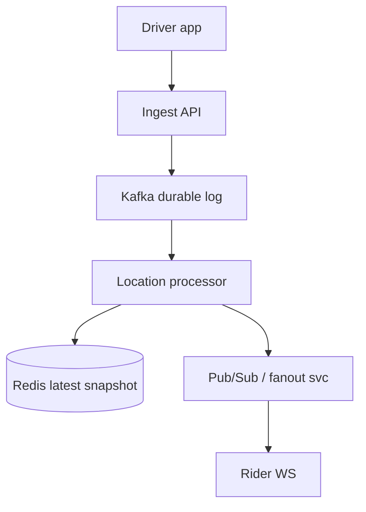
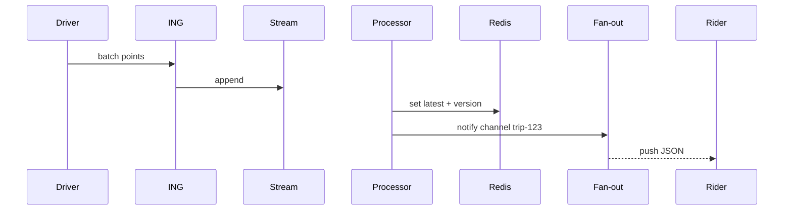

# HLD — Real-Time Driver Tracking System

## Live interview opening (clarify first — bar raiser order)

*“I’ll **start by clarifying requirements**—scope, ambiguity, latency and scale expectations—then lock **FR/NFR**. **After** that, I’ll ground **user journey**, **consistency**, **commit/decision**, and **risks** so it’s clearly **derived from what we agreed**, then **scale** and **architecture**—and I’ll **pause after the diagram** for where you want depth.”*

> **Uber SDE-2 HLD — drive order in this doc:** **§1** clarify → FR → NFR → **Framing after requirements** (user journey, consistency, commit/decision anchors) → **§2** scale → **§3** core entities + APIs → **§4** architecture → **§5** deep dive and evolution → **§6** scaling → **§7** reliability → **§8** tradeoffs → **§9** observability and security → **§10** patterns → **Closing**. Treat **Human interaction** cue blocks (headings in this doc) as *spoken* cues—**paraphrase**; do not read every row. **Bar raiser** listens for **ownership**, **failure modes**, and **honest tradeoffs**. Canonical spine: [HLD-UBER-SDE2-INTERVIEW-SPINE.md](./HLD-UBER-SDE2-INTERVIEW-SPINE.md).

## Interview delivery (golden thread — live thinking)

Bar-raiser polish: **user-first**, **explicit consistency**, **bottleneck**, **evolution**, **UX trust**, **default opinion** (not endless “A or B”). Full template + habits: **[HLD-BAR-RAISER-PERFORMANCE-PACK.md](./HLD-BAR-RAISER-PERFORMANCE-PACK.md)** · **[HLD-MASTER-DELIVERY-GOLDEN-FLOW.md](./HLD-MASTER-DELIVERY-GOLDEN-FLOW.md)**.

| Say at the right time | What interviewers grade | In this guide |
|----------------------|---------------------------|---------------|
| **Opening** | Clarify before solution | **Above** — you **do not** assume requirements. |
| **User journey + consistency + decisions** | Derived, not memorized | **After Section 1**, block **Framing after requirements** — **before Section 2** (not before clarify). |
| **Bottleneck / evolution / UX** | Ops + trust | Same **Framing** block; deep numbers still in **Sections 5–7**. |
| **Strong opinion** | Defaults | **Section 8** tradeoffs — always *“I’d start with X because…”*. |

**Do not:** read tables line-by-line · put user journey **before** clarify · fence-sit.  
**Do:** clarify → FR/NFR → **then** grounded journey → diagram → deep dive where steered.

---

## 1. Clarify requirements

### 1.0 Live flow

#### Live voice (real interviewer room)

**Sound like you’re *deciding*, not reciting:** one idea per breath, then **pause**. Tables here are **backup**—if your eyes are down for more than a couple of seconds, you’ve slipped into reading the doc.

**Bridge phrases (mix naturally):** *“Let me **name the fork** first…”* · *“I’ll **default to X**—tell me if your bar is stricter.”* · *“The reason I ask is it changes **who owns the commit** / **what’s on the hot path**.”* · *“I’ll **over-answer** one layer, then stop—**where should I zoom**?”*

**Ping them (conversation, not monologue):** *“Does that match how you’d scope it?”* · *“If we only deep-dive one thing, is it **A** or **B**?”* (swap **A/B** for two tensions from *your* opening paragraph above.)

**This topic in one breath:** “Tracking is **telemetry ≠ trip**—pins are **eventual**, safety and **authZ** on channels aren’t.”

**`Verbatim` / `Live` cues:** say a line **once**, then **rephrase** the next time—verbatim twice in a row reads *canned*.

**Opening (~once):** *“I’ll align on **update rate**, **who sees whom** (rider vs ops), **map matching**, and **privacy**; then **ingest**, **fan-out**, **storage**, and **architecture**. **Pause after the diagram**—**WebSockets**, **write path**, or **regional**?”*

**Thinking transitions:** *“Not every **GPS tick** belongs in **OLTP**—**separate hot path** from **trip facts**.”*

**Live rule:** Paraphrase tables; deep on **fan-out** or **consistency** only if steered.

**User journey (once):** say [👤 User journey](#user-journey-framing) **before** the architecture diagram.

### 1.1 Clarify

| Topic | Say it like this in the room |
|--------------------------|-------------------------------|
| **Rate** | “**Hz** from device—1 Hz, 5 Hz—and do we **downsample** server-side?” |
| **Consumers** | “Rider **live map**, **ETA**, **support**, **fraud**—different **SLAs**?” |
| **Accuracy** | “**Snap to road**—in this service or **maps**?” |
| **History** | “How long is **breadcrumb** retention—**minutes** vs **days** (compliance)?” |

**Micro-pauses:** *“So **pins** can be **eventual**, but **Trip** correctness lives elsewhere; I’ll **downsample** before I hurt **WS**.”*

#### Human interaction (clarify requirements — think out loud & evolve scope)

**Habit:** *“I’m separating **telemetry hot path** from **trip OLTP**—that one sentence saves twenty minutes of wrong boxes.”*

**Live:** *“Confirm **Hz**, **who consumes**, **retention**, and **snap-to-road** ownership—those decide **Kafka vs** smaller log and how much we **coalesce**.”*

| Stage | Default | Evolve when… |
|-------|---------|----------------|
| **v1** | HTTP batch + **Redis latest** + **Kafka** log | Works at moderate scale |
| **v2** | **WS** fan-out + **per-trip** channel caps | Rider p99 tightens |
| **v3** | **Edge ingest POP** + regional fan-out | Cross-region / mega events |

### 1.2 Functional requirements (FR)

#### Human interaction (FR — after alignment)

**Habit:** *“Three verbs: **ingest**, **fan-out**, **retain**—everything else is optional.”*

| FR area | Say it like this |
|---------|-------------------|
| **Ingest** | “Drivers **publish** location updates **authenticated**.” |
| **Distribute** | “Authorized viewers get **near-real-time** position for **active trip**.” |
| **Derive** | “Optional **speed**, **heading**, **on-trip** flag for downstream.” |

**Core**

- Accept high-volume **location events**; validate + **throttle**.  
- **Broadcast** to trip subscribers (rider app, internal tools).  
- Feed **matching** / **ETA** with **latest** snapshot (see also [19-hld-ride-matching-driver-dispatch.md](./19-hld-ride-matching-driver-dispatch.md)).

### 1.3 Non-functional requirements (NFR)

#### Human interaction (NFR — how it must behave)

**Live:** *“**Privacy** is **AuthZ** on **subscribe** + **TTL**; **latency** is **viewer p99**, not ingest RPS vanity.”*

| NFR | Say it like this |
|-----|------------------|
| **Latency** | “End-to-end **< few seconds** worst case for rider map (confirm).” |
| **Scale** | “**Many** concurrent trips × **update rate**—**partition** by **trip** or **driver**.” |
| **Privacy** | “**Only** parties with **trip relationship**; **TTL** on history.” |

### 1.4 Invariants

**Invariant:** “A **location sample** is **delivered** only to **clients authorized** for that **driver+t** context (active trip or ops role); **PII** **minimized** in fan-out payloads.”

| Beat | Say it like this |
|------|------------------|
| **Bridge** | “**Ingest** cheap; **fan-out** bounded per **trip**.” |
| **Core split** | “**Hot path** = append/stream; **cold** = aggregates + compliance export.” |

### Key insight (say early)

**Decouple** high-frequency **telemetry** from **transactional trip DB**—use **durable append log + latest snapshot + pub/sub**; **location** is **eventually consistent**—see [⚖️ Consistency Model](#consistency-model-anchor).

#### Key anchors

1. “**WebSocket / MQTT** to viewers; **gRPC** internal.”  
2. “I’d **default to Kafka** (or Pulsar) for the **location event log**—**durability**, **replay**, **analytics** consumers; **Redis only** for **latest snapshot** + fast read path—not as the **system of record** for history.”  
3. “**Region-local** ingest; **backpressure** when spikes hit—see [🚦 Backpressure](#backpressure-handling).”

---

## Framing after requirements (before scale + architecture)

**Placement in the room:** this block is **not** “right after clarify questions.” You earn it **after** you’ve locked **FR + NFR** (spoken summary is fine)—otherwise journey / consistency / commit boundaries read as **assuming** product and SLOs.

**Out loud:** *“We’ve **clarified** scope and I’ve stated **FR/NFR** from that—**based on that**, here’s the **user-visible path**, **consistency**, and **commit** I’ll hold before I size **Section 2** and draw **Section 4**.”*

### Thinking transitions (use during interview)

- *“Let me think through this…”*
- *“One tradeoff here is…”*
- *“If I optimize for latency…”*
- *“This might become a bottleneck because…”*
- *“I’d start simple here and evolve later…”*

## User journey (say once—**after** FR/NFR, not after clarify alone)

From the rider’s perspective: subscribe to **live map** for **their trip**; dots move as the driver streams location. From the driver’s perspective: **batched** GPS uploads while moving.

So:

- **write path** = driver **`POST /locations/batch`** (or stream) → **append** durable **LocationEvent** + update **LatestSnapshot** (**idempotent** on `seq` / client ts).
- **read path** = **WS/MQTT** to **trip-scoped** viewers + **`GET …/latest`** for internal consumers—**never** global public driver tracking.
- **async path** = **Kafka/Pulsar** log for analytics, compliance export, replay—**not** every point on OLTP trip row.

## Consistency model

**Append-only facts** in the log; **latest snapshot** is **overwrite** / fast read—**eventually consistent** with strict **ordering per driver** as you defined.

**Decouple** high-frequency telemetry from **transactional trip DB**—backpressure before OLTP drowns.

## Commit boundary

An upload batch is “accepted” when:

- events are **durably appended** (or you explicitly defend WAL risk)—and **`seq`** dedupe makes retries safe.

**Map tile** serving is out of scope here—this service owns **points + fan-out**, not map CDN.

## Decision (strong opinion)

I’d start with:

- **Kafka (or Pulsar)** as **system of record** for the **location event log**; **Redis** (or equivalent) for **latest snapshot** + pub/sub fan-out—not Redis as sole history store.

because **replay + retention** matter for disputes and analytics; **Redis-only** loses the plot at Uber scale.

If fan-out explodes:

- **region-local** ingest, **sample** or **throttle** non-critical consumers, partition by **`driver_id` / trip**.

## Evolution

| Phase | Say it like this |
|-------|------------------|
| **1** | Simple implementation that ships. |
| **2** | Scaling: partitions, caches, queues, backpressure, observability. |
| **3** | Advanced / ML / global—only when metrics or product force it. |

Details: **Section 4.1 (phases)** and **Section 5** in this file.

## Bottleneck anchor

Watch first:

- **updates/sec/region** × **subscribers** (fan-out).
- **WS** connection churn and **reconnect** storms.

## Backpressure handling

Under load:

- **increase batch interval**, **drop** non-critical subscribers, **coalesce** points for downstream **ETA** consumers.
- never **block** driver accept path on analytics lag.

Goal: **rider sees smooth enough** track vs **perfect** 10 Hz for BI.

## UX awareness

Bad outcomes:

- **jumpy** or **stale** pin on map.
- **privacy** leak—wrong trip channel or over-broad subscription.
- duplicate points creating **zigzag** without dedupe.

### Driving the conversation

- *“Does this direction make sense?”*
- *“Should I go deeper on **A** or **B**?”*
- *“Would you like failure scenarios next?”*

### Mindset

*“I’m not presenting a solution—I’m **designing with a teammate**.”*

**Playbook:** [HLD-BAR-RAISER-PERFORMANCE-PACK.md](./HLD-BAR-RAISER-PERFORMANCE-PACK.md).

---

## 2. Estimate scale

#### Human interaction (estimate scale)

**Habit:** *“Multiply **drivers × Hz × subscribers**—that’s the **fan-out** bomb.”*

**Live:** *“I’ll quote **updates/sec/region** an **order of magnitude**—correct me, I only need **partition** justification.”*

| Dimension | Illustrative |
|-----------|----------------|
| Updates / sec / region | **100k–1M+** at Uber-scale discussion |
| Subscribers / trip | Small (1–5) |
| Payload | **Tens of bytes** compressed |

---

## 3. APIs and data model

### 3.0 Core entities (who owns what — say before API tables)

| Entity | Owns / lifecycle (one line) |
|--------|-----------------------------|
| **LocationEvent** | **Append** fact `(driver_id, seq, ts, geom, trip_id?)`—**idempotent** ingest. |
| **LatestSnapshot** | **Fast read** “where is driver now”—**overwrite** / **versioned**. |
| **TripChannel** | **AuthZ**-scoped fan-out to **rider/support** viewers. |
| **IngestSession** | **Rate limit** + **device attestation** hook (if product requires). |

#### Human interaction (API design — batching, idempotency, subscribe)

**Live:** *“**Batch** upload from mobile; **`seq`** or **`(driver_id, client_ts)`** for dedupe; **WS** subscribe is **trip-scoped**, never **global driver** public.”*

### 3.1 APIs

| API | Purpose |
|-----|---------|
| `POST /v1/locations/batch` | Driver upload (batched points) |
| `GET /v1/ws/trips/{trip_id}` | Upgrade to WS for rider |
| `GET /v1/drivers/{id}/latest` | Internal snapshot |

### 3.2 Model

- **LocationEvent:** `driver_id`, `trip_id?`, `ts`, `lat`, `lng`, `accuracy`, `heading`.  
- **LatestSnapshot:** key `driver_id` → last event + **version**.

---

## 👤 User Journey (say once early)

**Say it once early** (before or right after the [architecture diagram](#4-high-level-architecture)):

*“From the **product** side:

**Driver sends location updates** → the system **ingests** and **processes** them → the **latest** position is **stored** → the **rider sees real-time movement** on the map.

So:
- **Write path** = **location ingestion** (validate, authenticate, accept batch)
- **Stream path** = **processing** + **distribution** (consume log, update snapshot, notify fan-out)
- **Read path** = **fan-out** to **authorized viewers** (WS / poll), always scoped to **trip** context”*

👉 **Intuitive** before you draw **Kafka**, **Redis**, and **WS**.

---

## ⚖️ Consistency Model

**Bar Raiser:** *“Is location **strongly** consistent?”*

**Say clearly:**

**Location tracking is eventually consistent.** We optimize for:

- **Freshness** over **strict global ordering** of every point  
- **Latest snapshot** over **perfect historical** replay on the **hot path** (history lives in the **log/lake** with its own SLOs)

**Trip state** (assignment, phase, fare contract) stays **strongly consistent** in **Trip service**—see [18-hld-uber-ride-sharing-backend.md](./18-hld-uber-ride-sharing-backend.md). **Do not** conflate **map pin freshness** with **trip lifecycle correctness**.

**One-liner:** *“**Pin** can lag **seconds**; **‘you have a driver’** cannot be a **cache guess**.”*

---

## 🚦 Backpressure Handling

**If ingest rate spikes** (burst GPS, bad client loop, viral event):

- **Drop or downsample** **intermediate** points—keep **monotonic ‘latest wins’** semantics per `driver_id` / trip.  
- **Prioritize latest location** on the **snapshot** path over persisting **every** sub-second sample to **all** sinks.  
- **Protect fan-out latency** (rider **p99**) over **full** history on the **real-time** pipe—**extra** detail can land in **cold** storage **async**.

👉 Signals **streaming maturity**: **shed** work **gracefully**, don’t **queue unbounded** until the **WS tier** dies.

---

## 👤 UX Awareness

If updates are **delayed**, the rider should still see **last-known** position and a **clear loading / “catching up”** state—**not** a **blank map**, a **jumping pin** with no context, or a **silent** freeze. **Reconnect** = **last-known** from snapshot, then **live** tail—aligns with [§7](#7-reliability-and-failure-handling).

---

## 4. High-level architecture

#### Human interaction (high-level architecture)

| Moment | Say it like this in the room |
|--------|------------------------------|
| **User journey** | “Same beat as [👤 User journey](#user-journey-framing): **driver emits → ingest → process → latest → rider map**.” |
| **Stores** | “**Kafka** = **durable** event log + replay; **Redis** = **latest snapshot** only—[Key anchors](#key-insight-say-early).” |
| **Consistency** | “[⚖️ Location is eventual](#consistency-model-anchor); **Trip** stays **strong** elsewhere.” |
| **Spikes** | “[🚦 Backpressure](#backpressure-handling)—downsample, **latest wins**, protect **WS**.” |

**Default stance:** **Kafka** for the log (**Pulsar** acceptable same role); **not** “Redis Streams as primary history” unless scope is **tiny**—say why if you diverge.

### 4.1 Phases

| Phase | Ship |
|-------|------|
| **1** | HTTP batch + long poll |
| **2** | WS + **Redis latest** + **Kafka** log (**default** split: durability vs snapshot) |
| **3** | Edge POP ingest, regional fan-out |

---

## 5. Deep dive: ingest → fan-out

#### Human interaction (deep dive — critical flow, optimizations & evolution)

**Habit:** *“Walk **ingest → log → snapshot → push**; name [⚖️ eventual](#consistency-model-anchor) + [🚦 backpressure](#backpressure-handling) if they push.”*

**Live (evolution):** *“**v1**: bigger batches + long poll. **v2**: **Kafka** + **Redis latest** + **WS** with **coalesce**. **v3**: **edge** ingest to cut RTT—still **trip AuthZ** at core.”*

### 🎯 Bottleneck Anchor

“**Fan-out service** connection count and **Kafka consumer lag**—not raw **ingress** bandwidth alone.”

**Taking a stance:** *“**Coalesce** updates **per trip** to e.g. **2–5 Hz** viewer effective rate even if ingest is higher—that’s **backpressure** on the **fan-out** path, not ‘losing’ the driver.”*

---

## 6. Scaling and bottlenecks

#### Human interaction (scaling & bottlenecks)

**Live:** *“First break is almost always **connection count** or **consumer lag**—**shard** WS, **scale** processors horizontally, **cap** per-trip push rate.”*

| Risk | Mitigation |
|------|------------|
| **WS connection storms** | **Shard** connection gateways; **STUN**/edge |
| **Hot trip** | **Channel** per trip; **cap** message rate |
| **Lag** | **Monitor consumer lag**; **scale** LP |
| **Ingest storm** | [🚦 Downsample / latest wins](#backpressure-handling); **cap** queue depth at ingest |

---

## 7. Reliability and failure handling

#### Human interaction (reliability & failure handling)

**Live:** *“**At-least-once** is fine if **`seq`** makes writes **idempotent**; **reconnect** path serves **last-known** then tail—see [UX](#ux-awareness).”*

- **At-least-once** ingest → **idempotent** write by `(driver_id, seq)`.  
- **Viewer reconnect:** send **last-known** from Redis then **live**—[👤 UX Awareness](#ux-awareness).  
- **Partition:** **sticky routing** for WS.  
- **Processor overload:** apply [🚦 Backpressure](#backpressure-handling); never **unbounded** RAM on fan-out.

---

## 8. Tradeoffs and alternatives

#### Human interaction (tradeoffs & alternatives)

**Live:** *“**Kafka default** buys replay; **Redis Streams** only if we admit **smaller** scale. **Server map-match** improves consistency but costs **CPU**—often **async** off hot path.”*

| Choice | Trade |
|--------|--------|
| **Kafka (default) vs Redis Streams as primary log** | **Kafka**: durability + replay + many consumers; **Redis Streams** only if **small** scale / ops simplicity—**Redis** stays **latest snapshot** in the **default** story |
| **Map on device vs server** | Battery vs consistency |

---

## 9. Monitoring, observability, and security

#### Human interaction (monitoring, observability & security)

**Habit:** *“I’d trace **one point** through metrics: ingest ts → **Redis write** → **WS delivery**—that’s the **golden slice**.”*

**Metrics:** ingest RPS, **end-to-end latency** (sample timestamp → rider receive), WS **drop rate**, **authz** denials.  
**Security:** **mTLS** or signed tokens; **trip-scoped** channels.

---

## 10. Design patterns, data structures & best practices

#### Human interaction (design patterns, data structures & best practices)

**Verbatim (say on the board, ~30s):** *“**CQRS**—GPS **telemetry** is **append-heavy** and **eventual**; **Trip** OLTP stays **strong** elsewhere; **Kafka** as durable **ingest log** with **downsample** and **latest-wins** into **Redis**; **pub/sub** per **trip_id** to riders over **WebSocket**; **rate limit** and **authZ** on subscribe; optional **ring buffer** on device before batch upload.”*

**Live:** *“**CQRS**, **pub/sub** per trip, **ring buffer** on device, **rate limit** at ingest—only what’s on the diagram.”*

| Pattern / DS | Where | One interview line |
|----------------|------|----------------------|
| **CQRS** | Telemetry vs trip | “Pins are **eventual**; **trip lifecycle** is not.” |
| **Append log + replay** | Kafka | “**Bursts** and **reprocess** without losing the stream.” |
| **Latest-value store** | Redis / cache | “Riders need **last known**, not full GPS history, on the hot path.” |
| **Pub/sub (trip channel)** | Fan-out svc | “**AuthZ** before I put you on **`trip:{id}`**.” |
| **Rate limit + downsample** | Ingest | “**Backpressure** is a **feature**—protect fan-out.” |
| **Ring buffer (client)** | Driver app | “Batch and **drop** intermediate points under load.” |

**Live:** pick **five or six** rows; **never** put raw GPS in trip **txn** path.

---

## Closing notes

#### Human interaction (closing notes)

**Live:** *“**Hot path** = append + latest + fan-out; **Trip** correctness isn’t here; **backpressure** is a **feature**.”*

| Do | Avoid |
|----|--------|
| **Separate hot path** | Every GPS in SQL row |
| **AuthZ on subscribe** | Public driver id channels |
| **[⚖️ Say eventual for pins](#consistency-model-anchor)** | Pretend map == **trip** **strong** consistency |
| **[👤 Last-known + loading](#ux-awareness)** | Blank map on slow tail |

---

## Bar-raiser follow-ups

#### Human interaction (bar-raiser follow-ups)

| They ask | Say it like this |
|----------|------------------|
| **Ghost locations** | “**Kalman** / map-match **downstream**; flag **spoof** for fraud.” |
| **Global trip** | “**Roaming**—handoff **region** with **session** token.” |
| **Strong vs eventual** | “[⚖️ Pins eventual](#consistency-model-anchor); **Trip** **strong** for lifecycle.” |
| **Burst traffic** | “[🚦 Downsample, latest wins, protect fan-out](#backpressure-handling).” |

---

## 60-second close

#### Human interaction (60-second close)

| Beat | Say it like this |
|------|------------------|
| **Recap** | “**User journey**: **driver emits → ingest → process → latest → rider map**. **Write / stream / read** split. **Default: Kafka** = durable log + replay; **Redis** = **latest snapshot** only. [⚖️ **Location eventual**](#consistency-model-anchor); **Trip** **strong** elsewhere. [🚦 **Backpressure**](#backpressure-handling): downsample, **latest wins**, protect **WS**. [👤 **UX**](#ux-awareness): **last-known** + loading, not blank. **SLIs**: fan-out **p99**, consumer **lag**, drops.” |

---
