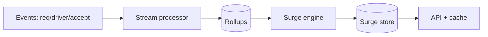
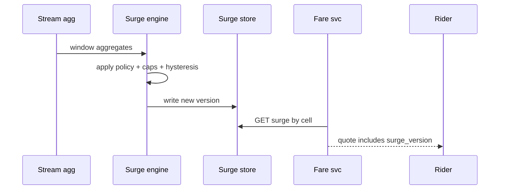

# HLD — Surge Pricing System

## Live interview opening (clarify first — bar raiser order)

*“I’ll **start by clarifying requirements**—scope, ambiguity, latency and scale expectations—then lock **FR/NFR**. **After** that, I’ll ground **user journey**, **consistency**, **commit/decision**, and **risks** so it’s clearly **derived from what we agreed**, then **scale** and **architecture**—and I’ll **pause after the diagram** for where you want depth.”*

> **Uber SDE-2 HLD — drive order in this doc:** **§1** clarify → FR → NFR → **Framing after requirements** (user journey, consistency, commit/decision anchors) → **§2** scale → **§3** core entities + APIs → **§4** architecture → **§5** deep dive and evolution → **§6** scaling → **§7** reliability → **§8** tradeoffs → **§9** observability and security → **§10** patterns → **Closing**. Treat **Human interaction** cue blocks (headings in this doc) as *spoken* cues—**paraphrase**; do not read every row. **Bar raiser** listens for **ownership**, **failure modes**, and **honest tradeoffs**. Canonical spine: [HLD-UBER-SDE2-INTERVIEW-SPINE.md](./HLD-UBER-SDE2-INTERVIEW-SPINE.md).

## Interview delivery (golden thread — live thinking)

Bar-raiser polish: **user-first**, **explicit consistency**, **bottleneck**, **evolution**, **UX trust**, **default opinion** (not endless “A or B”). Full template + habits: **[HLD-BAR-RAISER-PERFORMANCE-PACK.md](./HLD-BAR-RAISER-PERFORMANCE-PACK.md)** · **[HLD-MASTER-DELIVERY-GOLDEN-FLOW.md](./HLD-MASTER-DELIVERY-GOLDEN-FLOW.md)**.

| Say at the right time | What interviewers grade | In this guide |
|----------------------|---------------------------|---------------|
| **Opening** | Clarify before solution | **Above** — you **do not** assume requirements. |
| **User journey + consistency + decisions** | Derived, not memorized | **After Section 1**, block **Framing after requirements** — **before Section 2** (not before clarify). |
| **Bottleneck / evolution / UX** | Ops + trust | Same **Framing** block; deep numbers still in **Sections 5–7**. |
| **Strong opinion** | Defaults | **Section 8** tradeoffs — always *“I’d start with X because…”*. |

**Do not:** read tables line-by-line · put user journey **before** clarify · fence-sit.  
**Do:** clarify → FR/NFR → **then** grounded journey → diagram → deep dive where steered.

---

## 1. Clarify requirements

### 1.0 Live flow

#### Live voice (real interviewer room)

**Sound like you’re *deciding*, not reciting:** one idea per breath, then **pause**. Tables here are **backup**—if your eyes are down for more than a couple of seconds, you’ve slipped into reading the doc.

**Bridge phrases (mix naturally):** *“Let me **name the fork** first…”* · *“I’ll **default to X**—tell me if your bar is stricter.”* · *“The reason I ask is it changes **who owns the commit** / **what’s on the hot path**.”* · *“I’ll **over-answer** one layer, then stop—**where should I zoom**?”*

**Ping them (conversation, not monologue):** *“Does that match how you’d scope it?”* · *“If we only deep-dive one thing, is it **A** or **B**?”* (swap **A/B** for two tensions from *your* opening paragraph above.)

**This topic in one breath:** “Surge is **signals → smooth → versioned multiplier**—I’ll lead with **trust** (hysteresis) not clever ML.”

**`Verbatim` / `Live` cues:** say a line **once**, then **rephrase** the next time—verbatim twice in a row reads *canned*.

**Opening (~once):** *“I’ll align on **geo unit** (hex vs zone), **inputs** (supply/demand/exog), **staleness vs fairness**, and **UX cap**; then **compute pipeline**, **serving**, **architecture**. **Pause after the diagram**—**algorithm**, **cache**, or **incidents**?”*

**Thinking transitions:** *“Surge is a **published multiplier** with a **freshness SLO**—not a hidden **rank** score.”*

**Live rule:** Paraphrase tables; deep on **policy** or **consistency** only if steered.

**User journey (once):** say [👤 User journey](#user-journey-framing) **before** the architecture diagram.

### 1.1 Clarify

| Topic | Say it like this in the room |
|--------------------------|-------------------------------|
| **Objective** | “**Elasticity** / **wait reduction** / **driver incentive**—what’s primary?” |
| **Transparency** | “Show **exact** multiplier or **range**?” |
| **Caps** | “**Legal/product** max surge?” |
| **Cold start** | “New city—**defaults**?” |
| **Eats vs Rides** | “Same engine or **separate**?” |

**Micro-pauses:** *“So **quotes** carry **`surge_version`**; **serving** can be **stale** but **money** can’t be **silent retroactive**.”*

#### Human interaction (clarify requirements — think out loud & evolve scope)

**Habit:** *“Surge is a **published policy surface**—I clarify **objective**, **caps**, and **mid-trip rules** before I pick ML.”*

| Stage | Default | Evolve when… |
|-------|---------|----------------|
| **v1** | **Rules + hysteresis + caps** + **versioned** writes | Trust + debuggability |
| **v2** | **Better signals** + **shadow** formulas | Data quality proven |
| **v3** | **ML layer** + multi-objective + **A/B** | Org maturity |

### 1.2 Functional requirements (FR)

#### Human interaction (FR — after alignment)

**Habit:** *“**Compute**, **serve**, **audit**—three FR pillars.”*

| FR area | Say it like this |
|---------|-------------------|
| **Compute** | “Per **cell** and **product**, output **multiplier** (or additive fee) on a cadence.” |
| **Serve** | “Riders/drivers **read** current surge for **location**.” |
| **Audit** | “Explainability snapshot for **support** / **regulators**.” |

**Core**

- Ingest **signals**: open requests, idle drivers, ETA to accept, weather, events.  
- Emit **surge record** versioned by `(cell, product, window)`.  
- **Fare service** consumes surge for **estimate** and **final** (see [22-hld-eta-fare-estimation.md](./22-hld-eta-fare-estimation.md)).

### 1.3 Non-functional requirements (NFR)

#### Human interaction (NFR — how it must behave)

**Live:** *“Reads are **cheap**; recompute is **async**; **fairness** means **anti-oscillation**—not only ‘ML accuracy’.”*

| NFR | Say it like this |
|-----|------------------|
| **Latency** | “Reads **cached**—**ms**; recompute **async** **5s–60s** cadence (confirm).” |
| **Correctness** | “**Version** on **quotes**; **mid-trip** surge rules per product—spell [⚖️ Consistency Model](#consistency-model-anchor).” |
| **Fairness** | “Avoid **oscillation**—**hysteresis** / **smoothing**.” |

### 1.4 Invariants

**Invariant:** “Every **fare quote** references a **surge_version** (or **explicit default**) so we can **reconcile** what the user was **shown**; **no silent** retroactive change after **confirmation** without a **new** quote artifact—see [⚖️ Consistency Model](#consistency-model-anchor).”

| Beat | Say it like this |
|------|------------------|
| **Bridge** | “**Stream in** aggregates → **model** → **versioned** **surge table**.” |
| **Core split** | “**Offline / nearline** calibration vs **online** **serving**.” |

### Key insight (say early)

**Separate** **signal collection** from **policy computation** from **edge serving**—smooth, version, and **cap** in **one place**; **ship rules + hysteresis first**, add **ML** when **signals** are **trustworthy** ([👤 UX](#ux-awareness), [🚦 inputs](#input-quality-backpressure)).

#### Key anchors

1. “**Hysteresis** stops flip-flop.”  
2. “**Version** tied to **quotes**.”  
3. “**Shadow** deploy new formulas.”  
4. “I’d **start rule-based** with **hysteresis** + caps; add **ML** only once **signal pipelines** are **reliable** and **observable**—not as v1 magic.”

---

## Framing after requirements (before scale + architecture)

**Placement in the room:** this block is **not** “right after clarify questions.” You earn it **after** you’ve locked **FR + NFR** (spoken summary is fine)—otherwise journey / consistency / commit boundaries read as **assuming** product and SLOs.

**Out loud:** *“We’ve **clarified** scope and I’ve stated **FR/NFR** from that—**based on that**, here’s the **user-visible path**, **consistency**, and **commit** I’ll hold before I size **Section 2** and draw **Section 4**.”*

### Thinking transitions (use during interview)

- *“Let me think through this…”*
- *“One tradeoff here is…”*
- *“If I optimize for latency…”*
- *“This might become a bottleneck because…”*
- *“I’d start simple here and evolve later…”*

## User journey (say once—**after** FR/NFR, not after clarify alone)

From the rider’s perspective: open app → see **price** influenced by **surge** → request trip → **quote** shows a multiplier; during trip, **mid-trip** rules may differ per product—must still **reconcile** what was promised.

So:

- **write path** = ingest **signals** (supply/demand, incidents) → **recompute** policy → publish **versioned** **surge** rows + audit history.
- **read path** = **cached** read of current multiplier for a **cell/product**—**ms** SLO class.
- **async path** = OLAP rollups, **shadow** deploy of new formulas, **kill switch** rollback.

## Consistency model

Every **fare quote** references **`surge_version`** (immutable artifact)—**no silent** retroactive change after confirmation without a **new** quote.

**Fairness**: **hysteresis** / smoothing / caps to prevent **oscillation** flip-flop in UI and supply behavior.

## Commit boundary

**Serving read** can be **stale for seconds** if NFR allows; **committed upfront fare** binds to the **quote id** versions you named—not “whatever Redis says now.”

**Recompute** cadence (e.g. 5s–60s) is **async** from the **hot read path**.

## Decision (strong opinion)

I’d start with:

- **rule-based** surge + **hysteresis** + **caps** + **versioned** tables; **signal → model → serve** separation.

because **ML** without trustworthy **pipelines** and **observability** is how you get **unfair** and **un-debuggable** pricing.

If signals mature:

- add **ML** calibration with **shadow** traffic before **full** promotion.

## Evolution

| Phase | Say it like this |
|-------|------------------|
| **1** | Simple implementation that ships. |
| **2** | Scaling: partitions, caches, queues, backpressure, observability. |
| **3** | Advanced / ML / global—only when metrics or product force it. |

Details: **Section 4.1 (phases)** and **Section 5** in this file.

## Bottleneck anchor

Watch first:

- **read QPS** vs **recompute** cost (**millions of cells**, sparse updates—**tiered** recompute).
- **hot metro** events (bad weather) spiking both **signals** and **reads**.

## Backpressure handling

Under load:

- widen **recompute** intervals for **cold** cells; prioritize **hot** cells.
- **freeze** promotions / **kill switch** bad formula versions.

Goal: **stable perceived pricing** + **auditability** over **perfect** real-time elasticity everywhere.

## UX awareness

Bad outcomes:

- **flip-flop** multipliers while idle at the curb.
- rider charged differently than **shown quote** without a clear **new quote** moment.

### Driving the conversation

- *“Does this direction make sense?”*
- *“Should I go deeper on **A** or **B**?”*
- *“Would you like failure scenarios next?”*

### Mindset

*“I’m not presenting a solution—I’m **designing with a teammate**.”*

**Playbook:** [HLD-BAR-RAISER-PERFORMANCE-PACK.md](./HLD-BAR-RAISER-PERFORMANCE-PACK.md).

---

## 2. Estimate scale

#### Human interaction (estimate scale)

**Live:** *“**Millions** of cells but **sparse** updates—**tiered recompute** is how the cost curve bends.”*

| Dimension | Illustrative |
|-----------|----------------|
| Cells globally | **Millions** active; **hot** subset recomputed often |
| Read QPS | **Very high**—**CDN/edge cache** unrealistic for personalized—**regional Redis** |

**Tie it in one line:** “**O(cells)** recompute cost controlled by **hierarchy** (coarse → refine hot).”

---

## 3. APIs and data model

### 3.0 Core entities (who owns what — say before API tables)

| Entity | Owns / lifecycle (one line) |
|--------|-----------------------------|
| **SignalRollup** | **Windowed** counts/features per **cell/product**—**OLAP** or stream agg. |
| **SurgeRecord** | **Versioned** multiplier row—**immutable** history for audit. |
| **QuoteArtifact** | Embeds **`surge_version`**—owned by **Fare** service. |
| **Policy / Formula** | **Versioned** config; **kill switch** to rollback. |

#### Human interaction (API design — versioned reads & internal triggers)

**Live:** *“**GET surge** returns **multiplier + version**; **Fare** persists that **version** on quotes; internal **recompute** is **batch** or **stream-triggered**, never on rider **critical path**.”*

### 3.1 APIs

| API | Purpose |
|-----|---------|
| `GET /v1/surge?lat=&lng=&product=` | Current multiplier + `version` |
| *internal* | `POST /v1/surge/recompute` batch job trigger |

### 3.2 Model

- **SurgeRecord:** `cell_id`, `product`, `multiplier`, `version`, `valid_until`, `inputs_hash`.  
- **Signals rollup:** time-windowed counts in **OLAP** or **stream processor**.

---

## 👤 User Journey (say once early)

**Say it once early** (before or right after the [architecture diagram](#4-high-level-architecture)):

*“From the **rider** side:

**User opens app** → **requests a ride** → the system **fetches surge** for their **location** → the **fare quote** includes the **multiplier** (and **`surge_version`**) → user **confirms** → the **trip** continues to reference that **same `surge_version`** for anything **locked** at quote time (per product).

So:
- **Compute path** = **signals** → **surge engine** → **versioned** `SurgeRecord`
- **Read path** = **surge lookup** when building a **quote**
- **Correctness** = **version consistency** between what we **showed** and what we **charge** on”*

👉 **Product-aware** before the **pipeline** boxes.

---

## ⚖️ Consistency Model

**Bar Raiser:** *“Can **surge change mid-trip**?”*

**Say clearly:**

**Surge is eventually consistent** across cells and caches (staleness SLO is OK for the **published** multiplier **read**), but the **contract** with the user is **stricter** on **money**:

- **Quote** must be **consistent** with the **`surge_version`** it embeds—auditable.  
- **No silent change** after **user confirmation** on an **upfront** or **locked** fare: if surge moves, it applies to **new quotes** / **next trip**, not by **mutating** the old artifact in place.  
- **Metered** trips: align with interviewer—often **rate card** + **rules version** at trip start; **surge** may be **fixed** for that trip or **float** per policy—**state the default** and **never** hand-wave.

**One-liner:** *“**Eventual** on the **wall**; **explicit versions** on the **receipt path**.”*

---

## 🚦 Input Quality / Backpressure

**If signals are noisy, delayed, or spiky:**

- **Smooth** with **windowed** aggregates and **hysteresis**—don’t let one bad tick move the multiplier.  
- **Outlier rejection** / caps on absurd input spikes (GPS glitch, counter bug, replay storm).  
- Prefer **stable** behavior over **hyper-reactive** noise—pairs with [👤 UX Awareness](#ux-awareness).

**Backpressure:** shed **non-critical** exogenous inputs first under load; **extend** recompute cadence for **cold** cells before dropping **hot-cell** freshness.

👉 Shows **robustness**: **trust** beats **chasing every twitch** in the raw stream.

---

## 👤 UX Awareness

If **surge** changes **too often**, **user trust** drops—so we **prioritize stability** (smoothing, hysteresis, clear **version** / “updated just now” copy) over **chasing perfect instantaneous accuracy**. **Oscillation** is a **product** failure, not only an **algo** bug.

---

## 4. High-level architecture

#### Human interaction (high-level architecture)

| Moment | Say it like this in the room |
|--------|------------------------------|
| **User journey** | “[👤 Quote includes `surge_version`](#user-journey-framing); trip **locks** per **product** rules.” |
| **Consistency** | “[⚖️ Eventual serve vs explicit quote contract](#consistency-model-anchor).” |
| **Signals** | “[🚦 Window, reject outliers, backpressure](#input-quality-backpressure)—bad input ≠ wild multiplier.” |
| **Evolution** | “[Rule-based + hysteresis first](#key-insight-say-early); **ML** when pipelines **earn** it.” |

### 4.1 Phases

| Phase | Ship |
|-------|------|
| **1** | **Rule-based** demand/supply (or similar) + **hysteresis** + **caps**—**default MVP** |
| **2** | Harden **signal** quality, **dashboards**, **shadow**; then add **ML** layer **on top**—not before pipelines are **trusted** |
| **3** | Multi-objective + **A/B** flags + **strong** audit |

---

## 5. Deep dive: compute + serve

#### Human interaction (deep dive — critical flow, optimizations & evolution)

**Habit:** *“**Window** → **policy** → **version write** → **quote read**—tie [⚖️ consistency](#consistency-model-anchor) and [🚦 inputs](#input-quality-backpressure) if they probe.”*

**Live (evolution):** *“**v1**: rules + hysteresis + **tiered** cell updates. **v2**: shadow **ML** + better dashboards. **v3**: multi-objective with **strong** audit—still **version** everything.”*

### 🎯 Bottleneck Anchor

“**Oscillation** and **wrong cold inputs** cause **trust** incidents—**smooth** + **version** + **monitor** delta.”

**Taking a stance:** *“**Fare** stores **surge_version** on the **quote** artifact—**idempotent** replays; **mid-trip** behavior is a **policy** answer, not an implementation accident—[⚖️ spell it](#consistency-model-anchor).”*

---

## 6. Scaling and bottlenecks

#### Human interaction (scaling & bottlenecks)

**Live:** *“Don’t **recompute the planet** every tick—**hierarchical** cells + **skip stable** regions; **jitter** cadence against **herd**.”*

| Risk | Mitigation |
|------|------------|
| **All-cell recompute** | **Tiered**: metro → hex; **skip** stable cells |
| **Thundering herd** on spike | **Pre-warm**; **jitter** cadence |
| **Stale reads** | **TTL** + **version** mismatch → **refresh** |

---

## 7. Reliability and failure handling

#### Human interaction (reliability & failure handling)

**Live:** *“**Degrade** to **last good** with **max staleness**; **kill switch** formula; **never** silently rewrite **old quotes**—[⚖️ consistency](#consistency-model-anchor).”*

- **Engine down:** **last good** multiplier with **max age**; **fallback** to **1.0** if expired (product).  
- **Bad deploy:** **kill switch** to formula v-1.  
- **Poison signals:** fall back to **last stable** window per [🚦 Input Quality](#input-quality-backpressure); **alert** on anomaly rate.  
- **Quote / trip mismatch:** reconcile using **`surge_version`** on artifact—[⚖️ Consistency Model](#consistency-model-anchor).

---

## 8. Tradeoffs and alternatives

#### Human interaction (tradeoffs & alternatives)

**Live:** *“**Finer geo** costs compute; **personalized** surge can **hurt trust**; **ML v1** on **dirty** signals is a **liability**—I’d default **rules**.”*

| Choice | Trade |
|--------|--------|
| **Fine hex** | Responsive vs compute cost |
| **Personalized surge** | Revenue vs **fairness** perception |
| **Rule + hysteresis first vs ML v1** | **Ship fast, debuggable** vs **opaque** model on **dirty** signals—**default** the former ([Key anchors](#key-insight-say-early)) |

---

## 9. Monitoring, observability, and security

#### Human interaction (monitoring, observability & security)

**Habit:** *“I’d page on **oscillation rate** and **quote/trip version mismatch**—those are **money + trust**.”*

**Metrics:** multiplier **distribution**, **churn** rate version-to-version, **ETA** under surge, **quote** vs **trip** reconciliation diff.  
**Security:** **no** user-specific surge **leak** across sessions if policy forbids.

---

## 10. Design patterns, data structures & best practices

#### Human interaction (design patterns, data structures & best practices)

**Verbatim (say on the board, ~30s):** *“**Lambda**—stream for **fast** multipliers, batch for **reconciliation**; **versioned config** and **feature flags** for safe rollout; **ring buffer** or sliding windows for **signal smoothing**; **hysteresis** so we don’t oscillate; **idempotent** materialized **cell state** with **ETag** or version on quotes; **audit log** per cell window for **regulatory** replay.”*

**Live:** *“**Lambda**, **versioned config**, **feature flags**, **ring buffer**—pick **four** max on the diagram.”*

| Pattern / DS | Where | One interview line |
|----------------|------|----------------------|
| **Lambda (stream + batch)** | Signals → multiplier | “Stream is **fresh**; batch **fixes** drift and accounting.” |
| **Ring buffer / sliding window** | Demand smoothing | “One bad tick shouldn’t move the **multiplier**.” |
| **Hysteresis + caps** | Policy engine | “**Enter/exit** thresholds kill **flicker**.” |
| **Versioned config + flags** | Control plane | “**Kill switch** to formula **v-1** without redeploy panic.” |
| **Materialized cell state** | Read path | “Quote path does **lookup**, not recomputing the world.” |
| **Immutable quote linkage** | Trip / pricing | “**`surge_version`** on the artifact—no **silent** retro-pricing.” |

**Live:** pick **five or six** rows; lead with **trust** (hysteresis + version).

---

## Closing notes

#### Human interaction (closing notes)

**Live:** *“**Version** on quotes, **hysteresis** on policy, **tiered** compute—surge is **trust** engineering.”*

| Do | Avoid |
|----|--------|
| **Hysteresis + version** | Mystery multipliers |
| **Quote linkage** | Surge changes **retroactive** fare with no artifact |
| **[⚖️ Mid-trip without a contract](#consistency-model-anchor)** | “It changes” with no product rule |
| **[👤 Chasing accuracy over trust](#ux-awareness)** | **Oscillating** multiplier UX |

---

## Bar-raiser follow-ups

#### Human interaction (bar-raiser follow-ups)

| They ask | Say it like this |
|----------|------------------|
| **Pooling** | “**Cross-side** externalities—sometimes **objective** is **system throughput**, not single-trip revenue.” |
| **Regulation** | “**Audit log** of inputs + formula id per **cell** window.” |
| **Mid-trip surge** | “[⚖️ Default: no **silent** change to **locked** quote](#consistency-model-anchor); **metered** = **rate card** rule **explicit**.” |
| **Noisy demand signal** | “[🚦 Window + outlier cap + hysteresis](#input-quality-backpressure); don’t let one tick move price.” |

---

## 60-second close

#### Human interaction (60-second close)

| Beat | Say it like this |
|------|------------------|
| **Recap** | “**User journey**: **open → request → surge on quote → confirm → same `surge_version`** where locked. **Compute** = signals → engine → version; **read** = lookup for quote; **correctness** = **version contract** ([⚖️ eventual serve, strict quote](#consistency-model-anchor)). **[🚦 Inputs](#input-quality-backpressure)**: smooth, reject spikes, backpressure. **Default**: **rule-based + hysteresis**; **ML** after **reliable** pipelines. **[👤 UX](#ux-awareness)**: **stability** over twitchy accuracy. **Scale**: tiered cells; **watch oscillation**.” |

---
