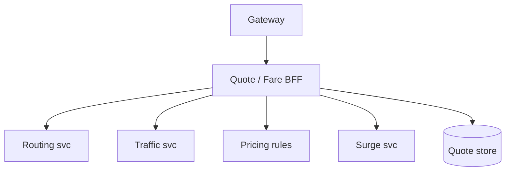
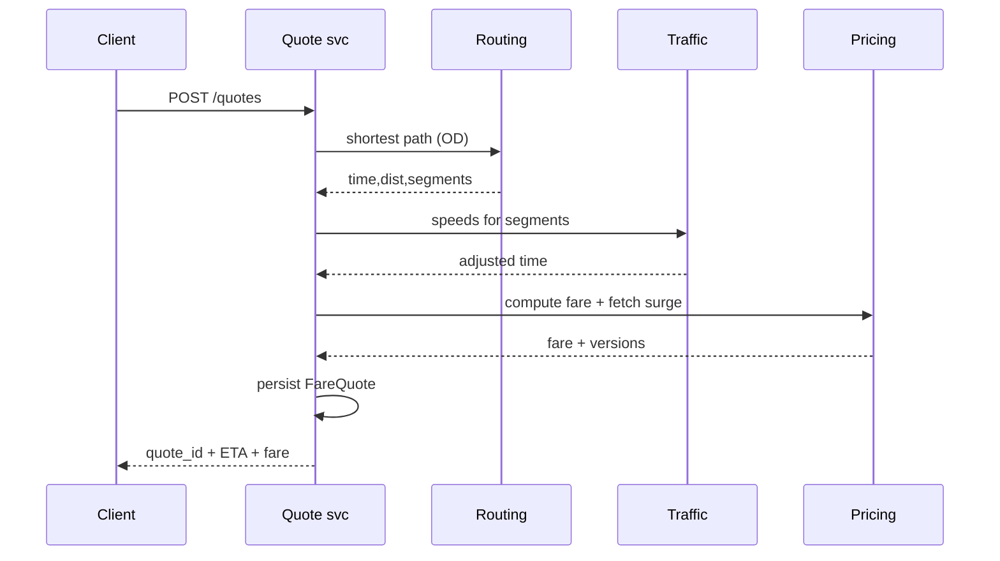

# HLD — ETA Calculation / Fare Estimation System

## Live interview opening (clarify first — bar raiser order)

*“I’ll **start by clarifying requirements**—scope, ambiguity, latency and scale expectations—then lock **FR/NFR**. **After** that, I’ll ground **user journey**, **consistency**, **commit/decision**, and **risks** so it’s clearly **derived from what we agreed**, then **scale** and **architecture**—and I’ll **pause after the diagram** for where you want depth.”*

> **Uber SDE-2 HLD — drive order in this doc:** **§1** clarify → FR → NFR → **Framing after requirements** (user journey, consistency, commit/decision anchors) → **§2** scale → **§3** core entities + APIs → **§4** architecture → **§5** deep dive and evolution → **§6** scaling → **§7** reliability → **§8** tradeoffs → **§9** observability and security → **§10** patterns → **Closing**. Treat **Human interaction** cue blocks (headings in this doc) as *spoken* cues—**paraphrase**; do not read every row. **Bar raiser** listens for **ownership**, **failure modes**, and **honest tradeoffs**. Canonical spine: [HLD-UBER-SDE2-INTERVIEW-SPINE.md](./HLD-UBER-SDE2-INTERVIEW-SPINE.md).

## Interview delivery (golden thread — live thinking)

Bar-raiser polish: **user-first**, **explicit consistency**, **bottleneck**, **evolution**, **UX trust**, **default opinion** (not endless “A or B”). Full template + habits: **[HLD-BAR-RAISER-PERFORMANCE-PACK.md](./HLD-BAR-RAISER-PERFORMANCE-PACK.md)** · **[HLD-MASTER-DELIVERY-GOLDEN-FLOW.md](./HLD-MASTER-DELIVERY-GOLDEN-FLOW.md)**.

| Say at the right time | What interviewers grade | In this guide |
|----------------------|---------------------------|---------------|
| **Opening** | Clarify before solution | **Above** — you **do not** assume requirements. |
| **User journey + consistency + decisions** | Derived, not memorized | **After Section 1**, block **Framing after requirements** — **before Section 2** (not before clarify). |
| **Bottleneck / evolution / UX** | Ops + trust | Same **Framing** block; deep numbers still in **Sections 5–7**. |
| **Strong opinion** | Defaults | **Section 8** tradeoffs — always *“I’d start with X because…”*. |

**Do not:** read tables line-by-line · put user journey **before** clarify · fence-sit.  
**Do:** clarify → FR/NFR → **then** grounded journey → diagram → deep dive where steered.

---

## 1. Clarify requirements

### 1.0 Live flow

#### Live voice (real interviewer room)

**Sound like you’re *deciding*, not reciting:** one idea per breath, then **pause**. Tables here are **backup**—if your eyes are down for more than a couple of seconds, you’ve slipped into reading the doc.

**Bridge phrases (mix naturally):** *“Let me **name the fork** first…”* · *“I’ll **default to X**—tell me if your bar is stricter.”* · *“The reason I ask is it changes **who owns the commit** / **what’s on the hot path**.”* · *“I’ll **over-answer** one layer, then stop—**where should I zoom**?”*

**Ping them (conversation, not monologue):** *“Does that match how you’d scope it?”* · *“If we only deep-dive one thing, is it **A** or **B**?”* (swap **A/B** for two tensions from *your* opening paragraph above.)

**This topic in one breath:** “ETA/fare is **routing + rules + quote artifact**—I’ll split **p99** model from **immutable** pricing.”

**`Verbatim` / `Live` cues:** say a line **once**, then **rephrase** the next time—verbatim twice in a row reads *canned*.

**Opening (~once):** *“I’ll split **ETA** (time-to-pickup, trip duration) from **fare** (rules + surge + tolls); align on **accuracy vs p99**, **pre-match vs post-match**, and **quote immutability**; then **data**, **APIs**, **architecture**. **Pause after the diagram**—**routing graph**, **ML**, or **pricing rules**?”*

**Thinking transitions:** *“**Fare quote** is a **first-class artifact** with **TTL**—not just a function call.”*

**Live rule:** Paraphrase tables; deep on **routing** or **consistency** only if steered.

**User journey (once):** say [👤 User journey](#user-journey-framing) **before** the architecture diagram.

### 1.1 Clarify

| Topic | Say it like this in the room |
|--------------------------|-------------------------------|
| **ETA types** | “**Pickup ETA** with **which** driver snapshot vs **trip duration** before match?” |
| **Traffic** | “**Live traffic** feed vs **historical** percentiles?” |
| **Fare** | “**Upfront** locked vs **metered** end?” |
| **Tolls** | “In scope for **estimate**?” |
| **Multi-stop** | “**Waypoints**?” |

**Micro-pauses:** *“So **routing+traffic** can be **messy**, but **`FareQuote`** is the **legal UX artifact** with **TTL** and **versions**.”*

#### Human interaction (clarify requirements — think out loud & evolve scope)

**Habit:** *“I split **ETA science** from **pricing law** from **quote contract**—if we blur them, every bar-raiser question becomes chaos.”*

| Stage | Default | Evolve when… |
|-------|---------|----------------|
| **v1** | **CH/A\*** + heuristic traffic + **rule pricing** + **quote store** | p99 acceptable |
| **v2** | **Deadline fan-out** + **fallback ladder** + hardened traffic ingest | Tail latency |
| **v3** | **ML traffic** + probabilistic ETAs | Signals trusted |

### 1.2 Functional requirements (FR)

#### Human interaction (FR — after alignment)

**Habit:** *“**ETA**, **fare**, **quote**—three outputs, one **composed** flow.”*

| FR area | Say it like this |
|---------|-------------------|
| **ETA** | “Given **OD** (+ traffic model), return **distributions** or point estimate + **confidence**.” |
| **Fare estimate** | “Apply **base + distance/time + fees + surge + tolls** per **pricing rules** version.” |
| **Quote** | “Persist **FareQuote** with **inputs fingerprint** + **TTL**.” |

**Core**

- **Routing engine**: graph + weights (distance, time, turn penalties).  
- **Traffic service**: live + predicted speeds by **segment**.  
- **Pricing engine**: rule evaluation + **surge** (see [21-hld-surge-pricing.md](./21-hld-surge-pricing.md)).  
- **Quote store** for **compliance** and **trip attachment**.

### 1.3 Non-functional requirements (NFR)

#### Human interaction (NFR — how it must behave)

**Live:** *“**p99** is engineered with **deadlines** and **degradation**, not heroics; **accuracy** is measured, not assumed.”*

| NFR | Say it like this |
|-----|------------------|
| **Latency** | “**p99** budget for **estimate** RPC—[🚦 deadlines + fallback + partial](#latency-backpressure-control), not just ‘try hard’.” |
| **Accuracy** | “Measure **MAPE** / **lateness rate**—product tradeoff.” |

### 1.4 Invariants

**Invariant:** “A **committed upfront fare** references a **quote id** whose **rule_version** and **surge_version** are **immutable**; **metered** trips log **rate card** version instead—full **traffic-after-quote** story in [⚖️ Consistency Model](#consistency-model-anchor).”

| Beat | Say it like this |
|------|------------------|
| **Bridge** | “**Route** gives **time/distance**; **pricing** is **pure function** of **inputs**.” |
| **Core split** | “**Heavy graph** offline/precomputed; **online** **contraction hierarchies** or **cached** paths.” |

### Key insight (say early)

Treat **ETA** and **fare** as **composed services** with a **stable quote artifact**—decouples **traffic experiments** from **legal pricing** rules; **ship rule-based ETA + heuristics first**, layer **ML traffic** when **signals** and **pipelines** are **reliable** ([§4.1](#41-phases), [👤 UX](#ux-awareness)).

#### Key anchors

1. “**Conflate** segments for **speed**.”  
2. “**Graceful degradation** ladder—[🚦 deadlines + fallback](#latency-backpressure-control).”  
3. “**Quote TTL** + **immutable** shown quote ([⚖️ consistency](#consistency-model-anchor)).”  
4. “**Rule/heuristic ETA first**; **ML** on traffic **after** we trust the **feed**.”

---

## Framing after requirements (before scale + architecture)

**Placement in the room:** this block is **not** “right after clarify questions.” You earn it **after** you’ve locked **FR + NFR** (spoken summary is fine)—otherwise journey / consistency / commit boundaries read as **assuming** product and SLOs.

**Out loud:** *“We’ve **clarified** scope and I’ve stated **FR/NFR** from that—**based on that**, here’s the **user-visible path**, **consistency**, and **commit** I’ll hold before I size **Section 2** and draw **Section 4**.”*

### Thinking transitions (use during interview)

- *“Let me think through this…”*
- *“One tradeoff here is…”*
- *“If I optimize for latency…”*
- *“This might become a bottleneck because…”*
- *“I’d start simple here and evolve later…”*

## User journey (say once—**after** FR/NFR, not after clarify alone)

From the rider’s perspective: pick pickup/dropoff → see **ETA band** and **upfront fare** (or estimate) → request → during trip may see **metered** behavior depending on product.

So:

- **write path** = **`POST /quotes`** (idempotent) creates **immutable FareQuote** artifact: **inputs hash**, **`rule_version`**, **`surge_version`**, **TTL**.
- **read path** = **routing** (time/distance) + **traffic snapshot** + **pricing function**—composed under a **deadline**.
- **async path** = graph updates, traffic ML, batch ETA for matching—**never** blocking the **interactive quote p99** without a **fallback ladder**.

## Consistency model

**Committed upfront fare** references **quote id** whose **rule_version** / **surge_version** are **immutable**; **metered** trips log **rate card** version—reconcile **traffic-after-quote** explicitly.

**Traffic** can be **stale within bounds**; **legal pricing** cannot be hand-wavy vs what was **shown**.

## Commit boundary

Return a quote when:

- you have a **routing result** (maybe **conflated** / cached) + **pricing evaluation** under **deadline**—or you return a **degraded** band with honest **confidence**, not a silent lie.

## Decision (strong opinion)

I’d start with:

- **heavy graph offline/precomputed**; **online** CH or **cached OD** hot paths; **rule/heuristic ETA** before **ML traffic** unless signals are trusted.

because **p99** is engineered with **deadlines + degradation**, not heroics.

If quality demands:

- layer **ML traffic** with measured **MAPE / lateness** and **shadow** rollout.

## Evolution

| Phase | Say it like this |
|-------|------------------|
| **1** | Simple implementation that ships. |
| **2** | Scaling: partitions, caches, queues, backpressure, observability. |
| **3** | Advanced / ML / global—only when metrics or product force it. |

Details: **Section 4.1 (phases)** and **Section 5** in this file.

## Bottleneck anchor

Watch first:

- **estimate QPS** at peak × **routing** fan-out.
- **hot OD** pairs, **graph partition** boundaries, **tail p99** when traffic service hiccups.

## Backpressure handling

Under load:

- **widen bands**, **conflate** segments, serve **cached** route for matching batch.
- **shed** non-critical components of quote before you miss **hard timeout**.

Goal: **honest quote or honest degrade** over **silent wrong** ETA/fare.

## UX awareness

Bad outcomes:

- **bait-and-switch** vs shown quote at trip end.
- spinner past **SLA**—client needs **partial** + retry semantics.

### Driving the conversation

- *“Does this direction make sense?”*
- *“Should I go deeper on **A** or **B**?”*
- *“Would you like failure scenarios next?”*

### Mindset

*“I’m not presenting a solution—I’m **designing with a teammate**.”*

**Playbook:** [HLD-BAR-RAISER-PERFORMANCE-PACK.md](./HLD-BAR-RAISER-PERFORMANCE-PACK.md).

---

## 2. Estimate scale

#### Human interaction (estimate scale)

**Live:** *“**Quote QPS** is huge; **graph** is **partitioned** by region; **hot OD** cache is the **economics** of this service.”*

| Dimension | Illustrative |
|-----------|----------------|
| Estimate QPS | **Very high** at peak |
| Graph size | **Billions** of segments (global)—**partitioned** by region |

---

## 3. APIs and data model

### 3.0 Core entities (who owns what — say before API tables)

| Entity | Owns / lifecycle (one line) |
|--------|-----------------------------|
| **FareQuote** | **Immutable** shown artifact: **inputs_hash**, **`rule_version`**, **`surge_version`**, **TTL**. |
| **RouteResult** | Geometry + **segment** list—**Routing** service. |
| **TrafficSnapshot** | Speeds by segment—**staleness** bounded. |
| **PricingEvaluation** | Pure function output given **distance/time** + rules. |

#### Human interaction (API design — idempotent quotes & internal batch)

**Live:** *“`POST /quotes` is **idempotent** with client key; **`POST /routing/eta`** batch serves **matching**—different **SLO**.”*

### 3.1 APIs

| API | Purpose |
|-----|---------|
| `POST /v1/quotes` | OD + product → ETA + fare + `quote_id` |
| `GET /v1/quotes/{id}` | Retrieve if still valid |
| `POST /v1/routing/eta` | Internal batch ETAs for matching |

### 3.2 Model

- **FareQuote:** `quote_id`, `inputs_hash`, `pickup`, `dropoff`, `est_time`, `est_dist`, `fare_low/high`, `rule_version`, `surge_version`, `expires_at`.  
- **RouteResult:** polyline ref, **segment** list with **ETA breakdown**.

---

## 👤 User Journey (say once early)

**Say it once early** (before or right after the [architecture diagram](#4-high-level-architecture)):

*“From the **rider** side:

**User enters pickup + dropoff** → the system **computes ETA + fare** → returns a **quote** (`quote_id`, versions, TTL) → user **confirms** → the **trip attaches** to that **same `quote_id`** (for **upfront** / locked models).

So:
- **Compute path** = **routing** + **traffic** + **pricing** (+ surge)
- **Persistence** = **FareQuote** artifact (what we **showed**)
- **Correctness** = **versioned quote** (`rule_version`, `surge_version`, inputs fingerprint)—not a one-off RPC result”*

👉 **Product-first**, then draw **Quote BFF** / **Routing** / **Traffic** / **Pricing**.

---

## ⚖️ Consistency Model

**Bar Raiser:** *“What if **traffic changes** after the **quote**?”*

**Say clearly:**

- **Live ETA** on the map is **eventually consistent**—traffic moves, models refresh.  
- The **fare quote** the user **accepted** ( **upfront** model) is **immutable** once issued/shown: **`surge_version`**, **`rule_version`**, and priced **inputs snapshot** are **locked** on the artifact.  
- **Actual** drive time may **differ** from **estimated** time; **billing** follows the **product contract**—for **upfront**, the **quote governs** what was **promised**; for **metered**, you log **rate card** / meter rules at trip start and **explicitly** separate “**estimate UX**” from “**metered fare**.”

**One-liner:** *“**Traffic** can move; **the receipt story** can’t **silently** rewrite without a **new** quote or **disclosed** meter rules.”*

---

## 🚦 Latency / Backpressure Control

**To hit `POST /quotes` p99:**

- **Strict deadlines** per downstream (**routing**, **traffic**, **pricing fetch**) inside a **global budget**—**cancel** stragglers.  
- **Fallback ladder**: e.g. **cached** route chunk → **simpler** graph query → **haversine** × **city factor** for **time/distance bounds** + honest **confidence** / **range**.  
- Prefer **partial** response (e.g. **fare band** + **wider ETA range**) over **hard 500** when a **non-critical** leg is slow—**degrade** a dimension, not the whole **quote** surface if product allows.

👉 **Production** signal: **timeboxed** dependency fan-out, not unbounded **parallel** RPC.

---

## 👤 UX Awareness

If **ETA** **jumps** on every **refresh**, **trust** drops—so we **smooth** displayed estimates (and **label** uncertainty) rather than **chasing every** traffic tick on the **UI**, while the **stored quote** stays **stable** until **TTL** or **new** quote—see [⚖️ Consistency Model](#consistency-model-anchor).

---

## 4. High-level architecture

#### Human interaction (high-level architecture)

| Moment | Say it like this in the room |
|--------|------------------------------|
| **User journey** | “[👤 OD → quote → confirm → trip holds `quote_id`](#user-journey-framing).” |
| **Consistency** | “[⚖️ Traffic moves; quote versions don’t ‘sneak’](#consistency-model-anchor).” |
| **p99** | “[🚦 Per-dependency deadlines + fallback ladder](#latency-backpressure-control).” |
| **ML** | “[Rules/heuristics first](#key-insight-say-early); ML when **traffic** data **earns** it.” |

### 4.1 Phases

| Phase | Ship |
|-------|------|
| **1** | Single-region **CH / A\*** + **rule/heuristic** traffic factors + static surge + **quote store** |
| **2** | **Harden** traffic ingest + **deadline/fallback** path; then **ML** traffic layer **on top** |
| **3** | **Multi-modal** + **probabilistic** ETAs where product wants distributions |

---

## 5. Deep dive: `POST /v1/quotes`

#### Human interaction (deep dive — critical flow, optimizations & evolution)

**Habit:** *“Sequence the **RPCs** under a **single deadline**; land on [⚖️ immutable quote](#consistency-model-anchor) + [🚦 fallback](#latency-backpressure-control).”*

**Live (evolution):** *“**v1**: parallel **RT+TR** under budget → persist quote. **v2**: **precomputed** hot corridors + **tiered** degradation metrics. **v3**: **distributional** ETAs—still **TTL** + **versions**.”*

### 🎯 Bottleneck Anchor

“**Routing + traffic** fan-out dominates **p99**; **pricing** is cheap once **time/distance** known.”

**Taking a stance:** *“**Parallel** routing/traffic calls with **per-hop timeouts** and a **global budget**—[🚦 fallback ladder](#latency-backpressure-control); return **range** or **tier-B** estimate rather than **fail** the whole quote when possible.”*

---

## 6. Scaling and bottlenecks

#### Human interaction (scaling & bottlenecks)

**Live:** *“**Hot OD** and **traffic SLO** bite first—**cache** common pairs, **bound** staleness, **shard** quote store by **time**.”*

| Risk | Mitigation |
|------|------------|
| **Hot corridors** | **Precomputed** common OD pairs |
| **Traffic service** SLO | **Staleness** bounds + **fallback** ([🚦 latency control](#latency-backpressure-control)) |
| **Quote DB** | **TTL** + **partition** by time |

---

## 7. Reliability and failure handling

#### Human interaction (reliability & failure handling)

**Live:** *“**Straggler cancel** is a **design feature**; user gets **range** or **tier-B** with honest **confidence**—better than **500**.”*

- **Routing timeout:** widen to **haversine** × **city factor** + **disclaimer**—part of [🚦 fallback](#latency-backpressure-control).  
- **Surge stale:** embed **max_age** in UX.  
- **Idempotent** `POST /quotes` with **client key**.  
- **Traffic moved after quote:** billing/UX follows [⚖️ Consistency Model](#consistency-model-anchor)—no **silent** rewrite of accepted artifact.

---

## 8. Tradeoffs and alternatives

#### Human interaction (tradeoffs & alternatives)

**Live:** *“**Upfront lock** vs **metered** is a **product/legal** fork—my job is **artifact + versions**, not to hide the fork.”*

| Choice | Trade |
|--------|--------|
| **Upfront lock** | Trust vs **risk** on traffic |
| **ML ETA (add later)** | Accuracy vs **explainability**—**default** [rules + heuristics](#key-insight-say-early) until traffic **signals** are **trusted** |
| **Instant reactive ETA vs smoothed UX** | Flicker vs [👤 trust](#ux-awareness) |

---

## 9. Monitoring, observability, and security

#### Human interaction (monitoring, observability & security)

**Habit:** *“I’d track **degradation tier rate**—if it spikes, the problem is **dependency SLO**, not ‘bad ML’.”*

**Metrics:** ETA error by **corridor**, quote **use rate**, **fare delta** quote vs actual, **degradation** tier usage.  
**Security:** **Auth** quotes to **user**; **no** PII in **polyline** logs.

---

## 10. Design patterns, data structures & best practices

#### Human interaction (design patterns, data structures & best practices)

**Verbatim (say on the board, ~30s):** *“**Contraction hierarchies** or **multi-level Dijkstra** behind a **RoutingPort**; **TTL cache** on hot **origin–destination** pairs; **Strategy** pattern for pricing rules vs surge plug-in; **bulkhead** timeouts per map vendor; **immutable FareQuote** with **`quote_id`** and versions; **degradation ladder** when routing misses **SLO**.”*

**Live:** *“**CH/MLD**, **TTL hot-OD cache**, **strategy** pricing, **bulkhead**—tie each to a **box**.”*

| Pattern / DS | Where | One interview line |
|----------------|------|----------------------|
| **CH / MLD / A\*** | Routing engine | “Abstract behind **RoutingPort**; swap vendors without rewrite.” |
| **TTL cache (OD matrix)** | Read path | “**P95** hits memory; **cold** path pays graph cost once.” |
| **Strategy + rules engine** | Pricing | “**Surge** and **promos** are **pluggable**, not spaghetti **if**.” |
| **Bulkhead + deadline** | Dependencies | “**Map** slow doesn’t block **pricing** forever.” |
| **Immutable quote artifact** | Storage | “**`quote_id`** is the **receipt**—audit and disputes.” |
| **Fallback ladder** | API | “**Range ETA** or **degraded** tier beats **500** to the user.” |

**Live:** pick **five or six** rows; lead with **quote immutability**.

---

## Closing notes

#### Human interaction (closing notes)

**Live:** *“**Quote** is the receipt; **deadlines** create **trust** at scale.”*

| Do | Avoid |
|----|--------|
| **Quote artifact** | Ephemeral fare with no audit |
| **Degradation ladder** | Hard fail whole marketplace |
| **[⚖️ Silent post-quote changes](#consistency-model-anchor)** | “Traffic changed so we **retro-priced**” with no artifact |
| **[👤 ETA flicker](#ux-awareness)** | Raw model tick on every poll with no smoothing |

---

## Bar-raiser follow-ups

#### Human interaction (bar-raiser follow-ups)

| They ask | Say it like this |
|----------|------------------|
| **Pool fare** | “**Leg allocation** from **simulated** orderings—**heavy** offline, **light** online.” |
| **Map provider** | “Abstract behind **RoutingPort**; **cache** tiles vs **compute**.” |
| **Traffic after quote** | “[⚖️ Upfront: artifact immutable; metered: disclose meter story](#consistency-model-anchor).” |
| **p99 miss** | “[🚦 Deadlines, cancel stragglers, partial/range](#latency-backpressure-control).” |

---

## 60-second close

#### Human interaction (60-second close)

| Beat | Say it like this |
|------|------------------|
| **Recap** | “**User journey**: **pickup+drop → ETA+fare quote → confirm → trip → `quote_id`**. **Compute** = routing + traffic + pricing; **persistence** = **FareQuote**; **correctness** = **versions**. [⚖️ **ETA eventual**](#consistency-model-anchor); **quote** **immutable** once shown (**upfront**); **metered** = explicit contract. [🚦 **p99**](#latency-backpressure-control): **deadlines**, **fallback ladder**, **partial** over **500**. **Default**: **rule-based ETA**; **ML traffic** when **signals** earn it. [👤 **Smooth**](#ux-awareness) display ETA for trust.” |

---
