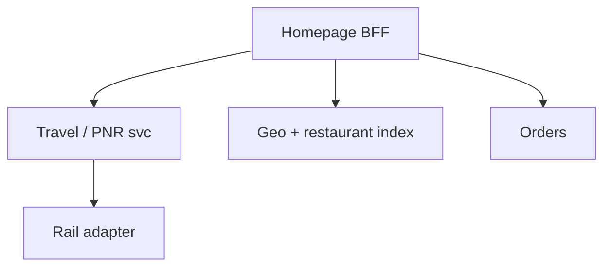
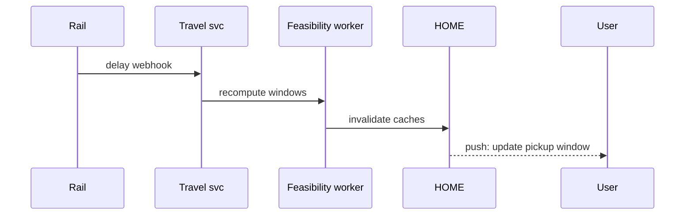

# HLD — Uber Eats Homepage / Delivery for Customer on Train (PNR + Station)

## Live interview opening (clarify first — bar raiser order)

*“I’ll **start by clarifying requirements**—scope, ambiguity, latency and scale expectations—then lock **FR/NFR**. **After** that, I’ll ground **user journey**, **consistency**, **commit/decision**, and **risks** so it’s clearly **derived from what we agreed**, then **scale** and **architecture**—and I’ll **pause after the diagram** for where you want depth.”*

> **Uber SDE-2 HLD — drive order in this doc:** **§1** clarify → FR → NFR → **Framing after requirements** (user journey, consistency, commit/decision anchors) → **§2** scale → **§3** core entities + APIs → **§4** architecture → **§5** deep dive and evolution → **§6** scaling → **§7** reliability → **§8** tradeoffs → **§9** observability and security → **§10** patterns → **Closing**. Treat **Human interaction** cue blocks (headings in this doc) as *spoken* cues—**paraphrase**; do not read every row. **Bar raiser** listens for **ownership**, **failure modes**, and **honest tradeoffs**. Canonical spine: [HLD-UBER-SDE2-INTERVIEW-SPINE.md](./HLD-UBER-SDE2-INTERVIEW-SPINE.md).

## Interview delivery (golden thread — live thinking)

Bar-raiser polish: **user-first**, **explicit consistency**, **bottleneck**, **evolution**, **UX trust**, **default opinion** (not endless “A or B”). Full template + habits: **[HLD-BAR-RAISER-PERFORMANCE-PACK.md](./HLD-BAR-RAISER-PERFORMANCE-PACK.md)** · **[HLD-MASTER-DELIVERY-GOLDEN-FLOW.md](./HLD-MASTER-DELIVERY-GOLDEN-FLOW.md)**.

| Say at the right time | What interviewers grade | In this guide |
|----------------------|---------------------------|---------------|
| **Opening** | Clarify before solution | **Above** — you **do not** assume requirements. |
| **User journey + consistency + decisions** | Derived, not memorized | **After Section 1**, block **Framing after requirements** — **before Section 2** (not before clarify). |
| **Bottleneck / evolution / UX** | Ops + trust | Same **Framing** block; deep numbers still in **Sections 5–7**. |
| **Strong opinion** | Defaults | **Section 8** tradeoffs — always *“I’d start with X because…”*. |

**Do not:** read tables line-by-line · put user journey **before** clarify · fence-sit.  
**Do:** clarify → FR/NFR → **then** grounded journey → diagram → deep dive where steered.

---

## 1. Clarify requirements

### 1.0 Live flow (how to open and steer)

#### Live voice (real interviewer room)

**Sound like you’re *deciding*, not reciting:** one idea per breath, then **pause**. Tables here are **backup**—if your eyes are down for more than a couple of seconds, you’ve slipped into reading the doc.

**Bridge phrases (mix naturally):** *“Let me **name the fork** first…”* · *“I’ll **default to X**—tell me if your bar is stricter.”* · *“The reason I ask is it changes **who owns the commit** / **what’s on the hot path**.”* · *“I’ll **over-answer** one layer, then stop—**where should I zoom**?”*

**Ping them (conversation, not monologue):** *“Does that match how you’d scope it?”* · *“If we only deep-dive one thing, is it **A** or **B**?”* (swap **A/B** for two tensions from *your* opening paragraph above.)

**This topic in one breath:** “Train+PNR is **feasibility + versions**—rail is **adapters**, not magic in the food core.”

**`Verbatim` / `Live` cues:** say a line **once**, then **rephrase** the next time—verbatim twice in a row reads *canned*.

**Opening (~once):** *“This extends **geo delivery** with **train context**: **PNR**, **route/stations**, **arrival window**, and **handoff** at a **station**; I’ll align **eligibility** (which stops are serviceable), **timing** (prep vs dwell time), then **APIs** and **architecture**. **Pause after the diagram**—**rail data**, **ETA**, or **trust**?”*

**When (HLD clock):** the **full user-journey script** lives **[just above §4](#user-journey-train-pnr)**—say it **once out loud** immediately **before** you draw the architecture diagram so the room is **user-first**. Optional: tee up **one clause** during clarify if you opened systems-heavy; don’t read the **whole** block twice.

**Thinking transitions:** *“Same spine as [11-hld-uber-eats-homepage.md](./11-hld-uber-eats-homepage.md)—but **location** is **derived from PNR + schedule**, not only GPS.”*

**Live rule:** **Paraphrase** §1–2 tables; don’t read every row. Go deep **only if they probe**.

### 1.1 Clarify

| Topic | Say it like this in the room |
|--------------------------|-------------------------------|
| **PNR trust** | “**I’d default verified PNR** with the **carrier** API for **trust**; **fallback** to **manual** station + time **only** with **clear UX disclosure** (risk banner, no silent downgrade).” |
| **Stations** | “**Static** station list per operator vs **live** platform changes?” |
| **Dwell** | “Minimum **minutes** at stop to **hand off** food?” |
| **Failure** | “Train **late**—**re-anchor** delivery stop or **cancel policy**?” |
| **Overlap** | “Is **standard home** still in scope on same **home API**?” |

**Micro-pauses:** *“So **context** is **PNR + itinerary**; **eligibility** is **station feasibility**; **commit** locks a **validated window**—got it.”*

#### Human interaction (clarify requirements — think out loud & evolve scope)

**Habit:** *“Train mode is **homepage + logistics**—if I don’t pin **PNR trust** and **delay policy**, I’ll draw the wrong **feasibility** box.”*

**Live:** *“I’m defaulting **verified PNR**; **manual** path only with **disclosure**—that’s a **product** call, not a cheat.”*

| Stage | Default | Evolve when… |
|-------|---------|----------------|
| **v1** | Manual station + static timetable | MVP |
| **v2** | Verified PNR + **delay stream** + feasibility workers | Trust + scale |
| **v3** | Multi-leg + partner menus | Network effects |

### 1.2 Functional requirements (FR) — after alignment, say this as "what we must build"

#### Human interaction (FR — after alignment)

**Habit:** *“Say the **three nouns**: **TravelContext**, **StopFeasibility**, **Order window**.”*

| FR area | Say it like this |
|---------|-------------------|
| **Context** | “User binds **PNR** (or ticket id); system resolves **train**, **direction**, **next stops**.” |
| **Station picker** | “Show **serviceable stations** ahead on route with **ETA to stop** + **order-by** cutoff.” |
| **Homepage** | “Same **sections** as standard home but **ranking** uses **station arrival** and **walk from platform** rules.” |
| **Order** | “Delivery address becomes **station + platform + time window** artifact.” |

**Core**

- **Default: carrier-verified PNR** where integrated; then **enrich** → **itinerary** + **live delays** (if available); **manual** path only with **disclosure** (aligns with clarify table).  
- Filter restaurants that can **prepare + dispatch** to meet **dwell window**.  
- **Countdown** UX driven by **schedule + delay** feed.

**Cross-ref:** Browse/rank/cache patterns in [11-hld-uber-eats-homepage.md](./11-hld-uber-eats-homepage.md); dispatch timing in [24-hld-food-delivery-order-dispatch.md](./24-hld-food-delivery-order-dispatch.md).

### 1.3 Non-functional requirements (NFR) — say as "how it must behave"

#### Human interaction (NFR — how it must behave)

**Live:** *“**Fail-closed** on uncertainty; **rail API** down means **degraded** with **honest** UX—see [UX](#ux-awareness-train-pnr).”*

| NFR | Say it like this |
|-----|------------------|
| **Correctness** | “**Never** promise delivery to a stop the train **won’t** reach in time **without** user reconfirm.” |
| **Latency** | “Home **p99** similar to standard; **PNR resolve** may be **cached**.” |
| **Availability** | “If **rail API** down—**degrade** to manual station + time **with disclosure**.” |

### 1.4 Invariants

**Invariant:** “A **checkout** or **commit** for **station delivery** includes a **validated service window** `(station_id, t_min, t_max)` that satisfies **restaurant prep + courier travel** constraints under **published delay assumptions**.”

## ⚖️ Consistency Model

Bar-raiser thread: *“What if **delay** changes **after** order?”*

Say it like this:

*“The system is **eventually consistent** on **live delays**, but:

- **Order commit** locks a **validated service window** that was **true at commit** (versioned **itinerary snapshot** on the order).  
- **Changes after commit** trigger a **re-evaluation workflow** (feasibility, restaurant, courier)—**never** a silent guarantee breach.  
- If we **can’t** hold the window, we **notify** the user and branch to **re-select station / widen window / cancel+comp** per **policy**—not a quiet miss.”*

**Purpose:** no second “clarify lecture”—only the **handoff** from answers → design.

| Beat | Say it like this |
|------|------------------|
| **Bridge** | “**PNR → itinerary → candidate stops → restaurant time feasibility**.” |
| **Core split** | “**Schedule truth** upstream; **marketplace** downstream.” |

### Key insight (say early)

**Train mode** is **eligibility + timing** on top of the same **read funnel** as homepage—**fail closed** when **uncertainty** exceeds **SLA**.

#### Key anchors

1. “**Feasibility check** before **show** orderable.”  
2. “**Recompute** on **delay events**.”  
3. “**Version** the **itinerary snapshot** on the **order**.”

---

## Framing after requirements (before scale + architecture)

**Placement in the room:** this block is **not** “right after clarify questions.” You earn it **after** you’ve locked **FR + NFR** (spoken summary is fine)—otherwise journey / consistency / commit boundaries read as **assuming** product and SLOs.

**Out loud:** *“We’ve **clarified** scope and I’ve stated **FR/NFR** from that—**based on that**, here’s the **user-visible path**, **consistency**, and **commit** I’ll hold before I size **Section 2** and draw **Section 4**.”*

### Thinking transitions (use during interview)

- *“Let me think through this…”*
- *“One tradeoff here is…”*
- *“If I optimize for latency…”*
- *“This might become a bottleneck because…”*
- *“I’d start simple here and evolve later…”*

## User journey (say once—**after** FR/NFR, not after clarify alone)

From the traveler’s perspective: enter **PNR** / train context → see **eligible station stops** and **service windows** → build cart → **checkout** for **station delivery** tied to an **itinerary snapshot**.

So:

- **read path** = resolve **schedule truth** + **candidate stops** + **feasibility** (restaurant prep + courier travel) before showing **orderable** UI.
- **write path** = **commit** order with **versioned `(station_id, t_min, t_max)`** window that was validated at commit time.
- **async path** = **delay events** (train late) → **re-evaluation workflow**—not silent guarantee changes.

## Consistency model

**Eventually consistent** on **live delays**; **commit** locks a **validated service window** true at commit (**versioned itinerary snapshot** on the order).

**Never** silently breach the window—if reality diverges, **notify** and branch per **policy** (re-select / widen / cancel+comp). Deeper thread: [§1.4 consistency model](#consistency-model-train-pnr).

## Commit boundary

Checkout **commits** only when the **feasibility check** passed for **`(station_id, t_min, t_max)`** under published delay assumptions—see **§1.4 invariant**.

## Decision (strong opinion)

I’d start with:

- **schedule / itinerary upstream** as **source of truth**; marketplace **fails closed** when uncertainty exceeds **SLA**.
- explicit **recompute** on **delay events** with user-visible **branching**.

because **train mode** is **eligibility + timing** on top of the same read funnel as browse—**trust** beats **optimistic** UX.

## Evolution

| Phase | Say it like this |
|-------|------------------|
| **1** | Simple implementation that ships. |
| **2** | Scaling: partitions, caches, queues, backpressure, observability. |
| **3** | Advanced / ML / global—only when metrics or product force it. |

Details: **Section 4.1 (phases)** and **Section 5** in this file.

## Bottleneck anchor

Watch first:

- **feasibility** CPU on tight windows + **delay** storm replans.
- **PNR / itinerary** read dependency availability.

## Backpressure handling

Under load:

- **narrow** offered windows or **pause** new station commits for unstable trains—**fail closed** with clear copy.
- **queue** re-evaluations; never **drop** user notification of breach.

Goal: **no silent miss** at the platform edge.

## UX awareness

Bad outcomes:

- food “promised” when train reality **can’t** support it.
- **silent** reschedule—users need explicit **policy** outcomes.

### Driving the conversation

- *“Does this direction make sense?”*
- *“Should I go deeper on **A** or **B**?”*
- *“Would you like failure scenarios next?”*

### Mindset

*“I’m not presenting a solution—I’m **designing with a teammate**.”*

**Playbook:** [HLD-BAR-RAISER-PERFORMANCE-PACK.md](./HLD-BAR-RAISER-PERFORMANCE-PACK.md).

---

## 2. Estimate scale

#### Human interaction (estimate scale)

**Live:** *“**PNR lookups** spike on holidays; **feasibility** is **CPU**-ish—**precompute** hot **train instances**.”*

| Dimension | Illustrative |
|-----------|----------------|
| PNR lookups / day | Smaller than total **Eats DAU** but **spiky** around travel holidays |
| Station catalog | **Thousands** per country—**CDN** friendly |

---

## 3. APIs and data model

### 3.0 Core entities (who owns what — say before API tables)

| Entity | Owns / lifecycle (one line) |
|--------|-----------------------------|
| **TravelContext** | **PNR/ticket** binding, **operator**, **ttl**, **status**. |
| **ItinerarySnapshot** | **Versioned** stops/times—**source** for feasibility + order lock. |
| **StopFeasibility** | **Which restaurants** can hit **which dwell window**—may be **precomputed**. |
| **Order** | **Handoff station** + **service window** artifact—**immutable** post-commit semantics per [⚖️](#consistency-model-train-pnr). |

#### Human interaction (API design — travel context + streaming delays)

**Live:** *“**POST travel-context** creates the binding; **GET stops** is the **product-critical** read; **SSE** for delays keeps **home** fresh without **polling** rail to death.”*

### 3.1 APIs (sketch)

| API | Purpose |
|-----|---------|
| `POST /v1/travel-contexts` | Bind PNR / ticket → `travel_context_id` |
| `GET /v1/travel-contexts/{id}/stops` | Serviceable upcoming stops + cutoffs |
| `GET /v1/home?travel_context_id=` | Homepage rail-aware |
| `GET /v1/itinerary/stream` | SSE/poll for **delays** |

### 3.2 Model

- **TravelContext:** `user_id`, `pnr_hash`, `operator`, `train_id`, `expires_at`, `status`.  
- **StopFeasibility:** `station_id`, `t_arrival_est`, `t_depart_est`, `serviceable_restaurant_ids` (precomputed or on demand).  
- **Order:** `travel_context_id`, `handoff_station_id`, `window`.

---

## 4. High-level architecture

### 👤 User journey (say once—before this diagram)

*“**User enters PNR** → system **fetches itinerary** → shows **upcoming serviceable stations** → user **selects a station** → sees **homepage** → **places order** → **delivery** happens in the **station dwell window**.

So:

- **context** = PNR + itinerary  
- **eligibility** = station feasibility  
- **delivery** = **timed handoff** at the platform window.”*

---

#### Human interaction (high-level architecture / HLD)

**Habit:** *“**Rail truth** in → **Travel** → **Home** reads **geo** like [11](./11-hld-uber-eats-homepage.md) but **rank** uses **station ETA**.”*

**Live:** *“Say [user journey](#user-journey-train-pnr) **once**, then this diagram: **TC** owns itinerary versions; **HOME** never silently widens a **committed** window.”*

### 4.1 Phases

| Phase | Ship |
|-------|------|
| **1** | Manual station + static timetable |
| **2** | **Verified** PNR + delay stream + feasibility |
| **3** | **Multi-leg** + **partner** exclusive menus |

---

## 👤 UX awareness

If **feasibility** becomes **uncertain** (delay, short dwell, kitchen slip), we **proactively notify** the user and offer **re-selection** of station/window or a **controlled cancel path**—**not** a silent delivery failure or a **moving goalpost** ETA with no audit trail.

---

## 5. Deep dive: delay → re-feasibility

#### Human interaction (deep dive — critical flow, optimizations & evolution)

**Habit:** *“Walk **delay event → version bump → feasibility → cache invalidation → user push**.”*

**Live (evolution):** *“**v1**: poll delays + **manual** reselect. **v2**: **webhook-driven** recompute + **targeted** invalidation. **v3**: **predictive** dwell risk scoring—still **notify** on any **commit** risk.”*

### 🎯 Bottleneck Anchor

“**Stale delay** + **tight dwell** → **missed handoff**—watch **feasibility recompute lag** and **push** to user.”

**Taking a stance:** *“**Orders in prep** get **automatic** **window widen** only if **restaurant+courier** still feasible—else **branch** to support playbook.”*

---

## 6. Scaling and bottlenecks

#### Human interaction (scaling & bottlenecks)

**Live:** *“**Rail rate limits** and **feasibility CPU** are the knobs—**cache** itinerary, **queue** heavy recompute, **shed** to shorter station list with **disclosure**.”*

| Risk | Mitigation |
|------|------------|
| **Rail API rate limits** | **Cache** itinerary; **webhook** push |
| **Feasibility CPU** | **Precompute** per **train instance** × **top stations** |

## 🚦 Feasibility Scaling (backpressure & load)

To handle **feasibility** load without melting **CPU** or **rail** quotas:

- **Precompute** feasibility for **top stations** / high-volume **corridors** (warm paths).  
- **Cache** results **per train instance** (or `(train_id, service_date, direction)`), keyed so **delay events** trigger **targeted invalidation**, not full recompute every read.  
- **Recompute** on **delay webhooks** and **meaningful schedule deltas**—not on every homepage **GET** (read path stays **thin**).  
- **Rate-limit** and **queue** heavy recompute; **shed** to **degraded** station list + disclosure if the feasibility tier is **overloaded** (see [UX awareness](#ux-awareness-train-pnr) above).

---

## 7. Reliability and failure handling

#### Human interaction (reliability & failure handling)

**Live:** *“**Invalid PNR** is a **clean** error; **missed stop** is a **support** workflow with **credit** policy—no **ghost** order states.”*

- **PNR invalid:** clear **error** + **fallback** to GPS home.  
- **Missed stop:** **no-show** policy; **credit** workflow.

---

## 8. Tradeoffs and alternatives

#### Human interaction (tradeoffs & alternatives)

**Live:** *“**Verified PNR** costs integration but buys **trust**; **GPS assist** saves UX when rail is down but isn’t **train mode**.”*

| Choice | Trade |
|--------|--------|
| **Verified PNR (default)** | **Trust** + fewer **false stops** vs **carrier integration** cost |
| **GPS assist** | Accuracy vs **battery** |

---

## 9. Monitoring, observability, and security

#### Human interaction (monitoring, observability & security)

**Habit:** *“I’d alert on **feasibility false positives** and **delay→push latency**—those are **missed handoff** precursors.”*

**Metrics:** PNR **verify success**, **feasibility false positive** rate (missed handoff), **delay** handling latency.  
**Security:** **PNR** is sensitive—**encrypt at rest**, **minimal** echo in logs.

---

## 10. Design patterns, data structures & best practices

#### Human interaction (design patterns, data structures & best practices)

**Verbatim (say on the board, ~30s):** *“**Adapter** per rail operator for **PNR verify** and **station master**; **event-driven** ingest for **delay webhooks**; **saga** or **process manager** for **re-anchor** when platforms change; **optimistic locking** on **order version**; **feasibility service** as **pure function** of **ETA + dwell**; **outbox** for **push** to rider when state changes.”*

**Live:** *“**Adapter**, **event-driven**, **saga** re-anchor—three anchors, then I’ll add **outbox** if they ask **reliability**.”*

| Pattern / DS | Where | One interview line |
|----------------|------|----------------------|
| **Adapter** | Operator integrations | “**IRCTC** vs **Deutsche Bahn** don’t leak into **core** order code.” |
| **Event-driven / webhook** | Delays | “Treat operator callbacks as **at-least-once**; **dedupe** by event id.” |
| **Saga / process manager** | Re-anchor | “**Compensate** or **re-plan** couriers when **platform** shifts.” |
| **State machine** | Order + handoff | “Explicit **states**: confirmed → at-station → **handoff window**.” |
| **Feasibility + version** | Core domain | “**False positive** feasibility is a **product** incident—I **version** decisions.” |
| **Transactional outbox** | Notifications | “Rider push **after** DB commit—no **ghost** messages.” |

**Live:** pick **five or six** rows; own **feasibility** honesty.

---

## Closing notes (where wrap-up human interaction lives)

#### Human interaction (closing notes)

**Live:** *“Train delivery is **feasibility + versions + honest degrade**—link back to [11](./11-hld-uber-eats-homepage.md) for read funnel, [24](./24-hld-food-delivery-order-dispatch.md) for dispatch timing.”*

Endgame is **short**, **confident**, and **conversational**: use the **Human interaction** subsections under [Bar-raiser](#bar-raiser-follow-ups), [Communication (do vs avoid)](#communication-do-vs-avoid), and [60-second close](#60-second-close)—not a second full design pass.

### Communication (do vs avoid)

| Do (sounds senior) | Avoid (sounds rehearsed) |
|--------------------|---------------------------|
| **Feasibility fail-closed** | Optimistic “we’ll make it” |
| **Link to homepage doc** | Rebuilding 11 from scratch in hour |

---

## Bar-raiser follow-ups

#### Human interaction (bar-raiser follow-ups)

| They ask | Say it like this |
|----------|------------------|
| **Fraud** | “**Velocity** limits on PNR changes; **device** binding.” |
| **Cross-border** | “**Operator** plugins + **currency** per **leg**.” |
| **Delay after commit** | “[Consistency model](#consistency-model-train-pnr): **re-evaluate**, **notify**, **re-select / cancel**—**no** silent guarantee.” |

---

## 60-second close

#### Human interaction (60-second close)

| Beat | Say it like this |
|------|------------------|
| **Recap** | “**User journey**: PNR → itinerary → **serviceable** stations → home → order → **timed handoff**. **Feasibility** precompute/cache + **recompute on delays**. **Consistency**: commit locks **versioned window**; post-commit delay → **workflow**, **notify**, never **silent** breach. **UX**: uncertain feasibility → **re-select**, not ghosting.” |

---
