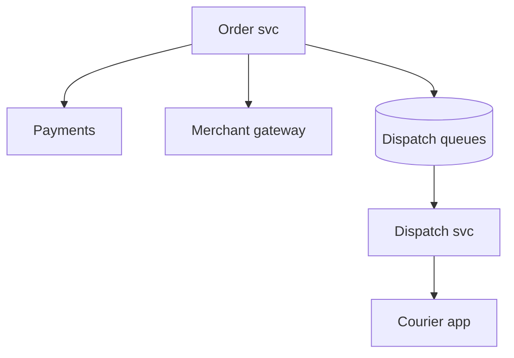
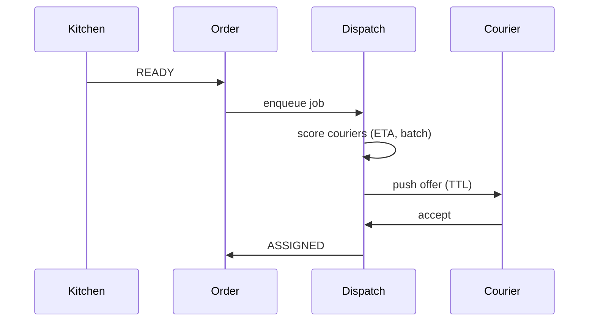

# HLD — Food Delivery / Restaurant Order Dispatching System

## Live interview opening (clarify first — bar raiser order)

*“I’ll **start by clarifying requirements**—scope, ambiguity, latency and scale expectations—then lock **FR/NFR**. **After** that, I’ll ground **user journey**, **consistency**, **commit/decision**, and **risks** so it’s clearly **derived from what we agreed**, then **scale** and **architecture**—and I’ll **pause after the diagram** for where you want depth.”*

> **Uber SDE-2 HLD — drive order in this doc:** **§1** clarify → FR → NFR → **Framing after requirements** (user journey, consistency, commit/decision anchors) → **§2** scale → **§3** core entities + APIs → **§4** architecture → **§5** deep dive and evolution → **§6** scaling → **§7** reliability → **§8** tradeoffs → **§9** observability and security → **§10** patterns → **Closing**. Treat **Human interaction** cue blocks (headings in this doc) as *spoken* cues—**paraphrase**; do not read every row. **Bar raiser** listens for **ownership**, **failure modes**, and **honest tradeoffs**. Canonical spine: [HLD-UBER-SDE2-INTERVIEW-SPINE.md](./HLD-UBER-SDE2-INTERVIEW-SPINE.md).

## Interview delivery (golden thread — live thinking)

Bar-raiser polish: **user-first**, **explicit consistency**, **bottleneck**, **evolution**, **UX trust**, **default opinion** (not endless “A or B”). Full template + habits: **[HLD-BAR-RAISER-PERFORMANCE-PACK.md](./HLD-BAR-RAISER-PERFORMANCE-PACK.md)** · **[HLD-MASTER-DELIVERY-GOLDEN-FLOW.md](./HLD-MASTER-DELIVERY-GOLDEN-FLOW.md)**.

| Say at the right time | What interviewers grade | In this guide |
|----------------------|---------------------------|---------------|
| **Opening** | Clarify before solution | **Above** — you **do not** assume requirements. |
| **User journey + consistency + decisions** | Derived, not memorized | **After Section 1**, block **Framing after requirements** — **before Section 2** (not before clarify). |
| **Bottleneck / evolution / UX** | Ops + trust | Same **Framing** block; deep numbers still in **Sections 5–7**. |
| **Strong opinion** | Defaults | **Section 8** tradeoffs — always *“I’d start with X because…”*. |

**Do not:** read tables line-by-line · put user journey **before** clarify · fence-sit.  
**Do:** clarify → FR/NFR → **then** grounded journey → diagram → deep dive where steered.

---

## 1. Clarify requirements

### 1.0 Live flow (how to open and steer)

#### Live voice (real interviewer room)

**Sound like you’re *deciding*, not reciting:** one idea per breath, then **pause**. Tables here are **backup**—if your eyes are down for more than a couple of seconds, you’ve slipped into reading the doc.

**Bridge phrases (mix naturally):** *“Let me **name the fork** first…”* · *“I’ll **default to X**—tell me if your bar is stricter.”* · *“The reason I ask is it changes **who owns the commit** / **what’s on the hot path**.”* · *“I’ll **over-answer** one layer, then stop—**where should I zoom**?”*

**Ping them (conversation, not monologue):** *“Does that match how you’d scope it?”* · *“If we only deep-dive one thing, is it **A** or **B**?”* (swap **A/B** for two tensions from *your* opening paragraph above.)

**This topic in one breath:** “Order dispatch is **state machines + assign lease**—I’ll own **courier staleness** and **double dispatch**.”

**`Verbatim` / `Live` cues:** say a line **once**, then **rephrase** the next time—verbatim twice in a row reads *canned*.

**Opening (~once):** *“I’ll align **merchant accept**, **prep time**, **courier assignment**, and **batching**; then **state machine**, **APIs**, **architecture**, and **dispatch deep dive**. **Pause after the diagram**—**courier matching**, **SLA**, or **failures**?”*

**Thinking transitions:** *“Three clocks: **customer promise**, **kitchen prep**, **courier travel**—dispatch **ties** them.”*

**Live rule:** **Paraphrase** §1–2 tables; don’t read every row. Go deep **only if they probe**.

**When (HLD clock):** the **full user-journey script** lives **[just above §4](#user-journey-food-dispatch)**—say it **once out loud** immediately **before** the architecture diagram so the room is **user-first**. Optional: **one clause** in clarify if you opened systems-heavy; don’t read the **whole** block twice.

### 1.1 Clarify

| Topic | Say it like this in the room |
|--------------------------|-------------------------------|
| **Promise** | “**ETA** shown at checkout—**hard** or **soft**?” |
| **Merchant** | “Auto-accept vs **manual confirm**?” |
| **Pooling** | “**Stacked** orders per courier?” |
| **Refund** | “Who owns **compensation** rules?” |

**Micro-pauses:** *“So **order** is **OLTP + pay**; **dispatch** is **async**; both paths **meet** at **pickup**—got it.”*

#### Human interaction (clarify requirements — think out loud & evolve scope)

**Habit:** *“Three clocks: **promise**, **prep**, **travel**—I align **merchant behavior** and **stacking** before I draw dispatch.”*

| Stage | Default | Evolve when… |
|-------|---------|----------------|
| **v1** | Single courier, **READY**-triggered offer | Simple |
| **v2** | **Prep-aware** send-to-store + **TTL** offers | Utilization pressure |
| **v3** | **Stacked** batches + **ML** ETA—still **[commit](#commit-boundary-food-dispatch)** gated | Scale |

### 1.2 Functional requirements (FR) — after alignment, say this as "what we must build"

#### Human interaction (FR — after alignment)

**Habit:** *“Say **order**, **merchant**, **dispatch job**, **courier**—who owns each **state** edge.”*

| FR area | Say it like this |
|---------|-------------------|
| **Order** | “Cart → **place** → pay → **Order** `CREATED`.” |
| **Restaurant** | “**Accept/reject**; **prep** signals **READY**.” |
| **Dispatch** | “Assign **courier**, **pickup → dropoff** navigation.” |
| **Delivery** | “**Handoff** proof (PIN/photo) if product requires.” |

**Core**

- Durable **order** with lines, fees, **promise window**.  
- **Restaurant tablet / POS** integration for **accept** and **prep**.  
- **Courier lifecycle**: offer → accept → at store → picked up → delivered.

### 1.3 Non-functional requirements (NFR) — say as "how it must behave"

#### Human interaction (NFR — how it must behave)

**Live:** *“**Place order** stays **thin**; **dispatch** scales **async**; **consistency** on **ASSIGNED** is **non-negotiable**.”*

| NFR | Say it like this |
|-----|------------------|
| **Latency** | “**Place order** **synchronous** minimal; **dispatch** **async** workers.” |
| **Consistency** | “**One courier** **committed** per assignment policy; **idempotent** webhooks.” |

### 1.4 Invariants

**Invariant:** “**Inventory / price** at **charge** time matches **captured snapshot** on the **order**; **dispatch commit** never assigns **same courier** to **conflicting** overlapping **pickups** without **stacking rules**.”

## 🔒 Commit Boundary

Bar-raiser thread: *“**When** is courier assignment **final**?”*

Say it like this:

*“**Dispatch proposes** offers, but **assignment commits** only when:

- **Courier accepts** within **offer TTL**.  
- **No conflicting** assignment exists for that courier (or stacking rules **explicitly** allow overlap).  
- **Order** (and courier) **state** transitions to **`ASSIGNED`** **atomically** with the **winning** offer—**not** on push alone.”*

## 🚗 Courier State Consistency

Bar-raiser thread: *“What if **courier availability** is **stale**?”*

Say it like this:

*“**Availability** is **eventually consistent** in the index, but we **re-validate** at **accept**:

- **TTL** on offers—stale proposals **expire**.  
- **Accept** path checks **capacity** / **conflicts** again against **authoritative dispatch** rules (not only **client cache**).  
- **Dispatch service** owns **final** consistency for **who is committed** to **which** orders; **courier app** is a **best-effort** view until **ack**.”*

**Purpose:** no second “clarify lecture”—only the **handoff** from answers → design.

| Beat | Say it like this |
|------|------------------|
| **Bridge** | “**OLTP order** + **async dispatch** **orchestration**.” |
| **Core split** | “**Restaurant path** and **courier path** **converge** at **pickup**.” |

### Key insight (say early)

**Orchestrated saga** with **timeouts** per party—**explicit** **compensation** (refund, re-offer courier, extend ETA).

#### Key anchors

1. “**Idempotent** merchant callbacks.”  
2. “**Dispatch queue** per **zone**.”  
3. “**READY** event triggers **courier offer**.”

---

## Framing after requirements (before scale + architecture)

**Placement in the room:** this block is **not** “right after clarify questions.” You earn it **after** you’ve locked **FR + NFR** (spoken summary is fine)—otherwise journey / consistency / commit boundaries read as **assuming** product and SLOs.

**Out loud:** *“We’ve **clarified** scope and I’ve stated **FR/NFR** from that—**based on that**, here’s the **user-visible path**, **consistency**, and **commit** I’ll hold before I size **Section 2** and draw **Section 4**.”*

### Thinking transitions (use during interview)

- *“Let me think through this…”*
- *“One tradeoff here is…”*
- *“If I optimize for latency…”*
- *“This might become a bottleneck because…”*
- *“I’d start simple here and evolve later…”*

## User journey (say once—**after** FR/NFR, not after clarify alone)

From the diner’s perspective: place order → restaurant **accepts/preps** → **READY** → **courier offers** → courier **accepts** → pickup → dropoff; failures → **refund / re-offer / extend ETA** per policy.

So:

- **write path** = **OLTP order** state machine + **idempotent** merchant callbacks + **dispatch orchestration** (**saga** with timeouts).
- **read path** = **order tracking** for user/support—**not** “truth” from push alone.
- **async path** = dispatch queues per **zone**, ETA recompute, notifications.

## Consistency model

**Dispatch service** owns **who is committed** to **which** orders; courier index is **eventually consistent** but **re-validated** at **accept** (TTL offers, conflict checks)—see [courier state](#courier-state-food-dispatch).

**Restaurant** and **courier** paths **converge** at pickup—orchestration must model **timeouts** and **compensation** explicitly.

## Commit boundary

**Assignment commits** only when **courier accepts** within **offer TTL**, **no conflicting** assignment (unless stacking rules allow), and order/courier state moves to **`ASSIGNED`** **atomically** with the winning offer—**not** on push alone. See [🔒 Commit boundary](#commit-boundary-food-dispatch) in this doc.

## Decision (strong opinion)

I’d start with:

- **zone-partitioned dispatch queues** + **READY-triggered** courier offers + **explicit saga** (not vibes).

because food is **money + time**; ambiguous ownership is how you get **double dispatch** and **cold food** fights.

## Evolution

| Phase | Say it like this |
|-------|------------------|
| **1** | Simple implementation that ships. |
| **2** | Scaling: partitions, caches, queues, backpressure, observability. |
| **3** | Advanced / ML / global—only when metrics or product force it. |

Details: **Section 4.1 (phases)** and **Section 5** in this file.

## Bottleneck anchor

Watch first:

- **dispatch decisions/sec** per metro (**zone shard** health).
- **READY → offer** latency and **offer TTL** storms at peak.

## Backpressure handling

Under load:

- widen **batching** of offers, **extend** prep estimates honestly, **re-offer** couriers—don’t **silent** drop orders.
- **shed** non-critical notifications before **assignment** correctness.

Goal: **one clear assignment story** over **fast-but-wrong** dispatch.

## UX awareness

Bad outcomes:

- rider told **assigned** when courier never accepted.
- restaurant **READY** never triggers courier—**stuck** states visible forever.

### Driving the conversation

- *“Does this direction make sense?”*
- *“Should I go deeper on **A** or **B**?”*
- *“Would you like failure scenarios next?”*

### Mindset

*“I’m not presenting a solution—I’m **designing with a teammate**.”*

**Playbook:** [HLD-BAR-RAISER-PERFORMANCE-PACK.md](./HLD-BAR-RAISER-PERFORMANCE-PACK.md).

---

## 2. Estimate scale

#### Human interaction (estimate scale)

**Live:** *“**Dispatch decisions/sec** per metro drive **zone sharding**—orders/day sets **OLTP** sizing.”*

| Dimension | Illustrative |
|-----------|----------------|
| Orders / day / metro | **100k+** large market |
| Dispatch decisions / sec | **High**—partition by **zone** |

---

## 3. APIs and data model

### 3.0 Core entities (who owns what — say before API tables)

| Entity | Owns / lifecycle (one line) |
|--------|-----------------------------|
| **Order** | **Durable** cart + **pricing snapshot** + **promise**—**OLTP**. |
| **Merchant session** | **Accept/reject**, **prep** signals—integrates via **webhooks**. |
| **DispatchJob** | **Zone**-partitioned work: offers, retries, **TTL**. |
| **Courier** | **Availability** index (eventually consistent) vs **committed** assignments. |

#### Human interaction (API design — webhooks, idempotency, internal assign)

**Live:** *“Merchant **callbacks** are **idempotent**; **`POST dispatch/assign`** is internal; **ASSIGNED** is **atomic** with **[commit rules](#commit-boundary-food-dispatch)**.”*

### 3.1 APIs

| API | Purpose |
|-----|---------|
| `POST /v1/orders` | Place (idempotent) |
| `POST /v1/orders/{id}/merchant/accept` | Webhook |
| `POST /v1/orders/{id}/prep/ready` | Kitchen signal |
| `POST /v1/dispatch/assign` | Internal |

### 3.2 Model

- **Order:** state, `promise_latest`, `restaurant_id`, `courier_id`, `pricing_snapshot`.  
- **DispatchJob:** `order_id`, attempts, `courier_offer_ttl`.

---

### 👤 User journey (say once—before this diagram)

*“**User places order** → **merchant accepts** → **kitchen prepares** → **READY** → system **assigns courier** → **pickup** → **delivery**.

So:

- **order path** = **OLTP** + **payment**  
- **dispatch path** = **async** matching / offers  
- **convergence** = **pickup** (restaurant and courier **meet** there).”*

---

## 4. High-level architecture

#### Human interaction (high-level architecture / HLD)

**Habit:** *“Say [user journey](#user-journey-food-dispatch) **once**, then: **Order** pays, **Dispatch** offers, **Courier** commits.”*

**Live:** *“**Zone** queues absorb **hotspot**; **backpressure** caps offers before **courier app** melts ([§6](#6-scaling-and-bottlenecks)).”*

### 4.1 Phases

| Phase | Ship |
|-------|------|
| **1** | Single courier, no batch |
| **2** | Stack + **prep-aware** dispatch |
| **3** | **ML** ETA + **cross-zone** signals (still **shard** dispatch **writes** by **zone**) |

---

## 👤 UX Awareness

If **dispatch** slips (no courier, queue depth, kitchen delay), **proactively** **push** an updated **ETA** / honest status and **notify** the customer—**not** a **silent** slip past the **promise** artifact. Pair with **compensation** policy when you cross a **hard** threshold.

---

## 5. Deep dive: READY → courier offer

#### Human interaction (deep dive — critical flow, optimizations & evolution)

**Habit:** *“Narrate **READY → enqueue → score → offer TTL → accept → ASSIGNED**.”*

**Live (evolution):** *“**v1**: nearest courier. **v2**: **prep-aware** send-to-store. **v3**: **stacking** with **hard** caps—still **[re-check courier](#courier-state-food-dispatch)** on accept.”*

### 🎯 Bottleneck Anchor

“**Courier supply** in **cell** at **rush** + **merchant READY jitter**—optimize **wait at store** vs **lateness**.”

**Taking a stance:** *“**Send-to-store** timing—courier **not** dispatched **too early** before **READY** unless **batch** efficiency wins.”*

---

## 6. Scaling and bottlenecks

#### Human interaction (scaling & bottlenecks)

**Live:** *“**Hot zone** → shard dispatch; **webhook dupes** → **idempotency**; **rush** → **[backpressure](#backpressure-food-dispatch)** on offers before dropping **assignability**.”*

| Risk | Mitigation |
|------|------------|
| **Hot zone** | Shard dispatchers; **courier** caps |
| **Webhook dupes** | **Idempotency keys** |

## 🚦 Backpressure Handling

If **dispatch** load **spikes** (rush, incident, bad deploy):

- **Cap** **concurrent offers** per **courier** and per **zone**—protect the **courier app** and **matching** workers.  
- **Prioritize** jobs by **promise deadline** (e.g. **priority queue** / **weighted** fair queue)—closest-to-breach **first**.  
- **Degrade** **batching** complexity (drop **stack** optimization before you drop **assignability** or **silence** users—see [UX awareness](#ux-awareness-food-dispatch)).

---

## 7. Reliability and failure handling

#### Human interaction (reliability & failure handling)

**Live:** *“**No courier** path is **product**: escalate incentive, **expand** radius, **honest** push—see [UX](#ux-awareness-food-dispatch).”*

- **No courier:** **escalate** fee, **expand radius**, **customer comms**.  
- **Merchant ghost:** **timeout** → cancel path.

---

## 8. Tradeoffs and alternatives

#### Human interaction (tradeoffs & alternatives)

**Live:** *“**Early assign** saves kitchen idle time but can **strand** couriers; **zone dispatch** is my **default** for **blast radius**.”*

| Choice | Trade |
|--------|--------|
| **Early assign courier** | Wait time vs **courier utilization** |
| **Central vs zone dispatch** | **I’d default zone-based distributed dispatch** for **latency** + **blast radius**; **central** optimizer only if product proves **global** wins justify **RTT** and **single choke point**—otherwise **shard** by **geo** and **sync aggregates async**. |

---

## 9. Monitoring, observability, and security

#### Human interaction (monitoring, observability & security)

**Habit:** *“**ready-to-assign** is the **canary** for marketplace health.”*

**Metrics:** **ready-to-assign** lag, **assign-to-pickup**, **lateness %**, **stack rate**.  
**Security:** **AuthZ** on **order** events; **anti-tamper** on **proof** of delivery.

---

## 10. Design patterns, data structures & best practices

#### Human interaction (design patterns, data structures & best practices)

**Verbatim (say on the board, ~30s):** *“**Saga** with **outbox** across **payment**, **merchant accept**, and **dispatch**; **dual state machines** on **order** and **courier** with explicit **ready-to-assign**; **priority queue** of jobs by **promise time** and **batching** for **stacked** deliveries; **idempotency** on assign; **zone-based** shard with **async** cross-zone **rebalance**.”*

**Live:** *“**Saga**, **state machines**, **priority queue**—then I’ll say **idempotency** on assign if they probe **double dispatch**.”*

| Pattern / DS | Where | One interview line |
|----------------|------|----------------------|
| **Saga + outbox** | Checkout / dispatch | “**Money** and **assignment** don’t rely on **best-effort** RPC.” |
| **State machine (order)** | Order svc | “**Illegal** transitions are **bugs**, not ‘edge cases’.” |
| **State machine (courier)** | Courier svc | “**Stale courier** is a **first-class** failure mode.” |
| **Priority queue / heap** | Dispatch worker | “**SLA breach** risk sorts higher than **FIFO** alone.” |
| **Batching / VRP-lite** | Route | “**Stack** orders when **ETA** slack allows—lift utilization.” |
| **Idempotency + lease** | Assign | “**Double assign** is **worse** than slow assign—I **lease** the job.” |

**Live:** pick **five or six** rows; own **commit boundary** + **courier staleness**.

---

## Closing notes (where wrap-up human interaction lives)

#### Human interaction (closing notes)

**Live:** *“Own **[commit](#commit-boundary-food-dispatch)**, **[courier staleness](#courier-state-food-dispatch)**, and **[backpressure](#backpressure-food-dispatch)**—that’s the SDE-2 story.”*

Endgame is **short**, **confident**, and **conversational**: drive the wrap from [Bar-raiser](#bar-raiser-follow-ups), [Communication (do vs avoid)](#communication-do-vs-avoid), and [60-second close](#60-second-close)—not a second full design pass.

### Communication (do vs avoid)

| Do (sounds senior) | Avoid (sounds rehearsed) |
|--------------------|---------------------------|
| **Prep-aware dispatch** | Courier idle at store always |
| **Promise artifact** | Moving ETA with no audit |

---

## Bar-raiser follow-ups

#### Human interaction (bar-raiser follow-ups)

| They ask | Say it like this |
|----------|------------------|
| **Robot / locker** | “Different **terminal state** + **PIN** handoff—same **saga** shape.” |
| **When is assignment final?** | “[Commit boundary](#commit-boundary-food-dispatch): **accept + TTL + atomic ASSIGNED**.” |
| **Stale courier GPS** | “[Courier state](#courier-state-food-dispatch): **re-check at accept**, **TTL offers**, **dispatch authoritative**.” |

---

## 60-second close

#### Human interaction (60-second close)

| Beat | Say it like this |
|------|------------------|
| **Recap** | “**Journey**: order → accept → prep → **READY** → assign → pickup → deliver. **Commit**: **ASSIGNED** only on **accept + TTL + no conflict**. **Dispatch**: **zone-based** default; **backpressure** on offers; **stale** courier → **re-validate** at accept. **UX**: **proactive** ETA when late.” |

---
