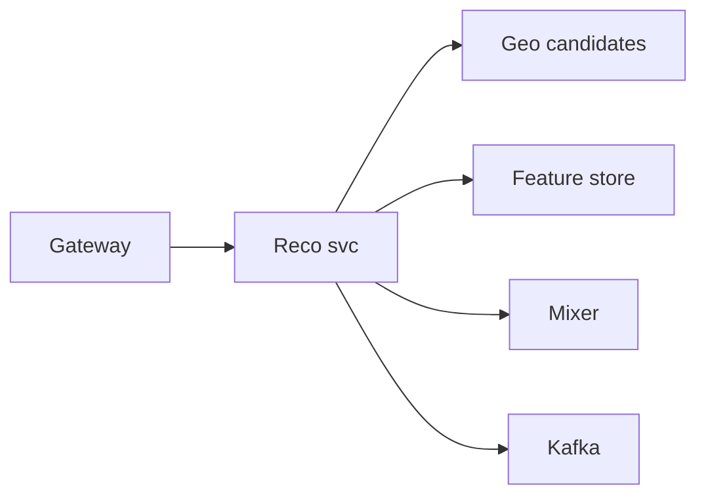
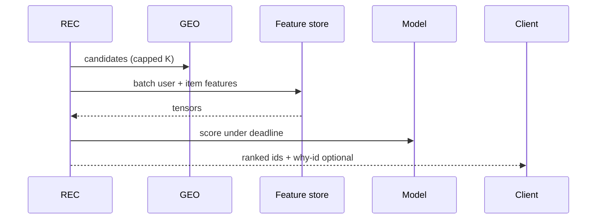

# HLD — Restaurant Recommendation System Based on User Location

## Live interview opening (clarify first — bar raiser order)

*“I’ll **start by clarifying requirements**—scope, ambiguity, latency and scale expectations—then lock **FR/NFR**. **After** that, I’ll ground **user journey**, **consistency**, **commit/decision**, and **risks** so it’s clearly **derived from what we agreed**, then **scale** and **architecture**—and I’ll **pause after the diagram** for where you want depth.”*

> **Uber SDE-2 HLD — drive order in this doc:** **§1** clarify → FR → NFR → **Framing after requirements** (user journey, consistency, commit/decision anchors) → **§2** scale → **§3** core entities + APIs → **§4** architecture → **§5** deep dive and evolution → **§6** scaling → **§7** reliability → **§8** tradeoffs → **§9** observability and security → **§10** patterns → **Closing**. Treat **Human interaction** cue blocks (headings in this doc) as *spoken* cues—**paraphrase**; do not read every row. **Bar raiser** listens for **ownership**, **failure modes**, and **honest tradeoffs**. Canonical spine: [HLD-UBER-SDE2-INTERVIEW-SPINE.md](./HLD-UBER-SDE2-INTERVIEW-SPINE.md).

## Interview delivery (golden thread — live thinking)

Bar-raiser polish: **user-first**, **explicit consistency**, **bottleneck**, **evolution**, **UX trust**, **default opinion** (not endless “A or B”). Full template + habits: **[HLD-BAR-RAISER-PERFORMANCE-PACK.md](./HLD-BAR-RAISER-PERFORMANCE-PACK.md)** · **[HLD-MASTER-DELIVERY-GOLDEN-FLOW.md](./HLD-MASTER-DELIVERY-GOLDEN-FLOW.md)**.

| Say at the right time | What interviewers grade | In this guide |
|----------------------|---------------------------|---------------|
| **Opening** | Clarify before solution | **Above** — you **do not** assume requirements. |
| **User journey + consistency + decisions** | Derived, not memorized | **After Section 1**, block **Framing after requirements** — **before Section 2** (not before clarify). |
| **Bottleneck / evolution / UX** | Ops + trust | Same **Framing** block; deep numbers still in **Sections 5–7**. |
| **Strong opinion** | Defaults | **Section 8** tradeoffs — always *“I’d start with X because…”*. |

**Do not:** read tables line-by-line · put user journey **before** clarify · fence-sit.  
**Do:** clarify → FR/NFR → **then** grounded journey → diagram → deep dive where steered.

---

## 1. Clarify requirements

### 1.0 Live flow (how to open and steer)

#### Live voice (real interviewer room)

**Sound like you’re *deciding*, not reciting:** one idea per breath, then **pause**. Tables here are **backup**—if your eyes are down for more than a couple of seconds, you’ve slipped into reading the doc.

**Bridge phrases (mix naturally):** *“Let me **name the fork** first…”* · *“I’ll **default to X**—tell me if your bar is stricter.”* · *“The reason I ask is it changes **who owns the commit** / **what’s on the hot path**.”* · *“I’ll **over-answer** one layer, then stop—**where should I zoom**?”*

**Ping them (conversation, not monologue):** *“Does that match how you’d scope it?”* · *“If we only deep-dive one thing, is it **A** or **B**?”* (swap **A/B** for two tensions from *your* opening paragraph above.)

**This topic in one breath:** “Reco is **eligible near you first**, model second—otherwise ML hides bad geo.”

**`Verbatim` / `Live` cues:** say a line **once**, then **rephrase** the next time—verbatim twice in a row reads *canned*.

**Opening (~once):** *“I’ll treat this as **ranking under latency**: **geo eligibility**, **personalization**, **cold start**, **experiments**; then **features**, **serving**, **architecture**. **Pause after the diagram**—**features**, **fairness**, or **infra**?”*

**Thinking transitions:** *“Same **read funnel** as homepage—**candidates** capped before **model**.”* (See [11-hld-uber-eats-homepage.md](./11-hld-uber-eats-homepage.md).)

**Live rule:** **Paraphrase** §1–2 tables; don’t read every row. Go deep **only if they probe**.

**When (HLD clock):** the **user-journey script** lives **[just above §4](#user-journey-reco-25)**—say it **once** immediately **before** the architecture diagram so the feed is **user-first**. Optional: **one clause** in clarify if you opened model-first.

### 1.1 Clarify

| Topic | Say it like this in the room |
|--------------------------|-------------------------------|
| **Surface** | “**Home rail**, **search zero-query**, **email**—which?” |
| **Objective** | “**GMV**, **CTR**, **diversity**?” |
| **Privacy** | “**Precise** lat vs **neighborhood** features?” |
| **Sponsored** | “**Mixer** slot?” |

**Micro-pauses:** *“So **retrieval** is **geo candidates**, **rank** is **model + mixer**, and **correctness** is **eligibility**—got it.”*

#### Human interaction (clarify requirements — think out loud & evolve scope)

**Habit:** *“Reco is **ranking under latency**—I pin **objective**, **privacy**, and **sponsored** before **embedding** dimensions.”*

| Stage | Default | Evolve when… |
|-------|---------|----------------|
| **v1** | Heuristic / distance | Cold start |
| **v2** | **GBDT** + feature logging | Quality + debuggability |
| **v3** | **Two-tower** + online learning | Candidate scale |

### 1.2 Functional requirements (FR) — after alignment, say this as "what we must build"

#### Human interaction (FR — after alignment)

**Habit:** *“**Retrieve → feature → score → mixer → log**—say it once.”*

| FR area | Say it like this |
|---------|-------------------|
| **Candidates** | “From **geo index**, pull **eligible** restaurants in **radius/cells**.” |
| **Features** | “User history, **context** (time, weather), **distance**, **popularity**, **merchant** quality.” |
| **Rank** | “Score + **mixer** + **diversity** constraints.” |
| **Log** | “**Impression/click** for **training** and **fairness** audits.” |

### 1.3 Non-functional requirements (NFR) — say as "how it must behave"

#### Human interaction (NFR — how it must behave)

**Live:** *“**Time-box** rank; **fallback** is a **product-safe** list, not random.”*

| NFR | Say it like this |
|-----|------------------|
| **Latency** | “**Time-box** rank; **fallback** to **distance + popularity**.” |
| **Freshness** | “**Feature** lag **seconds–minutes** acceptable for many signals.” |

### 1.4 Invariants

**Invariant:** “**Recommended** restaurants are always **hard-eligible** to serve the user’s **delivery context**; **rank order** may degrade.”

## ⚖️ Consistency Model

Bar-raiser thread: *“**How fresh** are recommendations?”*

Say it like this:

*“Recommendations are **eventually consistent**:

- **Eligibility** is **always correct** (hard filter—never **ML-overridden**).  
- **Features** may be **slightly stale** (**seconds–minutes**) for many signals—**bounded** and **observed**.  
- **Model outputs** are designed to **tolerate** that lag (**fallback** ranker, **time-box**, **versioned** features).”*

**Purpose:** no second “clarify lecture”—only the **handoff** from answers → design.

| Beat | Say it like this |
|------|------------------|
| **Bridge** | “**I’d start with GBDT** for **interpretability** and **shipping** speed; **move to two-tower** at **scale** when **retrieval** + **embedding** efficiency dominates—**serving** shape (**cap K → features → score → mixer**) stays the same.” |
| **Core split** | “**Offline training** vs **online feature log** vs **real-time** retrieval.” |

### Key insight (say early)

**Location** enters as **both hard filter** and **soft feature**—never let model **override** **ineligibility**.

#### Key anchors

1. “**Cap K**.”  
2. “**Feature store** with **point-in-time** correctness story.”  
3. “**Exploration** slots.”

---

## Framing after requirements (before scale + architecture)

**Placement in the room:** this block is **not** “right after clarify questions.” You earn it **after** you’ve locked **FR + NFR** (spoken summary is fine)—otherwise journey / consistency / commit boundaries read as **assuming** product and SLOs.

**Out loud:** *“We’ve **clarified** scope and I’ve stated **FR/NFR** from that—**based on that**, here’s the **user-visible path**, **consistency**, and **commit** I’ll hold before I size **Section 2** and draw **Section 4**.”*

### Thinking transitions (use during interview)

- *“Let me think through this…”*
- *“One tradeoff here is…”*
- *“If I optimize for latency…”*
- *“This might become a bottleneck because…”*
- *“I’d start simple here and evolve later…”*

## User journey (say once—**after** FR/NFR, not after clarify alone)

From the diner’s perspective: open app at a **location** → see **recommended** restaurants nearby → tap through to menu; impressions/clicks feed **feedback** asynchronously.

So:

- **read path** = **geo hard filter** + **retrieve top-K** candidates + **feature fetch** + **score** + optional **mixer** (promos/explore slots).
- **write path** (for reco) = mostly **telemetry** + **offline training** publishing new **model/version** artifacts—not on the **p99** rank hot path.
- **async path** = feature backfills, **point-in-time** training data, **shadow** model rollout.

## Consistency model

**Eligibility** (zone, hours, compliance) is **always correct**—**never** let the model **override** **ineligibility**.

**Features** / model outputs can be **eventually consistent** with **bounded lag**; ranker must **time-box** and **fallback** (e.g. popularity) when features are stale—align with **§1** consistency narrative in this guide.

## Commit boundary

A **rank response** “commits” when:

- you’ve applied **hard filters** on the candidate set for this user/context.
- scoring finished **or** **deadline hit** → **fallback rank**—same pattern as homepage **eligibility vs rank**.

## Decision (strong opinion)

I’d start with:

- **GBDT** (or similar) for **interpretability** + ship speed; **two-tower** when **retrieval** at scale dominates—keep **cap K → features → score → mixer** shape stable.

because **location** is both **hard filter** and **soft signal**—get the filter story boring first.

## Evolution

| Phase | Say it like this |
|-------|------------------|
| **1** | Simple implementation that ships. |
| **2** | Scaling: partitions, caches, queues, backpressure, observability. |
| **3** | Advanced / ML / global—only when metrics or product force it. |

Details: **Section 4.1 (phases)** and **Section 5** in this file.

## Bottleneck anchor

Watch first:

- **feature fan-out** cardinality at rank QPS.
- **mixer** + **exploration** slots under **p99** budget.

## Backpressure handling

Under load:

- **lower K**, skip **personalization** layers, **fallback** ranker.
- **throttle** exploration if it risks **latency** or **bad** tail outcomes.

Goal: **safe list** (eligible only) over **clever** but **wrong** recommendations.

## UX awareness

Bad outcomes:

- recommending **closed** or **out-of-zone** merchants.
- **stale** scores causing weird ordering—prefer honest **defaults**.

### Driving the conversation

- *“Does this direction make sense?”*
- *“Should I go deeper on **A** or **B**?”*
- *“Would you like failure scenarios next?”*

### Mindset

*“I’m not presenting a solution—I’m **designing with a teammate**.”*

**Playbook:** [HLD-BAR-RAISER-PERFORMANCE-PACK.md](./HLD-BAR-RAISER-PERFORMANCE-PACK.md).

---

## 2. Estimate scale

#### Human interaction (estimate scale)

**Live:** *“Rank **QPS** tracks **home**; **feature cardinality** drives **fan-out**—**cap K** early.”*

| Dimension | Illustrative |
|-----------|----------------|
| Rank QPS | Same order as **homepage** reads |
| Feature cardinality | **High**—**sparse** embeddings |

---

## 3. APIs and data model

### 3.0 Core entities (who owns what — say before API tables)

| Entity | Owns / lifecycle (one line) |
|--------|-----------------------------|
| **UserContext** | **Privacy**-safe location bucket + session. |
| **RestaurantItem** | **Catalog** features + **eligibility** flags. |
| **CandidateSet** | **Geo retrieval** output—**capped K**. |
| **RankedList** | **Model + mixer** output + **impression id**. |
| **TrainingLog** | **Impression/click** events—**async**. |

#### Human interaction (API design — read API + async logging)

**Live:** *“**GET reco** is synchronous to a **deadline**; **`POST events`** is **async**—never block **p99** on logging.”*

### 3.1 APIs

| API | Purpose |
|-----|---------|
| `GET /v1/reco/restaurants?lat=&lng=&user_id=` | Ranked list |
| `POST /v1/reco/events` | Impression/click (async) |

### 3.2 Features (examples)

- **Geo:** distance, cell id, **traffic** band.  
- **User:** **order history**, dietary, **LTV**.  
- **Item:** rating, **prep time**, **popularity**, **new** flag.

---

## 4. High-level architecture

### 👤 User journey (say once—before this diagram)

*“**User opens app** → system **fetches nearby** restaurants → **filters eligible** → **ranks** with **personalization** → **returns feed**.

So:

- **retrieval** = **geo** candidates  
- **ranking** = **ML** + **mixer**  
- **correctness** = **eligibility**.”*

---

#### Human interaction (high-level architecture / HLD)

**Habit:** *“Say [journey](#user-journey-reco-25) then boxes: **GEO → FS → Model → Mixer → LOG**.”*

**Live:** *“**Mixer** owns **sponsored** + **diversity** without breaking **[eligibility invariant](#consistency-model-reco-25)**.”*

### 4.1 Phases

| Phase | Ship |
|-------|------|
| **1** | Heuristic rank |
| **2** | **GBDT** + logged **features** + **batch** train (default **interpretable** path) |
| **3** | **Two-tower** + **online** learning (**after** GBDT baseline proves **traffic**) |

---

## 👤 UX Awareness

If the feed feels **repetitive** or **biased**, **trust** drops—so we **enforce** **diversity** and **exploration** slots in the **mixer** (and **watch** impression share for **cold** merchants). Pair with **transparent** “why” only if product wants it—**never** at the cost of **p99**.

---

## 5. Deep dive: rank request

#### Human interaction (deep dive — critical flow, optimizations & evolution)

**Habit:** *“Sequence **GEO cap K → batch feature fetch → score under deadline → mixer**.”*

**Live (evolution):** *“**v1** heuristics. **v2** GBDT + logged features. **v3** two-tower retrieval—**serving skeleton** unchanged.”*

### 🎯 Bottleneck Anchor

“**Feature fetch fan-out** (K × features) and **model p99**—**batch** embeddings, **deadline** + **fallback**.”

---

## 6. Scaling and bottlenecks

#### Human interaction (scaling & bottlenecks)

**Live:** *“**Hot user** embeddings and **model bulkhead**—**fallback ranker** is production, not shame.”*

| Risk | Mitigation |
|------|------------|
| **Hot user** | **Cache** user embedding |
| **Model OOM** | **Bulkhead** + **fallback** ranker |

---

## 7. Reliability and failure handling

#### Human interaction (reliability & failure handling)

**Live:** *“**Missed features** → **defaults** + **down-rank**; **model timeout** → **heuristic**—user still sees **eligible** food.”*

- **Feature store miss:** **default** features; **down-rank** unknowns.  
- **Model timeout:** **heuristic** sort.

---

## 8. Tradeoffs and alternatives

#### Human interaction (tradeoffs & alternatives)

**Live:** *“**Personalization** vs **bubble** is a **mixer** + **metrics** problem—call it explicitly.”*

| Choice | Trade |
|--------|--------|
| **Heavy personalization** | Engagement vs **filter bubble** |
| **GBDT → two-tower** | **GBDT** first for **debuggability** / **ops**; **two-tower** when **candidate scale** + **latency** force **approximate** retrieval—**cost** is **complexity** + **freshness** of **cross** terms |

---

## 9. Monitoring, observability, and security

#### Human interaction (monitoring, observability & security)

**Habit:** *“Slice **CTR** by **distance decile** to catch **geo bugs** early.”*

**Metrics:** **p99** rank latency, **fallback** rate, **new merchant** impression share, **CTR** slice by **distance decile**.  
**Security:** **No** cross-user **feature** leaks; **PII** in **feature store** encrypted.

---

## 10. Design patterns, data structures & best practices

#### Human interaction (design patterns, data structures & best practices)

**Verbatim (say on the board, ~30s):** *“**Eligibility before model**—geo and hours are **hard filters**; then **two-stage retrieve + rank** with **GBDT** or **two-tower** embeddings; **mixer** for sponsored vs organic; **contextual bandits** for exploration; **cache-aside** on the **feature store**; **deadline + fallback** when the ranker is slow.”*

**Live:** *“**Mixer**, **bandits**, **cache-aside**—tie to **Reco**, **FS**, **GEO** boxes.”*

| Pattern / DS | Where | One interview line |
|----------------|------|----------------------|
| **Retrieve → rank (funnel)** | Reco svc | “**Thousands → hundreds → dozens** under a **latency** budget.” |
| **Mixer / Decorator** | Feed assembly | “Organic first, **caps** on sponsored adjacency for **trust**.” |
| **Contextual bandit / ε-greedy** | Exploration | “Cold-start gets **explore** with **guardrails** on distance.” |
| **Cache-aside + TTL** | Feature store | “Features can be **seconds stale**; **eligibility** cannot.” |
| **Two-tower / ANN (later)** | Candidate gen | “When **catalog** explodes, **ANN** replaces brute force k-NN.” |
| **Deadline + fallback** | Rank path | “Miss the **SLO** → heuristic sort by distance + rating.” |

**Live:** pick **five or six** rows; **eligibility-first** is the bar-raiser line.

---

## Closing notes (where wrap-up human interaction lives)

#### Human interaction (closing notes)

**Live:** *“**Eligibility** beats **model**; **GBDT→two-tower** is an **evolution**, not a rewrite.”*

Endgame is **short**, **confident**, and **conversational**: drive the wrap from [Bar-raiser](#bar-raiser-follow-ups), [Communication (do vs avoid)](#communication-do-vs-avoid), and [60-second close](#60-second-close)—not a second full design pass.

### Communication (do vs avoid)

| Do (sounds senior) | Avoid (sounds rehearsed) |
|--------------------|---------------------------|
| **Eligibility before model** | “ML fixes bad zone” |
| **Time-box** | 10 min on **embedding dim** |

---

## Bar-raiser follow-ups

#### Human interaction (bar-raiser follow-ups)

| They ask | Say it like this |
|----------|------------------|
| **Counterfactual** | “**Logging policy** bias—**IPS** corrections / **randomized** buckets.” |
| **How fresh is reco?** | “[Consistency model](#consistency-model-reco-25): **eligibility** strict; **features** **seconds–minutes** stale **bounded**; **fallback** + **deadline**.” |
| **Filter bubble** | “[UX awareness](#ux-awareness-reco-25): **diversity** + **exploration** in **mixer**, **metrics** on **share**.” |

---

## 60-second close

#### Human interaction (60-second close)

| Beat | Say it like this |
|------|------------------|
| **Recap** | “**Journey**: open → nearby → **eligible** → rank → feed. **Consistency**: **hard eligibility**; **feature lag** OK **bounded**; **tolerate** in model + **fallback**. **Model path**: **GBDT** first → **two-tower** at scale. **UX**: **diversity** / **exploration** for **trust**.” |

---
