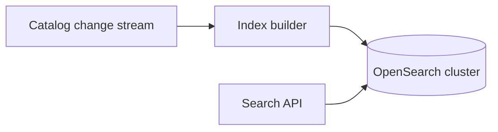
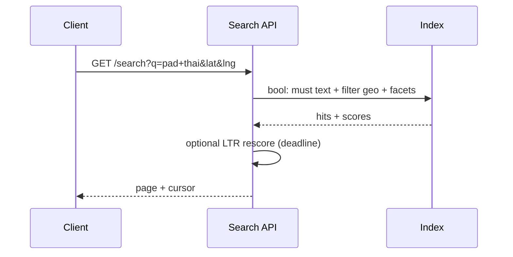

# HLD — Restaurant Search / Nearby Restaurants Service

## Live interview opening (clarify first — bar raiser order)

*“I’ll **start by clarifying requirements**—scope, ambiguity, latency and scale expectations—then lock **FR/NFR**. **After** that, I’ll ground **user journey**, **consistency**, **commit/decision**, and **risks** so it’s clearly **derived from what we agreed**, then **scale** and **architecture**—and I’ll **pause after the diagram** for where you want depth.”*

<a id="interview-spine-nine-steps"></a>

> **Uber SDE-2 HLD — drive order in this doc:** **§1** clarify → FR → NFR → **Framing after requirements** (user journey, consistency, commit/decision anchors) → **§2** scale → **§3** core entities + APIs → **§4** architecture → **§5** deep dive and evolution → **§6** scaling → **§7** reliability → **§8** tradeoffs → **§9** observability and security → **§10** patterns → **Closing**. Treat **Human interaction** cue blocks (headings in this doc) as *spoken* cues—**paraphrase**; do not read every row. **Bar raiser** listens for **ownership**, **failure modes**, and **honest tradeoffs**. Canonical spine: [HLD-UBER-SDE2-INTERVIEW-SPINE.md](./HLD-UBER-SDE2-INTERVIEW-SPINE.md).

## Interview delivery (golden thread — live thinking)

Bar-raiser polish: **user-first**, **explicit consistency**, **bottleneck**, **evolution**, **UX trust**, **default opinion** (not endless “A or B”). Full template + habits: **[HLD-BAR-RAISER-PERFORMANCE-PACK.md](./HLD-BAR-RAISER-PERFORMANCE-PACK.md)** · **[HLD-MASTER-DELIVERY-GOLDEN-FLOW.md](./HLD-MASTER-DELIVERY-GOLDEN-FLOW.md)**.

| Say at the right time | What interviewers grade | In this guide |
|----------------------|---------------------------|---------------|
| **Opening** | Clarify before solution | **Above** — you **do not** assume requirements. |
| **User journey + consistency + decisions** | Derived, not memorized | **After Section 1**, block **Framing after requirements** — **before Section 2** (not before clarify). |
| **Bottleneck / evolution / UX** | Ops + trust | Same **Framing** block; deep numbers still in **Sections 5–7**. |
| **Strong opinion** | Defaults | **Section 8** tradeoffs — always *“I’d start with X because…”*. |

**Do not:** read tables line-by-line · put user journey **before** clarify · fence-sit.  
**Do:** clarify → FR/NFR → **then** grounded journey → diagram → deep dive where steered.

---

## 1. Clarify requirements

### 1.0 Live flow (how to open and steer)

<a id="live-flow-open"></a>

#### Live voice (real interviewer room)

**Sound like you’re *deciding*, not reciting:** one idea per breath, then **pause**. Tables here are **backup**—if your eyes are down for more than a couple of seconds, you’ve slipped into reading the doc.

**Bridge phrases (mix naturally):** *“Let me **name the fork** first…”* · *“I’ll **default to X**—tell me if your bar is stricter.”* · *“The reason I ask is it changes **who owns the commit** / **what’s on the hot path**.”* · *“I’ll **over-answer** one layer, then stop—**where should I zoom**?”*

**Ping them (conversation, not monologue):** *“Does that match how you’d scope it?”* · *“If we only deep-dive one thing, is it **A** or **B**?”* (swap **A/B** for two tensions from *your* opening paragraph above.)

**This topic in one breath:** “Restaurant search is **text recall then hard geo**—I’ll say **honest null** beats far viral hits.”

**`Verbatim` / `Live` cues:** say a line **once**, then **rephrase** the next time—verbatim twice in a row reads *canned*.

**Opening (~once):** *“I’ll separate **keyword + facets** from **geo filter**; align on **open now**, **sort** (distance vs relevance), and **pagination**; then **index**, **query path**, **architecture**. **Pause after the diagram**—**inverted index**, **geo**, or **ranking**?”*

**Thinking transitions:** *“**Search** is not `LIKE` in SQL—**OpenSearch**-shaped at scale.”*

**Live rule:** **Paraphrase** §1–2 tables; don’t read every row. Go deep **only if they probe**.

**When (HLD clock):** the **user-journey script** lives **[just above §4](#user-journey-search-26)**—say it **once** immediately **before** the architecture diagram so search is **user-first**. Optional: **one clause** in clarify if you opened index-first.

<a id="say-1-questions-human"></a>
### 1.1 Clarify

| Topic | Say it like this in the room |
|--------------------------|-------------------------------|
| **Language** | “**Stemming**, **synonyms** (cuisine aliases)?” |
| **Geo** | “**Radius** vs **polygon** delivery zone?” |
| **Sort** | “**Best match** vs **distance** default?” |
| **Sponsored** | “**Ad** injection point?” |

**Micro-pauses:** *“So **retrieval** is **inverted index**, **filtering** is **geo + facets**, **rank** is **relevance** (+ optional **rescore**)—got it.”*

#### Human interaction (clarify requirements — think out loud & evolve scope)

**Habit:** *“Search is **index + query DSL + ranking**—I align **synonyms**, **geo model**, and **sponsored** before shards.”*

| Stage | Default | Evolve when… |
|-------|---------|----------------|
| **v1** | Single shard BM25 + geo filter | MVP |
| **v2** | Facets + **LTR** rescore + **CDC** | Quality |
| **v3** | Per-market federation | Global scale |

### 1.2 Functional requirements (FR) — after alignment, say this as "what we must build"

<a id="say-fr-human"></a>

#### Human interaction (FR — after alignment)

**Habit:** *“**Query + filters + pagination**—snippets are **denormalized** for UI speed.”*

| FR area | Say it like this |
|---------|-------------------|
| **Query** | “Text + optional **filters**: cuisine, price, rating, fee, open.” |
| **Geo** | “Results constrained to **serviceable** from user point.” |
| **Snippets** | “Return **card** fields for list UI.” |
| **Pagination** | “**Keyset** by `(score, id)` or `(distance, id)`.” |

### 1.3 Non-functional requirements (NFR) — say as "how it must behave"

<a id="say-nfr-human"></a>

#### Human interaction (NFR — how it must behave)

**Live:** *“**p99** beats perfect recall in browse—**cap fuzziness**.”*

| NFR | Say it like this |
|-----|------------------|
| **Latency** | “**p99** **sub-200ms** typical target (confirm)—**cache** hot queries.” |
| **Recall** | “**Synonym** and **fuzzy** configurable.” |

### 1.4 Invariants

**Invariant:** “Every hit satisfies **geo + eligibility** predicates attached to the **query**; **relevance score** never **bypasses** those filters.”

<a id="consistency-model-search-26"></a>

## ⚖️ Consistency Model

Bar-raiser thread: *“**How fresh** is search?”*

Say it like this:

*“**Search** is **eventually consistent**:

- **Index updates lag** behind **OLTP** / catalog (nearline **CDC**).  
- **Eligibility** (**geo**, **zones**, **open now**) is still **enforced at query time** on the **serving** path—never trust the index alone if product says otherwise.  
- **Stale** snippets / hours / promos are **acceptable within bounds**—**label** or **SLO** index lag; **hard** errors **degrade** with **honest** partial results.”*

<a id="say-voice-1"></a>

**Purpose:** no second “clarify lecture”—only the **handoff** from answers → design.

| Beat | Say it like this |
|------|------------------|
| **Bridge** | “**Inverted index** for text; **spatial** filter for geo; **join** on **restaurant id**.” |
| **Core split** | “**Index build** offline/nearline; **serving** **stateless**.” |

<a id="key-insight-say-early"></a>
### Key insight (say early)

**Unified document** per restaurant in the search index: **text fields**, **facets**, **geo point**, **hours**, **popularity** denorm—**one query** to **serving**.

#### Key anchors

1. “**Geo prefilter** or **combined** field—pick one and defend **latency**.”  
2. “**Replication** per region.”  
3. “**Personalization** as **rescore** layer optional.”

---

## Framing after requirements (before scale + architecture)

**Placement in the room:** this block is **not** “right after clarify questions.” You earn it **after** you’ve locked **FR + NFR** (spoken summary is fine)—otherwise journey / consistency / commit boundaries read as **assuming** product and SLOs.

**Out loud:** *“We’ve **clarified** scope and I’ve stated **FR/NFR** from that—**based on that**, here’s the **user-visible path**, **consistency**, and **commit** I’ll hold before I size **Section 2** and draw **Section 4**.”*

### Thinking transitions (use during interview)

- *“Let me think through this…”*
- *“One tradeoff here is…”*
- *“If I optimize for latency…”*
- *“This might become a bottleneck because…”*
- *“I’d start simple here and evolve later…”*

## User journey (say once—**after** FR/NFR, not after clarify alone)

From the diner’s perspective: type **query** + filters → see **nearby** results on a map/list → refine sort/radius → open restaurant detail.

So:

- **read path** = **geo filter** + **inverted index** text hit + **join** on unified **restaurant doc** (text + facets + geo + hours + popularity denorm) → **one** serving query where possible.
- **write path** = catalog/merchant updates → **CDC / nearline** index build (not on user read hot path).
- **async path** = segment merge, personalization **rescore** (optional), A/B.

## Consistency model

**Index** can **lag** OLTP; **eligibility** (**geo**, **zones**, **open now**) still enforced at **query time** on serving if product demands—**never** trust index alone for **hard** trust when §1 says otherwise.

**Degrade** with **honest** partial results on hard errors; **stale** snippets/hours within **bounded SLO**—**label** if UX needs it.

## Commit boundary

A search page is “good enough” when:

- **authz** + **geo** constraints applied to every hit returned.
- you respected **timeout / scan budget**—return **partial** + **cursor** vs hanging.

## Decision (strong opinion)

I’d start with:

- **unified restaurant document** in the index (**text + facets + geo + hours**).
- **geo prefilter** vs **combined field**—pick one and defend **latency**; **replicate** per region.

because **meal-peak QPS** + **spatial** constraints dominate; split indexes multiply **fan-out**.

## Evolution

| Phase | Say it like this |
|-------|------------------|
| **1** | Simple implementation that ships. |
| **2** | Scaling: partitions, caches, queues, backpressure, observability. |
| **3** | Advanced / ML / global—only when metrics or product force it. |

Details: **Section 4.1 (phases)** and **Section 5** in this file.

## Bottleneck anchor

Watch first:

- **hot shards** (dense metros), **posting list** scans for generic terms.
- **replica lag** causing “ghost” closed restaurants—monitor **index age**.

## Backpressure handling

Under load:

- tighten **radius**, reduce **facets**, **disable** expensive rerankers.
- **shed** personalization before core **text+geo** relevance fails.

Goal: **trustable nearby results** over **perfect** freshness on promos.

## UX awareness

Bad outcomes:

- results **not actually nearby** or **closed** but shown open.
- empty page on index hiccup—prefer **degraded** list + message.

### Driving the conversation

- *“Does this direction make sense?”*
- *“Should I go deeper on **A** or **B**?”*
- *“Would you like failure scenarios next?”*

### Mindset

*“I’m not presenting a solution—I’m **designing with a teammate**.”*

**Playbook:** [HLD-BAR-RAISER-PERFORMANCE-PACK.md](./HLD-BAR-RAISER-PERFORMANCE-PACK.md).

---

## 2. Estimate scale

<a id="say-voice-2"></a>

#### Human interaction (estimate scale)

**Live:** *“**Millions** of docs, **meal-peak QPS**—**replicas** and **routing** shards are the levers.”*

| Dimension | Illustrative |
|-----------|----------------|
| Documents | **Millions** restaurants + dishes optional |
| QPS | **High** at meal peaks |

---

## 3. APIs and data model

<a id="say-voice-3"></a>

### 3.0 Core entities (who owns what — say before API tables)

| Entity | Owns / lifecycle (one line) |
|--------|-----------------------------|
| **SearchDocument** | Denormalized **restaurant** view in index—**versioned** by **CDC**. |
| **Query** | Parsed **DSL** + **filter context** (geo, open, facets). |
| **Hit / Result row** | **Score**, **snippet** fields, **cursor** token. |
| **IndexSegment** | **Immutable** Lucene segments; **merge** policy in builder. |

#### Human interaction (API design — parameterized DSL + cursors)

**Live:** *“**GET** is **parameterized** (no string concat DSL); **keyset** cursor avoids **deep offset** death.”*

### 3.1 APIs

| API | Purpose |
|-----|---------|
| `GET /v1/search/restaurants?q=&lat=&lng=&filters...&cursor=` | List |
| `GET /v1/search/suggest?q=` | Typeahead (see [27-hld-search-autocomplete.md](./27-hld-search-autocomplete.md)) |

### 3.2 Index document (conceptual)

```json
{
  "restaurant_id": "r1",
  "name": "…",
  "cuisines": ["thai"],
  "location": {"lat": 0, "lng": 0},
  "rating": 4.7,
  "delivery_zone_ids": ["z42"],
  "popularity": 0.83,
  "open_now": true
}
```

---

<a id="user-journey-search-26"></a>

### 👤 User journey (say once—before this diagram)

*“**User types query** → system **finds matching** restaurants → **filters** by **geo + eligibility** → **ranks** → **returns results**.

So:

- **retrieval** = **inverted index**  
- **filtering** = **geo** + **facets**  
- **ranking** = **relevance** + optional **personalization**.”*

---

## 4. High-level architecture

<a id="say-voice-4"></a>

#### Human interaction (high-level architecture / HLD)

**Habit:** *“Say [journey](#user-journey-search-26) then **CDC → builder → OpenSearch → stateless API**.”*

**Live:** *“**Index lag** is real—**query-time eligibility** is my **trust** backstop ([⚖️](#consistency-model-search-26)).”*



### 4.1 Phases

| Phase | Ship |
|-------|------|
| **1** | Single shard + basic BM25 |
| **2** | Geo + facets + **Learning-to-rank** rescore |
| **3** | **Per-market** indices + **federation** |

---

<a id="ux-awareness-search-26"></a>

## 👤 UX Awareness

If search returns **irrelevant** or **far-away** hits, **trust** drops—so **geo + eligibility** are **hard filters at query time** (same spirit as **filter context first** in the deep dive), **honest null** or **tight** “expand radius?” beats **wrong** results, and when the **index lags** OLTP we **surface freshness** honestly (copy or badge)—not silent **stale** menus.

---

## 5. Deep dive: query execution

<a id="say-voice-5"></a>

#### Human interaction (deep dive — critical flow, optimizations & evolution)

**Habit:** *“**Filter-first bool query** → hits → **optional LTR** under **deadline**.”*

**Live (evolution):** *“**v1** BM25+geo. **v2** facets + LTR. **v3** federated markets—**query shape** stable.”*

<a id="bottleneck-anchor-once"></a>
### 🎯 Bottleneck Anchor

“**Post-filter geo** that kills recall vs **indexed geo**—measure **latency** and **quality**.”



**Taking a stance:** *“**Filter context** first (**geo + open**), **should** text inside—**prevents** far-away viral names.”*

---

## 6. Scaling and bottlenecks

#### Human interaction (scaling & bottlenecks)

**Live:** *“**Hot queries** cache; **shard** by market; watch **post-filter geo** killing recall **and** latency.”*

| Risk | Mitigation |
|------|------------|
| **Hot query** | **CDN** for **zero-query** nearby; **query cache** |
| **Large fanout** | **Replica** scale; **routing** shards |

---

## 7. Reliability and failure handling

#### Human interaction (reliability & failure handling)

**Live:** *“**Degrade** to **geo list** or **homepage** path with **honest** ‘results may be incomplete’—better than **wrong** far hits.”*

- **Index lag:** **stale** ok if **labeled**; **hard** errors **fallback** to **geo-only** list from [11-hld-uber-eats-homepage.md](./11-hld-uber-eats-homepage.md) path.

---

## 8. Tradeoffs and alternatives

#### Human interaction (tradeoffs & alternatives)

**Live:** *“**OpenSearch/ES** is my **default** for this workload; separate **dish index** only when **recall** demands it.”*

| Choice | Trade |
|--------|--------|
| **OpenSearch vs Elasticsearch** | **I’d default OpenSearch / Elasticsearch** for **maturity**, **ecosystem**, and **ops** patterns teams already know; **pick** managed vs self-run on **SRE** capacity—not on **SQL** nostalgia.” |
| **Separate dish index** | Recall vs **complexity** |

---

## 9. Monitoring, observability, and security

#### Human interaction (monitoring, observability & security)

**Habit:** *“**Null-result** spikes often mean **index** or **geo** regression—not ‘bad luck’.”*

**Metrics:** **null results** rate, **p99**, **click position**, **index lag**.  
**Security:** **Query injection** safe via **parameterized** DSL; **rate limit** abuse.

---

## 10. Design patterns, data structures & best practices

#### Human interaction (design patterns, data structures & best practices)

**Verbatim (say on the board, ~30s):** *“**CDC** from catalog OLTP into a **unified search document**, **CQRS** so the index is a **read model** not the system of record, **inverted index** plus **geo filter** at query time, **keyset** pagination for deep pages, **bulkhead** between query and index build, and **circuit breaker** when OpenSearch is sick so I **degrade** to geo-only.”*

**Live:** *“**CDC**, **CQRS**, **inverted index**, **keyset**—then I’ll add **bulkhead** if they push **p99**.”*

| Pattern / DS | Where | One interview line |
|----------------|------|----------------------|
| **CDC (Debezium / binlog)** | Catalog → indexer | “Search follows OLTP; **lag** is bounded and **labeled**.” |
| **CQRS / read model** | OpenSearch doc | “The document is **denormalized** for BM25 + facets.” |
| **Inverted index + filters** | Query | “Text recall then **hard geo** + **eligibility**—Uber trust.” |
| **BKD / geo_shape (optional)** | Spatial | “Don’t fake geo with text tricks when you have a **spatial** index.” |
| **Keyset pagination** | API | “**Offset** dies at page 50; keyset is **stable** under churn.” |
| **Bulkhead + circuit breaker** | Gateway → OS | “When search is down, **honest** partial results beat **wrong** far hits.” |

<a id="say-voice-10"></a>
**Live:** pick **five or six** rows and **stop** at the diagram.

---

## Closing notes (where wrap-up human interaction lives)

#### Human interaction (closing notes)

**Live:** *“**Hard geo + query-time eligibility** beats clever text tricks for **Uber trust**.”*

Endgame is **short**, **confident**, and **conversational**: drive the wrap from [Bar-raiser](#bar-raiser-follow-ups), [Communication (do vs avoid)](#communication-do-vs-avoid), and [60-second close](#60-second-close)—not a second full design pass.

<a id="communication-do-vs-avoid"></a>

### Communication (do vs avoid)

| Do (sounds senior) | Avoid (sounds rehearsed) |
|--------------------|---------------------------|
| **Unified doc** | Join explosion at query time |
| **Keyset pagination** | Offset on deep pages |

---

## Bar-raiser follow-ups

#### Human interaction (bar-raiser follow-ups)

| They ask | Say it like this |
|----------|------------------|
| **Typo-tolerance** | “**Edge n-grams** + **fuzziness** cap for **p99**.” |
| **How fresh is the index?** | “[Consistency model](#consistency-model-search-26): **CDC lag** OK **bounded**; **eligibility** at **query** time; **label** staleness.” |
| **Far-away viral names** | “[UX awareness](#ux-awareness-search-26): **hard geo** + **honest empty**.” |

---

## 60-second close

#### Human interaction (60-second close)

| Beat | Say it like this |
|------|------------------|
| **Recap** | “**Journey**: type → match → **geo/eligibility** filter → rank → results. **Consistency**: index **lags** OLTP; **enforce** eligibility **on query**; **bounded** staleness. **Stack**: default **OpenSearch/Elasticsearch**. **UX**: **hard geo**, **honest null**. **Doc**: unified **BM25** + optional **LTR**; **CDC**.” |

---
