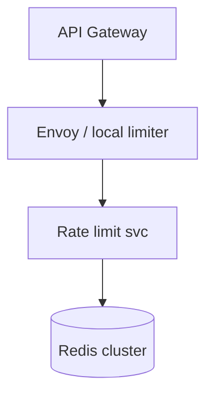
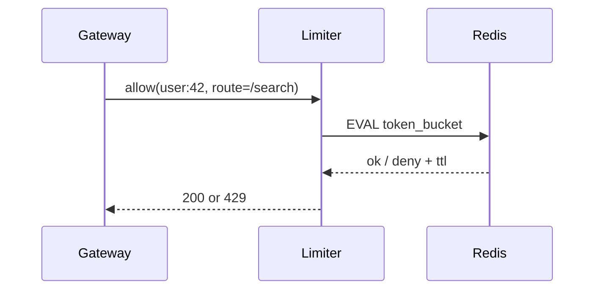

# HLD — Distributed Rate Limiter

## Live interview opening (clarify first — bar raiser order)

*“I’ll **start by clarifying requirements**—scope, ambiguity, latency and scale expectations—then lock **FR/NFR**. **After** that, I’ll ground **user journey**, **consistency**, **commit/decision**, and **risks** so it’s clearly **derived from what we agreed**, then **scale** and **architecture**—and I’ll **pause after the diagram** for where you want depth.”*

> **Uber SDE-2 HLD — drive order in this doc:** **§1** clarify → FR → NFR → **Framing after requirements** (user journey, consistency, commit/decision anchors) → **§2** scale → **§3** core entities + APIs → **§4** architecture → **§5** deep dive and evolution → **§6** scaling → **§7** reliability → **§8** tradeoffs → **§9** observability and security → **§10** patterns → **Closing**. Treat **Human interaction** cue blocks (headings in this doc) as *spoken* cues—**paraphrase**; do not read every row. **Bar raiser** listens for **ownership**, **failure modes**, and **honest tradeoffs**. Canonical spine: [HLD-UBER-SDE2-INTERVIEW-SPINE.md](./HLD-UBER-SDE2-INTERVIEW-SPINE.md).

## Interview delivery (golden thread — live thinking)

Bar-raiser polish: **user-first**, **explicit consistency**, **bottleneck**, **evolution**, **UX trust**, **default opinion** (not endless “A or B”). Full template + habits: **[HLD-BAR-RAISER-PERFORMANCE-PACK.md](./HLD-BAR-RAISER-PERFORMANCE-PACK.md)** · **[HLD-MASTER-DELIVERY-GOLDEN-FLOW.md](./HLD-MASTER-DELIVERY-GOLDEN-FLOW.md)**.

| Say at the right time | What interviewers grade | In this guide |
|----------------------|---------------------------|---------------|
| **Opening** | Clarify before solution | **Above** — you **do not** assume requirements. |
| **User journey + consistency + decisions** | Derived, not memorized | **After Section 1**, block **Framing after requirements** — **before Section 2** (not before clarify). |
| **Bottleneck / evolution / UX** | Ops + trust | Same **Framing** block; deep numbers still in **Sections 5–7**. |
| **Strong opinion** | Defaults | **Section 8** tradeoffs — always *“I’d start with X because…”*. |

**Do not:** read tables line-by-line · put user journey **before** clarify · fence-sit.  
**Do:** clarify → FR/NFR → **then** grounded journey → diagram → deep dive where steered.

---

## 1. Clarify requirements

### 1.0 Live flow

#### Live voice (real interviewer room)

**Sound like you’re *deciding*, not reciting:** one idea per breath, then **pause**. Tables here are **backup**—if your eyes are down for more than a couple of seconds, you’ve slipped into reading the doc.

**Bridge phrases (mix naturally):** *“Let me **name the fork** first…”* · *“I’ll **default to X**—tell me if your bar is stricter.”* · *“The reason I ask is it changes **who owns the commit** / **what’s on the hot path**.”* · *“I’ll **over-answer** one layer, then stop—**where should I zoom**?”*

**Ping them (conversation, not monologue):** *“Does that match how you’d scope it?”* · *“If we only deep-dive one thing, is it **A** or **B**?”* (swap **A/B** for two tensions from *your* opening paragraph above.)

**This topic in one breath:** “Limiter is **deny safe, allow fuzzy**—I’ll state **fail-open vs closed** per surface before Redis.”

**`Verbatim` / `Live` cues:** say a line **once**, then **rephrase** the next time—verbatim twice in a row reads *canned*.

**Opening (~once):** *“I’ll align **algorithm** (token bucket vs sliding window), **scope** (user/IP/route), **sync vs local approx**, and **burst** behavior; then **data plane**, **architecture**. **Pause after the diagram**—**correctness**, **Redis**, or **edge**?”*

**Thinking transitions:** *“Distributed limiter trades **exactness** for **latency**—I’ll state **over-admission** bounds.”*

**Live rule:** **Paraphrase** §1 tables; go deep **only if probed**.

**Micro-pauses:** after **fail-open vs closed** and **burst**, say: *“So I’ll treat **deny** as always safe, **allow** may overshoot a little under races, and I’ll call out **payments** as **fail-closed** unless you override me.”*

### 1.1 Clarify

| Topic | Say it like this in the room |
|--------------------------|-------------------------------|
| **Fairness** | “**Per tenant** fairness vs **global** cap?” |
| **Burst** | “Allow **burst** of **B**?” |
| **Failure mode** | “**Fail open** vs **closed** under store outage?” |
| **Hierarchy** | “**Global** then **per-route** nested?” |

#### Human interaction (clarify requirements — think out loud & evolve scope)

**Verbatim (open):** *“Before I draw Redis, I want to lock four things with you: **what we’re limiting**—user, IP, tenant, route—**what burst looks like**, **what happens when the limiter store is sick**, and **whether payments reads must fail closed**. I’ll throw a default after your answers.”*

**Verbatim (evolution):** *“I’d phase it: **v1** single-region Redis with **Lua** for atomic increments; **v2** add a **local token bucket** at the edge so we’re not doing a network hop on every request; **v3** only if you need **global** quotas across regions—then we talk **hierarchical** budgets and **async reconciliation**, not pretend **perfect** distributed counts.”*

### 1.2 Functional requirements (FR)

#### Human interaction (FR — after alignment)

**Verbatim:** *“Functionally it’s simple: every request hits **allow(key, cost)** and we return **allow or deny**, optionally **Retry-After**; rules can change from config without redeploying the gateway; and we emit **metrics** with **bounded cardinality** so we don’t DDoS our own metrics stack.”*

| FR area | Say it like this |
|---------|-------------------|
| **Decide** | “Given **key** + **limit rule**, return **allow** / **deny** + optional **Retry-After**.” |
| **Dynamic** | “Rules from **config** / **API**.” |
| **Obs** | “Emit **metrics** per key prefix (cardinality-safe).” |

### 1.3 Non-functional requirements (NFR)

#### Human interaction (NFR — how it must behave)

**Verbatim:** *“Non-functionally: **sub‑millisecond to a few ms** on the hot path if we can help it—usually that means **local decide** with **async sync** to central; **correctness** is **probabilistic** in a distributed system, so I’ll state the bound: a **deny** is trustworthy, an **allow** might be slightly over under races, and I’ll tell you what bound I’m designing for.”*

| NFR | Say it like this |
|-----|------------------|
| **Latency** | “**Microseconds–low ms** on hot path—**local** decision preferred.” |
| **Accuracy** | “**Centralized** ‘exact’ vs **Gossip** approximate—pick and defend.” |

### 1.4 Invariants

**Invariant:** “A **deny** response is **always safe**; an **allow** may be **slightly over** quota under **distributed races**—bounded by design.”

| Beat | Say it like this |
|------|------------------|
| **Bridge** | “**Token bucket** in **Redis** + **local leash**.” |
| **Core split** | “**Data plane** (fast) vs **control plane** (rules).” |

### Key insight (say early)

**Hierarchical limits** + **token bucket** at edge with **async central reconciliation** for **abuse**—pure distributed counting is either **slow** or **fuzzy**.

#### Key anchors

1. “**Lua script** atomicity in Redis.”  
2. “**Epoch + counter** sliding window approximation.”  
3. “**Fail closed** on **payments**; **fail open** on **optional** reads if product says so.”

---

## Framing after requirements (before scale + architecture)

**Placement in the room:** this block is **not** “right after clarify questions.” You earn it **after** you’ve locked **FR + NFR** (spoken summary is fine)—otherwise journey / consistency / commit boundaries read as **assuming** product and SLOs.

**Out loud:** *“We’ve **clarified** scope and I’ve stated **FR/NFR** from that—**based on that**, here’s the **user-visible path**, **consistency**, and **commit** I’ll hold before I size **Section 2** and draw **Section 4**.”*

### Thinking transitions (use during interview)

- *“Let me think through this…”*
- *“One tradeoff here is…”*
- *“If I optimize for latency…”*
- *“This might become a bottleneck because…”*
- *“I’d start simple here and evolve later…”*

## User journey (say once—**after** FR/NFR, not after clarify alone)

From the **client / gateway** perspective: each request calls **`allow(key, cost)`** before expensive work; response is **allow** or **deny** (+ optional **`Retry-After`**); operators change **rules** via control plane without redeploying data plane.

So:

- **read/hot path** = **local** decision when possible → optional **Redis/Lua** atomic increment for distributed truth.
- **write path** = **control plane** updates **LimitRule** versions; **config** rollouts.
- **async path** = metrics with **bounded cardinality**, **reconciliation** for abuse / global budgets.

## Consistency model

**Invariant**: **deny** is always **safe**; **allow** may **slightly over-admit** under races—state the bound.

**Fail closed** on **payments** / fraud-critical surfaces; **fail open** only when product explicitly accepts risk on **optional** reads during store outage.

## Commit boundary

The **`allow`** response is the **decision** returned to the gateway for this attempt—**not** “eventually consistent everywhere” without saying so. **Central counters** commit in **Redis transaction/Lua**; **edge** may **lag** central if you use hybrid.

## Decision (strong opinion)

I’d start with:

- **Redis + Lua** for atomic **token bucket** / sliding-window **approx** in v1 single region.
- **local leash** at edge + **async** sync when hot path latency dominates.

because **sub-ms** decisions don’t survive a **remote hop** every request at gateway QPS.

## Evolution

| Phase | Say it like this |
|-------|------------------|
| **1** | Simple implementation that ships. |
| **2** | Scaling: partitions, caches, queues, backpressure, observability. |
| **3** | Advanced / ML / global—only when metrics or product force it. |

Details: **Section 4.1 (phases)** and **Section 5** in this file.

## Bottleneck anchor

Watch first:

- **Redis hot keys** / **Lua** CPU, **shard** placement.
- **key cardinality** in metrics (don’t DDoS your own observability).

## Backpressure handling

Under load:

- **shed** optional limits first; **coarsen** keys (prefix caps).
- **degrade** to **local** only with explicit **over-admission** story.

Goal: **protect critical surfaces** over **perfect** fairness across every route.

## UX awareness

Bad outcomes:

- **thundering herd** on **Retry-After** alignment.
- **accidental lockout** of good users when store flaps—product needs **fail-open** stance per surface.

### Driving the conversation

- *“Does this direction make sense?”*
- *“Should I go deeper on **A** or **B**?”*
- *“Would you like failure scenarios next?”*

### Mindset

*“I’m not presenting a solution—I’m **designing with a teammate**.”*

**Playbook:** [HLD-BAR-RAISER-PERFORMANCE-PACK.md](./HLD-BAR-RAISER-PERFORMANCE-PACK.md).

---

## 2. Estimate scale

#### Human interaction (estimate scale)

**Verbatim:** *“Scale-wise I’m assuming limit checks are roughly **the same order as gateway QPS**—often **hundreds of thousands to millions** per region at peak—and key cardinality is enormous, so I care about **hot keys**, **sharded Redis**, and **sampling** high-cardinality metrics, not logging every key.”*

| Dimension | Illustrative |
|-----------|----------------|
| Checks / sec | **Same as gateway QPS** |
| Key cardinality | **Huge**—**hash** tags, **sample** metrics |

---

## 3. APIs and data model

### 3.0 Core entities (who owns what — say before API tables)

| Entity | Owns / lifecycle (one line) |
|--------|-----------------------------|
| **LimitRule** | **Versioned** policy: key template, rate, burst, algorithm—**control plane**. |
| **Counter / bucket state** | **Redis** keys + **Lua** atomics—**data plane**. |
| **AllowDecision** | Ephemeral response + optional **Retry-After**—**no PII** in logs. |
| **Tenant / route context** | Resolved at gateway—feeds **key** derivation. |

#### Human interaction (API design)

**Verbatim:** *“API-wise: **`allow`** is internal and called from the gateway on the hot path; **`PUT limits`** is admin—different **SLO**, different **auth**; every **deny** should be safe to show to the client as a **429** with a clear policy story.”*

### 3.1 APIs

| API | Purpose |
|-----|---------|
| `allow(key, cost)` | Internal sync call from gateway |
| `PUT /v1/limits/{tenant}` | Control plane |

### 3.2 Rules model

- **LimitRule:** `key_template`, `rate`, `burst`, `algorithm`, `priority`.

---

## 4. High-level architecture

#### Human interaction (high-level architecture / HLD)

**Verbatim:** *“Architecture in one sentence: **gateway** does policy and auth, **edge limiter** absorbs bursts cheaply, **central Redis** is the shared truth when we need cross-host accuracy, and the **control plane** pushes rule updates out of band.”*

### 4.1 Phases

| Phase | Ship |
|-------|------|
| **1** | Single-region Redis + Lua |
| **2** | **Local token bucket** + **async sync** |
| **3** | **Global** quotas with **hierarchical** aggregation |

---

## 5. Deep dive: allow check

#### Human interaction (deep dive — critical flow, optimizations & evolution)

**Verbatim (walk the diagram):** *“Walk it like this: gateway calls **allow** with a derived key; limiter runs **EVAL** in Redis to decrement tokens or increment a window counter **atomically**; Redis returns OK or deny with TTL; gateway maps deny to **429** and attaches **Retry-After** when we can.”*

**Verbatim (evolution):** *“If Redis is slow, I don’t freeze the world: **v2** we add a **local leash** so most traffic is decided locally within a **smaller** cap, and we **reconcile** centrally for abuse; **v3** hierarchical limits if you need **tenant + route** nesting without exploding keys.”*

### 🎯 Bottleneck Anchor

“**Redis hot key** per **viral user**—**shard** keyspace or **local** burst absorption.”

**Taking a stance:** *“**Token bucket** for **smooth bursts**; **sliding log** only when **hard** audit window needed (more storage).”*

---

## 6. Scaling and bottlenecks

#### Human interaction (scaling & bottlenecks)

**Verbatim:** *“First bottlenecks are almost always **hot keys**—one abusive tenant or one viral route—so we **shard** the keyspace, add **local** absorption, and we **never** put unbounded cardinality into Redis **key names**.”*

| Risk | Mitigation |
|------|------------|
| **Hot key** | **Sharding** + **local** limit |
| **Cross-region** | **Sticky** routing; **CRDT-ish** counters (rare) |

---

## 7. Reliability and failure handling

#### Human interaction (reliability & failure handling)

**Verbatim:** *“If Redis is partially broken, I’m explicit: either we **degrade** to local with a **stricter** cap, or for **payments** we **fail closed**—I won’t hand-wave ‘best effort’ without saying which product risk we’re taking.”*

- **Redis partial fail:** **degrade** to **local** only with **lower** cap.  
- **Clock skew:** rely on **Redis TIME** or **server** time authority.

---

## 8. Tradeoffs and alternatives

#### Human interaction (tradeoffs & alternatives)

**Verbatim:** *“Tradeoff I want on the table: **central Redis** buys accuracy but adds **RTT**; **pure gossip** removes the single choke point but you live with **overcount**—I’ll pick **central + edge** unless you force me to optimize for **no SPOF**.”*

| Choice | Trade |
|--------|--------|
| **Central Redis** | Accuracy vs **RTT** |
| **Gossip** | No single point vs **overcount** |

---

## 9. Monitoring, observability, and security

#### Human interaction (monitoring, observability & security)

**Verbatim:** *“I’d watch **429 rate** by route, **Redis p99**, and **sync lag** between edge and central; security-wise keys are **derived identifiers**, not raw emails, and any **break-glass bypass** is audited because that’s where incidents come from.”*

**Metrics:** **429 rate** by route, **sync lag**, **Redis** latency.  
**Security:** **Keys** must not leak **PII** in logs; **bypass** only for **break-glass** audit.

---

## 10. Design patterns, data structures & best practices

#### Human interaction (design patterns, data structures & best practices)

**Verbatim (pick 5–6 on the board, say where they sit):** *“I’m going to name six things and map each to a box: **token bucket** at edge for smooth bursts, **sliding window** approximation when you need a harder audit window, **Lua atomic scripts** in Redis so compare-and-set isn’t racey, **bulkhead** pools so one dependency doesn’t starve the gateway, **fixed window counters** only if you accept boundary spikes, **hierarchical limits** for tenant→route nesting, and **leader-follow / central store** as the pragmatic accuracy story versus gossip.”*

| Pattern / DS | Where it lives | Say one line (interview) |
|----------------|----------------|---------------------------|
| **Token bucket** | Edge + optional central | “Smooth bursts without punishing steady traffic.” |
| **Sliding window / fixed window counter** | Redis | “Pick window semantics deliberately—fixed windows spike at boundaries.” |
| **Redis `EVAL` / Lua atomicity** | Data plane | “All increments are **one atomic script**—no read-modify-write races.” |
| **Bulkhead** | Gateway / limiter pools | “Noisy route can’t exhaust the whole connection pool.” |
| **Leaky bucket (strict shaping)** | Optional edge | “Use when output rate must be perfectly smooth, not just capped bursts.” |
| **Hierarchical limits + async reconciliation** | Control + data plane | “Global tenant cap + per-route cap: reconcile asynchronously, don’t pretend instant global truth.” |

---

## Closing notes

#### Human interaction (closing notes)

**Verbatim:** *“If I leave you with one sentence: **deny is always safe**, **allow may be fuzzy**, and we engineer **hot keys**, **Lua atomicity**, and explicit **fail-open vs fail-closed** per surface.”*

| Do | Avoid |
|----|--------|
| **State over-admission** | “Exactly once global” hand-wave |
| **Lua atomic** | Racey read-modify-write |

---

## Bar-raiser follow-ups

#### Human interaction (bar-raiser follow-ups)

**Verbatim:** *“Happy to go deeper on **exactly-once**, **CRDT counters**, or **multi-region**—tell me which worries you more: **correctness** or **latency**.”*

| They ask | Say it like this |
|----------|------------------|
| **Distributed consensus** | “Usually **overkill**—**central** store + **edge** **approx** wins.” |

---

## 60-second close

#### Human interaction (60-second close)

**Verbatim:** *“**Token bucket + Redis Lua** for atomic checks, **edge** for cheap absorption, **hierarchical** rules if needed, **hot key** sharding, explicit **fail-open vs closed**, metrics on **429** and **Redis tail**.”*

| Beat | Say it like this |
|------|------------------|
| **Recap** | “**Token bucket** + **Redis Lua**; **hierarchy** user/route/tenant; **hot key** mitigations; **fail-open/closed** explicit; **429** + **Retry-After**.” |

---
