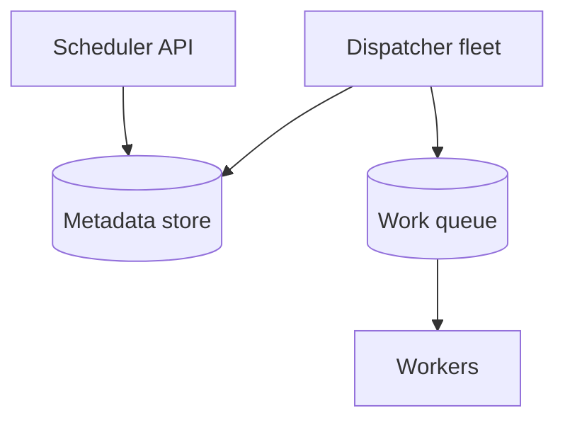
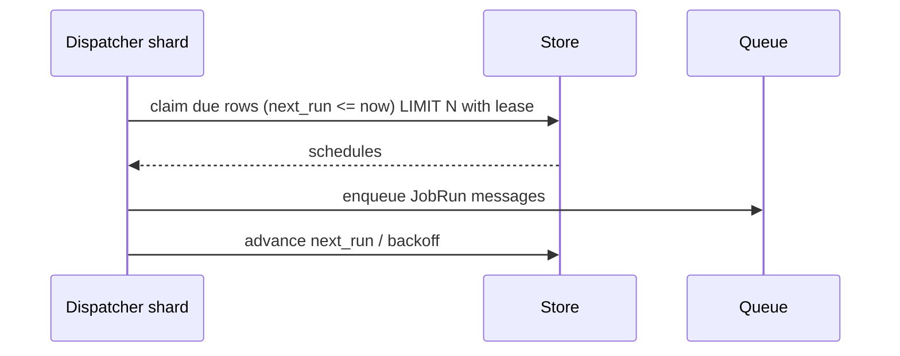

# HLD — Distributed Job Scheduler

## Live interview opening (clarify first — bar raiser order)

*“I’ll **start by clarifying requirements**—scope, ambiguity, latency and scale expectations—then lock **FR/NFR**. **After** that, I’ll ground **user journey**, **consistency**, **commit/decision**, and **risks** so it’s clearly **derived from what we agreed**, then **scale** and **architecture**—and I’ll **pause after the diagram** for where you want depth.”*

> **Uber SDE-2 HLD — drive order in this doc:** **§1** clarify → FR → NFR → **Framing after requirements** (user journey, consistency, commit/decision anchors) → **§2** scale → **§3** core entities + APIs → **§4** architecture → **§5** deep dive and evolution → **§6** scaling → **§7** reliability → **§8** tradeoffs → **§9** observability and security → **§10** patterns → **Closing**. Treat **Human interaction** cue blocks (headings in this doc) as *spoken* cues—**paraphrase**; do not read every row. **Bar raiser** listens for **ownership**, **failure modes**, and **honest tradeoffs**. Canonical spine: [HLD-UBER-SDE2-INTERVIEW-SPINE.md](./HLD-UBER-SDE2-INTERVIEW-SPINE.md).

## Interview delivery (golden thread — live thinking)

Bar-raiser polish: **user-first**, **explicit consistency**, **bottleneck**, **evolution**, **UX trust**, **default opinion** (not endless “A or B”). Full template + habits: **[HLD-BAR-RAISER-PERFORMANCE-PACK.md](./HLD-BAR-RAISER-PERFORMANCE-PACK.md)** · **[HLD-MASTER-DELIVERY-GOLDEN-FLOW.md](./HLD-MASTER-DELIVERY-GOLDEN-FLOW.md)**.

| Say at the right time | What interviewers grade | In this guide |
|----------------------|---------------------------|---------------|
| **Opening** | Clarify before solution | **Above** — you **do not** assume requirements. |
| **User journey + consistency + decisions** | Derived, not memorized | **After Section 1**, block **Framing after requirements** — **before Section 2** (not before clarify). |
| **Bottleneck / evolution / UX** | Ops + trust | Same **Framing** block; deep numbers still in **Sections 5–7**. |
| **Strong opinion** | Defaults | **Section 8** tradeoffs — always *“I’d start with X because…”*. |

**Do not:** read tables line-by-line · put user journey **before** clarify · fence-sit.  
**Do:** clarify → FR/NFR → **then** grounded journey → diagram → deep dive where steered.

---

## 1. Clarify requirements

### 1.0 Live flow

#### Live voice (real interviewer room)

**Sound like you’re *deciding*, not reciting:** one idea per breath, then **pause**. Tables here are **backup**—if your eyes are down for more than a couple of seconds, you’ve slipped into reading the doc.

**Bridge phrases (mix naturally):** *“Let me **name the fork** first…”* · *“I’ll **default to X**—tell me if your bar is stricter.”* · *“The reason I ask is it changes **who owns the commit** / **what’s on the hot path**.”* · *“I’ll **over-answer** one layer, then stop—**where should I zoom**?”*

**Ping them (conversation, not monologue):** *“Does that match how you’d scope it?”* · *“If we only deep-dive one thing, is it **A** or **B**?”* (swap **A/B** for two tensions from *your* opening paragraph above.)

**This topic in one breath:** “Scheduler is **persistence + leader + misfire policy**—I’ll pick **at-least-once** honestly.”

**`Verbatim` / `Live` cues:** say a line **once**, then **rephrase** the next time—verbatim twice in a row reads *canned*.

**Opening (~once):** *“I’ll align **once vs recurring**, **at-least-once vs exactly-once**, **timezone/DST**, and **fairness** across tenants; then **leader election**, **persistence**, **worker execution**. **Pause after the diagram**—**storage**, **misfire**, or **multi-region**?”*

**Thinking transitions:** *“Schedulers are **databases + clocks**—I’ll be explicit about **skew** and **lease**.”*

**Live rule:** **Paraphrase** §1 tables; go deep **only if probed**.

**Micro-pauses:** *“So we’re **at-least-once** to the queue with **idempotent** job keys, and **misfire** is a **policy**, not an accident—got it.”*

### 1.1 Clarify

| Topic | Say it like this in the room |
|--------------------------|-------------------------------|
| **Semantics** | “**At-least-once** delivery ok with **idempotent** jobs?” |
| **Precision** | “**Second** vs **minute** granularity?” |
| **Priority** | “**VIP** queues?” |
| **DAG** | “**Dependencies** between jobs—**Airflow**-class or **simple** timer?” |

#### Human interaction (clarify requirements — think out loud & evolve scope)

**Verbatim:** *“I’m going to treat the scheduler as two planes: **control plane** for CRUD on schedules, and **data plane** for ticking and dispatching. Before I draw it, I need **delivery semantics**, **timezone/DST**, **misfire policy**, and whether jobs are **idempotent**—because ‘exactly-once’ only exists at the **business** layer if we define keys.”*

**Verbatim (evolution):** *“**v1** leader dispatcher scanning `next_run` with leases; **v2** shard dispatchers by time bucket; **v3** multi-region **active-passive** with explicit failover semantics.”*

### 1.2 Functional requirements (FR)

#### Human interaction (FR — after alignment)

**Verbatim:** *“Users can create schedules, workers execute runs, and operators can see **next run**, **history**, and **missed** behavior—nothing silently disappears: either we enqueue, or we record **suppressed** with a reason.”*

| FR area | Say it like this |
|---------|-------------------|
| **Schedule** | “Create/update/delete **triggers**.” |
| **Execute** | “Fire → **enqueue** work item → **workers** consume.” |
| **Observe** | “History, **next run**, **missed** policy.” |

### 1.3 Non-functional requirements (NFR)

#### Human interaction (NFR — how it must behave)

**Verbatim:** *“Durability beats cleverness: if the dispatcher restarts, **due work** is still discoverable from the database index; scale-out means **horizontal** dispatch shards with **leases**, not one heroic process.”*

| NFR | Say it like this |
|-----|------------------|
| **Scale** | “**Many** schedules; **horizontal** dispatchers.” |
| **Durability** | “No **silent drop** on **restart**.” |

### 1.4 Invariants

**Invariant:** “Every **due** trigger generates **at least one** execution attempt **or** a **recorded** **suppressed** reason (disabled, misfire policy); **no** silent **loss**.”

| Beat | Say it like this |
|------|------------------|
| **Bridge** | “**Placer** puts **due** rows in **queue**; **workers** **ack**.” |
| **Core split** | “**Control plane** (CRUD) vs **data plane** (tick dispatch).” |

### Key insight (say early)

**Time-indexed lease** on schedule shards + **idempotent job execution**—**exactly-once** end-to-end is **business-level**, not **network-level**.

#### Key anchors

1. “**Leader** or **sharded time ranges**.”  
2. “**Catch-up** vs **coalesce** misfire policy.”  
3. “**Outbox** to **queue**.”

---

## Framing after requirements (before scale + architecture)

**Placement in the room:** this block is **not** “right after clarify questions.” You earn it **after** you’ve locked **FR + NFR** (spoken summary is fine)—otherwise journey / consistency / commit boundaries read as **assuming** product and SLOs.

**Out loud:** *“We’ve **clarified** scope and I’ve stated **FR/NFR** from that—**based on that**, here’s the **user-visible path**, **consistency**, and **commit** I’ll hold before I size **Section 2** and draw **Section 4**.”*

### Thinking transitions (use during interview)

- *“Let me think through this…”*
- *“One tradeoff here is…”*
- *“If I optimize for latency…”*
- *“This might become a bottleneck because…”*
- *“I’d start simple here and evolve later…”*

## User journey (say once—**after** FR/NFR, not after clarify alone)

From the **operator / product** perspective: define a **schedule** (once/recurring, timezone, priority) → system **ticks** → **enqueue** execution → **workers** run with **acks** / retries → **history** + **next run** visible.

So:

- **control plane** = CRUD on schedules, **misfire** policy, enable/disable.
- **data plane** = **dispatcher** finds **due** rows → **outbox/queue** → workers (**at-least-once**).
- **async path** = catch-up storms, **dead-letter** inspection, **multi-region** failover.

## Consistency model

**At-least-once** to the queue is normal; **exactly-once** execution is **business-level** via **idempotent job keys**.

**No silent loss**: every **due** trigger → **attempt** **or** **recorded suppressed** reason (disabled / policy)—**§1.4 invariant**.

Clock **skew**, **DST**, and **lease** renewal are first-class—not edge cases.

## Commit boundary

A schedule row “fires” when:

- dispatcher **claims** it under a **lease** / leader shard and **durably** enqueues (or records suppress) **before** acking the tick—define idempotency for **duplicate** dispatcher scans.

Worker **ack** is separate from **dispatch**—don’t conflate “queued” with “succeeded.”

## Decision (strong opinion)

I’d start with:

- **DB-indexed `next_run` + leases** + **horizontal** dispatcher shards by **time bucket**.
- **outbox** pattern into **Kafka/SQS**; **idempotent** workers.

because schedulers are **databases + clocks**—clever in-memory only works until restart.

## Evolution

| Phase | Say it like this |
|-------|------------------|
| **1** | Simple implementation that ships. |
| **2** | Scaling: partitions, caches, queues, backpressure, observability. |
| **3** | Advanced / ML / global—only when metrics or product force it. |

Details: **Section 4.1 (phases)** and **Section 5** in this file.

## Bottleneck anchor

Watch first:

- **due-row scan** hot spots near “top of minute.”
- **misfire** storms after outages (**catch-up** vs **coalesce** policy pressure).

## Backpressure handling

Under load:

- **coalesce** missed ticks when product allows; otherwise **throttle** enqueue rate with visible backlog.
- **isolate** noisy tenants to **queues**.

Goal: **predictable backlog** + **honest miss policy** over **pretend real-time** on every schedule.

## UX awareness

Bad outcomes:

- **duplicate** bill runs (money) without idempotency.
- **silent** skipped runs—operators need **suppressed** reasons.

### Driving the conversation

- *“Does this direction make sense?”*
- *“Should I go deeper on **A** or **B**?”*
- *“Would you like failure scenarios next?”*

### Mindset

*“I’m not presenting a solution—I’m **designing with a teammate**.”*

**Playbook:** [HLD-BAR-RAISER-PERFORMANCE-PACK.md](./HLD-BAR-RAISER-PERFORMANCE-PACK.md).

---

## 2. Estimate scale

#### Human interaction (estimate scale)

**Verbatim:** *“Think **hundreds of millions** of triggers and **spiky** firings around the top of the hour—so the database access pattern is **time-bucket indexed claims**, not scanning the universe every second.”*

| Dimension | Illustrative |
|-----------|----------------|
| Triggers | **100M+** |
| Firings / sec | **Spiky**—**partition** by **time bucket** |

---

## 3. APIs and data model

### 3.0 Core entities (who owns what — say before API tables)

| Entity | Owns / lifecycle (one line) |
|--------|-----------------------------|
| **Schedule** | Cron/one-shot definition + **tz** + **enabled** bit—**metadata store**. |
| **JobRun** | **Attempt** record: status, lease, ack—**durable** audit. |
| **Work message** | Queue payload referencing **`(schedule_id, fire_time)`** idempotency. |

#### Human interaction (API design)

**Verbatim:** *“`POST schedules` is authenticated admin; worker **`ack`** is how we close the loop; the **idempotency key** is **`schedule_id + intended_fire_time`** so retries don’t double-apply side effects.”*

### 3.1 APIs

| API | Purpose |
|-----|---------|
| `POST /v1/schedules` | Create cron / one-shot |
| `DELETE /v1/schedules/{id}` | Cancel |
| *worker* | `POST /v1/jobs/{id}/ack` |

### 3.2 Model

- **Schedule:** `id`, `cron`, `tz`, `next_run_at`, `owner`, `enabled`.  
- **JobRun:** `schedule_id`, `run_id`, `status`, `lease_until`.

---

## 4. High-level architecture

#### Human interaction (high-level architecture / HLD)

**Verbatim:** *“API writes metadata, dispatcher fleet **claims due rows** with leases and publishes to the work queue, workers consume **at-least-once** and ack—classic **control vs data plane** split.”*

### 4.1 Phases

| Phase | Ship |
|-------|------|
| **1** | Leader dispatcher + SQL index on `next_run_at` |
| **2** | Sharded dispatchers + **lease** |
| **3** | **Multi-region** active-passive |

---

## 5. Deep dive: tick → dispatch

#### Human interaction (deep dive — critical flow, optimizations & evolution)

**Verbatim:** *“Deep dive is the tick loop: dispatcher shard queries **`next_run_at <= now`** with a **lease**, enqueues a JobRun with a deterministic id, advances **`next_run`** or applies backoff, and workers ack; if I’m double-firing, my lease model is wrong, not ‘Kafka is magic’.”*

**Verbatim (evolution):** *“**v1** single leader; **v2** bucket sharding + coalesce on hot minutes; **v3** fencing tokens if side effects are scary.”*

### 🎯 Bottleneck Anchor

“**Scanning** all schedules each tick—need **time-bucket index** + **lease** to avoid **double fire**.”

**Taking a stance:** *“**At-least-once** to queue + **idempotent** **job_id** = `(schedule_id, fire_time)`.”*

---

## 6. Scaling and bottlenecks

#### Human interaction (scaling & bottlenecks)

**Verbatim:** *“Hot minutes and DB write amplification are the story—**coalesce**, **append fire logs**, **shard** dispatchers, and never claim unbounded rows per tick.”*

| Risk | Mitigation |
|------|------------|
| **Hot minute** | **Coalesce** windows; **shard** dispatchers |
| **DB write amp** | **Append** fire log + **async** advance |

---

## 7. Reliability and failure handling

#### Human interaction (reliability & failure handling)

**Verbatim:** *“Worker crash is normal: **visibility timeout** redelivers; dispatcher split-brain is why we use **leases** and optionally **fencing tokens** if workers talk to external systems.”*

- **Worker crash:** **visibility timeout** / **redelivery**.  
- **Dispatcher split-brain:** **lease** + **fencing token** to workers (if supported).

---

## 8. Tradeoffs and alternatives

#### Human interaction (tradeoffs & alternatives)

**Verbatim:** *“Cron-in-SQL is great until it isn’t; **Kafka timewheel** tricks are clever but operationally spicy—I’ll default **SQL + leases + queue** unless you push me.”*

| Choice | Trade |
|--------|--------|
| **Cron in SQL** | Simple vs **scale** ceiling |
| **Kafka timed topics** | Clever vs **complexity** |

---

## 9. Monitoring, observability, and security

#### Human interaction (monitoring, observability & security)

**Verbatim:** *“I’d page on **enqueue lag** and rising **duplicate execution** rate—those mean lease bugs or poison schedules; security means **no arbitrary code** in schedules, only **registered** job types.”*

**Metrics:** **misfire** count, **lag** (due→enqueue), **duplicate** execution rate, **queue depth**.  
**Security:** **AuthZ** on schedule CRUD; **no arbitrary code** string—**registered job types** only.

---

## 10. Design patterns, data structures & best practices

#### Human interaction (design patterns, data structures & best practices)

**Verbatim (say 5–6 on the board):** *“**Leader election** or time-sharded dispatch, **lease-based claiming** on `next_run`, **outbox** for durable enqueue, **priority queues** for VIP tenants, **visibility timeout** redelivery, **min-heap** time index conceptually even if SQL index backs it, and **fencing tokens** if workers touch external systems.”*

| Pattern / DS | Where | One interview line |
|----------------|------|----------------------|
| **Leader election / sharded dispatch** | Dispatcher fleet | “Avoid every node scanning the full table.” |
| **Lease + conditional claim** | Metadata DB | “Only one shard owns a due row until lease expires.” |
| **Transactional outbox** | Scheduler → queue | “Don’t enqueue unless the DB commit says so.” |
| **Work queue + ack** | Kafka/SQS | “At-least-once is fine with **idempotent** job keys.” |
| **Visibility timeout** | Worker consumer | “Crash ⇒ retry without human intervention.” |
| **Fencing token** | Worker → external side effect | “Stale leader can’t commit after new leader wins.” |

---

## Closing notes

#### Human interaction (closing notes)

**Verbatim:** *“Schedulers are **databases + clocks**: leases prevent double fire, idempotency defines ‘exactly-once’ for business effects, and misfire policy is part of the product contract.”*

| Do | Avoid |
|----|--------|
| **Idempotent job key** | “Exactly-once” without definition |
| **Misfire policy** | Silent skip |

---

## Bar-raiser follow-ups

#### Human interaction (bar-raiser follow-ups)

**Verbatim:** *“Pick your poison: **DST**, **multi-region**, or **DAG dependencies**—I’ll go deep where you steer.”*

| They ask | Say it like this |
|----------|------------------|
| **DST** | “Store **tz** + use **Olson**; **test** spring forward/back.” |

---

## 60-second close

#### Human interaction (60-second close)

**Verbatim:** *“**Lease-claim** due schedules, **enqueue** at-least-once, **idempotent** `(schedule_id, fire_time)`, **misfire** policy explicit, **metrics** on lag and duplicates.”*

| Beat | Say it like this |
|------|------------------|
| **Recap** | “**Time-indexed** claim with **lease**; **enqueue** to **workers**; **at-least-once** + **idempotent** keys; **misfire** policy; **metrics** on **lag**.” |

---
