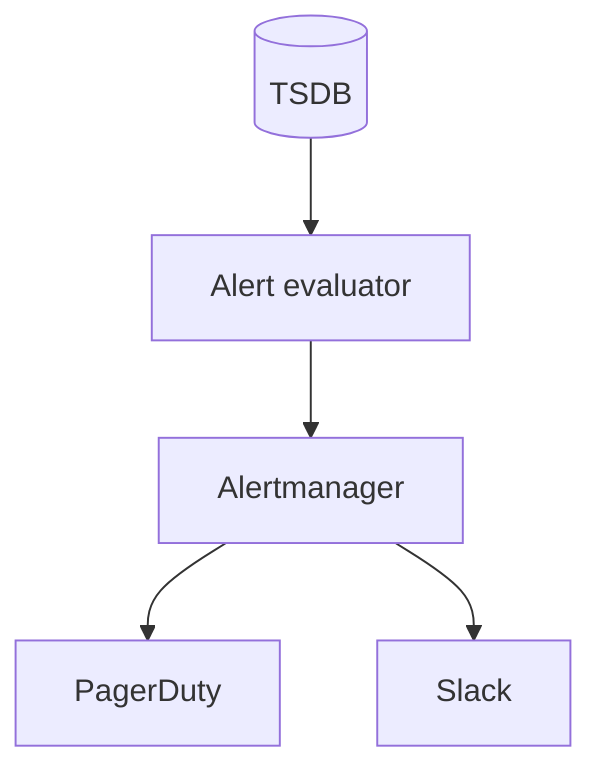
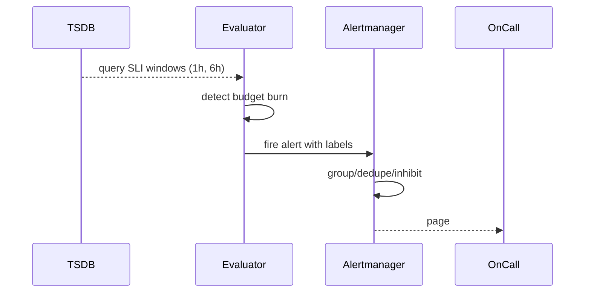

# HLD — Monitoring / Alerting System

## Live interview opening (clarify first — bar raiser order)

*“I’ll **start by clarifying requirements**—scope, ambiguity, latency and scale expectations—then lock **FR/NFR**. **After** that, I’ll ground **user journey**, **consistency**, **commit/decision**, and **risks** so it’s clearly **derived from what we agreed**, then **scale** and **architecture**—and I’ll **pause after the diagram** for where you want depth.”*

> **Uber SDE-2 HLD — drive order in this doc:** **§1** clarify → FR → NFR → **Framing after requirements** (user journey, consistency, commit/decision anchors) → **§2** scale → **§3** core entities + APIs → **§4** architecture → **§5** deep dive and evolution → **§6** scaling → **§7** reliability → **§8** tradeoffs → **§9** observability and security → **§10** patterns → **Closing**. Treat **Human interaction** cue blocks (headings in this doc) as *spoken* cues—**paraphrase**; do not read every row. **Bar raiser** listens for **ownership**, **failure modes**, and **honest tradeoffs**. Canonical spine: [HLD-UBER-SDE2-INTERVIEW-SPINE.md](./HLD-UBER-SDE2-INTERVIEW-SPINE.md).

## Interview delivery (golden thread — live thinking)

Bar-raiser polish: **user-first**, **explicit consistency**, **bottleneck**, **evolution**, **UX trust**, **default opinion** (not endless “A or B”). Full template + habits: **[HLD-BAR-RAISER-PERFORMANCE-PACK.md](./HLD-BAR-RAISER-PERFORMANCE-PACK.md)** · **[HLD-MASTER-DELIVERY-GOLDEN-FLOW.md](./HLD-MASTER-DELIVERY-GOLDEN-FLOW.md)**.

| Say at the right time | What interviewers grade | In this guide |
|----------------------|---------------------------|---------------|
| **Opening** | Clarify before solution | **Above** — you **do not** assume requirements. |
| **User journey + consistency + decisions** | Derived, not memorized | **After Section 1**, block **Framing after requirements** — **before Section 2** (not before clarify). |
| **Bottleneck / evolution / UX** | Ops + trust | Same **Framing** block; deep numbers still in **Sections 5–7**. |
| **Strong opinion** | Defaults | **Section 8** tradeoffs — always *“I’d start with X because…”*. |

**Do not:** read tables line-by-line · put user journey **before** clarify · fence-sit.  
**Do:** clarify → FR/NFR → **then** grounded journey → diagram → deep dive where steered.

---

## 1. Clarify requirements

### 1.0 Live flow

#### Live voice (real interviewer room)

**Sound like you’re *deciding*, not reciting:** one idea per breath, then **pause**. Tables here are **backup**—if your eyes are down for more than a couple of seconds, you’ve slipped into reading the doc.

**Bridge phrases (mix naturally):** *“Let me **name the fork** first…”* · *“I’ll **default to X**—tell me if your bar is stricter.”* · *“The reason I ask is it changes **who owns the commit** / **what’s on the hot path**.”* · *“I’ll **over-answer** one layer, then stop—**where should I zoom**?”*

**Ping them (conversation, not monologue):** *“Does that match how you’d scope it?”* · *“If we only deep-dive one thing, is it **A** or **B**?”* (swap **A/B** for two tensions from *your* opening paragraph above.)

**This topic in one breath:** “Alerting is **SLI→SLO→budget→page**—I’ll separate **symptom** alerts from **cause** archaeology.”

**`Verbatim` / `Live` cues:** say a line **once**, then **rephrase** the next time—verbatim twice in a row reads *canned*.

**Opening (~once):** *“I’ll connect **SLI → SLO → error budget → alert policy**; align **symptoms vs causes**, **noise**, and **on-call**; then **data sources**, **evaluation**, **notification**. **Pause after the diagram**—**SLO math**, **runbooks**, or **multi-tenant**?”*

**Thinking transitions:** *“**Alert on user pain**, not **CPU**—unless CPU **is** user pain.”*

**Live rule:** **Paraphrase** §1 tables; go deep **only if probed**.

**Micro-pauses:** *“So every page has a **runbook** and an **owner**, and we prefer **burn rate** over fifty static thresholds—got it.”*

### 1.1 Clarify

| Topic | Say it like this in the room |
|--------------------------|-------------------------------|
| **Consumers** | “**PagerDuty** class vs **email** dashboards?” |
| **SLO** | “**99.9%** monthly for which **SLI**?” |
| **Windows** | “**Burn rate** alerts?” |
| **Multi-tenant** | “Per-tenant **noise** isolation?” |

#### Human interaction (clarify requirements — think out loud & evolve scope)

**Verbatim:** *“I’m going to connect **SLI → SLO → error budget → paging policy**. Before I draw Alertmanager, I want to know what **user-visible** SLI we’re protecting, what **noise** looks like for on-call, and whether tenants need **isolated** budgets.”*

**Verbatim (evolution):** *“**v1** thresholds + dashboards; **v2** multi-window burn rates + routing; **v3** richer incident workflow—still **symptom-first**.”*

### 1.2 Functional requirements (FR)

#### Human interaction (FR — after alignment)

**Verbatim:** *“We ingest telemetry, define SLOs and alert rules, evaluate them continuously, route notifications with dedupe, and visualize burn—**PagerDuty** is a detail, the contract is **actionable** alerts.”*

| FR area | Say it like this |
|---------|-------------------|
| **Collect** | “Ingest **metrics**, **logs**, **traces**, **synthetic** probes.” |
| **Define** | “SLOs, **alert rules**, **silences**, **routes**.” |
| **Notify** | “Pages, chat, tickets.” |
| **Visualize** | “Dashboards, **SLO** views.” |

### 1.3 Non-functional requirements (NFR)

#### Human interaction (NFR — how it must behave)

**Verbatim:** *“The alerting system has to survive partial outages—**federation**, HA evaluators, and **dogfood** meta-alerts so we don’t fly blind while we’re blind.”*

| NFR | Say it like this |
|-----|------------------|
| **Reliability** | “**Monitoring** must stay up during **partial** outages—**federation**.” |
| **Latency** | “**Alert evaluation** near **real-time** (tens of seconds).” |

### 1.4 Invariants

**Invariant:** “Every **page** maps to a **runbook** entry and **severity**; **no page** without **owner** and **rollback/mitigation** path.”

| Beat | Say it like this |
|------|------------------|
| **Bridge** | “**SLI queries** in **TSDB** → **burn** detectors → **router**.” |
| **Core split** | “**Symptom-based** alerts vs **cause** dashboards.” |

### Key insight (say early)

**Multi-window multi-burn-rate** on **error budget** consumption beats static thresholds for **noise** (Google SRE style).

#### Key anchors

1. “**RED** metrics.”  
2. “**SLO** not **SLA** in the room unless legal.”  
3. “**Synthetic** **canaries** for **critical** journeys.”

---

## Framing after requirements (before scale + architecture)

**Placement in the room:** this block is **not** “right after clarify questions.” You earn it **after** you’ve locked **FR + NFR** (spoken summary is fine)—otherwise journey / consistency / commit boundaries read as **assuming** product and SLOs.

**Out loud:** *“We’ve **clarified** scope and I’ve stated **FR/NFR** from that—**based on that**, here’s the **user-visible path**, **consistency**, and **commit** I’ll hold before I size **Section 2** and draw **Section 4**.”*

### Thinking transitions (use during interview)

- *“Let me think through this…”*
- *“One tradeoff here is…”*
- *“If I optimize for latency…”*
- *“This might become a bottleneck because…”*
- *“I’d start simple here and evolve later…”*

## User journey (say once—**after** FR/NFR, not after clarify alone)

From the **on-call** perspective: **SLI** dips → **alert** fires → runbook → **dashboards** (symptom) → **traces/logs** (cause) → **mute/snooze** with policy; SRE tunes **SLO burn** alerts.

So:

- **write path** = **rules** + **routing** + **silences** + **incident** annotations (control plane).
- **read path** = **evaluation** loop reading **TSDB**/streaming metrics—**low latency** for firing, not for heavy analytics.
- **async path** = **notification** delivery, **ticket** creation, **post-mortem** exports.

## Consistency model

**Alert state** (open/firing/resolved) should be **clear** under **at-least-once** metric ingestion—use **dedupe keys** / **grouping** to avoid **page storms**.

**Symptom vs cause**: user-facing paging is **SLI/SLO**-driven; deep dives are **logs/traces**—don’t page on every noisy **cause** unless product demands.

## Commit boundary

An alert **fires** when rule evaluation commits a **state transition** with **evidence window** snapshot—**not** on single missing scrape without **for** duration policy.

**Silence/suppression** must be **auditable** and **time-bounded**.

## Decision (strong opinion)

I’d start with:

- **Prometheus-style** pull or **remote_write** + **Cortex/Thanos**-shaped scaling story + **Alertmanager** routing.

because **SLI→SLO→budget→page** is the readable spine; fancy ML anomaly detection is optional v3.

## Evolution

| Phase | Say it like this |
|-------|------------------|
| **1** | Simple implementation that ships. |
| **2** | Scaling: partitions, caches, queues, backpressure, observability. |
| **3** | Advanced / ML / global—only when metrics or product force it. |

Details: **Section 4.1 (phases)** and **Section 5** in this file.

## Bottleneck anchor

Watch first:

- **rule evaluation** cost vs **cardinality** of labels.
- **notification** fan-out and **provider** rate limits.

## Backpressure handling

Under load:

- **drop** non-critical **low-severity** routes first; **aggregate** notifications.
- **auto-mute** known storms with **governance** (two-key approval if needed).

Goal: **actionable pages** over **complete** coverage of every metric twitch.

## UX awareness

Bad outcomes:

- **alert fatigue** / missing real outages (**silent** bad thresholds).
- **flapping** without hysteresis—operators stop trusting the system.

### Driving the conversation

- *“Does this direction make sense?”*
- *“Should I go deeper on **A** or **B**?”*
- *“Would you like failure scenarios next?”*

### Mindset

*“I’m not presenting a solution—I’m **designing with a teammate**.”*

**Playbook:** [HLD-BAR-RAISER-PERFORMANCE-PACK.md](./HLD-BAR-RAISER-PERFORMANCE-PACK.md).

---

## 2. Estimate scale

#### Human interaction (estimate scale)

**Verbatim:** *“Evaluation QPS can get huge—**recording rules** precompute expensive SLIs so paging isn’t a giant ad-hoc query storm.”*

| Dimension | Illustrative |
|-----------|----------------|
| Evaluation QPS | **High**—**pre-aggregated** counters help |
| Cardinality | **Guard** same as metrics pipeline ([30-hld-logging-metrics-pipeline.md](./30-hld-logging-metrics-pipeline.md)) |

---

## 3. APIs and data model

### 3.0 Core entities (who owns what — say before concepts)

| Entity | Owns / lifecycle (one line) |
|--------|-----------------------------|
| **SLI query / recording rule** | Derived **good/valid** events—**TSDB**. |
| **AlertRule** | PromQL-ish expr + `for` + labels—**versioned**. |
| **Incident route** | Matcher → receiver + **silence** audit. |

#### Human interaction (API design)

**Verbatim:** *“APIs are mostly config: define rules, routes, silences—with **RBAC** because silences are where outages go to hide.”*

### 3.1 Concepts

- **SLI:** `good_events / valid_events` over window.  
- **AlertRule:** `expr`, `for`, `labels`, `annotations`.  
- **Route:** matcher → **receiver** (PagerDuty, Slack).

---

## 4. High-level architecture

#### Human interaction (high-level architecture / HLD)

**Verbatim:** *“TSDB feeds an evaluator that detects budget burn, Alertmanager does grouping dedupe inhibition, then we notify humans with **context** and **runbook links**.”*

### 4.1 Phases

| Phase | Ship |
|-------|------|
| **1** | Threshold alerts + dashboards |
| **2** | **SLO** + burn + routing |
| **3** | **Auto-triage** + **incident** bot |

---

## 5. Deep dive: burn rate alert

#### Human interaction (deep dive — critical flow, optimizations & evolution)

**Verbatim:** *“Burn-rate paging in plain English: we watch **multiple windows** of the same SLI, and we page when **budget consumption** accelerates—not when a single minute blips.”*

**Verbatim (evolution):** *“Add inhibition so node fires don’t spam when the cluster is dead; add synthetics for **critical journeys**.”*

### 🎯 Bottleneck Anchor

“**Flapping** when **small** windows see **noise**—**multi-window** **AND** guards.”

**Taking a stance:** *“**Inhibit** **node** alerts when **cluster** alert fires—**cause** hierarchy.”*

---

## 6. Scaling and bottlenecks

#### Human interaction (scaling & bottlenecks)

**Verbatim:** *“Query cost and notification storms are the bottlenecks—**recording rules** and **Alertmanager grouping** are not optional polish.”*

| Risk | Mitigation |
|------|------------|
| **Query cost** | **Recording rules** precompute SLIs |
| **Storm** | **Grouping** + **rate limits** on notifications |

---

## 7. Reliability and failure handling

#### Human interaction (reliability & failure handling)

**Verbatim:** *“If the evaluator is down, we’ve lost safety—**HA** pairs and a **dead man’s switch** meta-alert are the boring correct answer.”*

- **Evaluator down:** **missed** pages—**HA** pair; **dead man’s snitch** meta-alert.

---

## 8. Tradeoffs and alternatives

#### Human interaction (tradeoffs & alternatives)

**Verbatim:** *“Many fine alerts feels like coverage but becomes **noise**; SLO-only can miss **non-budget** defects—I'll combine **burn alerts** with a small set of **critical** synthetics.”*

| Choice | Trade |
|--------|--------|
| **Many fine alerts** | Coverage vs **noise** |
| **SLO-only** | Miss **non-SLO** defects |

---

## 9. Monitoring, observability, and security

#### Human interaction (monitoring, observability & security)

**Verbatim:** *“Dogfood the pipeline: if we can’t alert on our alerting lag, we don’t deserve on-call trust; silences are **RBAC** + audit because that’s a blast radius.”*

**Dogfood:** monitor **alert pipeline** itself.  
**Security:** **RBAC** on silence; **audit** who ack’d.

---

## 10. Design patterns, data structures & best practices

#### Human interaction (design patterns, data structures & best practices)

**Verbatim (say 5–6 on the board):** *“**Multi-window burn detection**, **Alertmanager grouping/dedupe/inhibition**, **recording rules** as pre-aggregation, **hysteresis** for flap control, **synthetic probes** as user-journey checks, and **runbook-linked** pages as an operational pattern.”*

| Pattern / DS | Where | One interview line |
|----------------|------|----------------------|
| **Multi-window burn** | Evaluator | “Page on budget acceleration, not single spikes.” |
| **Recording rules** | TSDB | “Make SLI queries cheap and stable.” |
| **Inhibition graph** | Alertmanager | “Suppress noisy children when parent symptom fires.” |
| **Routing tree** | Alertmanager | “Tenant isolation + severity-based escalation.” |
| **Dead-man switch** | Meta monitoring | “Detect ‘monitoring is blind’.” |
| **SLO dashboards + error budget** | Product ops | “Translate metrics into product tradeoffs.” |

---

## Closing notes

#### Human interaction (closing notes)

**Verbatim:** *“Symptom-based paging tied to **error budgets**, with dedupe/inhibit and runbooks—**never** raw CPU thresholds without a user story.”*

| Do | Avoid |
|----|--------|
| **Runbook link** in alert | “CPU high” with no user impact |
| **Error budget** language | 500 meaningless thresholds |

---

## Bar-raiser follow-ups

#### Human interaction (bar-raiser follow-ups)

**Verbatim:** *“I can go deeper on **toil reduction**, **multi-tenant noisy neighbor**, or **SLO math**—what’s most interesting?”*

| They ask | Say it like this |
|----------|------------------|
| **Toil** | “**Automate** remediation for **safe** actions; **measure** on-call hours.” |

---

## 60-second close

#### Human interaction (60-second close)

**Verbatim:** *“**SLI/SLO**, multi-window **burn**, **Alertmanager** grouping/inhibit, **recording rules**, **synthetics**, dogfood the pipeline.”*

| Beat | Say it like this |
|------|------------------|
| **Recap** | “**SLI/SLO** + **multi-window burn**; **Alertmanager** **group/dedupe/inhibit**; **symptom** pages; **synthetic** canaries; **ties** to **metrics pipeline**.” |

---
