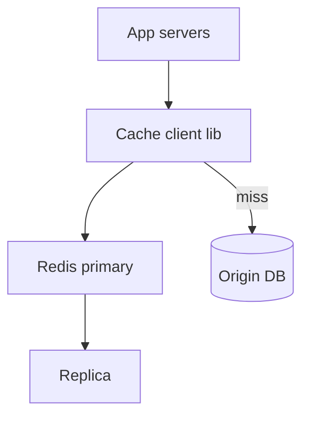
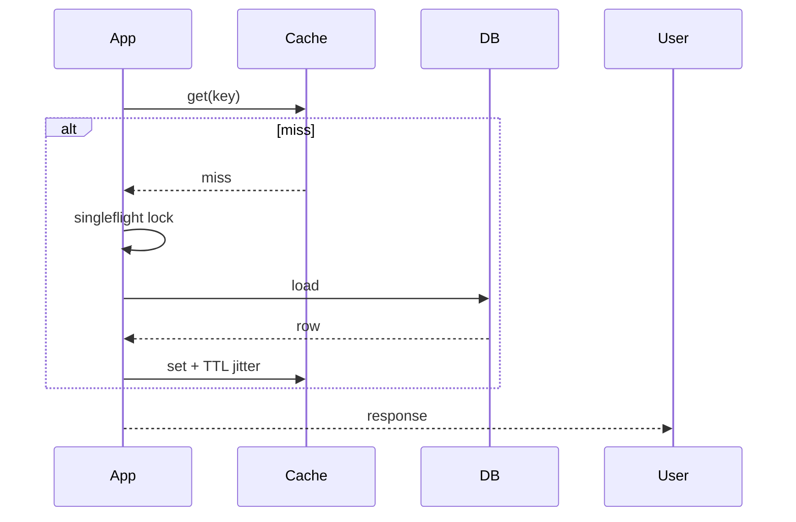

# HLD — Distributed Cache

## Live interview opening (clarify first — bar raiser order)

*“I’ll **start by clarifying requirements**—scope, ambiguity, latency and scale expectations—then lock **FR/NFR**. **After** that, I’ll ground **user journey**, **consistency**, **commit/decision**, and **risks** so it’s clearly **derived from what we agreed**, then **scale** and **architecture**—and I’ll **pause after the diagram** for where you want depth.”*

> **Uber SDE-2 HLD — drive order in this doc:** **§1** clarify → FR → NFR → **Framing after requirements** (user journey, consistency, commit/decision anchors) → **§2** scale → **§3** core entities + APIs → **§4** architecture → **§5** deep dive and evolution → **§6** scaling → **§7** reliability → **§8** tradeoffs → **§9** observability and security → **§10** patterns → **Closing**. Treat **Human interaction** cue blocks (headings in this doc) as *spoken* cues—**paraphrase**; do not read every row. **Bar raiser** listens for **ownership**, **failure modes**, and **honest tradeoffs**. Canonical spine: [HLD-UBER-SDE2-INTERVIEW-SPINE.md](./HLD-UBER-SDE2-INTERVIEW-SPINE.md).

## Interview delivery (golden thread — live thinking)

Bar-raiser polish: **user-first**, **explicit consistency**, **bottleneck**, **evolution**, **UX trust**, **default opinion** (not endless “A or B”). Full template + habits: **[HLD-BAR-RAISER-PERFORMANCE-PACK.md](./HLD-BAR-RAISER-PERFORMANCE-PACK.md)** · **[HLD-MASTER-DELIVERY-GOLDEN-FLOW.md](./HLD-MASTER-DELIVERY-GOLDEN-FLOW.md)**.

| Say at the right time | What interviewers grade | In this guide |
|----------------------|---------------------------|---------------|
| **Opening** | Clarify before solution | **Above** — you **do not** assume requirements. |
| **User journey + consistency + decisions** | Derived, not memorized | **After Section 1**, block **Framing after requirements** — **before Section 2** (not before clarify). |
| **Bottleneck / evolution / UX** | Ops + trust | Same **Framing** block; deep numbers still in **Sections 5–7**. |
| **Strong opinion** | Defaults | **Section 8** tradeoffs — always *“I’d start with X because…”*. |

**Do not:** read tables line-by-line · put user journey **before** clarify · fence-sit.  
**Do:** clarify → FR/NFR → **then** grounded journey → diagram → deep dive where steered.

---

## 1. Clarify requirements

### 1.0 Live flow

#### Live voice (real interviewer room)

**Sound like you’re *deciding*, not reciting:** one idea per breath, then **pause**. Tables here are **backup**—if your eyes are down for more than a couple of seconds, you’ve slipped into reading the doc.

**Bridge phrases (mix naturally):** *“Let me **name the fork** first…”* · *“I’ll **default to X**—tell me if your bar is stricter.”* · *“The reason I ask is it changes **who owns the commit** / **what’s on the hot path**.”* · *“I’ll **over-answer** one layer, then stop—**where should I zoom**?”*

**Ping them (conversation, not monologue):** *“Does that match how you’d scope it?”* · *“If we only deep-dive one thing, is it **A** or **B**?”* (swap **A/B** for two tensions from *your* opening paragraph above.)

**This topic in one breath:** “Cache is **TTL + invalidation + stampede**—I’ll say **eventual** and what **strong** buys us.”

**`Verbatim` / `Live` cues:** say a line **once**, then **rephrase** the next time—verbatim twice in a row reads *canned*.

**Opening (~once):** *“I’ll align **read vs write-through**, **consistency** (eventual vs strong), **eviction**, and **stampede**; then **client library**, **cluster topology**, **failure modes**. **Pause after the diagram**—**Redis cluster**, **invalidation**, or **multi-region**?”*

**Thinking transitions:** *“Cache is **not** a **source of truth**—I’ll say what **owns** truth.”*

**Live rule:** **Paraphrase** §1 tables; go deep **only if probed**.

**Micro-pauses:** *“So **writes** still go to the **origin** (or write-through with a defined consistency story), and we plan **stampede** explicitly—got it.”*

### 1.1 Clarify

| Topic | Say it like this in the room |
|--------------------------|-------------------------------|
| **Workload** | “**Hot key** social graph vs **session**?” |
| **TTL** | “Default **staleness** tolerance?” |
| **Size** | “**MB** values ok?” |
| **Multi-region** | “**Active-active** writes?” |

#### Human interaction (clarify requirements — think out loud & evolve scope)

**Verbatim:** *“Before Redis topology, I want workload (**hot key** vs session), default **TTL/staleness**, max value size, and whether you need **read-your-writes**—because that chooses **aside vs write-through** and how scary **invalidation** is.”*

**Verbatim (evolution):** *“**v1** single shard + replicas; **v2** Redis Cluster + client routing; **v3** multi-region only with explicit **conflict** rules—never pretend **active-active** is free.”*

### 1.2 Functional requirements (FR)

#### Human interaction (FR — after alignment)

**Verbatim:** *“We expose KV with TTL, common collection types if we’re Redis-shaped, and optional pub/sub hints for invalidation—functionally it’s a **fast read replica** with programmable eviction.”*

| FR area | Say it like this |
|---------|-------------------|
| **KV** | “Get/set/del with **TTL**.” |
| **Collections** | “Sets, sorted sets, hashes if Redis-shaped.” |
| **Optional** | “Pub/sub **invalidation** hints.” |

### 1.3 Non-functional requirements (NFR)

#### Human interaction (NFR — how it must behave)

**Verbatim:** *“Latency is usually **sub-ms** in-AZ; availability means **graceful miss**: if cache is sick, we still serve from origin with **timeouts** and **bulkheads**.”*

| NFR | Say it like this |
|-----|------------------|
| **Latency** | “**Sub-ms** in-AZ typical.” |
| **Availability** | “**Degrade** to **origin** on miss/outage.” |

### 1.4 Invariants

**Invariant:** “**Mutations** to **authoritative** state go through **primary store** first (or **write-through** with **acknowledged** consistency model); **cache** never **silently** invents **commits**.”

| Beat | Say it like this |
|------|------------------|
| **Bridge** | “**Cache-aside** + **TTL** + **jitter** for **most** reads.” |
| **Core split** | “**Client** owns **coalescing** / **circuit breaker**.” |

### Key insight (say early)

**Solve thundering herd** with **singleflight / request coalescing**, **probabilistic early refresh**, and **TTL jitter**—not bigger machines alone.

#### Key anchors

1. “**Consistent hashing** + **replicas**.”  
2. “**Hot key** **split** logical keys.”  
3. “**LRU** + **maxmemory policy**.”

---

## Framing after requirements (before scale + architecture)

**Placement in the room:** this block is **not** “right after clarify questions.” You earn it **after** you’ve locked **FR + NFR** (spoken summary is fine)—otherwise journey / consistency / commit boundaries read as **assuming** product and SLOs.

**Out loud:** *“We’ve **clarified** scope and I’ve stated **FR/NFR** from that—**based on that**, here’s the **user-visible path**, **consistency**, and **commit** I’ll hold before I size **Section 2** and draw **Section 4**.”*

### Thinking transitions (use during interview)

- *“Let me think through this…”*
- *“One tradeoff here is…”*
- *“If I optimize for latency…”*
- *“This might become a bottleneck because…”*
- *“I’d start simple here and evolve later…”*

## User journey (say once—**after** FR/NFR, not after clarify alone)

From the **application** perspective: **GET** tries cache → **hit** returns fast → **miss** loads from DB → **populate** cache; **writes** update DB then **invalidate** or **write-through** per policy.

From the **operator** perspective: **resize** clusters, **flush** bad keys, watch **hot spots** and **eviction** rates.

So:

- **read path** = single-flight / probabilistic early refresh to fight **thundering herds**.
- **write path** = source-of-truth update + **cache update/invalidate** (ordering matters).
- **async path** = **replication**, **AOF/RDB** snapshots, **cross-region** mirror lag.

## Consistency model

Default: **eventual** between cache and DB—say what **staleness** is acceptable per use case.

**Strong** only when you buy it with **distributed locks**, **versioned keys**, or **read-through** patterns you can defend—otherwise don’t pretend **linearizable** everywhere.

## Commit boundary

User-visible **read** “commits” to the value returned—define **stale-read** vs **read-your-writes** per feature.

**Invalidate** commits when downstream acknowledges—or **TTL** expiry makes the next read **self-heal**.

## Decision (strong opinion)

I’d start with:

- **Redis cluster** + **TTL** + **single-flight** + clear **invalidation** discipline per entity.

because most outages here are **stampede** + **bad invalidation**, not lack of features.

## Evolution

| Phase | Say it like this |
|-------|------------------|
| **1** | Simple implementation that ships. |
| **2** | Scaling: partitions, caches, queues, backpressure, observability. |
| **3** | Advanced / ML / global—only when metrics or product force it. |

Details: **Section 4.1 (phases)** and **Section 5** in this file.

## Bottleneck anchor

Watch first:

- **hot keys**, **big values**, **cross-slot** multi-key ops in cluster mode.
- **replication lag** vs **read preference**.

## Backpressure handling

Under load:

- **early expire** + jitter, **circuit break** origin on miss storms.
- **drop** optional cache population for **degraded** origin protection.

Goal: **protect DB** over **perfect** freshness.

## UX awareness

Bad outcomes:

- serving **very stale** prices or **wrong** feature flags—tie TTL to **trust** level.
- **thundering herd** taking down DB—worse than slow cache.

### Driving the conversation

- *“Does this direction make sense?”*
- *“Should I go deeper on **A** or **B**?”*
- *“Would you like failure scenarios next?”*

### Mindset

*“I’m not presenting a solution—I’m **designing with a teammate**.”*

**Playbook:** [HLD-BAR-RAISER-PERFORMANCE-PACK.md](./HLD-BAR-RAISER-PERFORMANCE-PACK.md).

---

## 2. Estimate scale

#### Human interaction (estimate scale)

**Verbatim:** *“Aggregate QPS can be millions and memory terabytes—**hot keys** and **connection storms** dominate design more than average RPS.”*

| Dimension | Illustrative |
|-----------|----------------|
| QPS | **Millions** aggregate |
| Memory | **TB** cluster |

---

## 3. APIs and data model

### 3.0 Core entities (who owns what — say before client API)

| Entity | Owns / lifecycle (one line) |
|--------|-----------------------------|
| **Cache entry** | **TTL** + bytes—**evicted** under pressure. |
| **Origin record** | **Authoritative** truth in DB. |
| **Client coalescer** | **Singleflight** / in-flight dedupe—**app tier**. |

#### Human interaction (API design)

**Verbatim:** *“Client API is `get/set/del` with TTL; optional CAS when we need optimistic concurrency; **never** use cache as the only write path for money.”*

### 3.1 Client API (conceptual)

- `get(key)`, `set(key, val, ttl)`, `del(key)`  
- **CAS** optional (`SET NX`, versioned **ETag** pattern)

---

## 4. High-level architecture

#### Human interaction (high-level architecture / HLD)

**Verbatim:** *“Apps use a client library to talk to Redis primaries with replicas; on miss we go to origin; **replication** is for read scale and failover, not a magic consistency wand.”*

### 4.1 Phases

| Phase | Ship |
|-------|------|
| **1** | Single shard Redis + replicas |
| **2** | **Cluster** + **client-side** routing |
| **3** | **Global** **active-passive** with **conflict** rules |

---

## 5. Deep dive: cache-aside read

#### Human interaction (deep dive — critical flow, optimizations & evolution)

**Verbatim:** *“Cache-aside read: try cache, on miss **singleflight** one origin load per key, set with **TTL jitter**, return; **thundering herd** is the interview trap—call it first.”*

**Verbatim (evolution):** *“Add **stale-while-revalidate** for soft freshness; add **near-cache L1** only when invalidation complexity is worth it.”*

### 🎯 Bottleneck Anchor

“**Thundering herd** on **popular key expiry**—**coalesce** + **stale-while-revalidate**.”

**Taking a stance:** *“**Write-through** when **read-after-write** must be **fresh**; **aside** for **most** denormalized reads.”*

---

## 6. Scaling and bottlenecks

#### Human interaction (scaling & bottlenecks)

**Verbatim:** *“Hot keys mean **logical sharding** in the app, not buying a bigger Redis; big payloads mean compression policy and maybe chunking.”*

| Risk | Mitigation |
|------|------------|
| **Hot key** | **Subkey sharding** in app |
| **Big payload** | **Compression** + **chunking** policy |
| **Failover** | **Replica** promotion with **fencing** if strong consistency needed |

---

## 7. Reliability and failure handling

#### Human interaction (reliability & failure handling)

**Verbatim:** *“Split brain is a product decision: I’ll state whether we choose **availability + stale reads** or chase stronger consistency with **fencing**—I won’t leave it ambiguous.”*

- **Cluster split:** prefer **availability** + **stale** vs **split-brain writes**—define.  
- **Origin slow:** **bulkhead** threads fetching DB.

---

## 8. Tradeoffs and alternatives

#### Human interaction (tradeoffs & alternatives)

**Verbatim:** *“Redis vs Memcached is features vs simplicity; local L1 is speed vs invalidation complexity—I'll pick **Redis cluster + aside** as default unless you force near-cache.”*

| Choice | Trade |
|--------|--------|
| **Redis vs Memcached** | Rich ops vs **simplicity** |
| **Local L1** | Speed vs **invalidation** complexity |

---

## 9. Monitoring, observability, and security

#### Human interaction (monitoring, observability & security)

**Verbatim:** *“Watch hit rate, latency, evictions, and connection churn; security is **TLS + ACL prefixes** and never storing raw secrets in Redis values.”*

**Metrics:** **hit rate**, **latency**, **evictions**, **connections**.  
**Security:** **TLS**, **ACL** per prefix; **no secrets** in values.

---

## 10. Design patterns, data structures & best practices

#### Human interaction (design patterns, data structures & best practices)

**Verbatim (say 5–6 on the board):** *“**Cache-aside** for most reads, **write-through** when read-your-writes matters, **TTL + jitter**, **singleflight** against stampedes, **consistent hashing** for cluster routing, **pub/sub** for optional invalidation, and **circuit breaker** to origin.”*

| Pattern / DS | Where | One interview line |
|----------------|------|----------------------|
| **Cache-aside** | App + Redis | “Miss loads origin once, then populate.” |
| **Write-through / write-behind** | Write path | “Pick explicit consistency; never silent commits.” |
| **TTL + jitter** | All keys | “Prevent synchronized expiry stampedes.” |
| **Singleflight / coalescing** | App | “One origin load per hot key per window.” |
| **Consistent hashing** | Redis Cluster | “Minimal reshuffle on node add/remove.” |
| **LRU / maxmemory policy** | Redis | “Eviction behavior is part of correctness under load.” |

---

## Closing notes

#### Human interaction (closing notes)

**Verbatim:** *“Cache speeds reads, origin owns truth, **TTL+jitter+singleflight** handle herds, cluster + replicas handle scale—**stale** is a product knob, not an accident.”*

| Do | Avoid |
|----|--------|
| **Stampede story** | “We’ll set a TTL” only |
| **Ownership of truth** | Cache as database |

---

## Bar-raiser follow-ups

#### Human interaction (bar-raiser follow-ups)

**Verbatim:** *“Want **near-cache**, **strong consistency**, or **multi-region**—I’ll go where you point.”*

| They ask | Say it like this |
|----------|------------------|
| **Near-cache** | “**Per-process** L1 + **pub/sub** invalidation—**complex**.” |

---

## 60-second close

#### Human interaction (60-second close)

**Verbatim:** *“**Aside** default, **TTL+jitter**, **singleflight**, Redis **cluster+replicas**, hot key **sharding**, never sole SoT for commits.”*

| Beat | Say it like this |
|------|------------------|
| **Recap** | “**Cache-aside** default; **TTL+jitter**; **singleflight**; **Redis cluster** + **replicas**; **hot key** patterns; **never** sole **source of truth** for **commits**.” |

---
