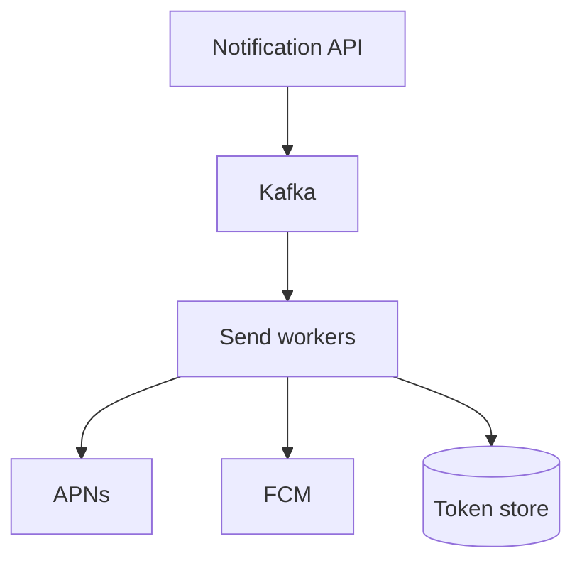
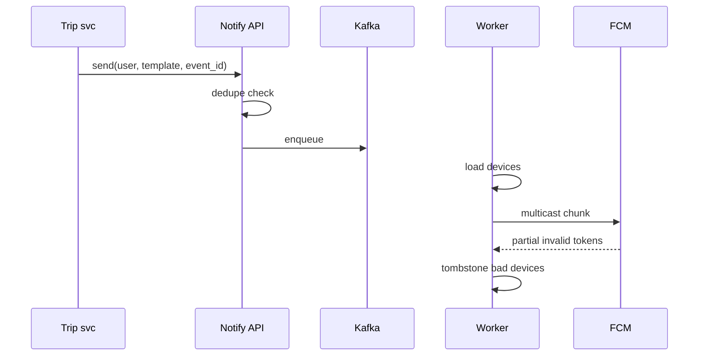

# HLD — Push Notification Service

## Live interview opening (clarify first — bar raiser order)

*“I’ll **start by clarifying requirements**—scope, ambiguity, latency and scale expectations—then lock **FR/NFR**. **After** that, I’ll ground **user journey**, **consistency**, **commit/decision**, and **risks** so it’s clearly **derived from what we agreed**, then **scale** and **architecture**—and I’ll **pause after the diagram** for where you want depth.”*

> **Uber SDE-2 HLD — drive order in this doc:** **§1** clarify → FR → NFR → **Framing after requirements** (user journey, consistency, commit/decision anchors) → **§2** scale → **§3** core entities + APIs → **§4** architecture → **§5** deep dive and evolution → **§6** scaling → **§7** reliability → **§8** tradeoffs → **§9** observability and security → **§10** patterns → **Closing**. Treat **Human interaction** cue blocks (headings in this doc) as *spoken* cues—**paraphrase**; do not read every row. **Bar raiser** listens for **ownership**, **failure modes**, and **honest tradeoffs**. Canonical spine: [HLD-UBER-SDE2-INTERVIEW-SPINE.md](./HLD-UBER-SDE2-INTERVIEW-SPINE.md).

## Interview delivery (golden thread — live thinking)

Bar-raiser polish: **user-first**, **explicit consistency**, **bottleneck**, **evolution**, **UX trust**, **default opinion** (not endless “A or B”). Full template + habits: **[HLD-BAR-RAISER-PERFORMANCE-PACK.md](./HLD-BAR-RAISER-PERFORMANCE-PACK.md)** · **[HLD-MASTER-DELIVERY-GOLDEN-FLOW.md](./HLD-MASTER-DELIVERY-GOLDEN-FLOW.md)**.

| Say at the right time | What interviewers grade | In this guide |
|----------------------|---------------------------|---------------|
| **Opening** | Clarify before solution | **Above** — you **do not** assume requirements. |
| **User journey + consistency + decisions** | Derived, not memorized | **After Section 1**, block **Framing after requirements** — **before Section 2** (not before clarify). |
| **Bottleneck / evolution / UX** | Ops + trust | Same **Framing** block; deep numbers still in **Sections 5–7**. |
| **Strong opinion** | Defaults | **Section 8** tradeoffs — always *“I’d start with X because…”*. |

**Do not:** read tables line-by-line · put user journey **before** clarify · fence-sit.  
**Do:** clarify → FR/NFR → **then** grounded journey → diagram → deep dive where steered.

---

## 1. Clarify requirements

### 1.0 Live flow

#### Live voice (real interviewer room)

**Sound like you’re *deciding*, not reciting:** one idea per breath, then **pause**. Tables here are **backup**—if your eyes are down for more than a couple of seconds, you’ve slipped into reading the doc.

**Bridge phrases (mix naturally):** *“Let me **name the fork** first…”* · *“I’ll **default to X**—tell me if your bar is stricter.”* · *“The reason I ask is it changes **who owns the commit** / **what’s on the hot path**.”* · *“I’ll **over-answer** one layer, then stop—**where should I zoom**?”*

**Ping them (conversation, not monologue):** *“Does that match how you’d scope it?”* · *“If we only deep-dive one thing, is it **A** or **B**?”* (swap **A/B** for two tensions from *your* opening paragraph above.)

**This topic in one breath:** “Push is **tokens + fan-out + provider reality**—delivery is **best-effort**, with dedupe and receipts.”

**`Verbatim` / `Live` cues:** say a line **once**, then **rephrase** the next time—verbatim twice in a row reads *canned*.

**Opening (~once):** *“I’ll align **transactional vs marketing**, **device tokens**, **priority**, and **delivery guarantees**; then **API**, **queue**, **provider adapters** (APNs/FCM). **Pause after the diagram**—**fan-out**, **privacy**, or **throttling**?”*

**Thinking transitions:** *“Push is **at-most-once** from the provider’s POV—**idempotency** at **our** boundary for **transactional**.”*

**Live rule:** **Paraphrase** §1 tables; go deep **only if probed**.

**Micro-pauses:** *“So **transactional** gets dedupe + priority, **marketing** can’t starve **trip** pushes, and tokens are **hygienic** on **410**—got it.”*

### 1.1 Clarify

| Topic | Say it like this in the room |
|--------------------------|-------------------------------|
| **Volume** | “**Marketing blast** vs **trip updates**?” |
| **Personalization** | “Deep links + **payload** size limits?” |
| **Quiet hours** | “**Compliance** by locale?” |
| **Web** | “**Web Push** in scope?” |

#### Human interaction (clarify requirements — think out loud & evolve scope)

**Verbatim:** *“I’m separating **transactional** vs **marketing**, device token lifecycle, consent/quiet hours, and provider limits—because push is half **policy** and half **plumbing**.”*

**Verbatim (evolution):** *“**v1** one provider + DB tokens; **v2** split priority queues + per-tenant throttles; **v3** geo-routed provider pools for HA.”*

### 1.2 Functional requirements (FR)

#### Human interaction (FR — after alignment)

**Verbatim:** *“Users register devices, we send to a user/topic/segment, and we track delivery/open when the OS gives us callbacks—**transactional** sends are deduped by `(user, event_id)` so retries don’t spam.”*

| FR area | Say it like this |
|---------|-------------------|
| **Register** | “Device **token** per **user** + **platform**.” |
| **Send** | “Single user, **topic**, or **segment**.” |
| **Track** | “Delivered/opened **if** OS provides callbacks.” |

**Cross-ref:** Stock-style alerts — [16-hld-notification-stock-alerts.md](./16-hld-notification-stock-alerts.md); email/SMS — [35-hld-email-sms-notification.md](./35-hld-email-sms-notification.md).

### 1.3 Non-functional requirements (NFR)

#### Human interaction (NFR — how it must behave)

**Verbatim:** *“Transactional is seconds-class; marketing can be slower but still needs **backoff** on provider 5xx and a **DLQ** for poison—**never** infinite blind retries.”*

| NFR | Say it like this |
|-----|------------------|
| **Latency** | “**Transactional** **seconds** class; **marketing** **minutes** ok.” |
| **Reliability** | “**DLQ** + **retry** with backoff for provider **5xx**.” |

### 1.4 Invariants

**Invariant:** “A **transactional** notification (e.g. **trip assigned**) is **deduped** by **`(user_id, event_id)`** within a **TTL window** so **retries** don’t **spam**.”

| Beat | Say it like this |
|------|------------------|
| **Bridge** | “**API** → **Kafka** → **workers** → **APNs/FCM**.” |
| **Core split** | “**Token registry** vs **send pipeline**.” |

### Key insight (say early)

**Adapter layer** per provider + **central policy** (rate, consent, quiet hours) + **fan-out workers** for **segments**.

#### Key anchors

1. “**Token invalidation** on **410** / **Unregistered**.”  
2. “**Collapse_key** (Android) / **apns-id** (iOS) for **dedupe**.”  
3. “**Consent** gate.”

---

## Framing after requirements (before scale + architecture)

**Placement in the room:** this block is **not** “right after clarify questions.” You earn it **after** you’ve locked **FR + NFR** (spoken summary is fine)—otherwise journey / consistency / commit boundaries read as **assuming** product and SLOs.

**Out loud:** *“We’ve **clarified** scope and I’ve stated **FR/NFR** from that—**based on that**, here’s the **user-visible path**, **consistency**, and **commit** I’ll hold before I size **Section 2** and draw **Section 4**.”*

### Thinking transitions (use during interview)

- *“Let me think through this…”*
- *“One tradeoff here is…”*
- *“If I optimize for latency…”*
- *“This might become a bottleneck because…”*
- *“I’d start simple here and evolve later…”*

## User journey (say once—**after** FR/NFR, not after clarify alone)

From the **product** perspective: event happens → **enqueue** notification → **fan-out** to devices → **APNs/FCM** attempts delivery → client shows notification; user may change **tokens**, **opt-out**, or **quiet hours**.

So:

- **write path** = **campaign** / **transactional** triggers → **dedupe** + **suppression** rules → **outbox** → provider workers.
- **read path** = **device token registry**, **preferences**—read on every send decision.
- **async path** = **receipts**, **retries**, **dead-letter** for bad tokens, **analytics** opens.

## Consistency model

Delivery to devices is **best-effort** at the physics layer—your system still needs **dedupe** (logical notification id) and **at-least-once** internal pipeline with **idempotent** provider calls where possible.

**Token** mapping is **eventually consistent**; **invalid token** errors must **prune** registry asynchronously.

## Commit boundary

“Accepted to send” means durable **outbox** row + policy checks (**quiet hours**, **frequency caps**, **opt-out**) passed—**not** “APNs said OK” (that’s downstream).

## Decision (strong opinion)

I’d start with:

- **Kafka/SQS** + **worker pools** per provider + **circuit breakers** + **token hygiene**.

because **provider rate limits** and **token churn** dominate real incidents.

## Evolution

| Phase | Say it like this |
|-------|------------------|
| **1** | Simple implementation that ships. |
| **2** | Scaling: partitions, caches, queues, backpressure, observability. |
| **3** | Advanced / ML / global—only when metrics or product force it. |

Details: **Section 4.1 (phases)** and **Section 5** in this file.

## Bottleneck anchor

Watch first:

- **fan-out** queues, **provider** throttling, **hot campaigns**.

## Backpressure handling

Under load:

- **coalesce** similar notifications, **delay** non-critical pushes, **shed** marketing before **transactional** OTP-class traffic (if policy allows prioritization).

Goal: **trustworthy critical pushes** over **every** marketing ping on time.

## UX awareness

Bad outcomes:

- **duplicate** OTP / **spam** bursts.
- **wrong device** / stale token loops hammering providers.

### Driving the conversation

- *“Does this direction make sense?”*
- *“Should I go deeper on **A** or **B**?”*
- *“Would you like failure scenarios next?”*

### Mindset

*“I’m not presenting a solution—I’m **designing with a teammate**.”*

**Playbook:** [HLD-BAR-RAISER-PERFORMANCE-PACK.md](./HLD-BAR-RAISER-PERFORMANCE-PACK.md).

---

## 2. Estimate scale

#### Human interaction (estimate scale)

**Verbatim:** *“Billions sends/day and occasional **massive** fan-out means Kafka partitioning and **separate** traffic classes—**marketing** must not crowd out **trip**.”*

| Dimension | Illustrative |
|-----------|----------------|
| Sends / day | **Billions** at mega-scale |
| Fan-out | **Millions** for rare blasts—**partition** topic |

---

## 3. APIs and data model

### 3.0 Core entities (who owns what — say before API tables)

| Entity | Owns / lifecycle (one line) |
|--------|-----------------------------|
| **DeviceToken** | Per user/platform/app version—**tombstone** on invalidation. |
| **NotificationJob** | Priority + **dedupe_key** + payload ref. |
| **Provider adapter** | APNs/FCM quirks—**isolated** module. |

#### Human interaction (API design)

**Verbatim:** *“`POST /devices` registers tokens; `POST /notifications` enqueues work with **idempotency**; topics are for fan-out segments—**authZ** everywhere.”*

### 3.1 APIs

| API | Purpose |
|-----|---------|
| `POST /v1/devices` | Register token |
| `POST /v1/notifications` | Enqueue send |
| `POST /v1/topics/{id}/subscribe` | Topic fan-out |

### 3.2 Model

- **Device:** `user_id`, `token`, `platform`, `app_version`, `last_seen`.  
- **NotificationJob:** `id`, `payload_ref`, `priority`, `dedupe_key`.

---

## 4. High-level architecture

#### Human interaction (high-level architecture / HLD)

**Verbatim:** *“API accepts sends and writes durable jobs to Kafka; workers fan out to provider adapters; token store is updated when providers tell us tokens are dead.”*

### 4.1 Phases

| Phase | Ship |
|-------|------|
| **1** | Single provider + DB tokens |
| **2** | **Priority queues** + **per-tenant** rate |
| **3** | **Geo** routing + **HA** provider pools |

---

## 5. Deep dive: enqueue → provider

#### Human interaction (deep dive — critical flow, optimizations & evolution)

**Verbatim:** *“Trip service calls notify API with template + event id; we dedupe, enqueue to Kafka, worker loads devices, multicasts in chunks, tombstones invalid tokens—**provider rate limits** drive adaptive concurrency.”*

**Verbatim (evolution):** *“Split **priority topics** early; add **per-tenant** token buckets; add **geo** pools only when HA demands it.”*

### 🎯 Bottleneck Anchor

“**Provider rate limits** + **invalid tokens**—**adaptive** concurrency and **token hygiene**.”

**Taking a stance:** *“**Transactional** path **small** Kafka **priority** topic; **marketing** **separate** cluster/pool so **blast** doesn’t **starve** **trip** pushes.”*

---

## 6. Scaling and bottlenecks

#### Human interaction (scaling & bottlenecks)

**Verbatim:** *“Biggest risks are **segment fan-out** and **hot users** with tons of devices—pre-materialize audiences and cap devices per send.”*

| Risk | Mitigation |
|------|------------|
| **Segment fan-out** | **Pre-materialize** audiences in **batch** |
| **Hot user** many devices | **Cap** devices per send |

---

## 7. Reliability and failure handling

#### Human interaction (reliability & failure handling)

**Verbatim:** *“Provider outage means exponential backoff and DLQ for poison; duplicate API calls are absorbed by **idempotency keys**—same as any money-adjacent surface.”*

- **Provider outage:** **exponential backoff**; **DLQ** for manual replay.  
- **Duplicate API:** **idempotency key** on `POST /notifications`.

---

## 8. Tradeoffs and alternatives

#### Human interaction (tradeoffs & alternatives)

**Verbatim:** *“Rich payloads improve UX but hurt privacy and size limits; pull inbox is reliable but not native push—I'll state what product optimizes for.”*

| Choice | Trade |
|--------|--------|
| **Data in payload** | Rich UX vs **privacy** + size |
| **Pull inbox** | Reliable vs **not native push** |

---

## 9. Monitoring, observability, and security

#### Human interaction (monitoring, observability & security)

**Verbatim:** *“I’d dashboard provider error codes, queue depth, invalid token rate, and end-to-end latency from enqueue to provider ack; tokens encrypted at rest, deep links signed, payloads minimized.”*

**Metrics:** **provider** error codes, **latency**, **queue depth**, **invalid token** rate.  
**Security:** **Encrypt** tokens at rest; **no PII** in payload if avoidable; **signed** deep links.

---

## 10. Design patterns, data structures & best practices

#### Human interaction (design patterns, data structures & best practices)

**Verbatim (say 5–6 on the board):** *“**Adapter** per provider, **outbox** from upstream services for durable enqueue, **bulkhead** pools separating marketing vs transactional, **priority queues** in Kafka, **idempotency + dedupe keys**, **token registry** hygiene, and **circuit breaker** around flaky providers.”*

| Pattern / DS | Where | One interview line |
|----------------|------|----------------------|
| **Adapter** | APNs/FCM | “Isolate provider quirks behind one interface.” |
| **Transactional outbox** | Upstream OLTP | “Don’t lose ‘user must be notified’ if Kafka hiccups.” |
| **Bulkhead / separate pools** | Workers | “Marketing blasts don’t starve trip pushes.” |
| **Priority queue / topics** | Kafka | “Different SLO classes get different lanes.” |
| **Exponential backoff + DLQ** | Worker | “5xx and poison messages need bounded pain.” |
| **Device token index** | DB/Redis | “Fast lookup + tombstone invalid tokens.” |

---

## Closing notes

#### Human interaction (closing notes)

**Verbatim:** *“Token registry + Kafka workers + provider adapters + dedupe for transactional + split pools so marketing can’t take down trip reliability.”*

| Do | Avoid |
|----|--------|
| **Dedupe + priority split** | One queue for everything |
| **Token tombstone** | Retry forever on dead token |

---

## Bar-raiser follow-ups

#### Human interaction (bar-raiser follow-ups)

**Verbatim:** *“Go deep on **rich media**, **consent**, or **multi-region** delivery—your pick.”*

| They ask | Say it like this |
|----------|------------------|
| **Rich media** | “**Attachment** URLs **signed**; **download** on display.” |

---

## 60-second close

#### Human interaction (60-second close)

**Verbatim:** *“**Deduped transactional** enqueue, **Kafka** workers, **APNs/FCM adapters**, **token tombstones**, **bulkhead** marketing vs trip, watch **provider errors**.”*

| Beat | Say it like this |
|------|------------------|
| **Recap** | “**Token registry**; **Kafka** + **workers**; **provider adapters**; **dedupe** for **transactional**; **separate** pools for **marketing**; **metrics** on **provider errors**.” |

---
