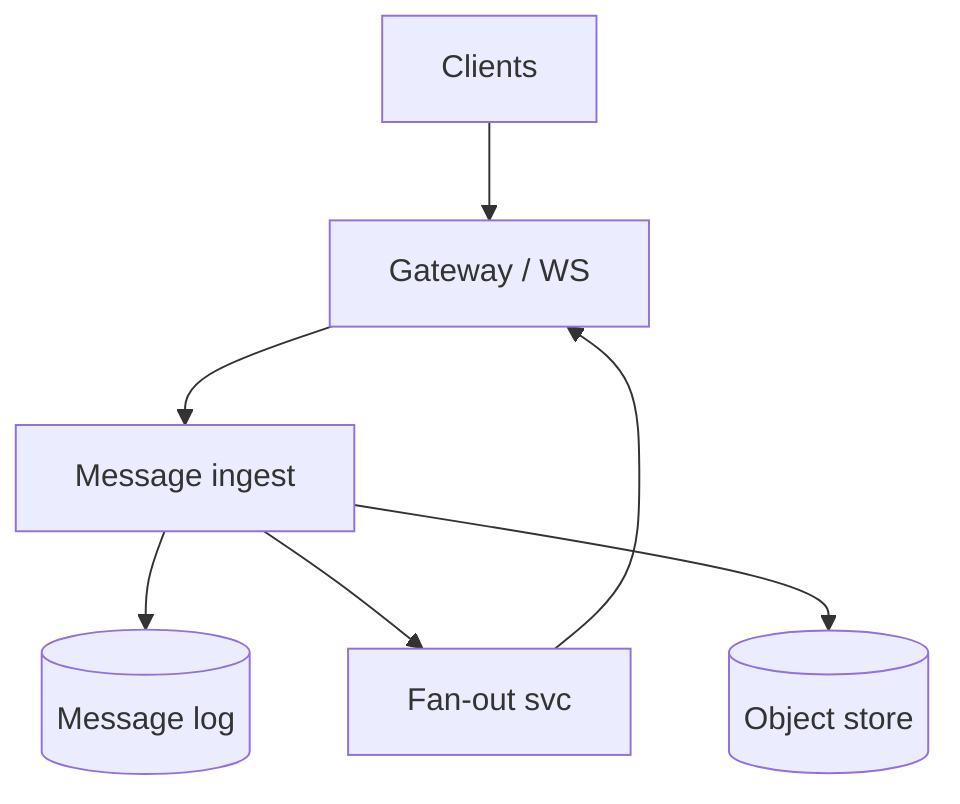
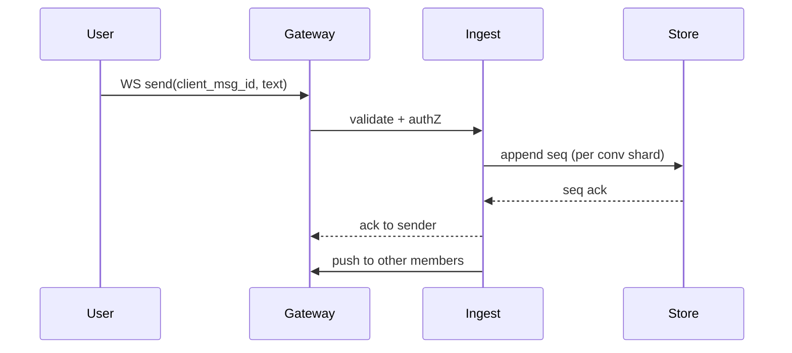

# HLD — Chat / Messaging Platform

## Live interview opening (clarify first — bar raiser order)

*“I’ll **start by clarifying requirements**—scope, ambiguity, latency and scale expectations—then lock **FR/NFR**. **After** that, I’ll ground **user journey**, **consistency**, **commit/decision**, and **risks** so it’s clearly **derived from what we agreed**, then **scale** and **architecture**—and I’ll **pause after the diagram** for where you want depth.”*

> **Uber SDE-2 HLD — drive order in this doc:** **§1** clarify → FR → NFR → **Framing after requirements** (user journey, consistency, commit/decision anchors) → **§2** scale → **§3** core entities + APIs → **§4** architecture → **§5** deep dive and evolution → **§6** scaling → **§7** reliability → **§8** tradeoffs → **§9** observability and security → **§10** patterns → **Closing**. Treat **Human interaction** cue blocks (headings in this doc) as *spoken* cues—**paraphrase**; do not read every row. **Bar raiser** listens for **ownership**, **failure modes**, and **honest tradeoffs**. Canonical spine: [HLD-UBER-SDE2-INTERVIEW-SPINE.md](./HLD-UBER-SDE2-INTERVIEW-SPINE.md).

## Interview delivery (golden thread — live thinking)

Bar-raiser polish: **user-first**, **explicit consistency**, **bottleneck**, **evolution**, **UX trust**, **default opinion** (not endless “A or B”). Full template + habits: **[HLD-BAR-RAISER-PERFORMANCE-PACK.md](./HLD-BAR-RAISER-PERFORMANCE-PACK.md)** · **[HLD-MASTER-DELIVERY-GOLDEN-FLOW.md](./HLD-MASTER-DELIVERY-GOLDEN-FLOW.md)**.

| Say at the right time | What interviewers grade | In this guide |
|----------------------|---------------------------|---------------|
| **Opening** | Clarify before solution | **Above** — you **do not** assume requirements. |
| **User journey + consistency + decisions** | Derived, not memorized | **After Section 1**, block **Framing after requirements** — **before Section 2** (not before clarify). |
| **Bottleneck / evolution / UX** | Ops + trust | Same **Framing** block; deep numbers still in **Sections 5–7**. |
| **Strong opinion** | Defaults | **Section 8** tradeoffs — always *“I’d start with X because…”*. |

**Do not:** read tables line-by-line · put user journey **before** clarify · fence-sit.  
**Do:** clarify → FR/NFR → **then** grounded journey → diagram → deep dive where steered.

---

## 1. Clarify requirements

### 1.0 Live flow

#### Live voice (real interviewer room)

**Sound like you’re *deciding*, not reciting:** one idea per breath, then **pause**. Tables here are **backup**—if your eyes are down for more than a couple of seconds, you’ve slipped into reading the doc.

**Bridge phrases (mix naturally):** *“Let me **name the fork** first…”* · *“I’ll **default to X**—tell me if your bar is stricter.”* · *“The reason I ask is it changes **who owns the commit** / **what’s on the hot path**.”* · *“I’ll **over-answer** one layer, then stop—**where should I zoom**?”*

**Ping them (conversation, not monologue):** *“Does that match how you’d scope it?”* · *“If we only deep-dive one thing, is it **A** or **B**?”* (swap **A/B** for two tensions from *your* opening paragraph above.)

**This topic in one breath:** “Chat is **fast ack, durable log, async fan-out**—ordering stays **per conversation**.”

**`Verbatim` / `Live` cues:** say a line **once**, then **rephrase** the next time—verbatim twice in a row reads *canned*.

**Opening (~once):** *“I’ll align **1:1 vs groups**, **ordering**, **delivery receipts**, **E2E encryption** scope, and **media**; then **sessions**, **storage**, **sync protocol**. **Pause after the diagram**—**fan-out**, **presence**, or **search**?”*

**Thinking transitions:** *“**WhatsApp-shaped** details live in [14-hld-whatsapp-web-messaging.md](./14-hld-whatsapp-web-messaging.md)—here I’ll keep a **generic platform** spine.”*

**Live rule:** **Paraphrase** §1 tables; go deep **only if probed**.

**Micro-pauses:** *“So ordering is **per conversation**, duplicates collapse on **`client_msg_id`**, and fan-out is **async** after a fast ack—got it.”*

### 1.1 Clarify

| Topic | Say it like this in the room |
|--------------------------|-------------------------------|
| **Ordering** | “**Per conversation** total order vs **causal**?” |
| **Size** | “**Message** max size; **media** offload?” |
| **Search** | “Server-side **full text** or **client** only?” |
| **Compliance** | “**Legal hold** / **export**?” |

#### Human interaction (clarify requirements — think out loud & evolve scope)

**Verbatim:** *“I’m aligning 1:1 vs groups, ordering guarantees, receipts, media offload, and compliance—because those decide **shard keys**, **fan-out**, and whether search is in-scope.”*

**Verbatim (evolution):** *“**v1** single region 1:1; **v2** groups + conversation sharding; **v3** global with regional conversation home—still **per-conversation** ordering, not global.”*

### 1.2 Functional requirements (FR)

#### Human interaction (FR — after alignment)

**Verbatim:** *“Send message, sync online via push, offline via cursor replay, optional delivered/read, and groups with explicit membership + fan-out policy.”*

| FR area | Say it like this |
|---------|-------------------|
| **Send** | “Client sends **message** to **conversation**.” |
| **Sync** | “**Online** push; **offline** pull since **cursor**.” |
| **State** | “**Delivered/read** if product requires.” |
| **Groups** | “**Membership** + **fan-out** policy.” |

### 1.3 Non-functional requirements (NFR)

#### Human interaction (NFR — how it must behave)

**Verbatim:** *“Low p99 on send ack, global users, durability is at-least-once server receive with **client dedupe**—I’ll say that plainly so nobody imagines magic exactly-once over the internet.”*

| NFR | Say it like this |
|-----|------------------|
| **Latency** | “**Low p99** for send ack; **global** users.” |
| **Durability** | “**At-least-once** server receive; **dedupe** client `msg_id`.” |

### 1.4 Invariants

**Invariant:** “Within a **conversation**, messages have a **monotonic server sequence** (or **Lamport**-style ordering) visible to readers; **duplicates** from **retries** collapse to **one** logical message.”

| Beat | Say it like this |
|------|------------------|
| **Bridge** | “**Ingest** path **fast ack**; **fan-out** **async**.” |
| **Core split** | “**Session gateway** vs **message store** vs **media blob**.” |

### Key insight (say early)

**Partition by conversation_id** for **write locality**; **replicate** for **HA**; **separate hot path** (**WS gateway**) from **cold storage** (**object store** for media).

#### Key anchors

1. “**Client-generated UUID** + **server seq**.”  
2. “**WS/MQTT** + **missed message sync**.”  
3. “**Presence** **ephemeral**.”

---

## Framing after requirements (before scale + architecture)

**Placement in the room:** this block is **not** “right after clarify questions.” You earn it **after** you’ve locked **FR + NFR** (spoken summary is fine)—otherwise journey / consistency / commit boundaries read as **assuming** product and SLOs.

**Out loud:** *“We’ve **clarified** scope and I’ve stated **FR/NFR** from that—**based on that**, here’s the **user-visible path**, **consistency**, and **commit** I’ll hold before I size **Section 2** and draw **Section 4**.”*

### Thinking transitions (use during interview)

- *“Let me think through this…”*
- *“One tradeoff here is…”*
- *“If I optimize for latency…”*
- *“This might become a bottleneck because…”*
- *“I’d start simple here and evolve later…”*

## User journey (say once—**after** FR/NFR, not after clarify alone)

From the user’s perspective: send message → **fast ACK** → appears in thread in **server order**; other members receive via **fan-out** (online) or **catch-up** (offline); typing/presence is **ephemeral**.

So:

- **write path** = **ingest** → **durable log** per **conversation** → assign **sequence** → **async** delivery to recipients.
- **read path** = **history pagination** + live **subscription** stream.
- **async path** = search indexing, moderation, analytics—must not block **ACK** path.

## Consistency model

**Ordering is per conversation** (not global); **at-least-once** + **dedupe** (`client_msg_id`) for **effectively-once** UX.

**Fast ACK** still means **durability policy** you name (WAL risk vs latency)—don’t pretend otherwise.

## Commit boundary

Message is “real” after **durable commit** to the conversation log—ACK to client matches that contract.

**Fan-out** completion is **async**; **read receipts** may **lag** messages.

## Decision (strong opinion)

I’d start with:

- **partitioned log** (`conversation_id`) + **queue fan-out** + **separate** hot path for ephemeral signals.

because **WhatsApp-shaped** problems die on **synchronous** fan-out at send time.

## Evolution

| Phase | Say it like this |
|-------|------------------|
| **1** | Simple implementation that ships. |
| **2** | Scaling: partitions, caches, queues, backpressure, observability. |
| **3** | Advanced / ML / global—only when metrics or product force it. |

Details: **Section 4.1 (phases)** and **Section 5** in this file.

## Bottleneck anchor

Watch first:

- **hot conversations** (fan-out backlog).
- **reconnect** catch-up storms.

## Backpressure handling

Under load:

- **shed typing/presence** first; **throttle** sends per user.
- **paginate** history aggressively; **isolate** abusive chats.

Goal: **message durability + order** over **perfect** side-channel freshness.

## UX awareness

Bad outcomes:

- **dup** messages, **gaps** on reconnect, **slow ACK** feels like “not sent.”

### Driving the conversation

- *“Does this direction make sense?”*
- *“Should I go deeper on **A** or **B**?”*
- *“Would you like failure scenarios next?”*

### Mindset

*“I’m not presenting a solution—I’m **designing with a teammate**.”*

**Playbook:** [HLD-BAR-RAISER-PERFORMANCE-PACK.md](./HLD-BAR-RAISER-PERFORMANCE-PACK.md).

---

## 2. Estimate scale

#### Human interaction (estimate scale)

**Verbatim:** *“Billions of messages per day means **partition by conversation_id**, cap group sizes for predictable fan-out, and scale gateways horizontally with **sticky** sessions.”*

| Dimension | Illustrative |
|-----------|----------------|
| Messages / day | **Billions** at scale |
| Group size | **Cap** (e.g. 256) for **fan-out** predictability |

---

## 3. APIs and data model

### 3.0 Core entities (who owns what — say before API tables)

| Entity | Owns / lifecycle (one line) |
|--------|-----------------------------|
| **Conversation** | Membership + metadata—**shard** soul. |
| **Message** | Append-only `(conv_id, server_seq, client_msg_id)`—**immutable**. |
| **Media object** | Blob store + ref on message—**async** scan. |

#### Human interaction (API design)

**Verbatim:** *“REST for history, WS for live; every send carries **`client_msg_id`** so retries don’t duplicate chat lines.”*

### 3.1 APIs

| API | Purpose |
|-----|---------|
| `POST /v1/conversations/{id}/messages` | Send |
| `GET /v1/conversations/{id}/messages?cursor=` | History |
| `WS /v1/connect` | Live stream |

### 3.2 Model

- **Message:** `(conversation_id, server_seq, client_msg_id, sender_id, body_ref, ts)`.  
- **Conversation:** metadata, **member_ids**.

---

## 4. High-level architecture

#### Human interaction (high-level architecture / HLD)

**Verbatim:** *“Gateway keeps WS sessions hot; ingest writes append-only log per conversation; fan-out pushes to other members; media goes to object store—**write log first**, push best-effort.”*

### 4.1 Phases

| Phase | Ship |
|-------|------|
| **1** | Single region, 1:1 |
| **2** | Groups + **sharded** conversations |
| **3** | **Global** with **regional** home for conversation |

---

## 5. Deep dive: send message

#### Human interaction (deep dive — critical flow, optimizations & evolution)

**Verbatim:** *“Client sends over WS with `client_msg_id`, gateway authZ, ingest assigns **server_seq** on the conversation shard, acks sender fast, then async fan-out to other members—large groups need shard fan-out trees.”*

**Verbatim (evolution):** *“Start 1:1; add group caps + fan-out workers; go global with **home region** per conversation—still **per-conversation** monotonic seq.”*

### 🎯 Bottleneck Anchor

“**Large group fan-out**—**precomputed** recipient shards or **gossip** style **fan-out tree**.”

**Taking a stance:** *“**Write** to **log** first; **push** **best-effort**; **client** **sync** heals gaps.”*

---

## 6. Scaling and bottlenecks

#### Human interaction (scaling & bottlenecks)

**Verbatim:** *“Hot conversation and WS memory are the bottlenecks—shard conversations and scale gateways with stickiness.”*

| Risk | Mitigation |
|------|------------|
| **Hot conversation** | **Shard** by hash(conversation_id) |
| **WS memory** | **Horizontal** gateway + **sticky** sessions |

---

## 7. Reliability and failure handling

#### Human interaction (reliability & failure handling)

**Verbatim:** *“Duplicates are handled by unique `(conversation_id, client_msg_id)`; missed pushes heal by cursor replay on reconnect—**at-least-once** honesty.”*

- **Duplicate send:** **unique** `(conversation_id, client_msg_id)`.  
- **Push miss:** **cursor** replay on reconnect.

---

## 8. Tradeoffs and alternatives

#### Human interaction (tradeoffs & alternatives)

**Verbatim:** *“E2E encryption improves privacy but complicates server search and moderation; CRDTs are elegant offline but expensive—I'll only go there if you steer.”*

| Choice | Trade |
|--------|--------|
| **Server E2E** | Privacy vs **search** / **moderation** |
| **CRDT** | Offline elegance vs **complexity** |

---

## 9. Monitoring, observability, and security

#### Human interaction (monitoring, observability & security)

**Verbatim:** *“Watch send p99, fan-out lag, reconnect storms; security is TLS, spam controls, and hooks for abuse reporting—**authZ** on every conversation action.”*

**Metrics:** **send p99**, **fan-out lag**, **WS reconnect** rate.  
**Security:** **TLS**; **spam** rate limits; **content** policy hooks.

---

## 10. Design patterns, data structures & best practices

#### Human interaction (design patterns, data structures & best practices)

**Verbatim (say 5–6 on the board):** *“**Append-only log** per conversation, **CQRS** for inbox read models, **pub/sub** for fan-out, **sticky sessions** on gateways, **single-writer shard** per conversation for ordering, **object store** for media, and **idempotent ingest** keyed by `client_msg_id`.”*

| Pattern / DS | Where | One interview line |
|----------------|------|----------------------|
| **Append-only log** | Message store | “Ordering is cheap when writes append.” |
| **Partition + single writer** | Shard | “Avoid split-brain seq assignment.” |
| **CQRS / projections** | Inbox | “Fast reads without scanning full history.” |
| **Pub/sub fan-out** | Push path | “Decouple ingest from delivery.” |
| **Sticky sessions** | WS GW | “Stateful connections with clean scale-out.” |
| **Content-addressed blobs** | Object store | “Big media never blocks hot log writes.” |

---

## Closing notes

#### Human interaction (closing notes)

**Verbatim:** *“WS + append log per conversation + async fan-out + client dedupe; see **14** if you want WhatsApp depth in one hour.”*

| Do | Avoid |
|----|--------|
| **Dedupe story** | At-least-once without client id |
| **Deep link to 14** | Re-derive Signal protocol in hour |

---

## Bar-raiser follow-ups

#### Human interaction (bar-raiser follow-ups)

**Verbatim:** *“Want **global ordering**, **E2E**, or **search**—pick one and I’ll zoom in.”*

| They ask | Say it like this |
|----------|------------------|
| **Global ordering** | “Usually **per conversation** order—**not** global wall clock.” |

---

## 60-second close

#### Human interaction (60-second close)

**Verbatim:** *“**Append log** per conversation, **server seq**, **`client_msg_id`** dedupe, **async fan-out**, **sticky WS**, **CQRS** reads—link **14** for deep messaging.”*

| Beat | Say it like this |
|------|------------------|
| **Recap** | “**WS gateway** + **append log** per **conversation**; **async fan-out**; **client_msg_id** dedupe; **groups** need **fan-out** plan; **see 14** for **WhatsApp** depth.” |

---
