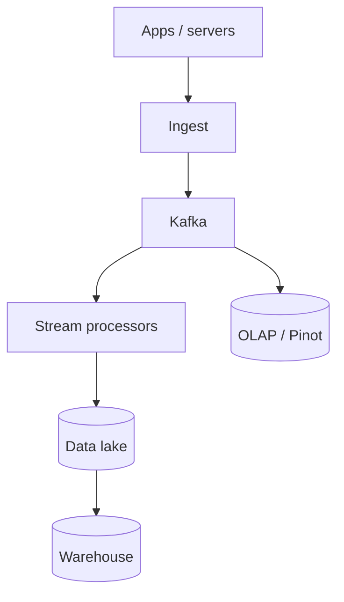
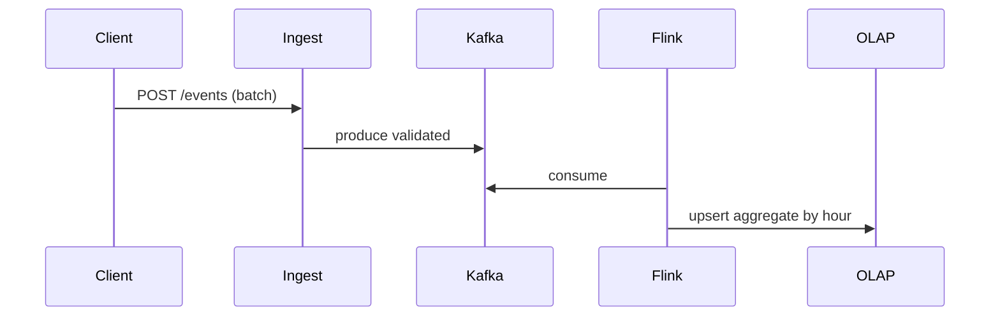

# HLD — Analytics / Event Pipeline

## Live interview opening (clarify first — bar raiser order)

*“I’ll **start by clarifying requirements**—scope, ambiguity, latency and scale expectations—then lock **FR/NFR**. **After** that, I’ll ground **user journey**, **consistency**, **commit/decision**, and **risks** so it’s clearly **derived from what we agreed**, then **scale** and **architecture**—and I’ll **pause after the diagram** for where you want depth.”*

> **Uber SDE-2 HLD — drive order in this doc:** **§1** clarify → FR → NFR → **Framing after requirements** (user journey, consistency, commit/decision anchors) → **§2** scale → **§3** core entities + APIs → **§4** architecture → **§5** deep dive and evolution → **§6** scaling → **§7** reliability → **§8** tradeoffs → **§9** observability and security → **§10** patterns → **Closing**. Treat **Human interaction** cue blocks (headings in this doc) as *spoken* cues—**paraphrase**; do not read every row. **Bar raiser** listens for **ownership**, **failure modes**, and **honest tradeoffs**. Canonical spine: [HLD-UBER-SDE2-INTERVIEW-SPINE.md](./HLD-UBER-SDE2-INTERVIEW-SPINE.md).

## Interview delivery (golden thread — live thinking)

Bar-raiser polish: **user-first**, **explicit consistency**, **bottleneck**, **evolution**, **UX trust**, **default opinion** (not endless “A or B”). Full template + habits: **[HLD-BAR-RAISER-PERFORMANCE-PACK.md](./HLD-BAR-RAISER-PERFORMANCE-PACK.md)** · **[HLD-MASTER-DELIVERY-GOLDEN-FLOW.md](./HLD-MASTER-DELIVERY-GOLDEN-FLOW.md)**.

| Say at the right time | What interviewers grade | In this guide |
|----------------------|---------------------------|---------------|
| **Opening** | Clarify before solution | **Above** — you **do not** assume requirements. |
| **User journey + consistency + decisions** | Derived, not memorized | **After Section 1**, block **Framing after requirements** — **before Section 2** (not before clarify). |
| **Bottleneck / evolution / UX** | Ops + trust | Same **Framing** block; deep numbers still in **Sections 5–7**. |
| **Strong opinion** | Defaults | **Section 8** tradeoffs — always *“I’d start with X because…”*. |

**Do not:** read tables line-by-line · put user journey **before** clarify · fence-sit.  
**Do:** clarify → FR/NFR → **then** grounded journey → diagram → deep dive where steered.

---

## 1. Clarify requirements

### 1.0 Live flow

#### Live voice (real interviewer room)

**Sound like you’re *deciding*, not reciting:** one idea per breath, then **pause**. Tables here are **backup**—if your eyes are down for more than a couple of seconds, you’ve slipped into reading the doc.

**Bridge phrases (mix naturally):** *“Let me **name the fork** first…”* · *“I’ll **default to X**—tell me if your bar is stricter.”* · *“The reason I ask is it changes **who owns the commit** / **what’s on the hot path**.”* · *“I’ll **over-answer** one layer, then stop—**where should I zoom**?”*

**Ping them (conversation, not monologue):** *“Does that match how you’d scope it?”* · *“If we only deep-dive one thing, is it **A** or **B**?”* (swap **A/B** for two tensions from *your* opening paragraph above.)

**This topic in one breath:** “Analytics is **immutable log + deterministic processing + idempotent sinks**—I won’t say ‘Kafka is exactly-once’.”

**`Verbatim` / `Live` cues:** say a line **once**, then **rephrase** the next time—verbatim twice in a row reads *canned*.

**Opening (~once):** *“I’ll align **event schema**, **delivery semantics** (at-least-once), **real-time vs batch**, and **privacy**; then **ingest**, **stream**, **warehouse**, **serving** for **metrics/dashboards**. **Pause after the diagram**—**Kafka**, **Lakehouse**, or **real-time OLAP**?”*

**Thinking transitions:** *“Same spine as browse **signals** in [12-hld-ecommerce-product-browsing.md](./12-hld-ecommerce-product-browsing.md)—here **generalized**.”*

**Live rule:** **Paraphrase** §1 tables; go deep **only if probed**.

**Micro-pauses:** *“So correctness is **at-least-once** ingest with **idempotent sinks** or **dedupe** windows—I'll say that before anyone says ‘Kafka is exactly-once’.”*

### 1.1 Clarify

#### Human interaction (clarify requirements — think out loud & evolve scope)

**Verbatim:** *“I'm aligning **event schema**, **delivery semantics**, **real-time vs batch**, and **PII**—that drives **Kafka + lake + OLAP** vs a single warehouse story.”*

**Verbatim (evolution):** *“**v1** Kafka to S3 and daily Spark; **v2** streaming aggregates to **OLAP**; **v3** feature store for **ML** online.”*

| Topic | Say it like this in the room |
|--------------------------|-------------------------------|
| **Volume** | “**Trillion** events/year class?” |
| **Latency** | “**Minutes** batch ok vs **sub-minute** KPI?” |
| **Schema** | “**Avro/Protobuf** registry?” |
| **PII** | “**Hash** user_id in raw stream?” |

### 1.2 Functional requirements (FR)

#### Human interaction (FR — after alignment)

**Verbatim:** *“Ingest typed events, validate enrich sessionize aggregate, then serve BI metrics and **ML** features—I'm explicit where **freshness** vs **cost** trades off.”*

| FR area | Say it like this |
|---------|-------------------|
| **Ingest** | “Clients/servers emit **typed events**.” |
| **Process** | “Validate, **enrich**, **sessionize**, **aggregate**.” |
| **Serve** | “BI tools, **metrics**, **ML** features.” |

### 1.3 Non-functional requirements (NFR)

#### Human interaction (NFR — how it must behave)

**Verbatim:** *“No silent drops—**DLQ** for poison; cost is **tiered** storage and **columnar** formats like **Parquet** in the lake.”*

| NFR | Say it like this |
|-----|------------------|
| **Durability** | “**No silent drop**—**DLQ** for poison.” |
| **Cost** | “**Tiered** storage; **columnar** formats.” |

### 1.4 Invariants

**Invariant:** “Every **event** has **`(event_id or idempotency key, source, occurred_at)`** such that **replays** do not **double-count** **business metrics** that require **exactly-once** semantics—achieved via **idempotent sinks** or **dedupe** windows.”

| Beat | Say it like this |
|------|------------------|
| **Bridge** | “**Kafka** **log** is **source** for **stream**; **S3** **lake** for **batch**.” |
| **Core split** | “**Lambda** or **Kappa**—pick one sentence.” |

### Key insight (say early)

**Immutable append-only log** + **deterministic processing** + **idempotent sinks** = practical **analytics correctness** at scale.

#### Key anchors

1. “**Schema registry**.”  
2. “**Bronze/silver/gold** medallion (Databricks idiom) if interviewer knows it.”  
3. “**OLAP** for **serving** aggregates.”

---

## Framing after requirements (before scale + architecture)

**Placement in the room:** this block is **not** “right after clarify questions.” You earn it **after** you’ve locked **FR + NFR** (spoken summary is fine)—otherwise journey / consistency / commit boundaries read as **assuming** product and SLOs.

**Out loud:** *“We’ve **clarified** scope and I’ve stated **FR/NFR** from that—**based on that**, here’s the **user-visible path**, **consistency**, and **commit** I’ll hold before I size **Section 2** and draw **Section 4**.”*

### Thinking transitions (use during interview)

- *“Let me think through this…”*
- *“One tradeoff here is…”*
- *“If I optimize for latency…”*
- *“This might become a bottleneck because…”*
- *“I’d start simple here and evolve later…”*

## User journey (say once—**after** FR/NFR, not after clarify alone)

From the **client app** perspective: user actions generate **events** → **SDK** batches/beacons → **ingest** accepts → user continues (non-blocking).

From the **analyst** perspective: **warehouse** / lake tables update → **dashboards** / experiments converge—**minutes to hours** lag is normal unless stated otherwise.

So:

- **write path** = **append-only** event accept → **Kafka** topic(s) → **stream** transforms.
- **read path** = **OLAP** / **pre-aggregates** / **BI** queries—not on the mobile hot path.
- **async path** = **dedupe**, **sessionization**, **identity graph**, **GDPR** deletes.

## Consistency model

**Immutable log** + **deterministic** processing + **idempotent** sinks—don’t claim **end-to-end exactly-once** without defining **keys** and **dedupe** windows.

**At-least-once** ingest is normal; correctness is **business idempotency**.

## Commit boundary

Client **`event_id`** (or batch id) commits at **ingest ACK** boundary; downstream **fact tables** commit per **sink** semantics (often **at-least-once** + **merge**).

## Decision (strong opinion)

I’d start with:

- **Kafka** (or similar) + **Flink/Spark**-shaped stream processing + **Iceberg/Hive**-shaped lake + **idempotent** writers.

because analytics is a **log processing** problem first; **schema** + **PII** discipline second.

## Evolution

| Phase | Say it like this |
|-------|------------------|
| **1** | Simple implementation that ships. |
| **2** | Scaling: partitions, caches, queues, backpressure, observability. |
| **3** | Advanced / ML / global—only when metrics or product force it. |

Details: **Section 4.1 (phases)** and **Section 5** in this file.

## Bottleneck anchor

Watch first:

- **ingest** skew partitions, **small file** / compaction lag in lake.
- **backfill** replay pressure when logic changes.

## Backpressure handling

Under load:

- **client backoff** + **sample** non-critical events; **expand** partitions carefully.
- **delay** expensive enrichment before dropping **ingest** availability.

Goal: **never lose** critical billing-ish events—define which events are **critical**.

## UX awareness

Bad outcomes:

- **PII** in immutable lake tiers.
- **wrong** experiment metrics from **double count** without dedupe.

### Driving the conversation

- *“Does this direction make sense?”*
- *“Should I go deeper on **A** or **B**?”*
- *“Would you like failure scenarios next?”*

### Mindset

*“I’m not presenting a solution—I’m **designing with a teammate**.”*

**Playbook:** [HLD-BAR-RAISER-PERFORMANCE-PACK.md](./HLD-BAR-RAISER-PERFORMANCE-PACK.md).

---

## 2. Estimate scale

#### Human interaction (estimate scale)

**Verbatim:** *“Millions of events per second and **PB** lake class—partition discipline and **compaction** matter as much as the diagram.”*

| Dimension | Illustrative |
|-----------|----------------|
| Events / sec | **Millions** |
| Storage | **PB** lake |

---

## 3. APIs and data model

### 3.0 Core entities (who owns what — say before schemas)

| Entity | Owns / lifecycle (one line) |
|--------|-----------------------------|
| **EventEnvelope** | `event_id`, `occurred_at`, `schema_version`, bounded `props`—**contract**. |
| **IngestBatch** | Beacon POST—**validated** then produced to log. |
| **AggregateRow** | OLAP / warehouse **upsert** key—**idempotent** by window + keys. |

#### Human interaction (API design)

**Verbatim:** *“Clients POST batched beacons; internal mirror jobs load the warehouse—**schema registry** is the choke point for compatibility.”*

### 3.1 Event envelope

- `event_name`, `event_id`, `occurred_at`, `user_id?`, `props` (bounded), `schema_version`.

### 3.2 APIs

| API | Purpose |
|-----|---------|
| `POST /v1/events` | Beacon batch |
| *internal* | **Mirror** to warehouse loaders |

---

## 4. High-level architecture

#### Human interaction (high-level architecture / HLD)

**Verbatim:** *“**Kafka** is the durable **append log**; stream processors fan to **OLAP** for low-latency KPIs and to **S3** for cheap history; warehouse is **batch** truth for heavy SQL.”*

### 4.1 Phases

| Phase | Ship |
|-------|------|
| **1** | Kafka + S3 + daily Spark |
| **2** | **Streaming** aggregates to **OLAP** |
| **3** | **Feature store** for **ML** online |

---

## 5. Deep dive: event → metric

#### Human interaction (deep dive — critical flow, optimizations & evolution)

**Verbatim:** *“Client batches to ingest, we validate and produce to Kafka, Flink consumes with **checkpointing**, upserts hourly rollups into **OLAP** with a **primary-key** merge so replays don't double-count.”*

**Verbatim (evolution):** *“If they want **exactly-once** end-to-end, I'll narrow it to **sink semantics**—Flink + idempotent merge, not hand-wavy.”*

### 🎯 Bottleneck Anchor

“**Small file problem** in lake + **consumer lag**—**compaction** + **partition** discipline.”

**Taking a stance:** *“**At-least-once** Kafka + **Flink** **checkpointing** + **OLAP** **primary key** dedupe for **hourly** rollups.”*

---

## 6. Scaling and bottlenecks

#### Human interaction (scaling & bottlenecks)

**Verbatim:** *“Hot partitions and **small files** in the lake—**salt** keys carefully and **compact**; schema drift is **registry** with compatibility checks.”*

| Risk | Mitigation |
|------|------------|
| **Hot partition** | **Salt** keys in Kafka partitioning carefully |
| **Schema drift** | **Registry** + **compatibility** checks |

---

## 7. Reliability and failure handling

#### Human interaction (reliability & failure handling)

**Verbatim:** *“Poison goes to **DLQ** with an alert; backfills use **watermarks** and **idempotent** batch jobs so reruns are safe.”*

- **Poison message:** **DLQ** + **alert**.  
- **Backfill:** **idempotent** batch jobs with **watermarks**.

---

## 8. Tradeoffs and alternatives

#### Human interaction (tradeoffs & alternatives)

**Verbatim:** *“Real-time **OLAP** is fresher but pricier; **Lambda** has two code paths—I'll pick **Kappa-ish** stream-first if the interviewer wants one sentence.”*

| Choice | Trade |
|--------|--------|
| **Real-time OLAP** | Freshness vs **cost** |
| **Lambda** | Two code paths vs **simplicity** |

---

## 9. Monitoring, observability, and security

#### Human interaction (monitoring, observability & security)

**Verbatim:** *“Watch ingest lag, parse error rate, sink freshness; security is **PII** separation, **lineage**, and **RBAC** on the warehouse.”*

**Metrics:** **ingest lag**, **parse error** %, **sink** freshness.  
**Security:** **PII** separation; **lineage**; **access** RBAC on warehouse.

---

## 10. Design patterns, data structures & best practices

#### Human interaction (design patterns, data structures & best practices)

**Verbatim (say 5–6 on the board):** *“**Append-only log** in Kafka, **schema registry** for contracts, **medallion** bronze/silver/gold in the lake, **stream processing** with **checkpointing**, **idempotent sink** merges in **OLAP**, **watermarked** batch backfill, and **columnar** Parquet for cost.”*

| Pattern / DS | Where | One interview line |
|----------------|------|----------------------|
| **Append-only event log** | Kafka | “Replay is a feature, not a bug.” |
| **Schema registry + compat** | Ingest | “Stop unbounded JSON chaos at the door.” |
| **Medallion (bronze/silver/gold)** | Lake | “Progressive refinement without losing raw.” |
| **Stateful stream + checkpoints** | Flink | “Recover offset state without guessing.” |
| **Idempotent upsert / merge keys** | OLAP/WH | “At-least-once in, **exactly-once** *semantics* out for aggregates.” |
| **Compaction + partitioning** | S3 lake | “Kill the small-file problem before it kills queries.” |

---

## Closing notes

#### Human interaction (closing notes)

**Verbatim:** *“**Ingest** → **Kafka** → **stream + lake**; **idempotent** sinks; **OLAP** for fast KPIs; **schema registry**; honest **lag** and **hot partition** story.”*

| Do | Avoid |
|----|--------|
| **Exactly-once** definition | Hand-wavy “Kafka is exact” |
| **Schema discipline** | Unbounded JSON chaos |

---

## Bar-raiser follow-ups

#### Human interaction (bar-raiser follow-ups)

**Verbatim:** *“Pick **GDPR delete**, **late-arriving** events, or **exactly-once** definition—I'll go one level deeper.”*

| They ask | Say it like this |
|----------|------------------|
| **GDPR delete** | “**Tombstone** events + **purge** pipelines; **hard** in **ML** features.” |

---

## 60-second close

#### Human interaction (60-second close)

**Verbatim:** *“**Kafka** log, **Flink** checkpoints, **OLAP** merge keys, **S3** lake, **schema registry**, watch **lag** and **hot partitions**.”*

| Beat | Say it like this |
|------|------------------|
| **Recap** | “**Ingest** → **Kafka** → **stream + lake**; **idempotent** sinks; **OLAP** for **low-latency** KPIs; **schema registry**; **watch lag** + **hot partitions**.” |

---
